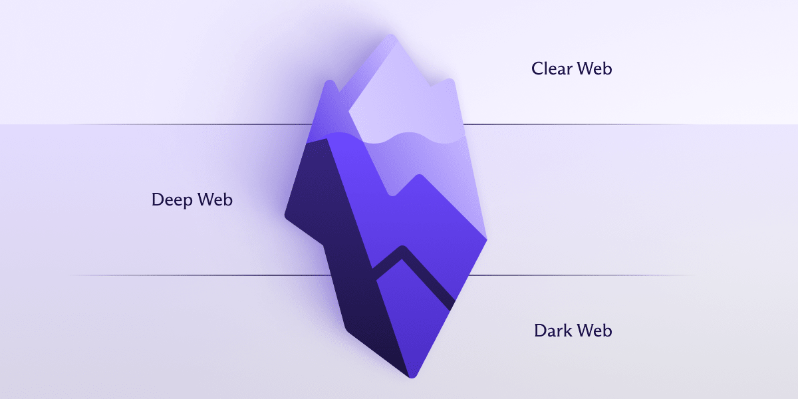

# Cours 1 | Bienvenue

*[HTML]: HyperText Markup Language
*[CSS]: Cascading Style Sheets
*[UX]: Expérience utilisateur (User eXperience)
*[UI]: Interface utilisateur (User Interface)
*[ANI]: Artificial Narrow Intelligence
*[AGI]: Artificial General Intelligence
*[ASI]: Artificial Super Intelligence
*[IA]: Intelligence Artificielle
*[LLM]: Large Language Model (ex: ChatGPT)
*[URL]: Uniform Resource Locator

*[CERN]: L’Organisation européenne pour la recherche nucléaire. Le plus grand centre de physique des particules du monde.
*[ARPANET]: Advanced Research Projects Agency Network

{ .w-100 }

## Introduction

### Présentations

### Ressources collégiales

* [:material-microsoft-office: Suite Microsoft 365](https://ccti.cmontmorency.qc.ca/rentree) : Word, Office, Excel, PowerPoint
* [:material-microsoft-teams: Teams](https://ccti.cmontmorency.qc.ca/rentree) : Cours, notes de cours, clavardage
* [:material-microsoft-outlook: Courriel](https://ccti.cmontmorency.qc.ca/rentree)
* [:material-wifi: Wifi](https://ccti.cmontmorency.qc.ca/rentree)
* [ColNET](https://www.cmontmorency.qc.ca/ColNET/etudiant/Messagesgeneraux/ColNET_procedure_connexion.pdf) : Bulletin, horaire, carte étudiante, messagerie médiévale.

### Plan de cours

## D'abord, un peu d'histoire

  

  <small>Ligne du temps ludique</small> 
  **[La fabuleuse histoire de l'Internet](./exercices/timeline1/index.md){.stretched-link .back}**

## Le développement Web, c’est quoi ?

Le développement Web, c’est tout ce qu’on peut créer pour le Web : des sites, des outils ou des applications accessibles depuis un navigateur, peu importe l’appareil.

La notion plus classique du Web est composée des éléments suivants :

* **Site vitrine** : <https://tim-montmorency.com/>
* **Blogue / Forum** : <https://www.reddit.com/>
* **Commerce en ligne** : <https://www.simons.ca/>
* **Réseaux sociaux** : <https://www.instagram.com/>
* **Messagerie** : <https://discord.com/>
* _et cætera_

Toutefois, le développement Web permet aussi de concevoir une surprenante panoplie d'usage. En voici quelques exemples :

**Tableaux de bord** : [Domotique](https://www.home-assistant.io/)

**Automatisation** : [IFTTT](https://ifttt.com/) ou [Zapier](https://zapier.com/)

**Jeux vidéos** : [itch.io](https://itch.io/games/platform-web)

**Environnement interactif** : [Réservation - Place des Arts](https://www.placedesarts.com/programmation)

**Outils collaboratifs** : [Wooclap](https://www.wooclap.com/fr/) ou [Figma](https://www.figma.com/)

**Visualisation de données** : [World Economic Forum](https://intelligence.weforum.org/topics/a1Gb0000000pTDREA2/key-issues/a1Gb00000017LD8EAM)

!!! info "À propos des applications Web"

    De plus en plus d’organisations développent des applications Web pour remplacer les logiciels installés localement.  
    Par exemple, **Microsoft Word en ligne** peut remplacer la version traditionnelle installée sur un ordinateur.

    Ces outils fonctionnent sur tous les types d’appareils et ne nécessitent aucune installation, juste un navigateur. La connexion à Internet n'est même pas obligatoire dans certains cas.

### Comment ça marche ?

C'est d'abord du code. HTML.

Code source d'une page.

-> Démonstration : Analyse rapide de sites Web existants

* Présentation de l'inspecteur du navigateur (Chrome DevTools)
  * Inspection du code source HTML et CSS
* Analyse pratique de quelques sites existants :
  * Structure HTML
  * Application des styles CSS
  * Observation des principes UX/UI en pratique
* Notion rapide de responsive design (adaptation mobile/tablette)

### Un Web à plusieurs niveaux

**Web surfacique**

C’est la partie d’Internet accessible à tous via les moteurs de recherche classiques comme <google.ca>, le site du collège ou <lapresse.ca>.

**Web profond**

Partie du Web qui n’est pas accessible aux internautes au moyen des moteurs de recherche usuels[^webprofond]. Cela inclut les bases de données, les intranets ou les contenus protégés par mot de passe (ex. : Netflix, Gmail, AccèsD). Cette portion représente la majorité du Web. Certains estiment qu’elle en constitue jusqu’à 95%[^avast] du Web !

[^webprofond]: [Définition de la toile profonde | OQLF](https://vitrinelinguistique.oqlf.gouv.qc.ca/fiche-gdt/fiche/26544511/toile-profonde)
[^avast]: [Avast – Dark web: facts and myths](https://www.avast.com/c-dark-web-facts)

**Web caché**

Partie du Web invisible à laquelle on peut accéder en utilisant des navigateurs Web spéciaux et des logiciels permettant le cryptage des communications[^webcache].

[^webcache]: [Définition du Web caché | OQLF](https://vitrinelinguistique.oqlf.gouv.qc.ca/fiche-gdt/fiche/26557092/web-cache)

## Outils

* Éditeur de code : VS Code.
* Navigateurs : Chrome, Firefox. + Devtool

Shortcut (ex: hard refresh / ouvrir un tab fermé)
 Devtool

* Plateformes collaboratives (GitHub, Teams, Discord).

## Métiers du Web

| Métier                     | Description                                    |
|----------------------------|------------------------------------------------|
| Développeur Frontend       | Interface utilisateur (HTML/CSS/JS)            |
| Développeur Backend        | Serveurs, bases de données, API, sécurité      |
| Intégrateur Web            | Maquettes graphiques → code HTML/CSS           |
| Designer UX/UI             | Expérience utilisateur et interface graphique  |
| Gestionnaire de projet Web | Coordination des équipes et ressources         |

Autres métiers connexes (SEO, rédaction Web, analyse Web).

## Expérience utilisateur : bonnes pratiques

* Définition : Qu'est-ce que l'UX (User Experience) ?
* Principes fondamentaux de l'ergonomie Web :
  * Lisibilité
  * Accessibilité
  * Cohérence
  * Efficacité
* Critères de Jakob Nielsen (heuristiques d’ergonomie)
* Exemples pratiques (bons et mauvais exemples UX)

## Composantes d’une page Web et interactivité

* Structure de base :
  * En-tête (`<header>`)
  * Menu (`<nav>`)
  * Contenu principal (`<main>`, `<section>`)
  * Barre latérale (`<aside>`)
  * Pied de page (`<footer>`)
* Concepts d’interactivité simples :
  * Formulaires
  * Boutons et liens
  * Animations basiques
* Introduction au DOM (Document Object Model)
  * Structure hiérarchique (relation parent-enfant)

## Récapitulatif

Lexique : 

* HTML
* UX
* UI
* Front-End

[STOP]

## Présentation

[Voir la présentation](https://tim-montmorency.com/compendium/582-111%E2%80%93web1/autres/presentation-web-1.html)

## Les Outils

[Voir les outils](https://tim-montmorency.com/compendium/582-111%E2%80%93web1/autres/les-outils.html)

## Histoire du Web

[Voir l'histoire du Web](https://tim-montmorency.com/compendium/582-111%E2%80%93web1/autres/histoire-du-web.html)

## Expérience utilisateur

[UX vs UI](https://tim-montmorency.com/compendium/582-111%E2%80%93web1/autres/experience-utilisateur.html)

## Composantes Web

[Voir les composantes](https://tim-montmorency.com/compendium/582-111%E2%80%93web1/autres/composantes-web.html)

## HTML / Histoire

[Voir l'histoire du HTML](https://tim-montmorency.com/compendium/582-111%E2%80%93web1/html/html-histoire.html)

