# Cours 1 | Bienvenue

<style>.md-nav .md-nav .md-nav { display: none; }</style>

*[HTML]: HyperText Markup Language
*[CSS]: Cascading Style Sheets
*[UX]: Expérience utilisateur (User eXperience)
*[UI]: Interface utilisateur (User Interface)
*[ANI]: Artificial Narrow Intelligence
*[AGI]: Artificial General Intelligence
*[ASI]: Artificial Super Intelligence
*[IA]: Intelligence Artificielle
*[LLM]: Large Language Model (ex: ChatGPT)
*[URL]: Uniform Resource Locator
*[DOM]: Document Object Model

*[CERN]: L’Organisation européenne pour la recherche nucléaire. Le plus grand centre de physique des particules du monde.
*[ARPANET]: Advanced Research Projects Agency Network

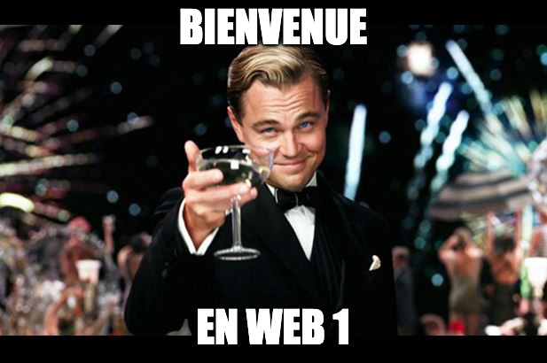{ .w-100 }

## Introduction

<div class="grid gap-lg" markdown>


Présentations<br>
Plan de cours<br>
Téléphones<br>
Intelligence artificielle
</div>

## Ressources du collège

### Outils étudiants

* [:material-microsoft-office: Suite Microsoft 365](https://ccti.cmontmorency.qc.ca/rentree) : Word, Office, Excel, PowerPoint
* [:material-microsoft-teams: Teams](https://ccti.cmontmorency.qc.ca/rentree) : Cours, notes de cours, clavardage
* [:material-microsoft-outlook: Courriel](https://ccti.cmontmorency.qc.ca/rentree)
* [:material-wifi: Wifi](https://ccti.cmontmorency.qc.ca/rentree)
* [Aide-mémoire pour les connexions](./assets/documents/feuille_aide-memoire_connexions_cmontmorency_portrait.pdf)
* [ColNET](https://www.cmontmorency.qc.ca/ColNET/etudiant/Messagesgeneraux/ColNET_procedure_connexion.pdf) : Bulletin, horaire, carte étudiante, messagerie médiévale 🤪.

### Soutien et aide

* [Soutien psychosocial](https://www.cmontmorency.qc.ca/etudiants/services-aux-etudiants/soutien-psychosocial/)
* [Service d’aide à l’apprentissage](https://www.cmontmorency.qc.ca/etudiants/services-aux-etudiants/aide-a-lapprentissage/presentation/)
* [Service d'aide financière](https://www.cmontmorency.qc.ca/etudiants/services-aux-etudiants/service-aide-financiere/presentation-du-service/)
* :fontawesome-regular-hand-point-right:{ .horizontal-anim-cos .valign-bottom } [Centre d’aide en intégration multimédia](https://www.cmontmorency.qc.ca/etudiants/services-aux-etudiants/aide-a-la-reussite/aide-techniques/centre-aide-integration-multimedia/) et tutorat :fontawesome-regular-hand-point-left:{ .horizontal-anim .valign-bottom }

## Le développement Web


Le développement Web c’est ce qui permet de créer des **sites Web**, des **outils** ou des applications **accessibles depuis un navigateur**, peu importe l’appareil.

La notion plus classique du Web est composée des éléments suivants :

* **Site vitrine** (ex. : <https://tim-montmorency.com/>)
* **Blogue / Forum** (ex. : <https://www.reddit.com/>)
* **Commerce en ligne** (ex. : <https://www.simons.ca/>)
* **Réseaux sociaux** (ex. : <https://www.instagram.com/>)
* **Messagerie** (ex. : <https://discord.com/>)
* _et cætera_

Toutefois, le développement Web permet aussi de concevoir une surprenante panoplie d'usage. En voici quelques exemples :

<div class="grid grid-1-4" markdown>
{ data-zoom-image }

<div markdown>
**Tableaux de bord** (ex. : [Domotique](https://www.home-assistant.io/))
</div>
</div>

<div class="grid grid-1-4" markdown>
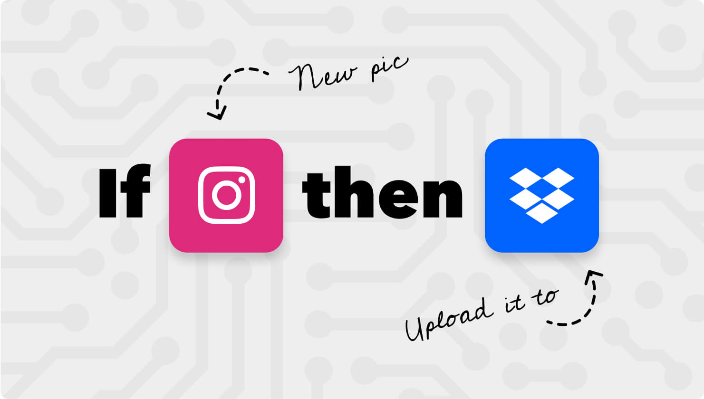{ data-zoom-image }

<div markdown>
**Automatisation** (ex. : [IFTTT](https://ifttt.com/) / [Zapier](https://zapier.com/))
</div>
</div>

<div class="grid grid-1-4" markdown>
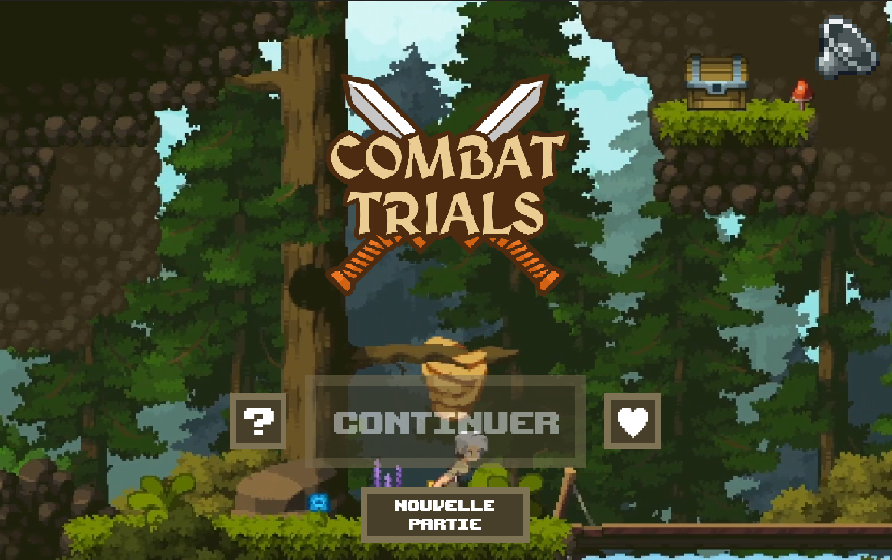{ data-zoom-image }

<div markdown>
**Jeux vidéos** (ex. : [itch.io]( https://mraosix.itch.io/combattrials ))
</div>
</div>

<div class="grid grid-1-4" markdown>
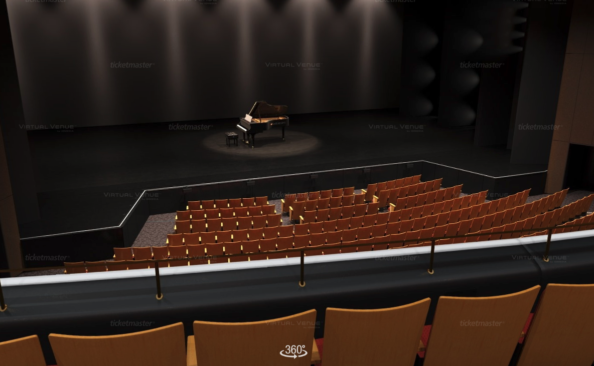{ data-zoom-image }

<div markdown>
**Environnement interactif** (ex. : [Réservation - Place des Arts](https://www.placedesarts.com/programmation))
</div>
</div>

<div class="grid grid-1-4" markdown>
{ data-zoom-image }

<div markdown>
**Outils collaboratifs**  (ex. : [Wooclap](https://www.wooclap.com/fr/) / [Figma](https://www.figma.com/))
</div>
</div>

<div class="grid grid-1-4" markdown>
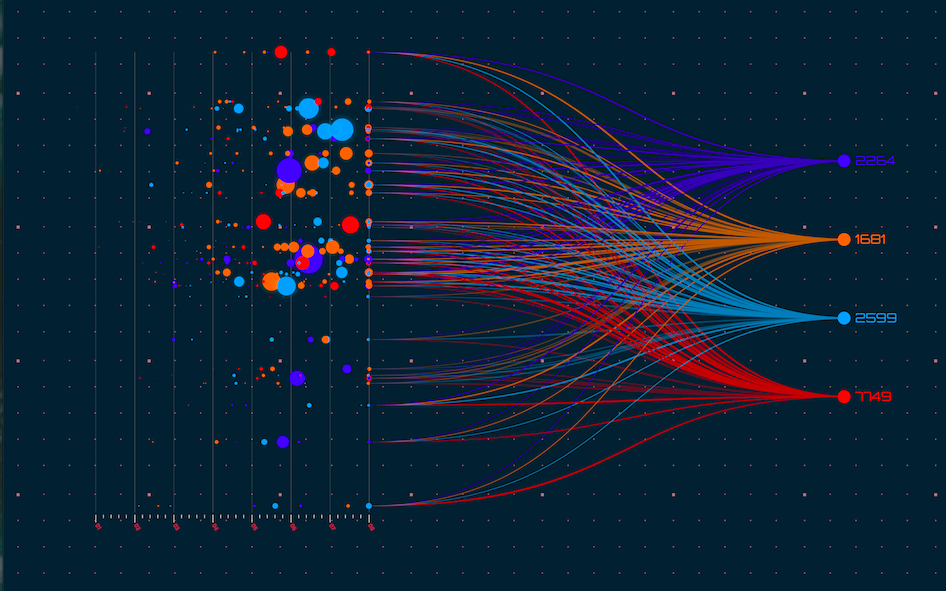{ data-zoom-image }

<div markdown>
**Visualisation de données**  (ex. : [World Economic Forum](https://intelligence.weforum.org/topics/a1Gb0000000pTDREA2/key-issues/a1Gb00000017LD8EAM))
</div>
</div>

<div class="grid grid-1-4" markdown>
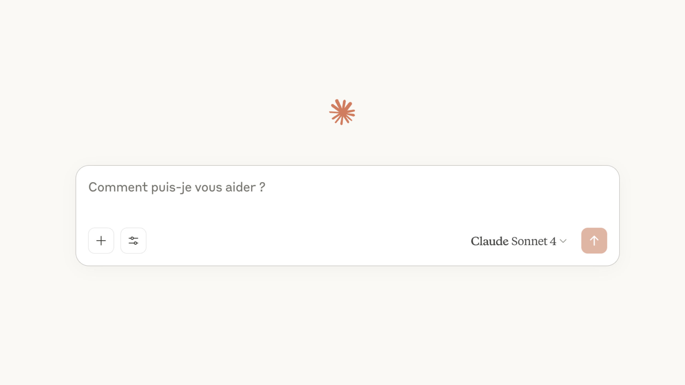{ data-zoom-image }

<div markdown>
**Assistants virtuels** :  (ex. : [ChatGPT](https://chatgpt.com/))
</div>
</div>

## Comment ça marche ?

D'abord il faut savoir que tous les sites Web, **sans exceptions**, sont programmés avec des langages de programmation.

C'est quoi un langage de programmation ?

### La programmation

Un langage de programmation (ou code), c'est la même chose qu'une langue écrite comme le français 🇫🇷 ou l'allemand 🇩🇪, la différence c'est qu'elle est destinée à être lue par un ordinateur ou un logiciel !

<div class="grid" markdown>
<figure markdown>
  { data-zoom-image }
  <figcaption>Langage naturel</figcaption>
</figure>

<figure markdown>
  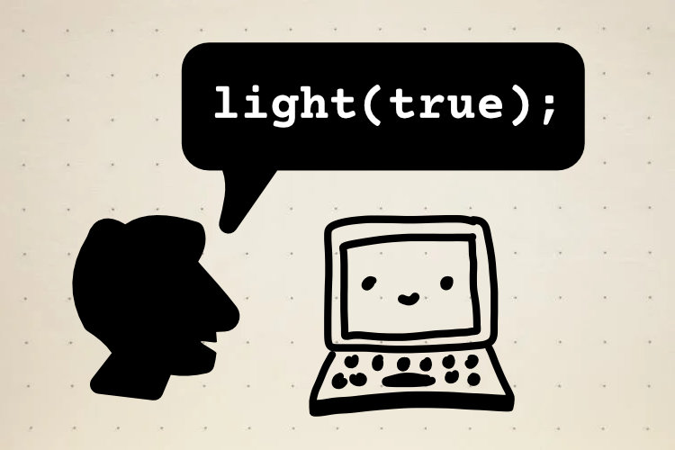{ data-zoom-image }
  <figcaption>Langage de programmation</figcaption>
</figure>
</div>

### La programmation pour le Web

Dans le cours Web 1, nous allons apprendre une nouvelle langue ! Celle qui permet de parler à un navigateur Web.

La structure MINIMALE d'une site web s'écrit dans un langage qu'on appelle **HTML**.

Voici à quoi ça ressemble :

```html
<!DOCTYPE html>
<html>
  <head>
    <title>Web 1</title>
  </head>
  <body>
    <h1>Bienvenue en Web 1</h1>
    <p>Ok bye !</p>
  </body>
</html>
```

!!! question "Bon qu'est-ce que je regarde ?"

    C'est normal de rien comprendre, pas de stress ;) 
    
    Observons tout de même ce qui est écrit :

    1. J’observe des mots entourés des caractères « plus petit que » (`<`) et « plus grand que » (`>`). C'est ce qu'on appelle des balises HTML.
    1. J’observe aussi une certaine **indentation** (des espaces au début des lignes). C'est fait pour rendre le code plus lisible.
    1. Je reconnais du **contenu textuel** : « Web 1 », « Bienvenue en Web 1 » et « Ok bye ! ».

## Outils

### Navigateur

Les navigateurs principaux sont **Chrome**, Safari, Edge et Firefox

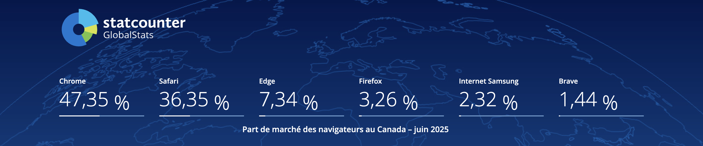{ data-zoom-image }

### Éditeur de code

Techniquement, on peut programmer un site Web complet avec **Notepad**, mais ce serait particulièrement inefficace.

Un peu comme **Microsoft Word** sert à la rédaction de texte, **[Visual Studio Code](https://code.visualstudio.com/)** (aussi appelé VSCode) est conçu spécifiquement pour programmer dans différents langages de programmation. C'est d'ailleurs l'application qui sera utilisée dans le cadre du cours et de la technique.

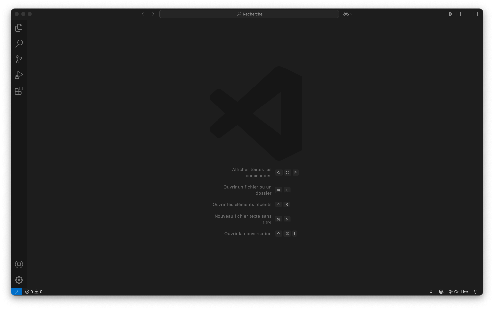{ data-zoom-image }

!!! question "On écrit ça où du code ?"
    
    Dans un fichier texte. C'est vraiment pas plus compliqué que ça !

    Mais... dites-moi, fichier et dossier, on connait la différence ?

!!! example "Tant qu'à y être, créons notre première page Web !"

    1. Ouvrir l'application VSCode
    1. Créer une nouveau fichier et nommez-le `index.html`
    1. Sauvegarder sur le bureau
    1. Dans la page, inscrire le caractère `!` (point d'exclamation) puis appuyer sur ++enter++
      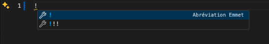
    1. Entre les balises `<body>` et `</body>`, inscrire n'importe quoi.
    1. Sauvegarder
    1. Sur le bureau de votre ordinateur, double-cliquer sur le fichier `index.html`.

### Inspecteur du navigateur

{ data-zoom-image }

L'inspecteur (ou _DevTools_) est un outil qui sert à analyser et déboguer une page Web.

On y accède soit en appuyant sur la touche ++f12++, soit en faisant un clic droit et en choisissant Inspecter.

!!! example "🧑‍🏫 Démo du prof"

    Essayons l'inspecteur sur le site <https://www.banq.qc.ca/> et observez bien ce qu'on peut réaliser avec !
    
    <!-- Lors de la démo, on montre comment en modifiant le DOM dans l'inspecteur, on peut bypasser le popup qui bloque la page. -->

### Raccourcis

* Naviguer une page Web à l’aide du clavier : ++tab++
* Rouvrir un onglet fermé : ++ctrl+shift+t++
* Rechargement forcé (hard reload) sans utiliser le cache (mémoire temporaire du navigateur) : ++ctrl+shift+r++

## Notions du Web

### Composantes

Dans une page Web, on observe plusieurs types d'affichages. Différents affichages s'appellent des composantes Web.

<figure markdown>
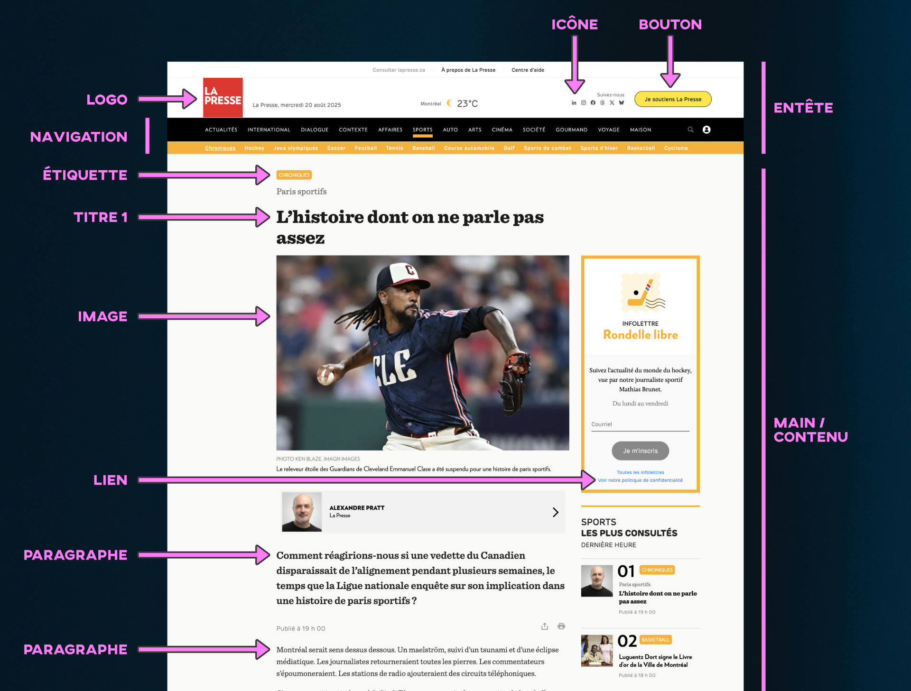{data-zoom-image}

<figcaption>Lapresse.ca</figcaption>
</figure>

### Catégories de composantes

Pour mieux les classer, on peut utiliser l’**Atomic Design**, une méthode qui s’inspire de la chimie. Le concept est de segmenter logiquement les différents affichages d'une page.

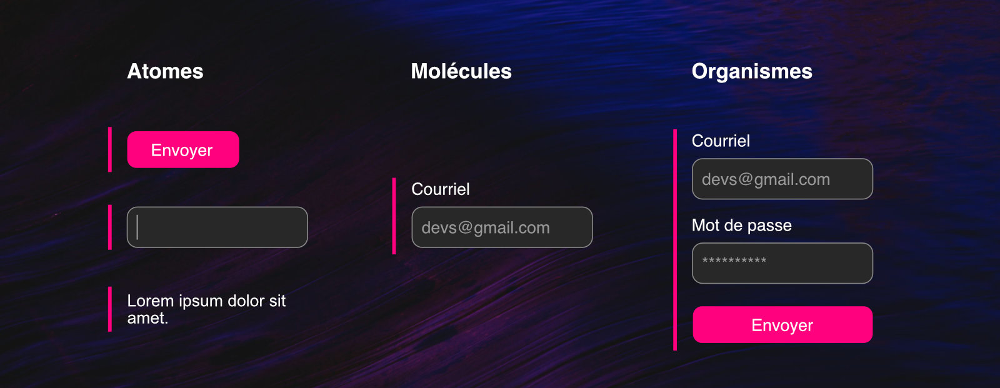{data-zoom-image}

### Composantes avancées

#### Accordion

L'[accordéon](https://daisyui.com/components/accordion/) (ou _accordion_) est une composante qui permet d’afficher ou masquer du contenu en cliquant sur un titre ou une section.

<iframe class="aspect-16-9" height="300" style="width: 100%;" scrolling="no" title="Web 1 - Accordéon" src="https://codepen.io/tim-momo/embed/VYvpyQO?default-tab=result&theme-id=50173" frameborder="no" loading="lazy" allowtransparency="true" allowfullscreen="true">
  See the Pen <a href="https://codepen.io/tim-momo/pen/VYvpyQO">
  Web 1 - Accordéon</a> by TIM Montmorency (<a href="https://codepen.io/tim-momo">@tim-momo</a>)
  on <a href="https://codepen.io">CodePen</a>.
</iframe>

#### Breadcrumb

Le [fil d’Ariane](https://daisyui.com/components/breadcrumbs/) (ou _Breadcrumb_) est un chemin de navigation qui montre à l’utilisateur sa position dans la structure du site (ex. : Accueil > Web 1 > Cours 1).

<iframe class="aspect-4-1" height="300" style="width: 100%;" scrolling="no" title="Web 1 - Modal" src="https://codepen.io/tim-momo/embed/QwjpaOd?default-tab=result&theme-id=50173" frameborder="no" loading="lazy" allowtransparency="true" allowfullscreen="true">
  See the Pen <a href="https://codepen.io/tim-momo/pen/QwjpaOd">
  Web 1 - Modal</a> by TIM Montmorency (<a href="https://codepen.io/tim-momo">@tim-momo</a>)
  on <a href="https://codepen.io">CodePen</a>.
</iframe>

#### Card

Une [carte](https://daisyui.com/components/card/) (ou _card_) est un bloc visuel regroupant généralement une image, un titre, un résumé et une action. Très utilisé pour des listes de contenus.

<iframe class="aspect-16-9" height="300" style="width: 100%;" scrolling="no" title="Web 1 - Card" src="https://codepen.io/tim-momo/embed/YPyZYEb?default-tab=result&theme-id=50173" frameborder="no" loading="lazy" allowtransparency="true" allowfullscreen="true">
  See the Pen <a href="https://codepen.io/tim-momo/pen/YPyZYEb">
  Web 1 - Card</a> by TIM Montmorency (<a href="https://codepen.io/tim-momo">@tim-momo</a>)
  on <a href="https://codepen.io">CodePen</a>.
</iframe>

#### Carousel

Le [carrousel](https://daisyui.com/components/carousel/) (ou _slideshow_). Composante qui affiche plusieurs éléments un à un avec un défilement automatique ou manuel.

<iframe class="aspect-16-9" height="300" style="width: 100%;" scrolling="no" title="Web 1 - Carousel" src="https://codepen.io/tim-momo/embed/vENxpaB?default-tab=result&theme-id=50173" frameborder="no" loading="lazy" allowtransparency="true" allowfullscreen="true">
  See the Pen <a href="https://codepen.io/tim-momo/pen/vENxpaB">
  Web 1 - Carousel</a> by TIM Montmorency (<a href="https://codepen.io/tim-momo">@tim-momo</a>)
  on <a href="https://codepen.io">CodePen</a>.
</iframe>

#### Hero

Une [bannière](https://daisyui.com/components/hero/) servant à capter l’attention, souvent accompagné d'un message et d'un appel à l'action.

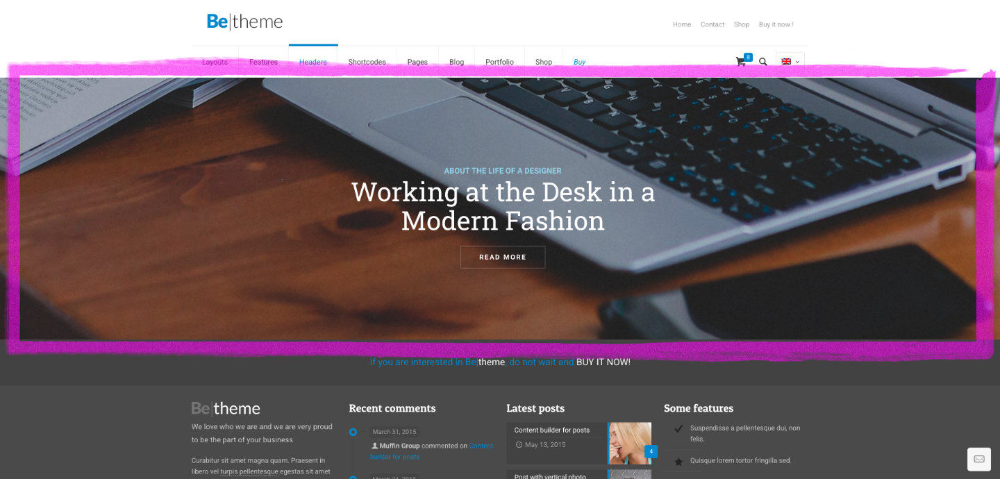{ data-zoom-image }

#### Modal

[Fenêtre flottante](https://daisyui.com/components/modal/) (ou _Modal_ / _Dialog_ / _Popup_) qui superpose le contenu.

<iframe class="aspect-4-3" height="300" style="width: 100%;" scrolling="no" title="Web 1 - Toast" src="https://codepen.io/tim-momo/embed/vENxpNb?default-tab=result&theme-id=50173" frameborder="no" loading="lazy" allowtransparency="true" allowfullscreen="true">
  See the Pen <a href="https://codepen.io/tim-momo/pen/vENxpNb">
  Web 1 - Toast</a> by TIM Montmorency (<a href="https://codepen.io/tim-momo">@tim-momo</a>)
  on <a href="https://codepen.io">CodePen</a>.
</iframe>

#### Tabs

Les [onglets](https://daisyui.com/components/tab/) (ou _Tabs_) permettent de naviguer entre plusieurs sections de contenu dans une même portion de l'interface.

<iframe height="300" style="width: 100%;" scrolling="no" title="Web 1 - Toast" src="https://codepen.io/tim-momo/embed/vENxWqQ?default-tab=result&theme-id=50173" frameborder="no" loading="lazy" allowtransparency="true" allowfullscreen="true">
  See the Pen <a href="https://codepen.io/tim-momo/pen/vENxWqQ">
  Web 1 - Toast</a> by TIM Montmorency (<a href="https://codepen.io/tim-momo">@tim-momo</a>)
  on <a href="https://codepen.io">CodePen</a>.
</iframe>

#### Tooltip

[Bulles d’information](https://daisyui.com/components/tooltip/) (ou _tooltip_) contextuelle qui apparaissent lorsqu’on survole ou clique sur un élément. Cette composante est moins pertinente sur un écran tactile.

<iframe class="aspect-4-1" height="300" style="width: 100%;" scrolling="no" title="Web 1 - Heuristique UX 1 Bon" src="https://codepen.io/tim-momo/embed/jEbBaeE?default-tab=result&theme-id=50173" frameborder="no" loading="lazy" allowtransparency="true" allowfullscreen="true">
  See the Pen <a href="https://codepen.io/tim-momo/pen/jEbBaeE">
  Web 1 - Heuristique UX 1 Bon</a> by TIM Montmorency (<a href="https://codepen.io/tim-momo">@tim-momo</a>)
  on <a href="https://codepen.io">CodePen</a>.
</iframe>

#### Toasts

[Notifications](https://daisyui.com/components/toast/) temporaires (ou _toasts_) qui apparaissent à l’écran pour informer l'utilisateur (ex. : "Message envoyé").

<iframe class="aspect-4-1" height="300" style="width: 100%;" scrolling="no" title="Web 1 - Tooltip" src="https://codepen.io/tim-momo/embed/jEbBadP?default-tab=result&theme-id=50173" frameborder="no" loading="lazy" allowtransparency="true" allowfullscreen="true">
  See the Pen <a href="https://codepen.io/tim-momo/pen/jEbBadP">
  Web 1 - Tooltip</a> by TIM Montmorency (<a href="https://codepen.io/tim-momo">@tim-momo</a>)
  on <a href="https://codepen.io">CodePen</a>.
</iframe>

### Concepts

<div class="grid grid-1-1" markdown>


<div markdown>
**Open source**
<p class="sm">Application dont la programmation est accessible au public. Le code peut être consulté, modifié et redistribué. L'inverse d'une application propriétaire.</p>
</div>
</div>

<div class="grid grid-1-1" markdown>


<div markdown>
**Responsive**
<p class="sm">Mise en page qui s’adapte à la taille de l’écran</p>
</div>
</div>

<div class="grid grid-1-1" markdown>


<div markdown>
**CTA (Call to Action)**
<p class="sm">Élément interactif (souvent un bouton) incitant clairement l’utilisateur à faire une action précise (ex. : "S’inscrire", "Acheter").</p>
</div>
</div>

!!! example "Chasse aux composantes !"

    Dans ce court exercice, vous devez 🧐 **détecter** le plus de **composantes** possible.

    Site Web : <https://discord.com/community>

    [Quiz](https://app.wooclap.com/WEB1COMP){ .md-button .md-button--primary }

## W3C


Le **W3C** (World Wide Web Consortium) est l’organisme qui définit les règles du Web (HTML, CSS, accessibilité, etc.) pour que les sites fonctionnent bien sur tous les navigateurs et pour tous les utilisateurs.  

## Expérience utilisateur

{ .w-100 }

L’expérience utilisateur (UX) c'est ce qui désigne la qualité de l’interaction d'une personne avec un produit ou un système.

La qualité se mesure en fonction de son **efficacité**, de son **efficience** et de la **satisfaction**[^nng].

[^nng]: [The Definition of User Experience (UX)](https://www.nngroup.com/articles/definition-user-experience/)

!!! question "Efficacité et efficience, c'est pas la même chose ?"

    Non 😜

    * **Efficacité** : Est-ce que l’utilisateur atteint son objectif ?
    * **Efficience** : Combien d’efforts ou de temps ça lui prend pour y arriver ?

    Prenons l'exemple d'arroser un jardin avec un tuyau d'arrosage ou avec un verre d'eau. Les deux sont efficaces, mais il y en a un plus efficient que l'autre. 

### 10 principes UX

Voici la liste des [10 heuristiques d’utilisabilité](https://www.nngroup.com/articles/ten-usability-heuristics/) de Jakob Nielsen.

> **Définitions de heuristique**, adjectif<br>
> Qui contribue à la découverte. _Hypothèse heuristique_.<br>
> En informatique, se dit d’une méthode d’exploration procédant par évaluations et hypothèses successives

<!-- Src : https://blog.prototypr.io/the-10-usability-heuristics-free-posters-for-every-design-office-c7b3b01b6099 -->

<!-- Résumé en image https://miro.medium.com/v2/resize:fit:4800/format:webp/1*QhwEGRQWg_yv_FTrJnsxBQ.png -->

#### 1️⃣ Visibilité de l’état du système

Le système doit toujours informer l’utilisateur de ce qui se passe.

=== "Bof"
    <iframe class="aspect-16-9" height="300" style="width: 100%;" scrolling="no" title="Web 1 - Heuristique UX 1 Bof" src="https://codepen.io/tim-momo/embed/ByopqGP?default-tab=result&theme-id=50173" frameborder="no" loading="lazy" allowtransparency="true" allowfullscreen="true"></iframe>

=== "Bon"
    <iframe class="aspect-16-9" height="300" style="width: 100%;" scrolling="no" title="Web 1 - Heuristique UX 1 Bon" src="https://codepen.io/tim-momo/embed/empgPQY?default-tab=result&theme-id=50173" frameborder="no" loading="lazy" allowtransparency="true" allowfullscreen="true"></iframe>

<!-- Exemple : Lors d’un paiement en ligne, un message « Traitement en cours… » avec une animation de chargement indique que l’action est en cours. -->

#### 2️⃣ Correspondance entre le système et le monde réel

L’interface doit utiliser un langage et des concepts familiers aux utilisateurs.

=== "Bof"
    <iframe class="aspect-16-9" height="300" style="width: 100%;" scrolling="no" title="Web 1 - Heuristique UX 2 Bof" src="https://codepen.io/tim-momo/embed/bNVgmzm?default-tab=result&theme-id=50173" frameborder="no" loading="lazy" allowtransparency="true" allowfullscreen="true"></iframe>

=== "Bon"
    <iframe class="aspect-16-9" height="300" style="width: 100%;" scrolling="no" title="Web 1 - Heuristique UX 2 Bon" src="https://codepen.io/tim-momo/embed/raOjqRV?default-tab=result&theme-id=50173" frameborder="no" loading="lazy" allowtransparency="true" allowfullscreen="true"></iframe>

<!-- Exemple : Une icône de panier 🛒 pour symboliser les achats, ou un bouton « Télécharger votre CV » sur un site d’emploi. -->

#### 3️⃣ Contrôle et liberté de l’utilisateur

Les utilisateurs doivent pouvoir annuler ou corriger facilement leurs actions.

=== "Bof"
    <iframe class="aspect-16-9" height="300" style="width: 100%;" scrolling="no" title="Web 1 - Heuristique UX 3 Bof" src="https://codepen.io/tim-momo/embed/NPGdEKo?default-tab=result&theme-id=50173" frameborder="no" loading="lazy" allowtransparency="true" allowfullscreen="true"></iframe>
=== "Bon"
    <iframe class="aspect-16-9" height="300" style="width: 100%;" scrolling="no" title="Web 1 - Heuristique UX 3 Bon" src="https://codepen.io/tim-momo/embed/QwjdJWR?default-tab=result&theme-id=50173" frameborder="no" loading="lazy" allowtransparency="true" allowfullscreen="true"></iframe>

<!-- Exemple : Un lien « Annuler » ou « Retour à la page précédente » dans un formulaire ou une configuration. -->

#### 4️⃣ Cohérence et standards

Le design doit suivre des conventions reconnues afin que les utilisateurs n’aient pas à se poser de question ou à apprendre de nouveaux concepts.

=== "Bof"
    <iframe height="300" style="width: 100%;" scrolling="no" title="Web 1 - Heuristique UX 4 Bof" src="https://codepen.io/tim-momo/embed/ogjBQBp?default-tab=result&theme-id=50173" frameborder="no" loading="lazy" allowtransparency="true" allowfullscreen="true"></iframe>
=== "Bon"
    <iframe height="300" style="width: 100%;" scrolling="no" title="Web 1 - Heuristique UX 4 Bon" src="https://codepen.io/tim-momo/embed/XJmpyap?default-tab=result&theme-id=50173" frameborder="no" loading="lazy" allowtransparency="true" allowfullscreen="true"></iframe>

#### 5️⃣ Prévention des erreurs

Le design doit minimiser les risques d’erreurs en guidant correctement l’utilisateur.

=== "Bof"
    <iframe class="aspect-16-9" height="300" style="width: 100%;" scrolling="no" title="Web 1 - Heuristique UX 5 Bof" src="https://codepen.io/tim-momo/embed/VYvPVxB?default-tab=result&theme-id=50173" frameborder="no" loading="lazy" allowtransparency="true" allowfullscreen="true"></iframe>
=== "Bon"
    <iframe class="aspect-16-9" height="300" style="width: 100%;" scrolling="no" title="Web 1 - Heuristique UX 5 Bon" src="https://codepen.io/tim-momo/embed/QwjdJxb?default-tab=result&theme-id=50173" frameborder="no" loading="lazy" allowtransparency="true" allowfullscreen="true"></iframe>

<!-- Exemple : Un champ de formulaire qui vérifie en temps réel si l’adresse courriel est au bon format avant l’envoi. -->

#### 6️⃣ Reconnaissance plutôt que rappel

Les interfaces doivent minimiser la mémoire nécessaire de l'utilisateur. Prioriser la reconnaissance plutôt que le rappel.

❌ **Quelle est la capitale du Japon ?**

✅ **Est-ce que Tokyo est la capitale du Japon ?**

=== "Bof"
    <iframe class="aspect-4-3" height="300" style="width: 100%;" scrolling="no" title="Web 1 - Heuristique UX 6 Bof" src="https://codepen.io/tim-momo/embed/WbQRYLQ?default-tab=result&theme-id=50173" frameborder="no" loading="lazy" allowtransparency="true" allowfullscreen="true"></iframe>
=== "Bon"
    <iframe class="aspect-4-3" height="300" style="width: 100%;" scrolling="no" title="Web 1 - Heuristique UX 6 Bon" src="https://codepen.io/tim-momo/embed/YPyNRBR?default-tab=result&theme-id=50173" frameborder="no" loading="lazy" allowtransparency="true" allowfullscreen="true"></iframe>

<!-- Exemple : Un champ de recherche avec suggestions automatiques (auto-complétion). -->

#### 7️⃣ Flexibilité et efficacité

Le système devrait convenir autant aux débutants qu’aux utilisateurs expérimentés.

L'exemple parfait ici est l'existence de l'inspecteur dans le navigateur.

=== "Débutant"
    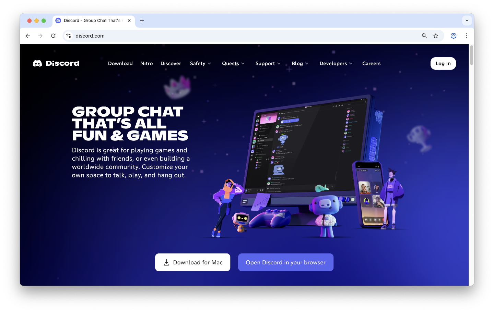
=== "Avancé"
    

<!-- Exemple : Des filtres personnalisables dans une boutique en ligne, ou des raccourcis clavier dans une application Web. -->

#### 8️⃣ Design esthétique et minimaliste

L’interface ne doit pas être surchargée. Chaque élément visuel ou textuel doit servir un objectif clair.

> Less is more

=== "Bof"
    <iframe class="aspect-4-3" height="300" style="width: 100%;" scrolling="no" title="Web 1 - Heuristique UX 8 Bof" src="https://codepen.io/tim-momo/embed/jEbyQjr?default-tab=result&theme-id=50173" frameborder="no" loading="lazy" allowtransparency="true" allowfullscreen="true"></iframe>
=== "Bon"
    <iframe class="aspect-4-3" height="300" style="width: 100%;" scrolling="no" title="Web 1 - Heuristique UX 8 Bof" src="https://codepen.io/tim-momo/embed/ZYbLZXr?default-tab=result&theme-id=50173" frameborder="no" loading="lazy" allowtransparency="true" allowfullscreen="true"></iframe>

<!-- Exemple : Une page de destination simple avec un seul bouton d’appel à l’action, sans distractions inutiles. -->

#### 9️⃣ Aider à reconnaître, diagnostiquer et corriger les erreurs

Les messages d’erreur doivent être compréhensibles, indiquer la nature du problème et suggérer une solution.

=== "Bof"
    <iframe class="aspect-16-9" height="300" style="width: 100%;" scrolling="no" title="Web 1 - Heuristique UX 9 Bof" src="https://codepen.io/tim-momo/embed/yyYgrEv?default-tab=result&theme-id=50173" frameborder="no" loading="lazy" allowtransparency="true" allowfullscreen="true"></iframe>
=== "Bon"
    <iframe class="aspect-16-9" height="300" style="width: 100%;" scrolling="no" title="Web 1 - Heuristique UX 9 Bon" src="https://codepen.io/tim-momo/embed/EaVZJpO?default-tab=result&theme-id=50173" frameborder="no" loading="lazy" allowtransparency="true" allowfullscreen="true"></iframe>

<!-- Exemple : « Le mot de passe doit contenir au moins 8 caractères, une majuscule et un chiffre », au lieu de « Erreur 001 ». -->

#### 🔟 Aide et documentation

Même si le système est simple, une aide doit être accessible pour les utilisateurs qui en ont besoin.

<iframe class="aspect-16-9" height="300" style="width: 100%;" scrolling="no" title="Web 1 - Heuristique UX 10 Bon" src="https://codepen.io/tim-momo/embed/zxvNXVe?default-tab=result&theme-id=50173" frameborder="no" loading="lazy" allowtransparency="true" allowfullscreen="true">
  See the Pen <a href="https://codepen.io/tim-momo/pen/zxvNXVe">
  Web 1 - Heuristique UX 10 Bon</a> by TIM Montmorency (<a href="https://codepen.io/tim-momo">@tim-momo</a>)
  on <a href="https://codepen.io">CodePen</a>.
</iframe>

<!-- Exemple : Une section FAQ, un bouton d’aide ou une bulle contextuelle « Besoin d’aide ? » sur un formulaire complexe. -->
