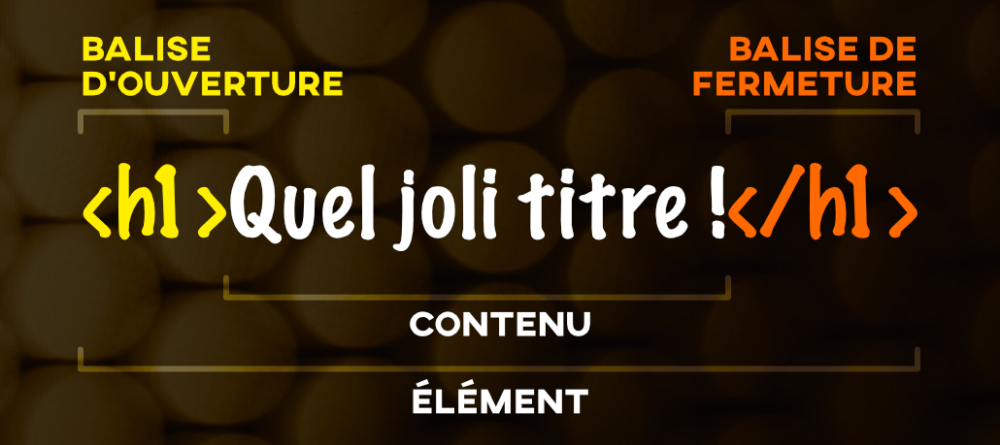
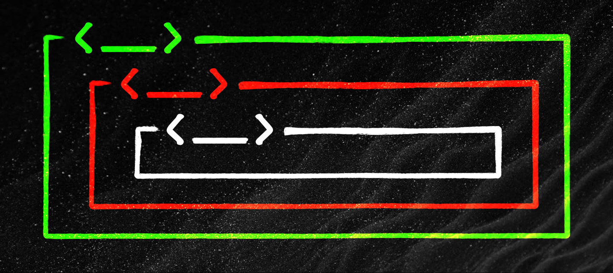
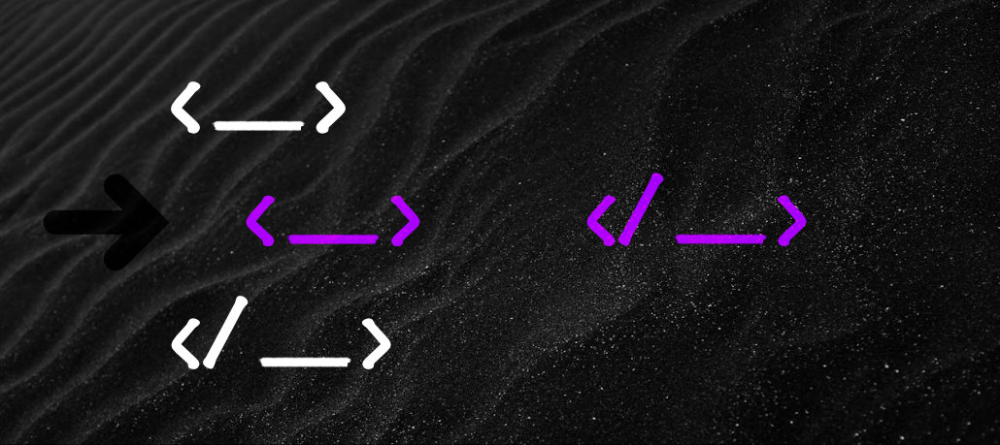
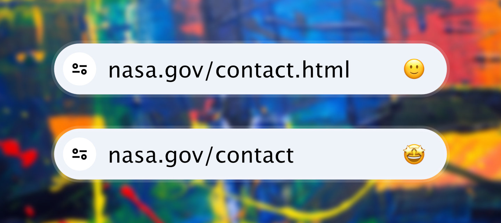
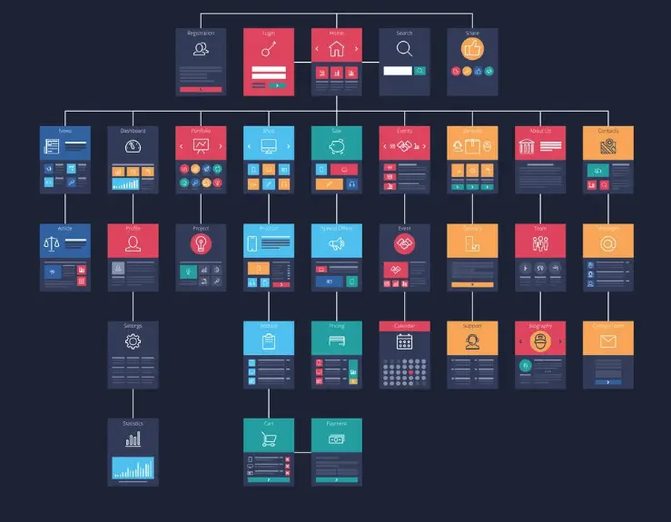
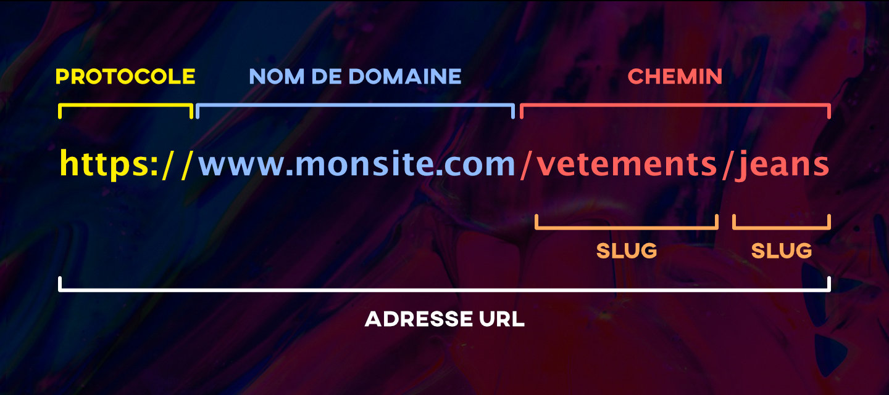
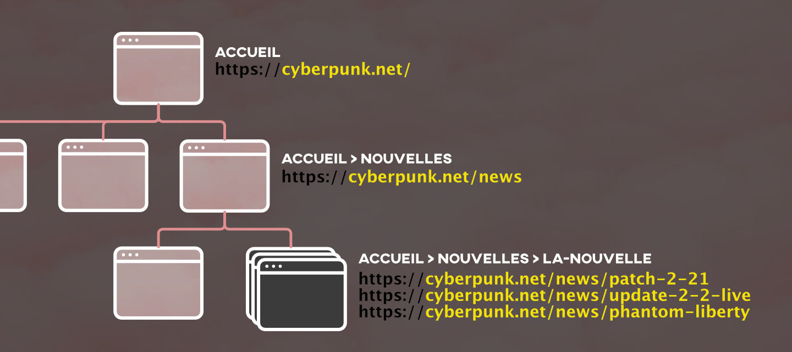
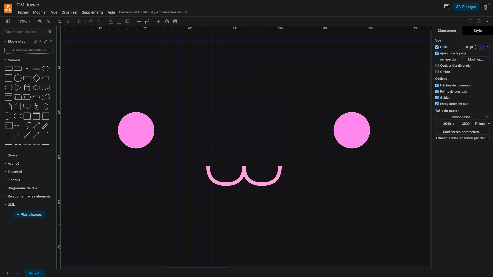
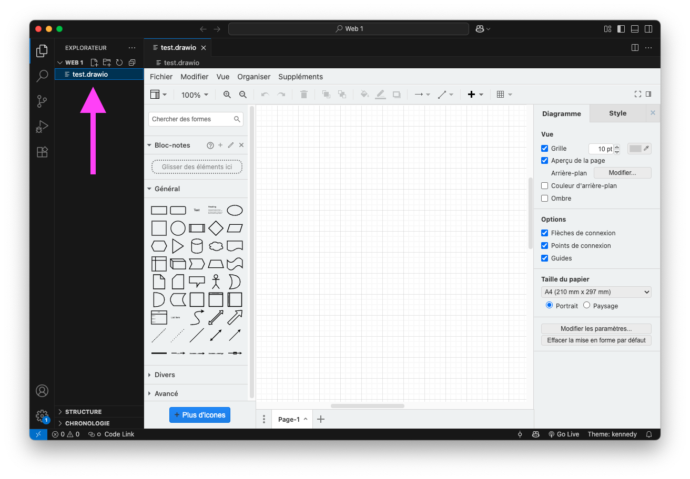
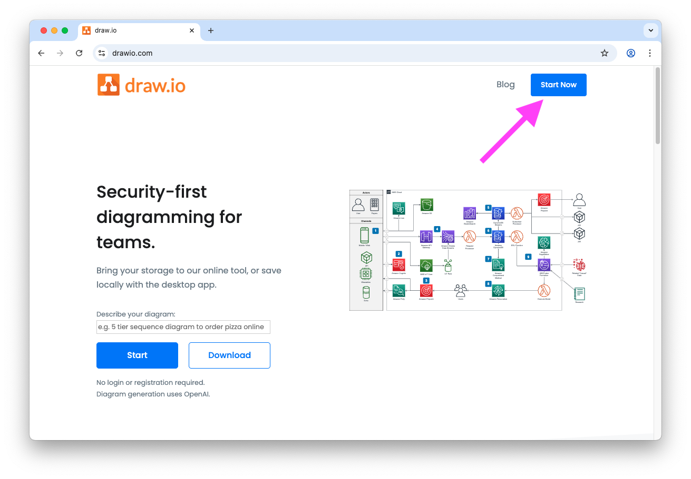

# Cours 2 | Structure

<style>.md-nav .md-nav .md-nav { display: none; }</style>

*[SEO]: Search engine optimization
*[URL]: Uniform Resource Locator

[^pascalCase]: [Notation Pascal | OQLF](https://vitrinelinguistique.oqlf.gouv.qc.ca/fiche-gdt/fiche/26543805/notation-pascal)
[^camelCase]: [Notation chameau | OQLF](https://vitrinelinguistique.oqlf.gouv.qc.ca/fiche-gdt/fiche/26543803/notation-chameau)
[^snakeCase]: [Notation serpent | OQLF](https://vitrinelinguistique.oqlf.gouv.qc.ca/fiche-gdt/fiche/26571362/notation-serpent)
[^kebabCase]: [Notation kébab | OQLF](https://vitrinelinguistique.oqlf.gouv.qc.ca/fiche-gdt/fiche/26571363/notation-kebab)
<!-- [^rfc]: [Norme RFC 3986](https://datatracker.ietf.org/doc/html/rfc3986) -->

## HTML

{ .w-100 }

HTML est le langage utilisé pour **structurer une page Web et son contenu**.  
On peut par exemple organiser le contenu en un ensemble de paragraphes, une liste d'éléments, insérer des images ou des tableaux de données[^defhtml].

[^defhtml]: https://developer.mozilla.org/fr/docs/Learn_web_development/Getting_started/Your_first_website/Creating_the_content

## Balises

Dans le langage HTML, on place le contenu de la page dans des **balises**.

Une balise s’écrit en encadrant un mot-clé par les signes « plus petit que » (`<`) et « plus grand que » (`>`). La plupart du temps, lorsqu'on ouvre une balise, il faut aussi spécifier quand elle se termine.

{.w-100 data-zoom-image}

!!! example "Clavier"

    Tous les claviers sont différents alors trouvons comment écrire ces caractères sur le clavier devant nous.

    Dépendamment du clavier, parfois c'est aussi simple que de cliquer sur la touche ++less++ et ++shift+greater++ pour l'autre sens.

### Paragraphe

Un [paragraphe](https://developer.mozilla.org/fr/docs/Web/HTML/Reference/Elements/p) HTML s'écrit avec la balise `<p>`.

Étant donné que `<p>` est une balise standard, il faut également indiquer quand elle se termine. On le fait avec sa balise de fermeture : `</p>`.

<iframe height="300" style="width: 100%;" scrolling="no" title="Web 1 - HTML - Paragraph" src="https://codepen.io/tim-momo/embed/QwjgGOM?default-tab=html%2Cresult&editable=true&theme-id=50210" frameborder="no" loading="lazy" allowtransparency="true" allowfullscreen="true"></iframe>

:material-information: Notez que le navigateur crée un espace automatiquement entre deux paragraphes. On appelle cet espacement une **marge** (ou _margin_).

### Titres

Les [titres](https://www.w3schools.com/html/html_headings.asp) HTML (ou _headings_) s’écrivent avec la lettre « h » accompagnée d’un chiffre entre 1 et 6.

<iframe class="aspect-16-9" height="300" style="width: 100%;" scrolling="no" title="Web 1 - HTML - Titre" src="https://codepen.io/tim-momo/embed/empRgpo?default-tab=html%2Cresult&editable=true&theme-id=50210" frameborder="no" loading="lazy" allowtransparency="true" allowfullscreen="true"></iframe>

!!! note "Sémantique des titres"

    Chaque page doit contenir **un seul titre de niveau 1 (`<h1>`)**. En général, une page Web correspond à un seul objectif ou sujet principal.

    Les titres suivants doivent être hiérarchisés correctement. Par exemple, un titre de niveau 3 (`<h3>`) ne doit **jamais** précéder un `<h2>` dans la structure du HTML.

### Saut de ligne

En HTML, on ne peut pas faire de saut de ligne simplement en appuyant sur la touche ++Enter++. Le navigateur les ignore 😨.

Pour forcer un saut de ligne, on peut utiliser la balise [break](https://developer.mozilla.org/fr/docs/Web/HTML/Reference/Elements/br) : `<br>`.

:material-information: Certaines balises HTML sont **autofermantes**. C’est-à-dire qu’il n’est pas nécessaire de spécifier une balise de fermeture. C’est le cas de la balise `<br>`.

<iframe height="300" style="width: 100%;" scrolling="no" title="Web 1 - HTML - Titres" src="https://codepen.io/tim-momo/embed/XJmgpzW?default-tab=html%2Cresult&editable=true&theme-id=50210" frameborder="no" loading="lazy" allowtransparency="true" allowfullscreen="true"></iframe>

!!! note "Quand l'utiliser ?"

    En général, on ne l’utilise pas 😅. Si on veut séparer deux paragraphes, on utilise plutôt des `<p>`, pas des `<br>`.

    La balise `<br>` est utilisée **uniquement** lorsque le saut de ligne fait **partie du contenu** et non pour des raisons visuelles.

    Par exemple : des paroles de chanson, une adresse postale, un dialogue ou un poème.

### Traits de séparation

Un trait de séparation horizontal s’écrit avec la balise [`<hr>`](https://developer.mozilla.org/fr/docs/Web/HTML/Element/hr) (pour _horizontal rule_).

Cette balise est **autofermante**, c’est-à-dire qu’elle n’a pas besoin d’une balise de fermeture.

Elle est utilisée pour marquer un changement de sujet.

<iframe height="300" style="width: 100%;" scrolling="no" title="Web 1 - HTML - Entité HTML" src="https://codepen.io/tim-momo/embed/MYaoxqM?default-tab=html%2Cresult&editable=true&theme-id=50210" frameborder="no" loading="lazy" allowtransparency="true" allowfullscreen="true"></iframe>

### Caractères spéciaux

En HTML, il existe deux façons d’écrire certains caractères spéciaux :

1. En les écrivant directement (ex. : é, ©, <)
1. En les écrivant sous forme d’entités HTML (ex. : `&eacute;`, `&copy;`, `&lt;`)

Une [entité HTML](https://www.w3schools.com/CHARSETS/ref_html_entities_a.asp) est une manière **codée** d’écrire un caractère spécial pour s’assurer qu’il soit bien affiché par tous les navigateurs. Elle commence par une esperluette (`&`) et se termine par un point-virgule (`;`).

:material-information: Aussi, bon à savoir, les entités HTML sont sensibles à la casse (_case sensitive_). C'est à dire que `&Eacute;` (É) et `&eacute;` (é) sont effectivement deux caractères différents.

Voici un exemple concret dans lequel on voudrait afficher la mention `<br>` dans une phrase :

<iframe class="aspect-16-9" height="300" style="width: 100%;" scrolling="no" title="Web 1 - HTML - Entité html" src="https://codepen.io/tim-momo/embed/GgpEmRK?default-tab=html%2Cresult&editable=true&theme-id=50210" frameborder="no" loading="lazy" allowtransparency="true" allowfullscreen="true"></iframe>

!!! note "L'espace inséquable"

    L’espace insécable `&nbsp;` s’affiche comme un espace normal, mais il empêche les sauts de ligne à cet endroit.

    C’est utile, entre autres, lorsqu’on veut écrire des [sommes d’argent en français](https://vitrinelinguistique.oqlf.gouv.qc.ca/21584/la-typographie/nombres/ecriture-des-sommes-dargent).

    ```html title="Exemple"
    <p>- Ma casquette m'a coûté un bon 400 $, si c’est pas plus !</p>
    <p>- Ma casquette m'a coûté un bon 400&nbsp;$, si c’est pas plus !</p>
    ```

    Voyons maintenant comment se comporte le texte si on redimentionne la fenêtre suivante :

    <iframe height="300" style="width: 100%;" scrolling="no" title="Web 1 - HTML - Entité HTML" src="https://codepen.io/tim-momo/embed/MYaooyL?default-tab=result&theme-id=50173" frameborder="no" loading="lazy" allowtransparency="true" allowfullscreen="true"></iframe>

### Commentaires

Les commentaires en HTML permettent d’ajouter des notes dans le code sans qu’elles soient affichées dans la page.

Ils sont utiles pour expliquer certaines parties du code, pour laisser des indications à d’autres développeurs ou pour désactiver temporairement un élément.

Un commentaire s’écrit entre `<!--` et `-->`. Voici un exemple :

```html
<!-- Ceci est un commentaire HTML -->
<p>Ce texte sera visible.</p>
<!-- <p>Ce texte ne sera pas affiché.</p> -->
```

## Relation Parent-Enfant



En HTML, les balises s’**imbriquent** comme des dossiers et fichiers :

- Une balise peut contenir une autre balise. On dit qu’elle est le **parent**.  
- La balise contenue est l’**enfant**.

Exemple :  

```html
<body> <!-- ← Parent -->
  <h1>Titre</h1> <!-- ← Enfant -->
  <p>Paragraphe</p> <!-- ← Enfant -->
</body>
```

## L'indentation



Pour garder un code clair et facile à relire, adoptez une convention d'indentation cohérente :

* utilisez **2 espaces** par niveau d'imbrication pour le HTML
* évitez de mélanger espaces (++space++) et tabulations (++tab++)

Exemples : 

<div class="grid align-items-top" markdown>
```html title="❌ L'enfer à lire"
<body><header><h1>Mon site
</h1>
    </header><main>
    <p>
    Contenu.</p>
  </main>
  
</body>
```

```html title="⚠️ Difficile à lire"
<body>
<header>
<h1>Mon site</h1>
</header>
<main>
<p>Contenu.</p>
</main>
</body>
```
</div>

```html title="✅ Facile à lire"
<body>
  <header>
    <h1>Mon site</h1>
  </header>
  <main>
    <p>Contenu.</p>
  </main>
</body>
```

!!! example "L'indentation"

    Dans vscode, il y a des outils d'indentation automatique, ça évite de devoir le faire manuellement.

    **🧑‍🏫 Démo du prof**

## Structure de base

Tous les sites Web, sans exception, ont **au moins** la structure de base suivante :

```html title="index.html"
<!DOCTYPE html>
<html lang="fr">
  <head>
    <meta charset="UTF-8">
    <title>Titre de l'onglet du navigateur</title>
  </head>
  <body>

  </body>
</html>
```

Explication :

*	`<!DOCTYPE html>` : indique que la page utilise HTML5 (la version actuelle du langage).
*	`<html>` : racine du document HTML. On peut y spécifier la langue de la page.
*	`<head>` : contient les métadonnées, le titre de la page, les feuilles de style et les scripts.
*	`<meta charset="UTF-8">` : (facultatif) permet d’afficher correctement les caractères accentués et les symboles spéciaux. En guise de comparaison, voici d'autres familles d’encodages :
  * ISO-8859-1 : latin (avant utf-8)
  * ISO-8859-2 : langues d’europe de l'est (polonais, tchèque, croate, etc.)
  * ISO-8859-7 : alphabet grec
*	`<title>` : définit le titre affiché dans l’onglet du navigateur (différent du `<h1>` visible sur la page).
*	`<body>` : contient tout le contenu visible de la page. C’est ici que vous placerez votre HTML.

:material-information: Observations :

* Les balises comme `<!DOCTYPE>` et `<meta>` sont autofermantes, mais les autres balises doivent avoir une balise de fermeture explicite.
* Le code HTML d’une page doit toujours se trouver dans le `<body>` et jamais ailleurs.
* En général, les balises peuvent s’imbriquer (on parle ici de relation parent-enfant).

!!! example "L'encodage"

    **🧑‍🏫 Démo du prof**

## Validateur W3C


Vous vous souvenez du W3C ? Il propose un validateur qui permet de s'assurer que la programmation est valide.

On peut y valider son code au [validator.w3.org](https://validator.w3.org/) via l'onglet "**Validate by Direct Input**".

---

<div class="grid grid-1-2" markdown>
  

  <small>Exercice - HTML</small><br>
  **[Lyrique](./exercices/lyrique/index.md){.stretched-link .back}**
</div>

<div class="grid grid-1-2" markdown>
  

  <small>Exercice - HTML</small><br>
  **[Trouve les erreurs](./exercices/trouve-les-erreurs/index.md){.stretched-link .back}**
</div>

## Structure de projet Web

{.w-100}

Un site Web est composé de nombreux fichiers : `HTML`, `CSS`, `images`, `scripts`, etc. Bien organiser ces fichiers dès le départ facilite grandement le développement et la maintenance du site.

### Structure recommandée 👌

Voici une structure de dossier simple et assez générique pour vos projets :

```txt
📂 mon-site-web
├── index.html
├── contact.html
├── ...
└── 📂 assets
    ├── 📂 img
    │   ├── main-background.jpg
    │   └── logo.png
    ├── 📂 video
    │   └── film-culte.mp4
    └── 📂 css
        └── styles.css
```

Explication :

* 📂 assets : Le dossier assets regroupe toutes les ressources comme les **images**, les **vidéos**, les fichiers **audio**, les feuilles de styles (**css**), les scripts, etc.
* Les fichiers avec l'extension `.html`, les pages web, sont pour leur part placés soit à la racine du projet, soit dans des dossiers pour mieux les catégoriser.
* Le fichier `index.html` situé à la racine est essentiel.

!!! question "Pourquoi index.html ?"

    Le fichier nommé `index.html` est automatiquement chargé par le navigateur. C'est une convention.

    Si aucun fichier ne porte ce nom, il faut alors spécifier le nom du fichier dans l’URL (par exemple, `https://monsite.com/bienvenue.html`).

## Organisation des fichiers HTML



Il existe deux approches principales pour organiser les fichiers HTML d'un site.

La grande différence se trouve essentiellement dans l'URL.

### Option 1 : Tous les fichiers HTML à la racine

Dans cette approche, toutes les pages HTML sont placées directement à la racine du projet.

Exemple avec une page « contact » :

```txt title="https://monsite.com/contact.html"
📂 mon-site-web
├── index.html
└── contact.html
```

### Option 2 : Chaque page dans son propre dossier

Dans cette deuxième approche, chaque page possède son propre dossier contenant un fichier `index.html`. Cela permet d'obtenir des URL plus élégantes, sans extension `.html`.

Le même exemple avec une page « contact » :

```txt title="https://monsite.com/contact"
📂 mon-site-web
├── index.html
└── 📂 contact
    └── index.html
```

!!! example "Organiser ses fichiers"

    **🧑‍🏫 Démo du prof**

## Convention de nommage

Il existe 4 grandes conventions pour nommer des fichiers, des dossiers et même pour écrire du code en programmation.

On appelle ça des **notations**.

| Notation                 | Exemple              | Explication                                            |
|--------------------------|----------------------|--------------------------------------------------------|
| 🧮 Pascal[^pascalCase]   | `MonNomDeFichier`    | Chaque mot commence par une majuscule                  |
| 🐫 Chameau[^camelCase]   | `monNomDeFichier`    | Chaque mot commence par une majuscule sauf le premier  |
| 🐍 Serpent[^snakeCase]   | `mon_nom_de_fichier` | Chaque mot est séparé par une barre de soulignement    |
| 🌯 Kébab[^kebabCase]     | `mon-nom-de-fichier` | Chaque mot est séparé par un tiret                     |

Celui qui nous intéresse en Web, c’est le **kébab** (miam miam).

### Notation Kébab


La notation kebab-case consiste simplement à écrire tous les mots en minuscules, séparés par des tirets.

Ce qui doit être évité :

* ❌ Espace
* ❌ Caractères accentués. Ex. : é, à, ç, ï
* ❌ Caractères spéciaux. Ex. : $, #, ?, %

#### Pourquoi _kebab-case_ ?

Parce qu’en Web, la **nomenclature a un impact direct sur l’URL** dans le navigateur.

Un fichier nommé `ma-page-contact.html` sera affiché ainsi dans la barre d'adresse du navigateur :

```txt
https://monsite.com/ma-page-contact.html
```

#### L'exception à la règle

L'interprétation des URL par Google dicte l'exception à la règle parce qu'il utilise la barre de soulignement pour un usage précis.

En effet, Google considère `_` comme un liant, donc un seul mot.

Exemple :

* aujourd-hui : Google comprend 2 mots, "aujourd" et "hui"
* aujourd_hui : Google comprend 1 seul mot, "aujourdhui"

!!! question "Laquelle choisir ?"

    ```txt
    https://monsite.com/aujourdhui.html 👈

    https://monsite.com/aujourd-hui.html

    https://monsite.com/aujourd_hui.html 👈
    ```

<div class="grid grid-1-2" markdown>
  

  <small>Exercice</small><br>
  **[Arrange-moi ça !](./exercices/arrange/index.md){.stretched-link .back}**
</div>

## Arborescence



Un site Web c'est comme un arbre 🌳 :

* La page d’accueil est la **racine**.  
* Les sections principales sont des **branches**.  
* Les pages du site sont des **feuilles**.  

```txt
Accueil
 ├─ Produits
 │   ├─ Vêtements
 │   └─ Électronique
 └─ Contact
```

Plus un site grandit, plus il faut garder une arborescence claire.  

Une bonne structure aide à organiser les contenus, guider la navigation et améliorer le référencement (SEO).

### URL



Chaque page a une URL unique qui reflète sa place dans l’arborescence.  

{ data-zoom-image }

Une bonne URL est **courte, descriptive** et utilise le **kebab-case**.

Dans une URL, les espaces et accents sont convertis en code UTF-8 (ex. : "Espace" = `%20`).

<!-- ⚠️ Caractères réservés (RFC 3986[^rfc]) : `: / ? # [ ] @ ! $ & ' ( ) * + , ; =` -->

Préconiser les chemins hiérarchiques pour comprendre où on se trouve sur le site :

<div class="grid">
```txt title="Hiérarchique"
/vetements-homme/jeans/etroits/
```

```txt title="À éviter"
/jeans-etroits-pour-homme
```
</div>

Évitez les majuscules, espaces et caractères spéciaux.  

!!! info "Tant qu'à alléger l'URL, allégeons-la pour la peine !"

    Retirez tous les déterminants (`le, la, les, un, une, des, l'`) des slugs.

    Ex. `https://monsite.com/la-page-du-projet` → `https://monsite.com/page-projet`.

### Navigation

La navigation n'est pas forcément pareille à l'arborescence.

Prenons par exemple le site : <https://www.cyberpunk.net>.

Malgré la présence d'une section News dans le site, elle ne figure pas dans le menu principal !

**Bonnes pratiques** :

* Garder le menu principal court (5 à 7 éléments maximum)
* Structure stratégique : sections clés au premier niveau
* Indiquer la page active
* Ajouter un fil d’Ariane
* Tester l’usage au clavier et sur mobile (menu burger 🍔)

## Draw.io

{ data-zoom-image .w-100 }

[Draw.io](https://www.drawio.com) est un outil gratuit pour créer des diagrammes, arborescences, organigrammes.

En Web, c’est un bel outil pour représenter visuellement l’arborescence d’un site et les relations entre les pages.

### Accéder à l’application

Il y a deux manières d’utiliser Draw.io.

<div class="grid grid-1-1" markdown>
<figure markdown>
{data-zoom-image}
<figcaption markdown>Par l’[extension Draw.io](https://marketplace.visualstudio.com/items?itemName=hediet.vscode-drawio) dans VSCode</figcaption>
</figure>

<figure markdown>
{data-zoom-image}
<figcaption markdown>Par le site <https://www.drawio.com></figcaption>
</figure>
</div>

!!! success "VSCode + draw.io"

    Si vous utilisez VSCode, il faut d'abord installer l'extension.
    
    Il suffit ensuite de créer un fichier avec l’extension `.drawio` et l’application s’ouvrira automatiquement.

### Créer un diagramme

Un diagramme est composé de **formes** et de **connexions**.

#### Ajouter des formes

1. Ouvrez la bibliothèque de formes (Section « Général » dans la colonne de gauche)
1. Glissez des formes (ex. : rectangles arrondis) sur le canevas.

#### Relier des formes

1. Survolez une forme.
1. Cliquez sur l'une des flèches bleues et maintenez.
1. Glissez jusqu’à une autre forme, puis relâchez.

#### Écrire du texte

Double-cliquez sur une forme pour modifier son texte.


### Navigation et manipulation

#### Se déplacer dans le canevas

* Flèches du clavier
* Barres de défilement
* Bouton du milieu de la souris (MMB) + glisser

#### Zoom

* Alt + molette de la souris
* Outils de zoom dans la barre d’outils

#### Sélection multiple

* Cliquez-glissez pour tracer une zone de sélection.

⚠️ Les éléments doivent être entièrement dans la zone pour être sélectionnés.

### Mise en forme

#### Alignement des blocs

1. Sélectionnez plusieurs éléments
1. Cliquez sur `Organiser › Aligner`
1. Choisissez un alignement

#### Types de lignes

* Ligne droite (par défaut) : simple, directe.
* Ligne orthogonale : suit un tracé en angles droits (souvent plus clair pour des structures arborescentes).

🔎 Pour changer le type de ligne, sélectionnez une ligne, puis choisir l'icône correspondante à son type dans la barre d’outils.


### Enregistrement

Pour enregistrer un fichier drawio, il faut soit le faire via GoogleDrive avec un compte Google, soit l'enregistrer manuellement.

Pour l'enregistrement manuel, assurez-vous d'enregistrer le fichier avec l'extension `.drawio` sur votre disque dur externe.

### Export

Avant d’exporter le diagramme en image, il est conseillé d’ajuster les paramètres de page pour un meilleur rendu :

#### Préparation

1. Aller dans `Fichier › Paramètres de la page...`
1. Cliquer sur **Modifier…** à droite du libellé **Arrière-plan**
1. Cocher l’option **Couleur de remplissage**
1. Cliquer sur **Appliquer**, puis à nouveau sur **Appliquer** pour fermer le popup

#### Export en PNG

1. Aller dans `Fichier › Exporter en tant que` et sélectionner **PNG...**
1. Dans le champ **Largeur de la bordure**, inscrire la valeur **50**
1. Dans le champ **Où**, choisir **Périphérique**
1. Cliquer sur **Enregistrer**, puis choisir un emplacement sur votre disque dur externe

<div class="grid grid-1-2" markdown>
  

  <small>Exercice</small><br>
  **[Musée d'art contemporain de Montréal](./exercices/mac/index.md){.stretched-link .back}**
</div>
