# Cours 3

*[DOM]: Document Object Model

## Tutorat

{.w-100}

Comment ça marche ?

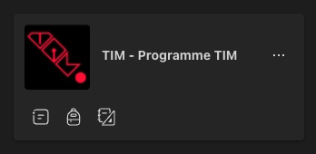

Dans le groupe Teams « TIM - Programme TIM », il y aura une annonce faite par le tuteur pour annoncer sa disponibilité. Aussi, il y aura un [horaire en ligne](https://www.cmontmorency.qc.ca/etudiants/services-aux-etudiants/aide-a-la-reussite/aide-techniques/centre-aide-integration-multimedia/) disponible sur le site du collège.

Il suffit d'envoyer un message privé au tuteur ou à la tutrice.

Y'a pas de gêne à avoir parce qu'ils sont carrément en attente de votre message !

Exemple :

> Bonjour Émeryk.<br>Je suis dans le cours Web1 et j'aurais besoin d'aide concernant mon TP1.


## Validateur HTML

Vous vous souvenez du validateur W3C qui détecte les erreurs dans le HTML ?

Hé bien il y a mieux encore 😜

L'extension [HTMLHint](https://marketplace.visualstudio.com/items?itemName=mkaufman.HTMLHint) fait _grosso modo_ la même chose que le validateur du W3C, mais à même VSCode !

Pour l'installater :

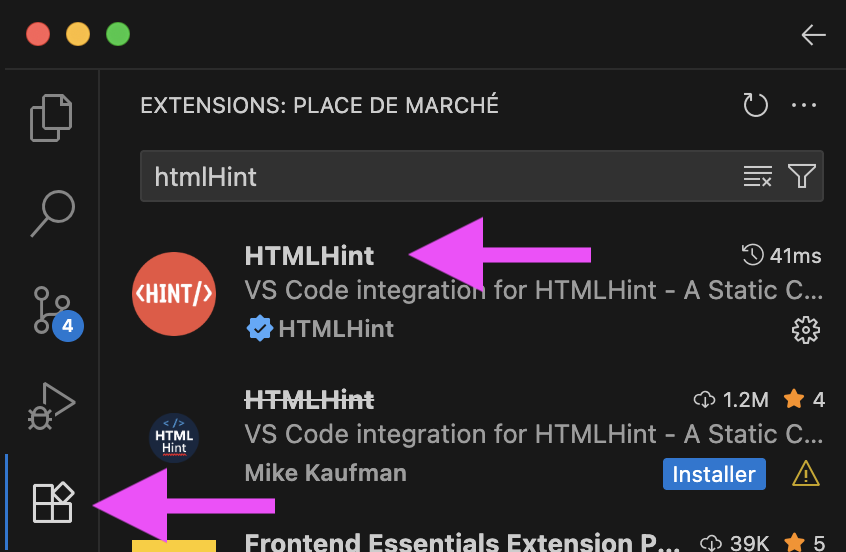{data-zoom-image}
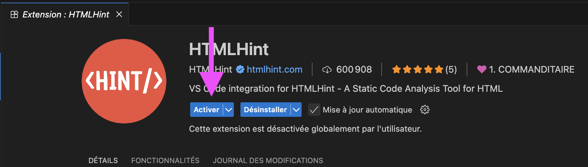{data-zoom-image}

Résultat :

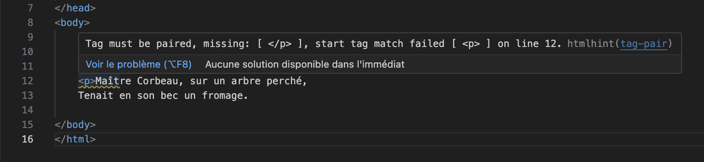{data-zoom-image}

:material-information: Il est possible que l'extension HTMLHint ne soit pas installée par défaut sur votre version de vscode. Dans ce cas, cherchez **HTMLHint** dans les extensions VSCode et installez-la.

### :octicons-copilot-24: GitHub Copilot

L'extension GitHub Copilot est parfois activée par défaut dans VS Code. Bien qu’utile pour les programmeurs avancés, elle peut nuire à votre apprentissage, car elle génère du code à votre place.

Pour bien assimiler la matière, je vous recommande de désactiver Copilot pendant les exercices.

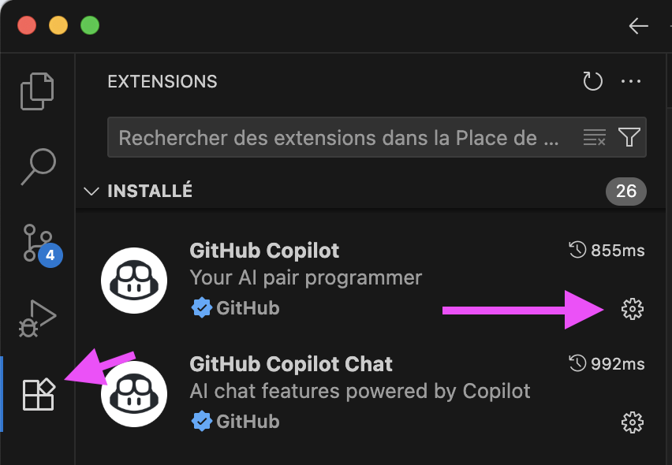{data-zoom-image}

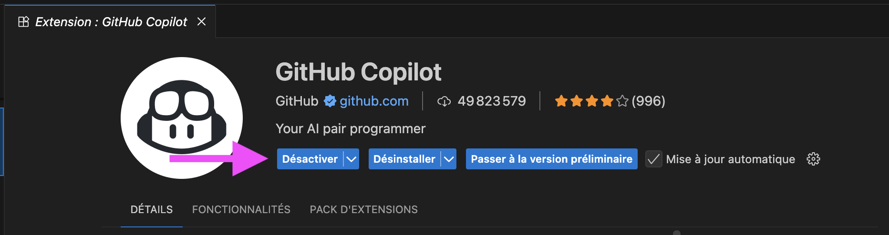{data-zoom-image}

## Rappel sur l'indentation automatique

Comme il est essentiel d'indenter son code afin de bien le lire, voici un rappel sur la manière d'indenter le code automatiquement avec [Prettier](https://marketplace.visualstudio.com/items?itemName=esbenp.prettier-vscode).

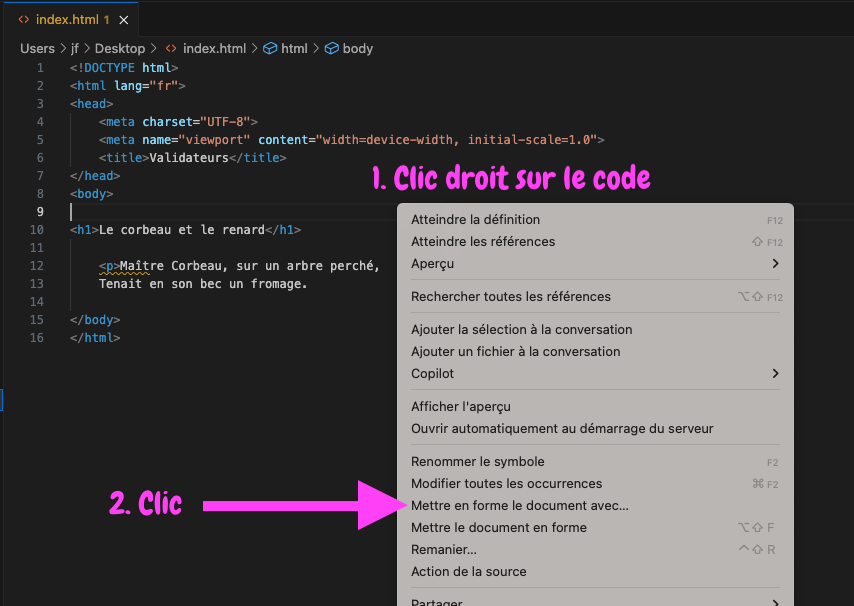{data-zoom-image}

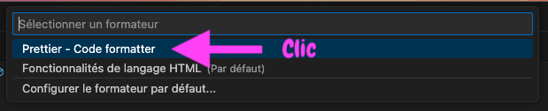{data-zoom-image}

:material-information: Il est possible que l'extension Prettier ne soit pas installé par défaut sur votre version de vscode. Dans ce cas, cherchez **Prettier** dans les extensions VSCode et installez-la.

## Serveur

{.w-100}

Les sites Web que nous consultons sont installés sur des **serveurs**.

!!! question "C'est quoi un serveur ?"

    Un serveur, c’est simplement un ordinateur spécialisé dont la tâche est d’envoyer les pages d’un site Web à ton navigateur.

Dans VSCode, on peut simuler un serveur avec l’option « Go Live ».

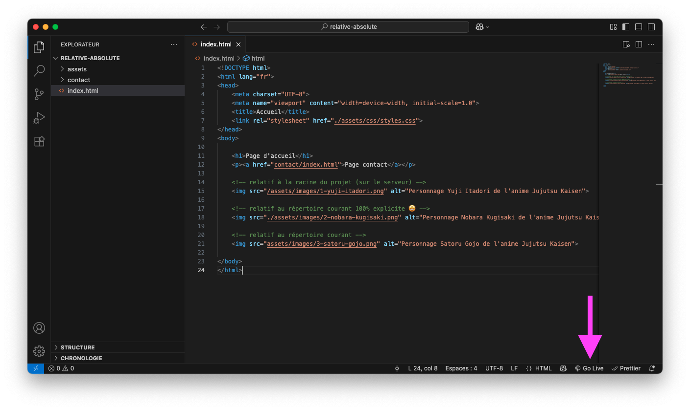{ data-zoom-image }

Quand on clique sur Go Live, la page Web s’ouvre dans le navigateur.

Observez que l’URL est différente de celle obtenue en double-cliquant sur un fichier HTML (ex.: http://127.0.0.1:5500/).

C’est ainsi parce que VSCode crée une adresse locale qui simule un vrai site accessible sur le Web.

Ainsi, on peut tester un site comme s’il était hébergé en ligne. C'est super pratique et on va bientôt voir pourquoi c’est le cas 😜

## Attributs HTML

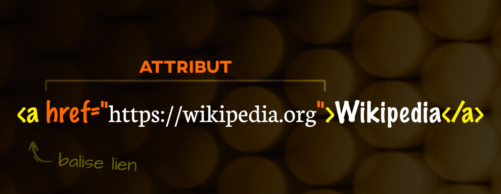{ data-zoom-image }

Les éléments HTML ont des attributs.

Des attributs, c'est des options de configuration des éléments HTML[^attr].

[^attr]: [Référence des attributs HTML](https://developer.mozilla.org/fr/docs/Web/HTML/Reference/Attributes)

### Attributs universels

Les attributs universels sont des attributs communs à l'**ensemble** des éléments HTML[^attrglobal].

[^attrglobal]: [Les attributs universels](https://developer.mozilla.org/fr/docs/Web/HTML/Reference/Global_attributes)

| Attribut                           | Rôle / Effet visible                          | Exemple |
|------------------------------------|-----------------------------------------------|---------|
| `title` :material-format-title:    | Affiche une info-bulle (tooltip) au survol    | `<p title="Astuce">Survolez-moi</p>` |
| `dir` :material-arrow-left-right:  | Définit la direction du texte (`ltr`, `rtl`)  | `<p dir="rtl">Texte en arabe</p>` |
| `hidden` :material-ghost:          | Masque l’élément (il reste dans le code)      | `<p hidden>Texte masqué</p>` |
| `lang` :material-translate:        | Indique la langue du contenu (accessibilité)  | `<html lang="fr">` |
| `class` :art:                      | Identifiant pour un élément                   | `<p class="texte-important">Paragraphe</p>` |
| `id` :material-fingerprint:        | Identifiant unique pour un élément            | `<p id="intro">Paragraphe</p>` |

:material-information:  On ne les utilise pas encore, mais vous verrez bientôt que **class** sert à appliquer un style et **id** sert à cibler un élément précis.

### Liens hypertexte

La syntaxe

```html
<a href="https://www.google.com">Visiter Google</a>
```

#### Types de liens

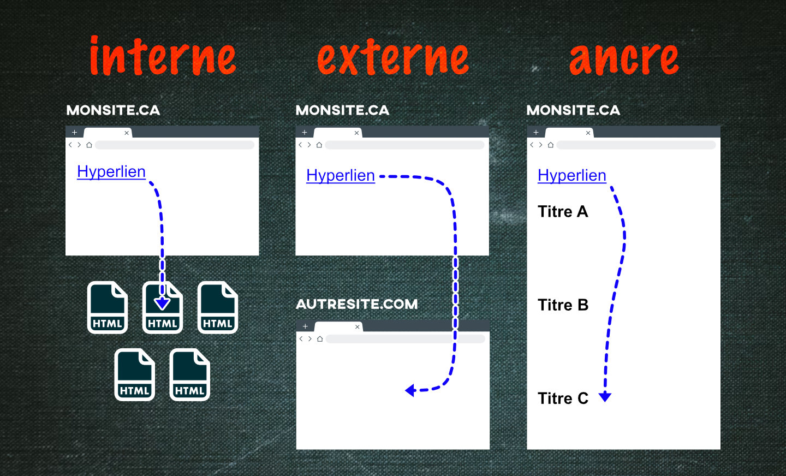{data-zoom-image}

| Type | Exemple | Description |
|------|---------|-------------|
| **Externe** | `<a href="https://example.com">Lien externe</a>` | Va vers un autre site |
| **Interne** | `<a href="page2.html">Page interne</a>` | Va vers une autre page du même site |
| **Ancre** | `<a href="#section2">Aller à Section 2</a>` | Saute à une section de la même page |

#### Créer une ancre

```html
<a href="#contact">Aller à Contact</a>

<!-- Plus bas dans la page -->
<h2 id="contact">Section Contact</h2>
```

#### Comportement du lien

On peut choisir si le lien va ouvrir sa destination dans la page en cours ou dans un nouvel onglet avec l'attribut `target`. Les valeurs possibles sont : 

* `_self` : (par défaut) ouvre dans le même onglet.
* `_blank` : ouvre dans un nouvel onglet.

```html
<a href="https://site.com" target="_blank">Site</a>
```

#### L'attribut href

L'attribut `href` peut contenir une adresse courriel préfixée par `mailto:` afin d'indiquer au service de courrielleur de l'usager (Outlook, Gmail, etc.) de générer un nouveau message prêt à être rédigé.

```html
<a href="mailto:exemple@gmail.com">Écrivez-moi!</a>
```

L'attribut `href` peut aussi contenir un numéro de téléphone préfixée par `tel:` afin d'indiquer que le système d'exploitation devrait devrait déclencher un appel au numéro mentionné si cette fonctionnalité est supportée par celui-ci.

```html
<a href="tel:5551234567">Appelez-moi!</a>
```

### Images


L'élément HTML [``](https://developer.mozilla.org/fr/docs/Web/HTML/Reference/Elements/img) permet d'intégrer une image dans une page Web.

La syntaxe de base :

```html

```

Attributs :

* L'attribut `src` est obligatoire et contient le chemin vers l'image qu'on veut intégrer.
* L'attribut `alt` est obligatoire et contient une description textuelle de l'image, ce qui est extrêmement utile. En effet, les outils de lecture d'écran utilisent cette description pour la lire afin que les personnes sachent ce que l'image représente. Ce texte alternatif sera également affiché sur la page si l'image ne peut pas être chargée.
* Les attributs `width` et `height` sont facultatifs. Ils permettent de définir la taille intrinsèque de l'image.

<!-- * L'attribut `loading` est facultatif. Il indique comment le navigateur devrait charger l'image. Les valeurs possibles sont les suivantes :
  * `eager` : L'image est chargée immédiatement, que l'image soit située dans la zone d'affichage (viewport) visible ou non. Il s'agit de la valeur par défaut.
  * `lazy` : Le chargement de l'image est retardé jusqu'à ce que celle-ci soit située à une certaine distance, définie par le navigateur, de la zone d'affichage. L'idée est d'éviter de consommer de la bande passante et des ressources réseaux avant d'être relativement certain que l'image est nécessaire. Pour la plupart des cas d'usage, cela permet d'améliorer les performances. -->

```html title="Exemple plus élaboré"

```

Les formats courants sont les `.jpg`, `.png`, `.webp` et `.svg`. Nous y reviendrons en détail.

<!-- 
| Format | Description |
|--------|-------------|
| `.jpg` ou `.jpeg` | Compression avec perte. Idéal pour les photos. Pas de transparence. |
| `.png` | Compression sans perte. Supporte la transparence alpha. |
| `.gif` | 256 couleurs maximum. Supporte l’animation et la transparence binaire. |
| `.webp` / `.avif` | Format moderne au poids optimisé. Très léger. |
| `.svg` | Format vectoriel. Souvent utilisé pour les icônes. | 
-->

#### Texte alternatif


Pour savoir quoi écrire dans le texte alternatif (`alt=""`), une « règle du pouce » veut qu'on s'imagine devoir expliquer une image à une personne qui a les yeux bandés.

## Inspecteur de :fontawesome-brands-chrome:  Chrome 

{.w-100}

### Ouvrir l'inspecteur 🕵 

* Faire un clic droit sur la souris 🖱️ et choisir l'option **Inspecter**.
* Utiliser le raccourci clavier ⌨️
  * Windows ++ctrl+shift+i++ ou ++f12++
  * Mac ++command+option+i++ ou ++f12++

### Positionnement

Dans le coin supérieur droit :arrow_upper_right: de l’inspecteur, vous remarquerez une icône :material-dots-vertical: 

Elle permet d'accéder aux paramètres d'affichage de l'inspecteur (_Dock side_).


### Simulation

Dans le coin supérieur droit :arrow_upper_left: de l’inspecteur, vous remarquerez une icône de cellulaire devant un laptop.

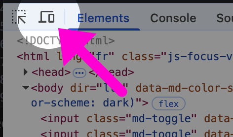{}

Elle permet de visionner le site dans différentes tailles d'écran pour tester l'aspect _Responsive_ (Réactivité) du site.


### L'onglet Éléments

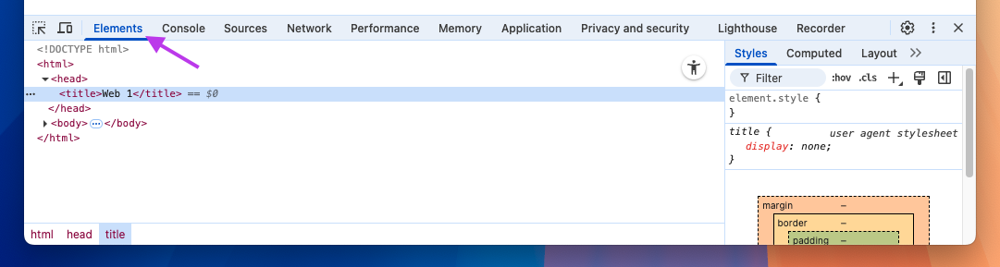

L'onglet éléments affiche le HTML de la page en cours. On l'appelle le DOM ou _DOM tree_. C'est la partie modifiable des éléments affichés sur la page Web.

#### Sélection

Dans le coin supérieur droit :arrow_upper_left: de l’inspecteur, vous remarquerez l'icône d'une flèche entourée d'un carré :material-button-cursor:.

Elle sert à sélectionner un élément dans la page.

#### Chercher

Il est possible de rechercher un élément en utilisant un raccourci clavier ⌨️

* Windows ++ctrl+f++
* Mac ++command+f++

L'élément recherché peut être du texte, une balise, un attribut, etc.

#### Modification et suppression

Pour modifier n'importe quoi dans la page, sélectionnez un élément du DOM avec la souris, faites un clic droit, puis sélectionnez « Modifier au format HTML ». On peut ainsi modifier le contenu ainsi que le HTML dans le DOM.

Pour supprimer un élément, on sélectionne un élément du DOM, puis on appuie sur la touche ++backspace++.

!!! example "Exercice rapide"

    [Change mon texte](#){ .md-button .md-button--primary }

    [Supprime-moi !](#){ .md-button .md-button--primary }

## Types de chemins

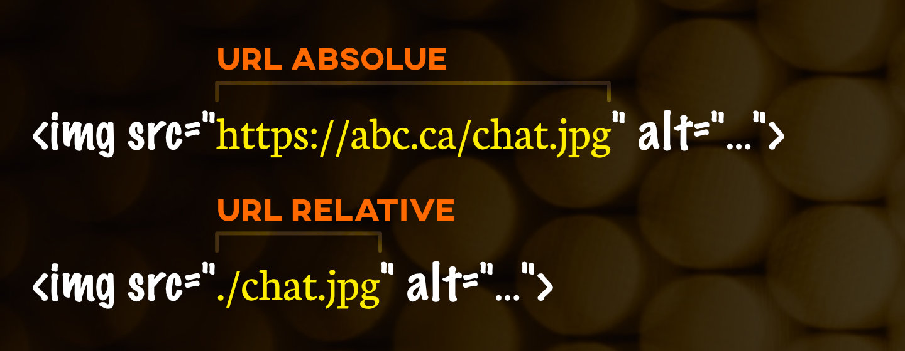{data-zoom-image}

### Chemins relatifs

Pour pointer de manière relative vers un fichier, on doit spécifier un **chemin**. Voici les 3 méthodes :

| Chemin | Signification                       |
|--------|-------------------------------------|
| `./`   | Dossier actuel                      |
| `../`  | Remonte d’un dossier                |
| `/`    | Racine du projet sur un **serveur** |

#### Exemple depuis la racine

Le dossier assets est facilement accessible depuis la racine du projet.

```text title="Structure de projet"
📂 mon-site-web
├── index.html 👈
├── 📂 contact.html
│    └── index.html
└── 📂 assets
    ├── 📂 img
    │   ├── main-background.jpg
    │   └── logo.png 🎯
    ├── 📂 video
    │   └── film-culte.mp4
    └── 📂 css
        └── styles.css
```

```html title="Chemins relatifs possibles"
 ✅ Valide
<!-- ou -->
 ✅ Valide et explicite (on aime)
<!-- ou -->
 ⚠️ Valide, mais il faut un serveur, sinon ça ne fonctionne pas
```

#### Exemple depuis ailleurs

Dans cet exemple, il faut remonter d'un niveau pour avoir accès au dossier assets.

```text title="Structure de projet"
📂 mon-site-web
├── index.html
├── 📂 contact.html
│    └── index.html 👈
└── 📂 assets
    ├── 📂 img
    │   ├── main-background.jpg
    │   └── logo.png 🎯
    ├── 📂 video
    │   └── film-culte.mp4
    └── 📂 css
        └── styles.css
```

```html title="Chemin relatif"

```

!!! example "Fichiers locaux vs serveur local"

    [**🧑‍🏫 Démo du prof**](./exercices/relative.zip)

    Dans cette démo, nous observerons que certains chemins relatifs se comportent différemment s'ils sont interprétés sur les fichiers locaux ou sur un serveur (ex.: Go Live).

## Web sémantique

{.w-100}

> **Sémantique** n. f.
>
> Ensemble des relations entre les caractères, ou groupes de caractères, et leur signification, indépendamment de la façon de les employer ou de les interpréter.[^semantique]

[^semantique]: [Sémantique | Office québécois de la langue française](https://vitrinelinguistique.oqlf.gouv.qc.ca/fiche-gdt/fiche/8369344/semantique)

La sémantique en Web, c’est donner du sens au code pour qu’il soit le plus compréhensible et significatif possible.

C'est comme si on devait comprendre la programmation sans avoir à regarder le résultat dans le navigateur.

<!-- 
### Pourquoi est-ce important ?

> Si ça ne change rien, pourquoi je devrais porter attention à la sémantique ?

Le code est moins difficile à lire.

Les robots qui scannent les sites comprennent mieux.

Les liseuses d'écran peuvent indiquer à l'utilisateur la structure du contenu. -->

### Lisibilité

En HTML, il existe une balise générique qui se nomme `<div>` (pour division).

Son nom (div) ne dit rien vraiment sur ce qu'elle fait ou ce qu'elle contient. 

En contrepartie, une balise comme `<article>` est beaucoup plus parlante. Ça donne une bonne idée de ce qu'elle pourrait contenir, c'est-à-dire un article.

<div class="grid" markdown>
```html title="Balises génériques"
<div>
  <div> ... </div>
  <div> ... </div>
  <div> ... </div>  
</div>
```

```html title="Balises sémantiques"
<section>
  <article> ... </article>
  <article> ... </article>
  <article> ... </article>
</section>
```
</div>

### Balises sémantiques

En HTML, il y a environ une [centaine de balises](https://developer.mozilla.org/fr/docs/Web/HTML/Reference/Elements), mais elles ne sont pas toutes sémantiques.

Voici les balises sémantiques en lien avec la structure d'une page :

| Balise      | Rôle |
| ----------- | ---- |
| `<header>`  | En-tête du site ou d’une section |
| `<nav>`     | Zone de navigation |
| `<main>`    | Contenu principal unique de la page |
| `<section>` | Regroupement logique de contenu |
| `<article>` | Contenu autonome et réutilisable (ex. : billet de blogue, article de presse) |
| `<aside>`   | Contenu secondaire ou complémentaire (pub, info connexe) |
| `<footer>`  | Pied de page (page ou section) |

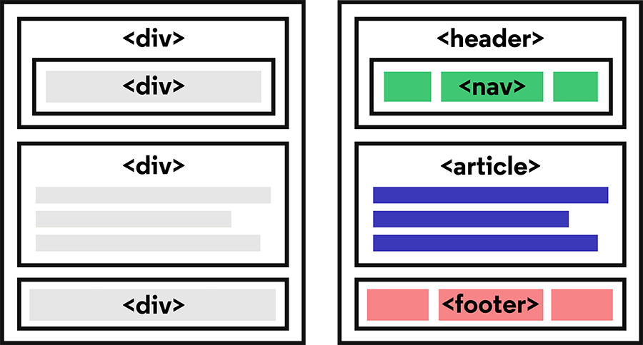


<!-- #### Contenu et médias

| Balise         | Rôle |
| -------------- | ---- |
| `<figure>`     | Conteneur pour un visuel, une image ou un média |
| `<figcaption>` | Légende associée à un `<figure>` |
| `<mark>`       | Mettre en évidence un texte (surlignage) |
| `<time>`       | Représente une date, une heure ou une durée |
| `<address>`    | Informations de contact |

#### Contenu interactif

| Balise       | Rôle |
| ------------ | ---- |
| `<details>`  | Contenu extensible/pliant (accordéon natif) |
| `<summary>`  | Titre cliquable d’un `<details>` |
| `<dialog>`   | Boîte de dialogue ou fenêtre modale | -->

!!! example "Bonne structure HTML sémantique"

    **🧑‍🏫 Démo du prof**

### Anglicismes

Les anglicismes doivent être pris en charge de manière sémantique. Pour ce faire, il faut utiliser l'attribut `lang=""`. Eh oui, ça peut aller ailleurs que dans la balise `<html>` !

<iframe height="300" style="width: 100%;" scrolling="no" title="Web 1 - Formatage" src="https://codepen.io/tim-momo/embed/vEOwpGm?default-tab=html%2Cresult&editable=true&theme-id=50173" frameborder="no" loading="lazy" allowtransparency="true" allowfullscreen="true">
  See the Pen <a href="https://codepen.io/tim-momo/pen/vEOwpGm">
  Web 1 - Formatage</a> by TIM Montmorency (<a href="https://codepen.io/tim-momo">@tim-momo</a>)
  on <a href="https://codepen.io">CodePen</a>.
</iframe>

:material-information: Utiliser `lang=""` de cette façon est moins nécessaire si c’est un anglicisme passé dans l’usage courant (ex. : « email » ou « weekend »).

## Balises génériques (non sémantiques)

| Balise | Type | Usage typique |
|--------|------|---------------|
| `<div>` | bloc | Conteneur de sections (ex. : regroupement de paragraphes, structure d’une page) |
| `<span>` | inline | Mise en forme ou manipulation de mots précis dans une ligne de texte |

```html
<div class="carte">
  <h2>Produit</h2>
  <p>Prix : <span class="prix">29,99 $</span></p>
</div>
```

## Formatage du texte HTML

| Balise   | Description | Exemple |
|----------|-------------|---------|
| `<strong>` | Met un texte en gras et indique une importance (version sémantique de `<b>`) | `<strong>Attention!</strong>` |
| `<em>` | Met un texte en italique et ajoute une emphase (version sémantique de `<i>`) | `<em>Mise en valeur</em>` |
| `<u>` | Souligne un texte <br>❌ Déconseillé, car c'est un style réservé aux liens | `<u>Texte souligné</u>` |
| `<small>` | Affiche un texte en taille réduite | `<small>Note en petit</small>` |
| `<del>` | Indique un texte **supprimé** (style barré) | `<del>Texte supprimé</del>` |
| `<sub>` | Met un texte en indice (en bas) | `H<sub>2</sub>O` |
| `<sup>` | Met un texte en exposant (en haut) | `x<sup>2</sup>` |
| `<mark>` | Surligne un texte | `<mark>Texte surligné</mark>` |
| `<abbr>` | Définit une abréviation (avec info au survol) | `<abbr title="HyperText Markup Language">HTML</abbr>` |

<iframe height="300" style="width: 100%;" scrolling="no" title="Web 1 - Formatage et anglicismes" src="https://codepen.io/tim-momo/embed/myJYXKY?default-tab=html%2Cresult&editable=true&theme-id=50173" frameborder="no" loading="lazy" allowtransparency="true" allowfullscreen="true">
  See the Pen <a href="https://codepen.io/tim-momo/pen/myJYXKY">
  Web 1 - Formatage et anglicismes</a> by TIM Montmorency (<a href="https://codepen.io/tim-momo">@tim-momo</a>)
  on <a href="https://codepen.io">CodePen</a>.
</iframe>

## Exercices

<div class="grid grid-1-2" markdown>
  

  <small>Exercice HTML</small><br>
  **[Fait du sens](./exercices/fait-du-sens/index.md){.stretched-link .back}**
</div>

<div class="grid grid-1-2" markdown>
  

  <small>Exercice HTML</small><br>
  **[Élémentaire](./exercices/format/index.md){.stretched-link .back}**
</div>

<div class="grid grid-1-2" markdown>
  

  <small>Exercice HTML</small><br>
  **[Ancres et cie.](./exercices/anchor/index.md){.stretched-link .back}**
</div>

## Devoir

<div class="grid grid-1-2" markdown>
  

  <small>Devoir formatif</small><br>
  **[Relativité einsteinienne](./exercices/relativite-einsteinienne/index.md){.stretched-link .back}**
</div>
