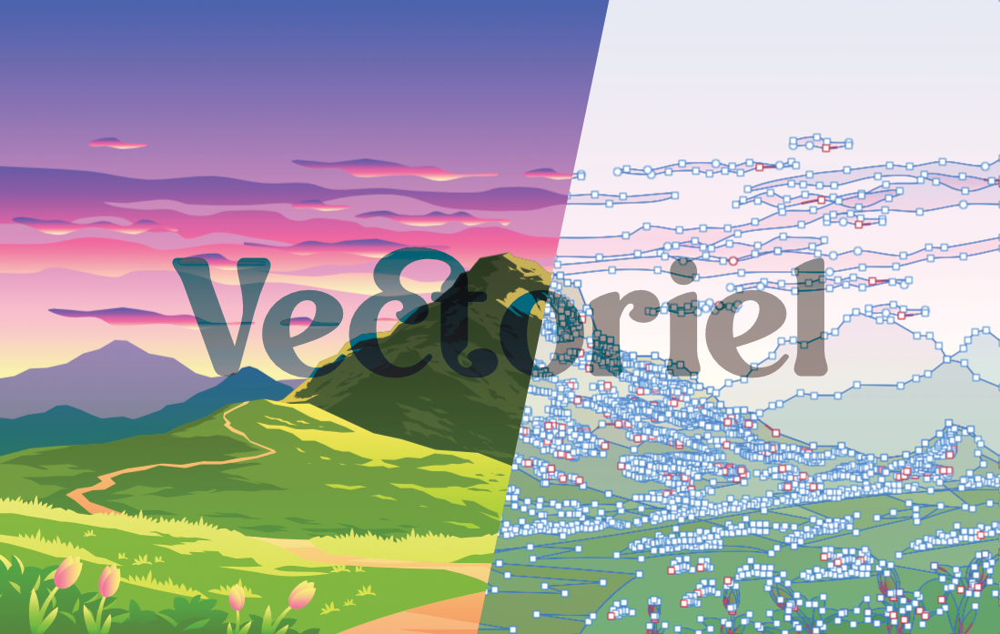
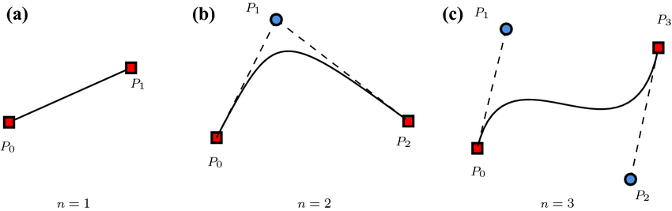
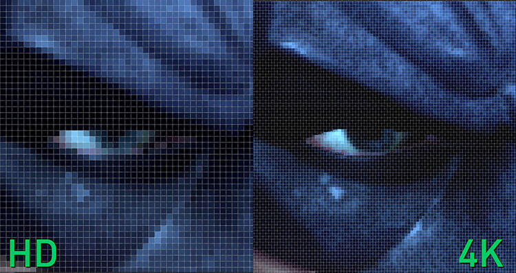
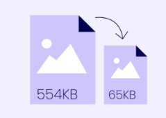
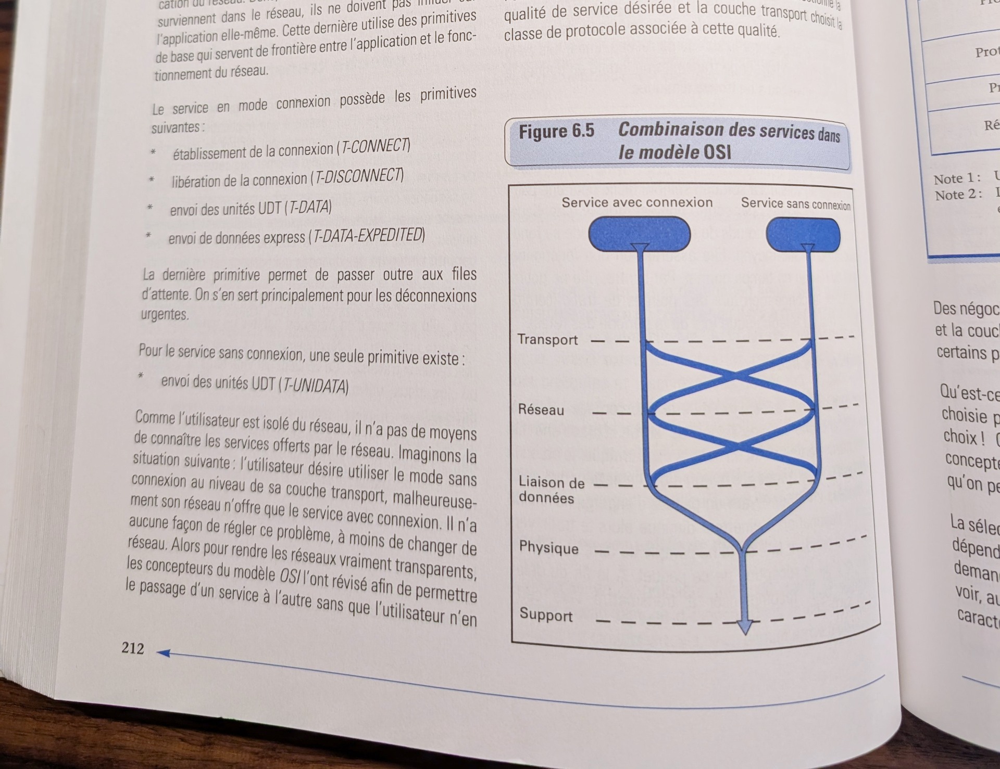
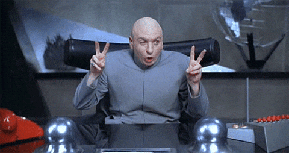
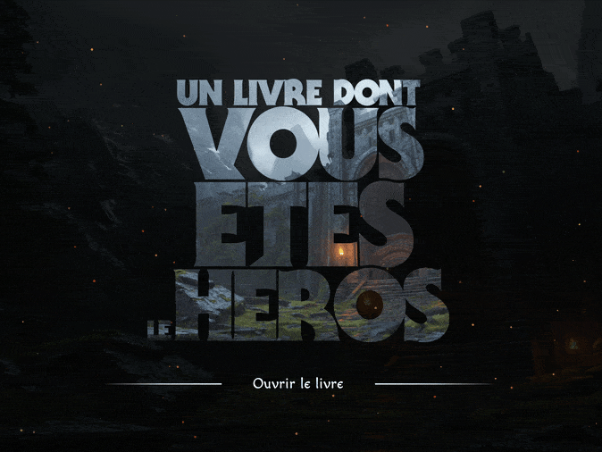

# Cours 4

*[SVG]: Scalable Vector Graphics

## Formats d’image


Il existe deux [types d’images](https://developer.mozilla.org/fr/docs/Web/Media/Guides/Formats/Image_types) utilisés en Web : les images **vectorielles** et les images **matricielles** (ou *bitmap* en anglais).

### Vectoriel

{data-zoom-image}

Les images vectorielles sont décrites par des équations mathématiques. Elles indiquent au navigateur comment dessiner l’image : « trace une ligne entre ces deux points », « dessine une courbe de Bézier entre ces coordonnées », etc. Ce système leur permet de rester nettes quelle que soit la taille d’affichage.

{.w-50 data-zoom-image}

Comme personne ne s'amuse à faire des maths pour dessiner une image, plusieurs outils spécialisés servent à gérer assez simplement les images vectorielles :

- [Adobe Illustrator](https://www.adobe.com/ca_fr/products/illustrator.html)
- [:simple-sketch: Sketch](https://www.sketch.com/)
- [:simple-figma: Figma](https://www.figma.com/fr-fr/)
- [:simple-affinitydesigner: Affinity Designer](https://affinity.serif.com/en-us/designer/)

#### svg

En Web, le format vectoriel le plus courant est le [SVG](https://en.wikipedia.org/wiki/SVG).

```html title="Exemple de svg"
<svg xmlns="http://www.w3.org/2000/svg" width="16" height="16" fill="currentColor" class="bi bi-heart-fill" viewBox="0 0 16 16">
  <path fill-rule="evenodd" d="M8 1.314C12.438-3.248 23.534 4.735 8 15-7.534 4.736 3.562-3.248 8 1.314"/>
</svg>
```
<https://icons.getbootstrap.com/icons/heart-fill/>


### Matriciel (bitmap)


Les images matricielles, quant à elles, sont composées de **pixels**. C’est comme un tableau dans lequel chaque case représente un pixel avec sa couleur.

{.w-50 data-zoom-image}

Lorsqu’on agrandit ce type d'image, on perd en qualité, car les pixels deviennent visibles. C’est ce qu’on appelle la **pixellisation** 😡.

Plus une image est en haute définition, plus elle contient de pixels dans un même espace. Cependant, plus une image contient de pixels, plus sont poids augmente.

{data-zoom-image}

Les formats courants sont :

| Format | Description |
|--------|-------------|
| `.jpg` ou `.jpeg` | Compression avec perte. Idéal pour les photos. Pas de transparence. |
| `.png` | Compression sans perte. Supporte la transparence alpha. |
| `.gif` | 256 couleurs maximum. Supporte l’animation et la transparence binaire. |
| `.webp` / `.avif` | Format moderne au poids optimisé. Très léger. |

Ces formats sont généralement produits avec des outils comme :

- [Photoshop](https://www.adobe.com/fr/products/photoshop.md)
- [:simple-photopea: Photopea](https://www.photopea.com/) (en ligne)
- [:simple-affinityphoto: Affinity Photo](https://affinity.serif.com/fr/photo/)

!!! example "Exercice éclair"

    Observe les deux images ci-dessous. Peux-tu identifier laquelle est une image **vectorielle** et laquelle est **matricielle** ?

    <div class="grid">
    <figure>
    <iframe height="300" style="width: 100%;" scrolling="no" title="Web 1 - Formatage" src="https://codepen.io/tim-momo/embed/bNdyvar?default-tab=result&theme-id=50173" frameborder="no" loading="lazy" allowtransparency="true" allowfullscreen="true">
    See the Pen <a href="https://codepen.io/tim-momo/pen/bNdyvar">
    Web 1 - Formatage</a> by TIM Montmorency (<a href="https://codepen.io/tim-momo">@tim-momo</a>)
    on <a href="https://codepen.io">CodePen</a>.
    </iframe>
    <figcaption>A</figcaption>
    </figure>
    <figure>
    <iframe height="300" style="width: 100%;" scrolling="no" title="Web 1 - Vector" src="https://codepen.io/tim-momo/embed/raVgKNM?default-tab=result&theme-id=50173" frameborder="no" loading="lazy" allowtransparency="true" allowfullscreen="true">
    See the Pen <a href="https://codepen.io/tim-momo/pen/raVgKNM">
    Web 1 - Vector</a> by TIM Montmorency (<a href="https://codepen.io/tim-momo">@tim-momo</a>)
    on <a href="https://codepen.io">CodePen</a>.
    </iframe>
    <figcaption>B</figcaption>
    </figure>
    </div>

#### Types de transparence

Il existe deux types de transparence : **alpha** et **binaire**.

- La **transparence binaire** signifie qu’un pixel est soit **totalement opaque**, soit **totalement transparent**. Il n’y a pas d'entre deux.
- La **transparence alpha** permet d'avoir des pixels partiellement transparents.

Voici un exemple de la même image enregistrée en `.png` et en `.gif` :

<div class="grid" markdown>
<figure markdown>
{ data-zoom-image }
<figcaption>Transparence alpha (png)</figcaption>
</figure>

<figure markdown>
{ data-zoom-image }
<figcaption>Transparence binaire (gif)</figcaption>
</figure>
</div>

### Compression d'image



En Web, le poids des images est critique : plus une image est lourde, plus elle ralentit le chargement d’un site.

Assurez-vous d'optimiser le poids de vos images avec un outil comme [TinyPNG](https://tinypng.com/).

## Audio

{.w-100}

Balise : [`<audio>`](https://developer.mozilla.org/fr/docs/Web/HTML/Reference/Elements/audio)

```html title="Exemple le plus simple"
<audio controls src="musique.mp3"></audio>
```

Attributs

* **controls** : Affiche les contrôles du lecteur (lecture, pause, volume). Pas obligatoire, mais un peu oui ;), sinon le lecteur ne s'affichera pas.
* **loop** : Fait jouer l’audio en boucle.
* **muted** : L’audio est désactivé.

C'est possible aussi d'utiliser une méthode de chargement avec la balise [`<source>`](https://developer.mozilla.org/fr/docs/Web/HTML/Reference/Elements/source).

Cette méthode permet de fournir **plusieurs formats** au navigateur et le laisse choisir celui qui est compatible. Celui-ci commence par essayer la lecture du premier format. S'il n'est pas compatible, il essaye le deuxième et ainsi de suite. C'est ce qu'on appelle des _fallback_.

<iframe height="300" style="width: 100%;" scrolling="no" title="Web 1 - Formatage" src="https://codepen.io/tim-momo/embed/ZYbWWrJ?default-tab=html%2Cresult&editable=true&theme-id=50210" frameborder="no" loading="lazy" allowtransparency="true" allowfullscreen="true">
  See the Pen <a href="https://codepen.io/tim-momo/pen/ZYbWWrJ">
  Web 1 - Formatage</a> by TIM Montmorency (<a href="https://codepen.io/tim-momo">@tim-momo</a>)
  on <a href="https://codepen.io">CodePen</a>.
</iframe>

### Formats Audio

Tout comme pour les images, il existe différents formats audio. Certains sont universels, d’autres plus modernes et plus légers.

!!! success "Recommandation : webm + mp3"
    
    Utiliser le format `.webm`. C'est un format très efficace avec une bonne qualité audio.

    En _fallback_, utiliser `.mp3` pour une [compatibilité maximale](https://caniuse.com/?search=mp3).

    ---

    Certes, d’autres formats existent (ex. : `.wav` (qualité brute mais trop lourd) ou `.aac` (plus pour iOS/Safari)), mais dans la majorité des cas, le combo `.webm` et `.mp3` est idéal.

## Vidéo

{.w-100}

Balise : [`<video>`](https://developer.mozilla.org/fr/docs/Web/HTML/Reference/Elements/video)

```html title="Exemple minimal"
<video src="video.mp4"></video>
```

Il est aussi possible d’utiliser une ou plusieurs balises enfants `<source>` :

```html title="Usage de la balise source"
<video>
  <source src="video.mp4" type="video/mp4">
</video>
```

Cette méthode permet de définir plusieurs formats. Ainsi, si le navigateur est incapable de lire le premier format, il tente le suivant :

```html title="Exemple avec Fallback"
<video>
  <source src="video.mp4" type="video/mp4">
  <source src="video.webm" type="video/webm">
  <p>
    Votre navigateur ne supporte pas la vidéo HTML.
    <a href="video.mp4" download>Télécharger la vidéo</a>.
  </p>
</video>
```

!!! info "Compatibilité"

    Si vous ne désirez pas fournir plusieurs formats, sachez que les `.mp4` sont supportés par tous les navigateurs.

### Attributs

Les attributs de video sont les suivant : `controls`, `autoplay`, `loop`, `muted`, `poster`, `width`, `height`

#### controls

Affiche les contrôles du lecteur (lecture, pause, volume, etc.).

🍎 Il est préférable de toujours l’activer.

```html
<video src="video.mp4" controls></video>
```

#### poster

Par défaut, une vidéo affiche la première image de sa source.

On peut forcer une autre image d’aperçu avec `poster` :

```html
<video src="video.mp4" poster="preview.jpg" controls></video>
```

#### loop

Joue la vidéo en boucle 🔁

```html
<video src="video.mp4" loop controls></video>
```

#### muted

Démarre la vidéo en mode silencieux 🔇

```html
<video src="video.mp4" muted controls></video>
```

#### autoplay

Demande au navigateur de démarrer automatiquement la vidéo.

```html
<video src="video.mp4" autoplay muted></video>
```

!!! warning "Attention"

    La plupart des navigateurs bloqueront l’autoplay si la vidéo n’est pas muette.
    Si l’utilisateur a déjà interagi avec la page Web, le navigateur peut choisir d’honorer l’autoplay.

#### playsinline

Sur plusieurs appareils mobiles 📱, les vidéos passent automatiquement en plein écran.

`playsinline` permet de garder la vidéo intégrée à la page.

```html
<video src="video.mp4" playsinline controls></video>
```

<iframe height="300" style="width: 100%;" scrolling="no" title="Web 1 - Audio" src="https://codepen.io/tim-momo/embed/KwVKzmV?default-tab=html%2Cresult" frameborder="no" loading="lazy" allowtransparency="true" allowfullscreen="true">
  See the Pen <a href="https://codepen.io/tim-momo/pen/KwVKzmV">
  Web 1 - Audio</a> by TIM Montmorency (<a href="https://codepen.io/tim-momo">@tim-momo</a>)
  on <a href="https://codepen.io">CodePen</a>.
</iframe>

### Formats vidéo

Tout comme pour l’audio, il existe différents formats vidéo.

!!! success "Recommandation : webm + mp4"

    Utiliser le format `.webm`. C'est un format très efficace avec une bonne qualité vidéo.

    En _fallback_, utiliser `.mp4` pour une [compatibilité maximale](https://caniuse.com/?search=mp4).

### Optimisation des vidéos

* Toujours compresser avant publication (ex. : [HandBrake](https://handbrake.fr/)).
* Éviter les vidéos trop lourdes (ex. > 50 Mo). Privilégier un hébergement externe (YouTube, Vimeo).

## Les figures 👺

{data-zoom-image}

La balise [`<figure>`](https://developer.mozilla.org/fr/docs/Web/HTML/Reference/Elements/figure) permet d'associer une information (image, vidéo, diagramme, etc.) à une légende `<figcaption>`. C'est très pratique pour associer visuellement une formation avec un média par exemple. De plus, c'est la façon sémantique de le faire 👌

```html
<figure>
  
  <figcaption>La Lune, notre unique satellite naturel.</figcaption>
</figure>
```

## Intégration de contenus externes

{.w-100}

Balise : [`<iframe>`](https://developer.mozilla.org/fr/docs/Web/HTML/Reference/Elements/iframe)

La balise `<iframe>` représente un contexte de navigation imbriqué qui permet d'obtenir une page HTML intégrée dans la page courante.

⚠️ Bien que visible à l’écran, cette page intégrée bénéficie de son propre contexte d’exécution. Cela signifie que :

* Les styles CSS et scripts JavaScript de la page parent n’ont aucun effet sur la page enfant.
* Inversement, les styles et scripts de la page enfant n’affectent pas la page parent.

```html title="Exemple minimal"
<iframe src="https://site.com"></iframe>
```

### Attributs

#### title

L'attribut title, bien que non obligatoire, est fortement recommandé puisqu'il permet de fournir une description du contenu du iFrame aux personnes utilisant une assistance vocale afin de naviguer sur la page.

```html
<iframe src="https://site.com" title="Démo iFrame"></iframe>
```

#### width et height

Permettent de définir la taille de l’iframe.

```html
<iframe src="https://site.com" width="600" height="400"></iframe>
```

#### allowfullscreen

Autorise l’affichage en plein écran (utile pour les vidéos).

```html
<iframe src="https://www.youtube.com/embed/dQw4w9WgXcQ" allowfullscreen></iframe>
```

#### loading="lazy"

Permet de charger l’iframe uniquement lorsqu’elle entre dans le champ de vision de l’utilisateur.

```html
<iframe src="https://site.com" loading="lazy"></iframe>
```

### Exemples concrets

Plusieurs sites Web offrent des options pour utiliser leur contenu dans notre site web. Ces options sont souvent accessibles via un bouton de partage.

```html title="Vidéo YouTube"
<iframe width="560" height="315" 
src="https://www.youtube.com/embed/dQw4w9WgXcQ?si=HQmwAnJfvdN8HPwg" 
title="YouTube video player" 
frameborder="0" 
allow="accelerometer; autoplay; clipboard-write; encrypted-media; gyroscope; picture-in-picture; web-share" 
referrerpolicy="strict-origin-when-cross-origin" 
allowfullscreen></iframe>
```

```html title="openstreetmap"
<iframe width="425" height="350"
src="https://www.openstreetmap.org/export/embed.html?bbox=-73.73120069503786%2C45.554418475852586%2C-73.71317625045778%2C45.56543096959684&amp;layer=mapnik"></iframe>
```

## Citations

{.w-100}

| Balise         | Usage                                              |
|----------------|----------------------------------------------------|
| `<q>`          | Courte citation à l’intérieur d’un paragraphe      |
| `<blockquote>` | Citation longue en bloc                            |
| `<cite>`       | Source d’une œuvre ou citation                     |

### q

La balise [`<q>`](https://developer.mozilla.org/fr/docs/Web/HTML/Reference/Elements/q) permet d'insérer dans un texte une courte citation sans créer un nouveau bloc de contenu.

Par défaut, la majorité des navigateurs ajoutent des guillemets anglophones autour de la balise `<q>` afin de la faire ressortir du texte régulier.

<iframe height="300" style="width: 100%;" scrolling="no" title="Q" src="https://codepen.io/tim-momo/embed/oNPvxXX?default-tab=html%2Cresult&editable=true&theme-id=50173" frameborder="no" loading="lazy" allowtransparency="true" allowfullscreen="true">
  See the Pen <a href="https://codepen.io/tim-momo/pen/oNPvxXX">
  Q</a> by TIM Montmorency (<a href="https://codepen.io/tim-momo">@tim-momo</a>)
  on <a href="https://codepen.io">CodePen</a>.
</iframe>

### blockquote

La balise [`<blockquote>`](https://developer.mozilla.org/fr/docs/Web/HTML/Reference/Elements/blockquote) permet de définir un bloc de citation relativement long.

Par défaut, la majorité des navigateurs ajoutent un espacement à gauche de la citation afin de faire ressortir ce contenu du texte régulier.

<iframe height="300" style="width: 100%;" scrolling="no" title="Blockquote" src="https://codepen.io/tim-momo/embed/yLxBOYx?default-tab=html%2Cresult&editable=true&theme-id=50173" frameborder="no" loading="lazy" allowtransparency="true" allowfullscreen="true">
  See the Pen <a href="https://codepen.io/tim-momo/pen/yLxBOYx">
  Blockquote</a> by TIM Montmorency (<a href="https://codepen.io/tim-momo">@tim-momo</a>)
  on <a href="https://codepen.io">CodePen</a>.
</iframe>

### cite

La balise [`<cite>`](https://developer.mozilla.org/fr/docs/Web/HTML/Reference/Elements/cite) permet de spécifier la source d'une citation.

Généralement, cette balise est inclus dans une balise `<footer>` pour indiquer qu'il s'agit en quelque sorte da la note de pied de page de la citation.

Par défaut, la majorité des navigateurs mettent en italique le contenu des balises `<cite>` afin de les différencier de la citation elle-même.

<iframe height="300" style="width: 100%;" scrolling="no" title="Cite" src="https://codepen.io/tim-momo/embed/GgpVKaj?default-tab=html%2Cresult&editable=true&theme-id=50173" frameborder="no" loading="lazy" allowtransparency="true" allowfullscreen="true">
  See the Pen <a href="https://codepen.io/tim-momo/pen/GgpVKaj">
  Cite</a> by TIM Montmorency (<a href="https://codepen.io/tim-momo">@tim-momo</a>)
  on <a href="https://codepen.io">CodePen</a>.
</iframe>

## Exercices

<div class="grid grid-1-2" markdown>
  

  <small>Exercice - HTML</small><br>
  **[Galapagos](./exercices/galapagos/index.md){.stretched-link .back}**
</div>

<div class="grid grid-1-2" markdown>
  

  <small>Exercice - HTML</small><br>
  **[La la land](./exercices/la-la-land/index.md){.stretched-link .back}**
</div>

## Travail pratique

<div class="grid grid-1-2" markdown>
  

  <small>TP1 - Première partie</small><br>
  **[Planification](./tp/ldvelh/index.md){.stretched-link .back}**
</div>

[STOP]

Le cours se termine environ 1h d'avance.