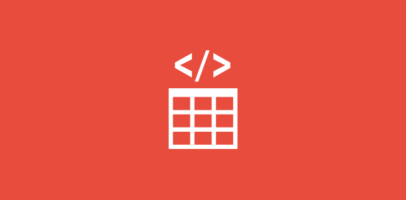
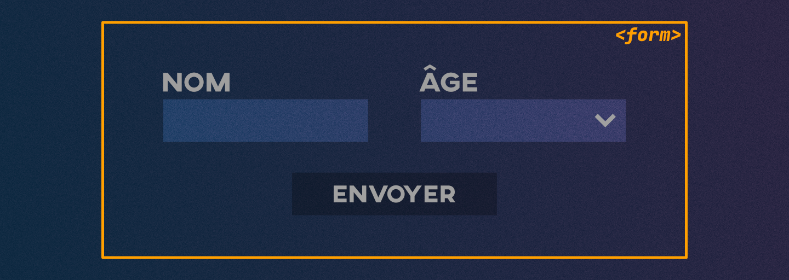
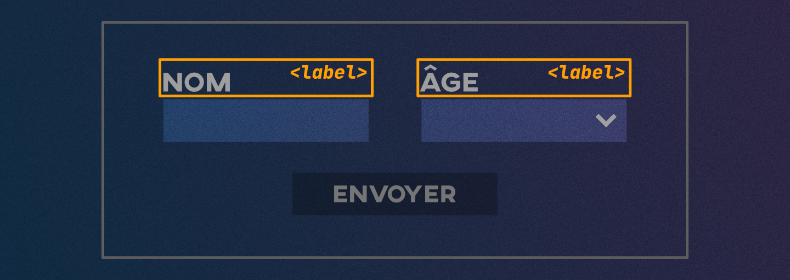
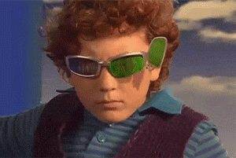
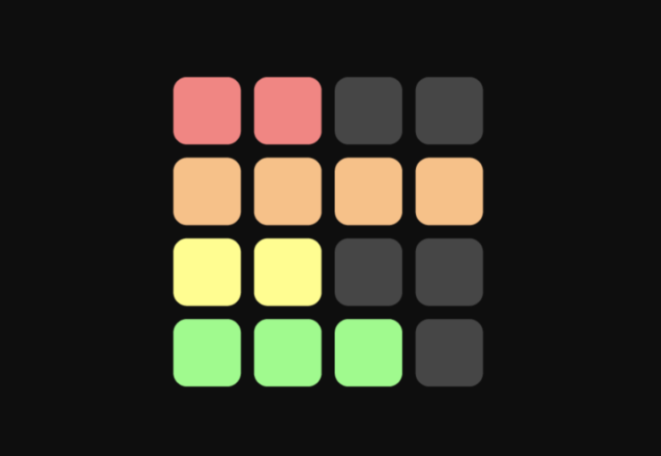

# Cours 5

*[FAQ]: Foire aux questions

## Listes

{.w-100}

Les listes permettent d’organiser du contenu de manière hiérarchique ou séquentielle. Elles sont très fréquentes sur le Web : menus de navigation, recettes, FAQ, glossaires, etc.

En HTML, il existe 3 types de listes :

1. Les listes à puces
1. Les listes ordonnées
1. Les listes de définitions

On peut aussi imbriquer des listes (une liste dans une autre).

### Listes à puces

Utilisées pour représenter des éléments sans ordre particulier.

Balises :

* `<ul>` : Pour _unordered list_
  * `<li>` : Pour _list item_

Le navigateur ajoutera automatiquement des puces (_bullet points_) devant chaque item.

<iframe height="300" style="width: 100%;" scrolling="no" title="HTML - Table - colspan" src="https://codepen.io/tim-momo/embed/wBMwBpN?default-tab=html%2Cresult&editable=true&theme-id=50173" frameborder="no" loading="lazy" allowtransparency="true" allowfullscreen="true">
  See the Pen <a href="https://codepen.io/tim-momo/pen/wBMwBpN">
  HTML - Table - colspan</a> by TIM Montmorency (<a href="https://codepen.io/tim-momo">@tim-momo</a>)
  on <a href="https://codepen.io">CodePen</a>.
</iframe>

### Listes ordonnées

Utilisées quand l’ordre des éléments a de l’importance.

Balises :

* `<ol>` : Pour _ordered list_
  * `<li>` : Pour _list item_

Le navigateur ajoutera automatiquement des chiffres devant chaque item.

<iframe height="300" style="width: 100%;" scrolling="no" title="HTML - Liste - ul" src="https://codepen.io/tim-momo/embed/XJXrJBN?default-tab=html%2Cresult&editable=true&theme-id=50173" frameborder="no" loading="lazy" allowtransparency="true" allowfullscreen="true">
  See the Pen <a href="https://codepen.io/tim-momo/pen/XJXrJBN">
  HTML - Liste - ul</a> by TIM Montmorency (<a href="https://codepen.io/tim-momo">@tim-momo</a>)
  on <a href="https://codepen.io">CodePen</a>.
</iframe>

Ici, l’ordre est essentiel : on ne peut pas cuire avant d’avoir mélangé 🤪!

### Listes imbriquées

Les listes (ordonnées, comme non-ordonnées) peuvent s'imbriquer !

Par défaut, chaque sous-liste sera indentée par le navigateur.

C'est pratique pour représenter une **hiérarchie**, comme un menu de site par exemple.

<iframe height="300" style="width: 100%;" scrolling="no" title="HTML - Liste - ol" src="https://codepen.io/tim-momo/embed/OPMLPBd?default-tab=html%2Cresult&editable=true&theme-id=50173" frameborder="no" loading="lazy" allowtransparency="true" allowfullscreen="true">
  See the Pen <a href="https://codepen.io/tim-momo/pen/OPMLPBd">
  HTML - Liste - ol</a> by TIM Montmorency (<a href="https://codepen.io/tim-momo">@tim-momo</a>)
  on <a href="https://codepen.io">CodePen</a>.
</iframe>

### Listes de définitions

Servent à présenter des termes et leur définition ou description. Utilisées pour des glossaires ou des FAQ.

Balises :

* `<dl>` : Pour _description list_
  * `<dt>` : Pour _description term_
  * `<dd>` : Pour _description details_

Contrairement aux autres listes, celle-ci n’a pas de puces ou de numéros : elle fonctionne en paires terme + définition.

<iframe height="300" style="width: 100%;" scrolling="no" title="HTML - Liste - nesting" src="https://codepen.io/tim-momo/embed/KwVPwbp?default-tab=html%2Cresult&editable=true&theme-id=50173" frameborder="no" loading="lazy" allowtransparency="true" allowfullscreen="true">
  See the Pen <a href="https://codepen.io/tim-momo/pen/KwVPwbp">
  HTML - Liste - nesting</a> by TIM Montmorency (<a href="https://codepen.io/tim-momo">@tim-momo</a>)
  on <a href="https://codepen.io">CodePen</a>.
</iframe>

## Tableaux

{.w-100}

Les tableaux permettent d’organiser des données sous forme de grille (lignes et colonnes).

Ils sont utiles pour représenter de l’information tabulaire : horaires, résultats sportifs, statistiques, prix, etc.

Ils ne doivent jamais être utilisés pour la mise en page.

### Tableau simple

Balises :

* `<table>`
  * `<tr>` : Pour ligne ou _table row_
    * `<td>` : Pour cellule ou _table data_

```html title="Exemple"
<h2>Notes des étudiants</h2>

<table>
  <tr>
    <td>Robin</td>
    <td>85</td>
  </tr>
  <tr>
    <td>Stella</td>
    <td>92</td>
  </tr>
</table>
```

<iframe height="300" style="width: 100%;" scrolling="no" title="HTML - Table - colspan" src="https://codepen.io/tim-momo/embed/azdobyg?default-tab=result&theme-id=50173" frameborder="no" loading="lazy" allowtransparency="true" allowfullscreen="true">
  See the Pen <a href="https://codepen.io/tim-momo/pen/azdobyg">
  HTML - Table - colspan</a> by TIM Montmorency (<a href="https://codepen.io/tim-momo">@tim-momo</a>)
  on <a href="https://codepen.io">CodePen</a>.
</iframe>

### Titre de tableau

Un tableau peut avoir un titre descriptif avec `<caption>`. Ça améliore la compréhension et l’accessibilité.

```html
<h2>Notes des étudiants</h2>

<table>
  <caption>Résultats de l'oral de français</caption>
  <tr>
    <td>Robin</td>
    <td>85</td>
  </tr>
  <tr>
    <td>Stella</td>
    <td>92</td>
  </tr>
</table>
```

<iframe height="300" style="width: 100%;" scrolling="no" title="HTML - Table" src="https://codepen.io/tim-momo/embed/MYKgYyN?default-tab=result&theme-id=50173" frameborder="no" loading="lazy" allowtransparency="true" allowfullscreen="true">
  See the Pen <a href="https://codepen.io/tim-momo/pen/MYKgYyN">
  HTML - Table</a> by TIM Montmorency (<a href="https://codepen.io/tim-momo">@tim-momo</a>)
  on <a href="https://codepen.io">CodePen</a>.
</iframe>

### Organisation d’un tableau

Un tableau peut être découpé en 3 sections sémantiques :

* `<thead>` : en-tête du tableau
* `<tbody>` : corps principal
* `<tfoot>` : pied du tableau

```html
<table>

  <thead>
    <tr>
      <th>Session</th>
      <th>Moyenne</th>
    </tr>
  </thead>

  <tbody>
    <tr>
      <td>Automne 2029</td>
      <td>85</td>
    </tr>
    <tr>
      <td>Hiver 2029</td>
      <td>89</td>
    </tr>
  </tbody>

  <tfoot>
    <tr>
      <td>Moyenne générale</td>
      <td>87</td>
    </tr>
  </tfoot>

</table>
```

<iframe height="300" style="width: 100%;" scrolling="no" title="HTML - Table - thead tbody tfoot" src="https://codepen.io/tim-momo/embed/JoGPLOg?default-tab=result&theme-id=50173" frameborder="no" loading="lazy" allowtransparency="true" allowfullscreen="true">
  See the Pen <a href="https://codepen.io/tim-momo/pen/JoGPLOg">
  HTML - Table - thead tbody tfoot</a> by TIM Montmorency (<a href="https://codepen.io/tim-momo">@tim-momo</a>)
  on <a href="https://codepen.io">CodePen</a>.
</iframe>

### Fusion

#### Fusion de colonnes

Deux attributs nous permettent de fusionner des cellules :

* `colspan="x"` : fusionne une cellule sur plusieurs colonnes.
* `rowspan="x"` : fusionne une cellule sur plusieurs lignes.

```html title="Exemple"
<table>
  <thead>
    <tr>
      <th>Vêtement</th>
      <th colspan="3">Tailles disponibles</th>
      <!-- <th></th> -->
      <!-- <th></th> -->
    </tr>
  </thead>
  <tbody>
    <tr>
      <td>Chandail</td>
      <td></td>
      <td>M</td>
      <td></td>
    </tr>
    <tr>
      <td>Coton ouaté</td>
      <td>P</td>
      <td></td>
      <td>L</td>
    </tr>
    <tr>
      <td>Chemise</td>
      <td>P</td>
      <td>M</td>
      <td>L</td>
    </tr>
  </tbody>
</table>
```

<iframe height="300" style="width: 100%;" scrolling="no" title="HTML - Table - colspan" src="https://codepen.io/tim-momo/embed/LEGPYxY?default-tab=result&theme-id=50173" frameborder="no" loading="lazy" allowtransparency="true" allowfullscreen="true">
  See the Pen <a href="https://codepen.io/tim-momo/pen/LEGPYxY">
  HTML - Table - colspan</a> by TIM Montmorency (<a href="https://codepen.io/tim-momo">@tim-momo</a>)
  on <a href="https://codepen.io">CodePen</a>.
</iframe>

#### Fusion de rangé

```html
<table>
  <thead>
    <tr>
      <th>Session</th>
      <th>Cours</th>
    </tr>
  </thead>
  <tbody>
    <tr>
      <td rowspan="2">Automne</td>
      <td>Math</td>
    </tr>
    <tr>
      <!-- <td>Automne</td> -->
      <td>Français</td>
    </tr>
    <tr>
      <td rowspan="2">Hiver</td>
      <td>Philo</td>
    </tr>
    <tr>
      <!-- <td>Hiver</td> -->
      <td>Gym</td>
    </tr>
  </tbody>
</table>
```

<iframe height="300" style="width: 100%;" scrolling="no" title="HTML - Table - colspan" src="https://codepen.io/tim-momo/embed/PwZYwWB?default-tab=result&theme-id=50173" frameborder="no" loading="lazy" allowtransparency="true" allowfullscreen="true">
  See the Pen <a href="https://codepen.io/tim-momo/pen/PwZYwWB">
  HTML - Table - colspan</a> by TIM Montmorency (<a href="https://codepen.io/tim-momo">@tim-momo</a>)
  on <a href="https://codepen.io">CodePen</a>.
</iframe>

## Formulaires

Un formulaire permet à l’utilisateur de saisir des informations et de les envoyer à un serveur.

Exemples : formulaire d’inscription, de connexion, de recherche, de sondage, etc.

Balises :

* `<form>`
  * `<label>`
  * `<input>`
  * `<textarea>`
  * `<select>`

### Structure de base



La balise `<form>` regroupe les champs d'un formulaire.

Elle est **obligatoire** pour mettre en place un formulaire Web.

```html
<form>
  <!-- Ici on place les champs -->
</form>
```

Les champs de formulaire utilisent soit les balises [`<input>`](https://developer.mozilla.org/fr/docs/Web/HTML/Reference/Elements/input), [`<textarea>`](https://developer.mozilla.org/fr/docs/Web/HTML/Reference/Elements/textarea) ou [`<select>`](https://developer.mozilla.org/fr/docs/Web/HTML/Reference/Elements/select).

Chaque champ doit être accompagné d'une balise [`<label>`](https://developer.mozilla.org/fr/docs/Web/HTML/Reference/Elements/label). Elle sert à identifier clairement la fonction du champ.

### Balise `<input>`

La balise `<input>` utilise l'attribut `type` pour spécifier le [type de champ](https://developer.mozilla.org/fr/docs/Web/HTML/Reference/Elements/input).

Elle utilise également l'attribut `id` afin de pouvoir l'associer à son libellé (`<label>`).

```html
<form>
  <label for="pwd">Étiquette du champ</label>
  <input id="pwd">
</form>
```

!!! note "À propos de la balise `<label>`"

    

    L'attribut `for` de la balise `<label>` doit correspondre à l'attribut `id` du champ.

    C'est important de spécifier cette valeur, car elle influence l'interactivité. En effet, si je clic sur le libellé, ça positionne le curseur sur le champ associé.

#### Texte

<iframe class="aspect-4-1" height="300" style="width: 100%;" scrolling="no" title="HTML - Input - text" src="https://codepen.io/tim-momo/embed/XJXrdJg?default-tab=html%2Cresult&editable=true&theme-id=50173" frameborder="no" loading="lazy" allowtransparency="true" allowfullscreen="true">
  See the Pen <a href="https://codepen.io/tim-momo/pen/XJXrdJg">
  HTML - Input - text</a> by TIM Montmorency (<a href="https://codepen.io/tim-momo">@tim-momo</a>)
  on <a href="https://codepen.io">CodePen</a>.
</iframe>

L'attribut `placeholder="..."` affiche un texte temporaire d’exemple dans un champ.

L'attribut `value="..."` permet d'assigner une valeur par défaut dans un champ texte.

L'attribut `disabled` permet de désactiver un champ de formulaire.

L'attribut `readonly` ne désactive pas le champ, mais il ne permet plus d'éditer le champs. On peut faire un copier/coller du contenu, ce que disabled ne permet pas.

#### Bouton de soumission

<iframe height="300" style="width: 100%;" scrolling="no" title="HTML - Input - submit" src="https://codepen.io/tim-momo/embed/QwyLNJp?default-tab=html%2Cresult&editable=true&theme-id=50173" frameborder="no" loading="lazy" allowtransparency="true" allowfullscreen="true">
  See the Pen <a href="https://codepen.io/tim-momo/pen/QwyLNJp">
  HTML - Input - submit</a> by TIM Montmorency (<a href="https://codepen.io/tim-momo">@tim-momo</a>)
  on <a href="https://codepen.io">CodePen</a>.
</iframe>

L'attribut `value="..."` permet de changer le texte du bouton.

L’attribut `required` indique qu’un champ doit obligatoirement être rempli. Si l’utilisateur tente de soumettre le formulaire sans le compléter, le navigateur affichera automatiquement un message d’erreur.

#### Courriel

<iframe class="aspect-4-1" height="300" style="width: 100%;" scrolling="no" title="HTML - Input - email" src="https://codepen.io/tim-momo/embed/myVbPQd?default-tab=html%2Cresult&editable=true&theme-id=50173" frameborder="no" loading="lazy" allowtransparency="true" allowfullscreen="true">
  See the Pen <a href="https://codepen.io/tim-momo/pen/myVbPQd">
  HTML - Input - email</a> by TIM Montmorency (<a href="https://codepen.io/tim-momo">@tim-momo</a>)
  on <a href="https://codepen.io">CodePen</a>.
</iframe>

#### Mot de passe

<iframe class="aspect-4-1" height="300" style="width: 100%;" scrolling="no" title="HTML - Input - text" src="https://codepen.io/tim-momo/embed/QwyLNBd?default-tab=html%2Cresult&editable=true&theme-id=50173" frameborder="no" loading="lazy" allowtransparency="true" allowfullscreen="true">
  See the Pen <a href="https://codepen.io/tim-momo/pen/QwyLNBd">
  HTML - Input - text</a> by TIM Montmorency (<a href="https://codepen.io/tim-momo">@tim-momo</a>)
  on <a href="https://codepen.io">CodePen</a>.
</iframe>

#### Case à cocher

<iframe class="aspect-16-9" height="300" style="width: 100%;" scrolling="no" title="HTML - Input - checkbox" src="https://codepen.io/tim-momo/embed/ZYQzWVr?default-tab=html%2Cresult&editable=true&theme-id=50173" frameborder="no" loading="lazy" allowtransparency="true" allowfullscreen="true">
  See the Pen <a href="https://codepen.io/tim-momo/pen/ZYQzWVr">
  HTML - Input - checkbox</a> by TIM Montmorency (<a href="https://codepen.io/tim-momo">@tim-momo</a>)
  on <a href="https://codepen.io">CodePen</a>.
</iframe>

L'attribut `checked` permet de présélectionner une case au chargement de la page.

### Bouton radio

<iframe class="aspect-16-9" height="300" style="width: 100%;" scrolling="no" title="HTML - Input - radio" src="https://codepen.io/tim-momo/embed/PwZYzwz?default-tab=html%2Cresult&editable=true&theme-id=50173" frameborder="no" loading="lazy" allowtransparency="true" allowfullscreen="true">
  See the Pen <a href="https://codepen.io/tim-momo/pen/PwZYzwz">
  HTML - Input - radio</a> by TIM Montmorency (<a href="https://codepen.io/tim-momo">@tim-momo</a>)
  on <a href="https://codepen.io">CodePen</a>.
</iframe>

L'attribut `checked` permet de présélectionner un bouton radio au chargement de la page.

### Champ nombre

<iframe class="aspect-4-1" height="300" style="width: 100%;" scrolling="no" title="HTML - Input - text" src="https://codepen.io/tim-momo/embed/ogbvdvL?default-tab=html%2Cresult&editable=true&theme-id=50173" frameborder="no" loading="lazy" allowtransparency="true" allowfullscreen="true">
  See the Pen <a href="https://codepen.io/tim-momo/pen/ogbvdvL">
  HTML - Input - text</a> by TIM Montmorency (<a href="https://codepen.io/tim-momo">@tim-momo</a>)
  on <a href="https://codepen.io">CodePen</a>.
</iframe>

Les attributs `min="0"` et `max="100"` permettent de spécifier des limites au champ nombre

### Champ date

<iframe class="aspect-4-1" height="300" style="width: 100%;" scrolling="no" title="HTML - Input - number" src="https://codepen.io/tim-momo/embed/jEWNxPQ?default-tab=html%2Cresult&editable=true&theme-id=50173" frameborder="no" loading="lazy" allowtransparency="true" allowfullscreen="true">
  See the Pen <a href="https://codepen.io/tim-momo/pen/jEWNxPQ">
  HTML - Input - number</a> by TIM Montmorency (<a href="https://codepen.io/tim-momo">@tim-momo</a>)
  on <a href="https://codepen.io">CodePen</a>.
</iframe>

### Champ file

<iframe class="aspect-4-1" height="300" style="width: 100%;" scrolling="no" title="HTML - Input - date" src="https://codepen.io/tim-momo/embed/WbreJra?default-tab=html%2Cresult&editable=true&theme-id=50173" frameborder="no" loading="lazy" allowtransparency="true" allowfullscreen="true">
  See the Pen <a href="https://codepen.io/tim-momo/pen/WbreJra">
  HTML - Input - date</a> by TIM Montmorency (<a href="https://codepen.io/tim-momo">@tim-momo</a>)
  on <a href="https://codepen.io">CodePen</a>.
</iframe>

### Champ plage

<iframe class="aspect-4-1" height="300" style="width: 100%;" scrolling="no" title="HTML - Input - range" src="https://codepen.io/tim-momo/embed/OPMLZXZ?default-tab=html%2Cresult&editable=true&theme-id=50173" frameborder="no" loading="lazy" allowtransparency="true" allowfullscreen="true">
  See the Pen <a href="https://codepen.io/tim-momo/pen/OPMLZXZ">
  HTML - Input - range</a> by TIM Montmorency (<a href="https://codepen.io/tim-momo">@tim-momo</a>)
  on <a href="https://codepen.io">CodePen</a>.
</iframe>

### Liste de sélection

<iframe class="aspect-3-1" height="300" style="width: 100%;" scrolling="no" title="HTML - select" src="https://codepen.io/tim-momo/embed/RNrbyJM?default-tab=html%2Cresult&editable=true&theme-id=50173" frameborder="no" loading="lazy" allowtransparency="true" allowfullscreen="true">
  See the Pen <a href="https://codepen.io/tim-momo/pen/RNrbyJM">
  HTML - select</a> by TIM Montmorency (<a href="https://codepen.io/tim-momo">@tim-momo</a>)
  on <a href="https://codepen.io">CodePen</a>.
</iframe>

L'attribut `selected` sur une option permet de la présélectionner au chargement de la page.

#### Liste de sélection multiple

<iframe class="aspect-3-1" height="300" style="width: 100%;" scrolling="no" title="HTML - select" src="https://codepen.io/tim-momo/embed/ByjBxGM?default-tab=html%2Cresult&editable=true&theme-id=50173" frameborder="no" loading="lazy" allowtransparency="true" allowfullscreen="true">
  See the Pen <a href="https://codepen.io/tim-momo/pen/ByjBxGM">
  HTML - select</a> by TIM Montmorency (<a href="https://codepen.io/tim-momo">@tim-momo</a>)
  on <a href="https://codepen.io">CodePen</a>.
</iframe>

### Zone de texte

<iframe height="300" style="width: 100%;" scrolling="no" title="HTML - textarea" src="https://codepen.io/tim-momo/embed/pvgzVYv?default-tab=html%2Cresult&editable=true&theme-id=50173" frameborder="no" loading="lazy" allowtransparency="true" allowfullscreen="true">
  See the Pen <a href="https://codepen.io/tim-momo/pen/pvgzVYv">
  HTML - textarea</a> by TIM Montmorency (<a href="https://codepen.io/tim-momo">@tim-momo</a>)
  on <a href="https://codepen.io">CodePen</a>.
</iframe>

### Attributs communs à plusieurs balises

Les attributs `required`, `disabled` et `readonly` ne sont pas exclusifs à un type de champ en particulier.

```html title="Exemple"
<input type="text" required>

<textarea required></textarea>

<select required>
  <option value="">-- Choisir une option --</option>
  <option value="1">Option 1</option>
</select>
```

#### L'attribut name

Un autre attribut essentiel au fonctionnement d’un formulaire est l’attribut `name=""`. Il sert à identifier les champs quand le formulaire est traité par un serveur. Toutefois, pour alléger la compréhension (et aussi parce qu’il ne nous sera pas utile dans ce cours), nous le mettons de côté.

## Fieldset

Permet de grouper plusieurs champs de formulaire en un seul bloc visuel et logique. Cela rend le formulaire plus clair et améliore l’accessibilité.

Balises :

* `<fieldset>`
  * `<legend>`

Il est recommandé d'utiliser `<legend>` à l’intérieur pour donner un titre au groupe.

```html title="Exemple"
<form>
  <fieldset>
    <legend>Informations personnelles</legend>
    
    <label for="nom">Nom</label>
    <input id="nom" type="text" required>

    <label for="courriel">Courriel</label>
    <input id="courriel" type="email" required>
  </fieldset>

  <fieldset>
    <legend>Préférences</legend>

    <label>
      <input type="checkbox" name="newsletter">
      S’abonner à l’infolettre
    </label>
  </fieldset>

  <input type="submit" value="Envoyer">
</form>
```

<iframe class="aspect-4-3" height="300" style="width: 100%;" scrolling="no" title="HTML - Input - date" src="https://codepen.io/tim-momo/embed/gbPOjBw?default-tab=result&theme-id=50173" frameborder="no" loading="lazy" allowtransparency="true" allowfullscreen="true">
  See the Pen <a href="https://codepen.io/tim-momo/pen/gbPOjBw">
  HTML - Input - date</a> by TIM Montmorency (<a href="https://codepen.io/tim-momo">@tim-momo</a>)
  on <a href="https://codepen.io">CodePen</a>.
</iframe>

## Quelques outils

{.w-100}

:material-image: Générer des images :

* <https://www.craiyon.com/fr>
* <https://deepai.org/machine-learning-model/text2img>
* <https://deepmind.google/models/imagen/>
* <https://chatgpt.com/>

:material-eraser: Pour retirer un élément d'une image :

* <https://cleanup.pictures/>
* <https://www.pixelcut.ai/ai-image-editor/>
* <https://theinpaint.com/>

:material-arrow-expand-all: Upscaler :

* <https://image-upscaling.net/upscaling/>
* <https://flux-ai.io/flux-ai-image-upscaler/>
* <https://ai.nero.com/image-upscaler/>
* <https://imgupscaler.com/>
* <https://www.upscale.media/fr/upload/>

:fontawesome-brands-creative-commons-zero: Images libre de droit :

* <https://unsplash.com/fr>
* <https://pixabay.com/>
* <https://www.pexels.com/fr-fr/>

:material-cast-audio: Audio libre de droit :

* <https://pixabay.com/music/>
* <https://pixabay.com/sound-effects/>
* <https://sound-effects.bbcrewind.co.uk/>
* <https://mixkit.co/free-sound-effects/>
* <https://www.zapsplat.com/>

Modification de format

* <https://cloudconvert.com/jpg-to-webp>
* <https://www.freeconvert.com/webm-converter>

## Exercices

<div class="grid grid-1-2" markdown>
  

  <small>Exercice - Tableaux HTML</small><br>
  **[Tierlist](./exercices/tierlist/index.md){.stretched-link .back}**
</div>

<div class="grid grid-1-2" markdown>
  

  <small>Exercice - Tableaux et listes HTML</small><br>
  **[Manga](./exercices/manga/index.md){.stretched-link .back}**
</div>

<div class="grid grid-1-2" markdown>
  

  <small>Exercice - Tableaux HTML</small><br>
  **[Uzumaki](./exercices/uzumaki/index.md){.stretched-link .back}**
</div>

<div class="grid grid-1-2" markdown>
  

  <small>Exercice - Formulaire HTML</small><br>
  **[L'inscription](./exercices/inscription/index.md){.stretched-link .back}**
</div>

## TP

<div class="grid grid-1-2" markdown>
  

  <small>TP1 - Deuxième partie</small><br>
  **[Développement](./tp/ldvelh/index.md){.stretched-link .back}**
</div>

[STOP]


## Formulaires

### Structure de base


Balise : [`<form>`](https://developer.mozilla.org/fr/docs/Web/HTML/Reference/Elements/form)

Attributs :

* **action=""** : URL où envoyer les données du formulaire. Dans le cadre du cours, les données ne pourront pas être traitées, car cela nécessite un langage de programmation côté serveur (comme PHP), ce qu’on ne couvre pas ici. On peut donc utiliser action="#" ou laisser vide pour rester sur la même page.
* **method=""** : Deux valeurs possibles :
  * **get** : envoie le contenu du formulaire dans l’URL (visible dans la barre d’adresse).
  * **post** : envoie les données de façon invisible, mais ne fonctionne que si un serveur est capable de les traiter, ce qui ne sera pas le cas dans le cours.

```html title="Exemple"
<form action="merci.html" method="get">

  <!-- Ici on insère les champs du formulaire -->
  
</form>
```

### Champs


Balises : [`<input>`](https://developer.mozilla.org/fr/docs/Web/HTML/Reference/Elements/input), [`<textarea>`](https://developer.mozilla.org/fr/docs/Web/HTML/Reference/Elements/textarea), [`<select>`](https://developer.mozilla.org/fr/docs/Web/HTML/Reference/Elements/select)

| Balise                    | Usage            | Exemple                              |
| ------------------------- | ---------------- | ------------------------------------ |
| `<input type="text">`     | Champ texte      | <form><input type="text"></form>     |
| `<input type="email">`    | Courriel         | <form><input type="email"></form>    |
| `<input type="password">` | Mot de passe     | <form><input type="password"></form> |
| `<input type="radio">`    | Choix unique     | <form><input type="radio" name="rad">1<input type="radio" name="rad">2<input type="radio" name="rad">3</form> |
| `<input type="checkbox">` | Choix multiples  | <form><input type="checkbox">1<input type="checkbox">2<input type="checkbox">3</form> |
| `<select>` `<option>`     | Liste déroulante | <form><select><option>1</option><option>2</option><option>3</option></select></form> |
| `<input type="submit">`   | Bouton d’envoi   | <form><input type="submit"></form>   |
| `<textarea>`              | Zone de texte    | <form><textarea></form>              |

Les [attributs de champ de formulaire](https://developer.mozilla.org/fr/docs/Web/HTML/Reference/Elements/input#attributs) sont nombreux. Voici une courte liste des plus utilisés :

* **required** : Le champ avec cet attribut soit être rempli pour soumettre le formulaire
* **disabled** : Désactive l'interactivité du champ.
* **placeholder** : Affiche un exemple de ce qui pourrait se trouver dans le champ. **Ne remplace pas la balise `<label>`**.
* **value** : Inscrit une valeur par défaut au chargement de la page
* **checked** : Un peu comme value, on peut définir si un radio ou un checkbox est coché par défaut.
* **name** : l'attribut name est essentiel pour que le langage de programmation côté serveur puisse associer un champ à sa valeur.
* **id** : Surtout utile pour la balise `<label>`.

<iframe class="aspect-1-1" height="300" style="width: 100%;" scrolling="no" title="Web 1 - Audio" src="https://codepen.io/tim-momo/embed/MYaeKgZ?%2Cresult&editable=true&theme-id=50210" frameborder="no" loading="lazy" allowtransparency="true" allowfullscreen="true">
  See the Pen <a href="https://codepen.io/tim-momo/pen/MYaeKgZ">
  Web 1 - Audio</a> by TIM Montmorency (<a href="https://codepen.io/tim-momo">@tim-momo</a>)
  on <a href="https://codepen.io">CodePen</a>.
</iframe>

### Label


Chaque champ doit être accompagné d'un libellé. Pour l'associer à un champ, on doit appliquer un id au champ et spécifier le id dans l'attribut for de la balise label.

| Balise                    | Usage            | Exemple          |
| ------------------------- | ---------------- | ---------------- |
| `<label for="">`          | Libellé de champ | <form><label for="ttt">Prénom</lable><br><input id="ttt" type="text"></form> |

Exemple : Avec association for et sans.

!!! example "Post vs. Get"

  Démonstration post-vs-get: [formulaire.zip](./exercices/formulaire.zip){ download }


### Orientation des en-tête

Concept

* `<th>` (table header) définit une cellule d’en-tête.
* Généralement en première ligne (noms de colonnes).
* Mais peut aussi être en première colonne (noms de lignes).
* L’attribut `scope` précise la portée : `col` (colonne) ou `row` (ligne).

```html
<table>
  <caption>Emploi du temps</caption>
  <thead>
    <tr>
      <th scope="col">Jour</th>
      <th scope="col">Matin</th>
      <th scope="col">Après-midi</th>
    </tr>
  </thead>
  <tbody>
    <tr>
      <th scope="row">Lundi</th>
      <td>Maths</td>
      <td>Histoire</td>
    </tr>
    <tr>
      <th scope="row">Mardi</th>
      <td>Physique</td>
      <td>Sport</td>
    </tr>
  </tbody>
</table>
```

Ici, les colonnes ont un en-tête en haut, et chaque ligne a un en-tête sur la gauche.

Exercices : 

[Form credits](exercices/carte-de-credit.md)
[Goku radio](exercices/dragonball.md)
[Exercice twitter select](exercices/twitter.md)
