# Cours 6

[^wireframe]: [Maquette conceptuelle | OQLF](https://vitrinelinguistique.oqlf.gouv.qc.ca/fiche-gdt/fiche/26529188/maquette-conceptuelle)

[^wfbp]: [Wireframing Best Practices | uxcel](https://app.uxcel.com/courses/designing-wireframes/wireframing-best-practices-816)

## Maquette conceptuelle

<!-- { .w-100 } -->
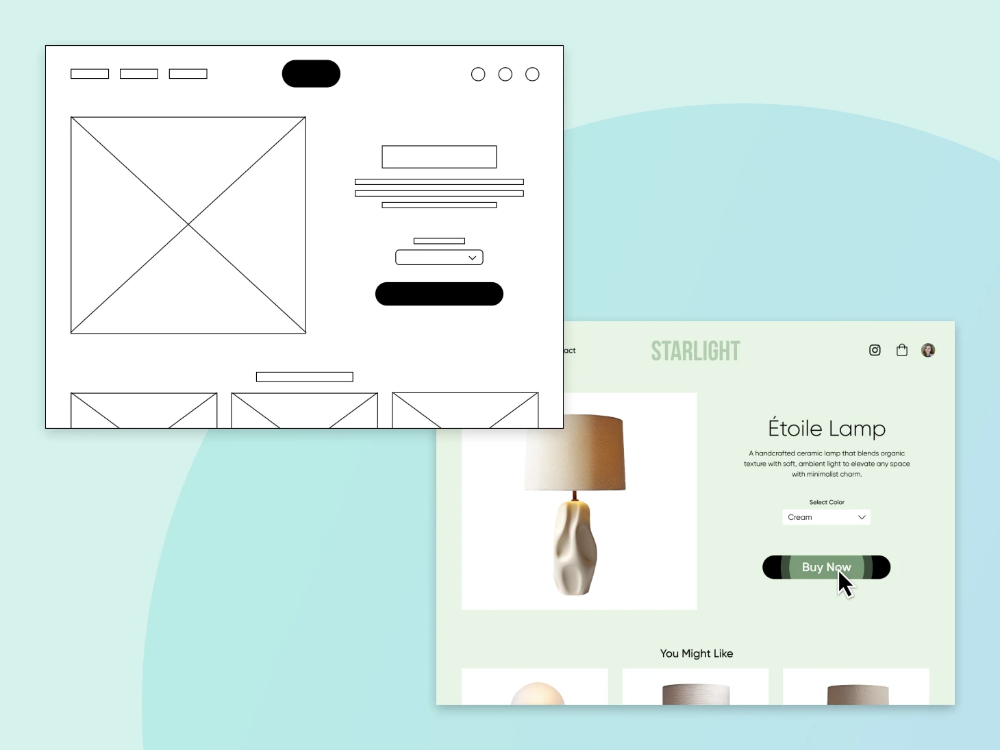{ .w-100 data-zoom-image }

Le wireframe (ou maquette conceptuelle[^wireframe]) est une représentation simple, schématique, d’une interface.

C’est un outil de planification qui sert à :

* organiser le contenu (titres, paragraphes, images, menus)
* structurer la navigation entre les pages
* établir une hiérarchie claire de l’information

En vrai, ça sert surtout à gagner du temps et à réfléchir au contenant plutôt qu'au contenu d'un projet.

Une fois cette étape terminée, les étapes de design subséquentes sont grandement facilitées. C'est toujours plus simple de faire le design (ou _mockup_) sans avoir à réfléchir à la structure ou le contenu.

### Comment ça marche ?

{.w-100 data-zoom-image}

On peut faire un wireframe sous forme de croquis (sketch) ou avec un logiciel d'édition graphique.

L'idée est de représenter l'information qui sera affichée dans notre projet de la manière la plus sobre possible.

Voici comment représenter les composantes d'un site Web :

<div class="grid grid-1-3" markdown>
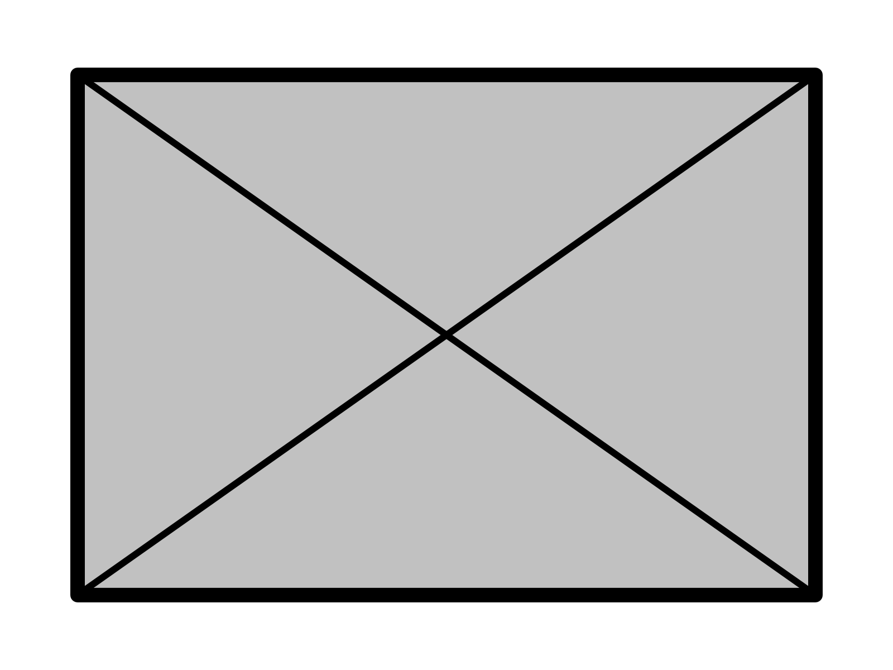{data-zoom-image}

Image
<br><small>Un rectangle avec un X superposé</small>
</div>

<div class="grid grid-1-3" markdown>
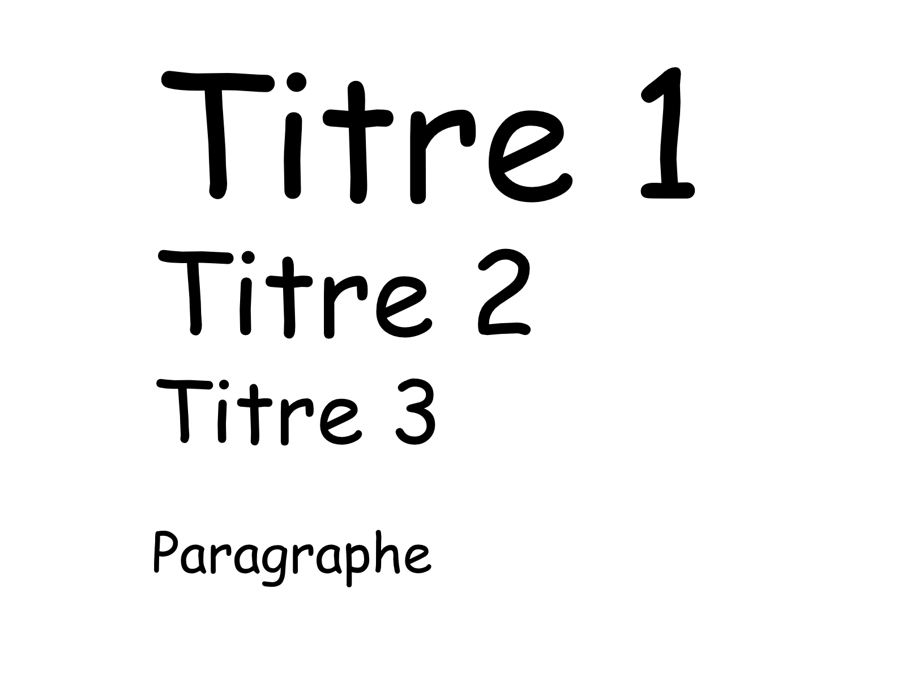{data-zoom-image}

Texte
<br><small>Une police comme Comic Sans 👌</small>
</div>

<div class="grid grid-1-3" markdown>
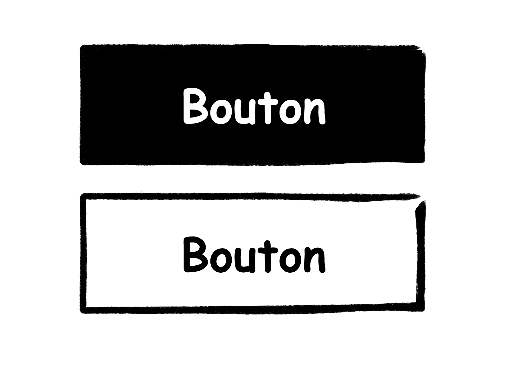{data-zoom-image}

Bouton
<br><small>Sobre et simple</small>
</div>

:simple-figma: Figma est un excellent outil pour ce genre de choses. Il y a d'ailleurs plein de [modèles de wireframe](https://www.figma.com/community/wireframes) disponibles gratuitement.

On peut aussi très bien utiliser :simple-diagramsdotnet: Draw.io, qu'on connaît bien, pour arriver au même résultat.

Il existe aussi plein d'outils comme [relume](https://www.relume.io/) qui utilise l'IA pour générer des wireframes et plus encore. Le hic, c'est qu'ils sont tous payants.

### Bonnes pratiques

Pour bien effectuer la phase de _wireframing_, il y a certaines contraintes[^wfbp] à respecter.

#### Éviter les couleurs 🌈

On évite normalement les couleurs dans un Wireframe, car on ne veut pas discuter du design graphique à cette étape.

La seule couleur permise serait le bleu pour spécifier un lien html, mais encore là, on pourrait utiliser la barre de soulignement pour indiquer la chose.

<div class="grid" markdown>
<figure markdown>
{data-zoom-image}
<figcaption>👌 Bonne pratique</figcaption>
</figure>

<figure markdown>
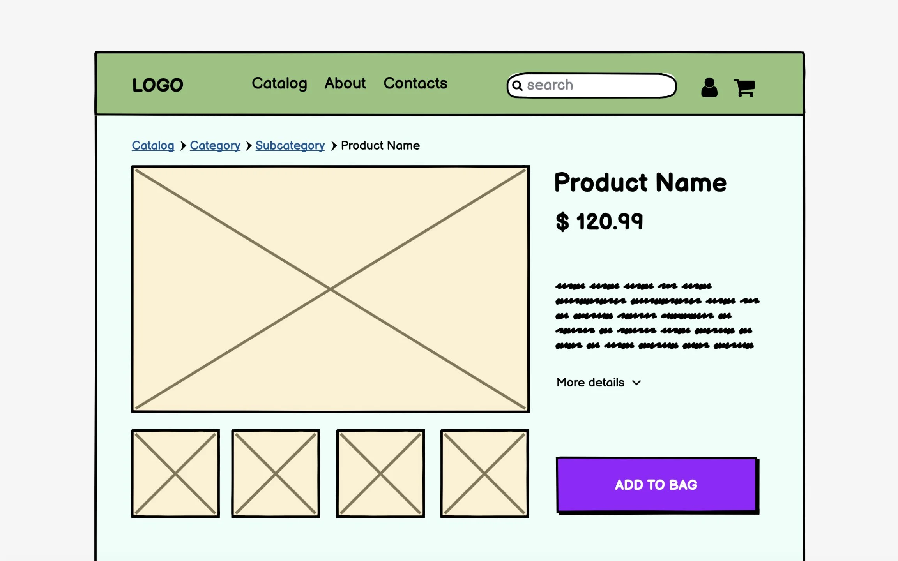{data-zoom-image}
<figcaption>🙅 À éviter</figcaption>
</figure>
</div>

#### Éviter les styles 💅

Il vaut mieux être sobre, quitte à être laid, pour éviter de se concentrer sur le look au lieu de la fonctionnalité.

<div class="grid" markdown>
<figure markdown>
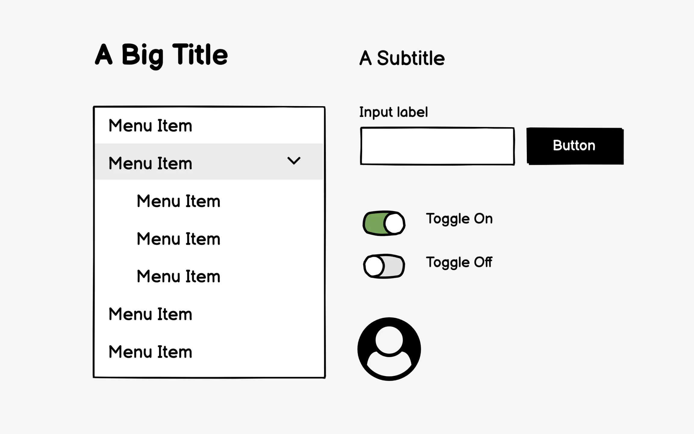{data-zoom-image}
<figcaption>👌 Bonne pratique</figcaption>
</figure>

<figure markdown>
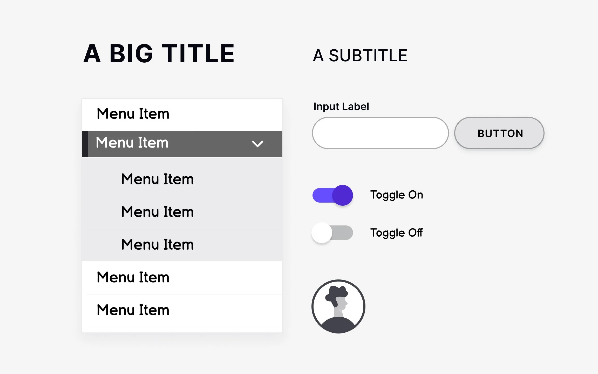{data-zoom-image}
<figcaption>🙅 À éviter</figcaption>
</figure>
</div>

#### Rester homogène 🏠🏠🏠

Un wireframe n’a pas besoin d’être beau ni stylisé, mais il doit rester uniforme et prévisible.

Cette régularité rendra ton wireframe plus clair et donnera une impression plus professionnelle, même s’il reste simple.

<div class="grid" markdown>
<figure markdown>
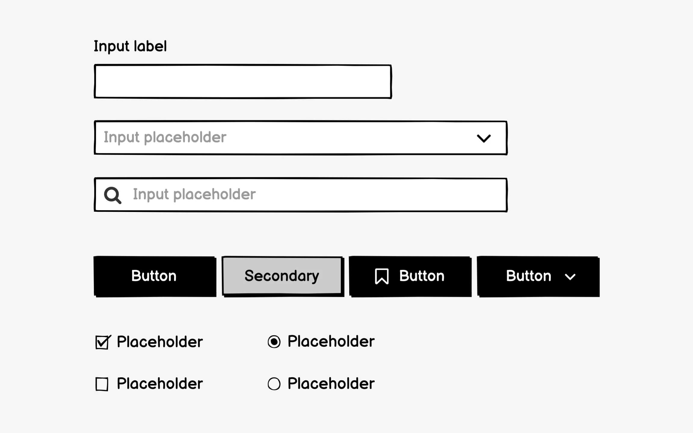{data-zoom-image}
<figcaption>👌 Bonne pratique</figcaption>
</figure>

<figure markdown>
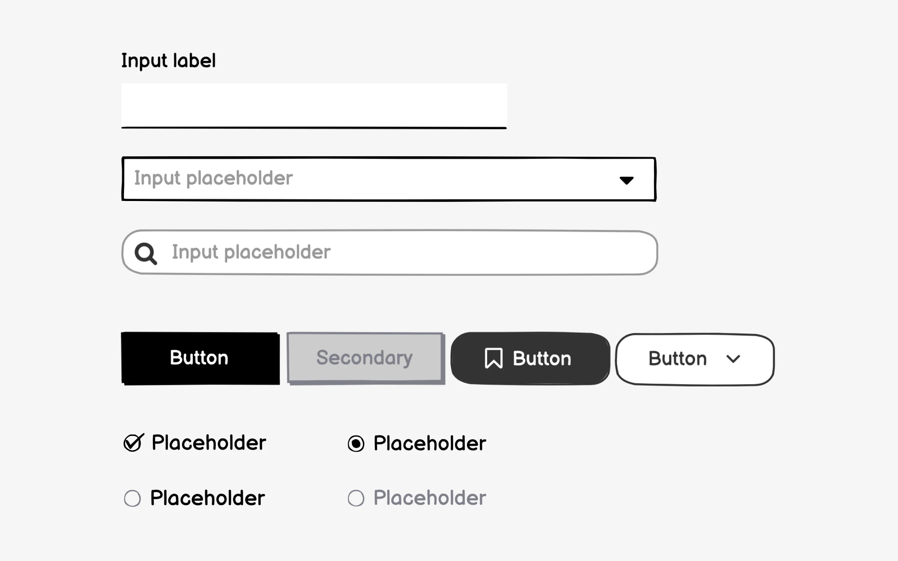{data-zoom-image}
<figcaption>🙅 À éviter</figcaption>
</figure>
</div>

#### Utiliser le vrai contenu 🎯

On est souvent tenté de mettre du contenu textuel bidon dans les wireframes, mais c'est une erreur.

En effet, la phase de wireframe doit tenter, autant que possible, de positionner l'information finale. Ça évite beaucoup de problèmes par la suite !

<div class="grid" markdown>
<figure markdown>
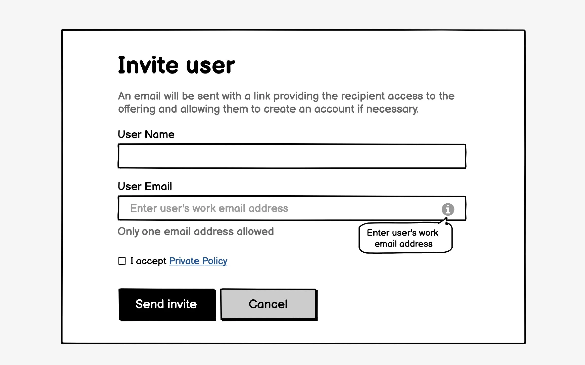{data-zoom-image}
<figcaption>👌 Bonne pratique</figcaption>
</figure>

<figure markdown>
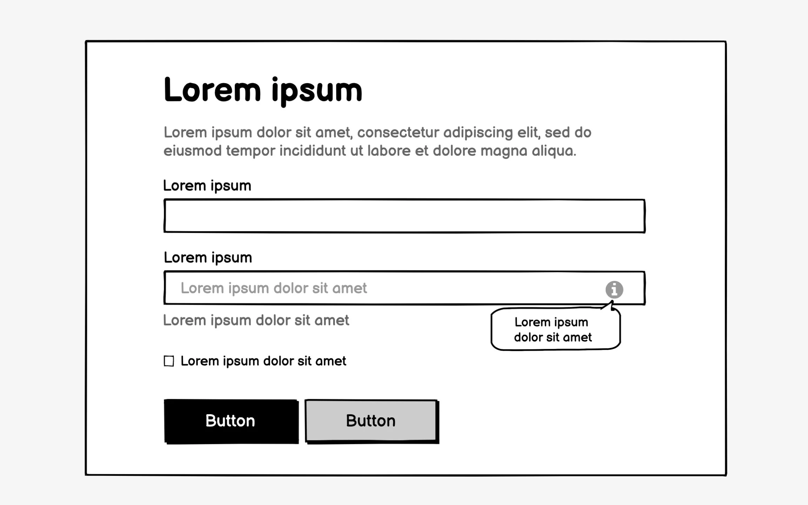{data-zoom-image}
<figcaption>🙅 À éviter</figcaption>
</figure>
</div>

#### Annoter pour la peine ! 🖋️

Il est important dans le processus de bien expliquer le comportement désiré d'une page.

Cela facilite beaucoup la compréhension de la conception de l'information et définit aussi les attentes.

<div class="grid" markdown>
<figure markdown>
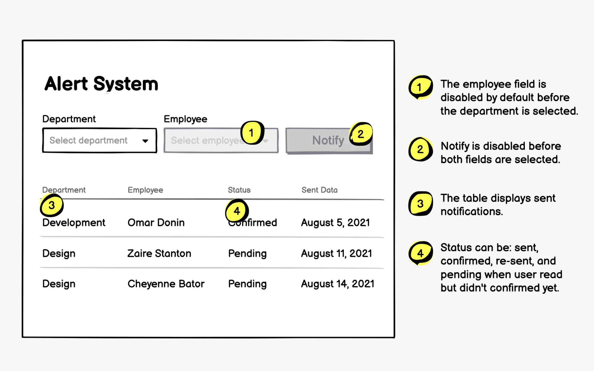{data-zoom-image}
<figcaption>👌 Super !</figcaption>
</figure>

<figure markdown>
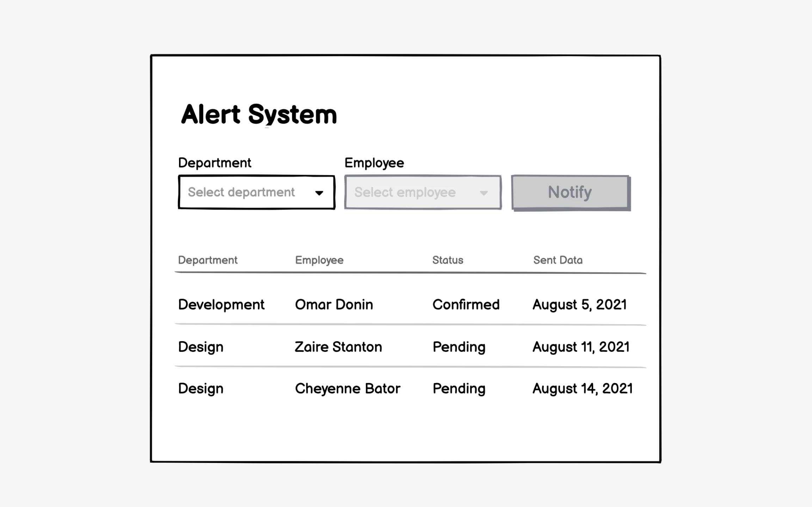{data-zoom-image}
<figcaption>Ok</figcaption>
</figure>
</div>

!!! example "draw.io + wireframe"

    **🧑‍🏫 Démo du prof**

	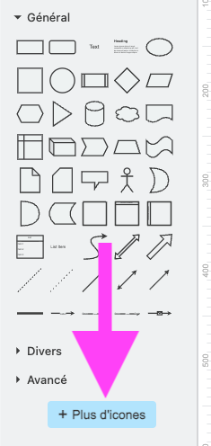{.w-25 data-zoom-image}
	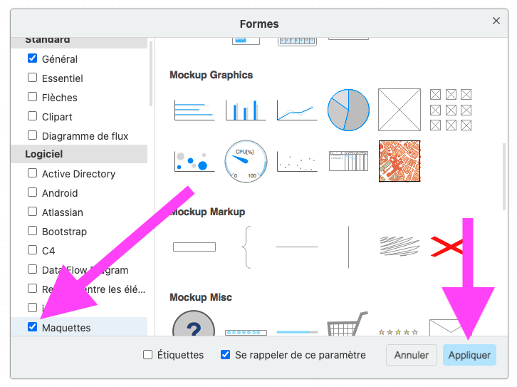{.w-25 data-zoom-image}
	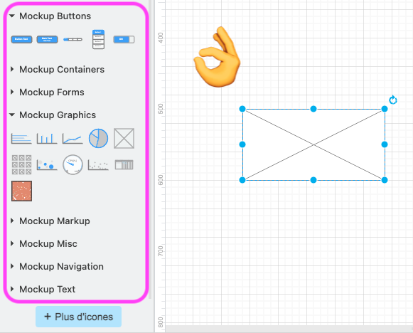{.w-25 data-zoom-image}

<div class="grid grid-1-2" markdown>
  

  <small>Exercice - Wireframe</small><br>
  **[Tenet](./exercices/tenet/index.md){.stretched-link .back}**
</div>

## Favicône

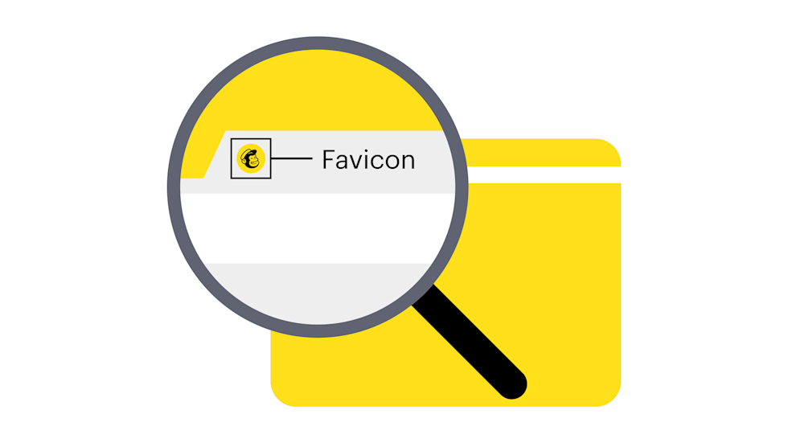{.w-100}

### C'est quoi une favicône ?

Prenez un instant pour regarder les onglets dans votre navigateur. Les petites icônes qu'ils renferment se nomment des [favoricônes](https://developer.mozilla.org/fr/docs/Glossary/Favicon) (ou _favicon_).

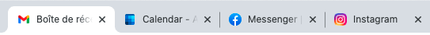

Ces icônes sont utilisées à plusieurs sauces afin d’aider à identifier rapidement certains sites dans différents contextes. Par exemple, plusieurs navigateurs proposent une page d’accueil présentant nos sites préférés ou régulièrement visités avec leur icône bien visible.


Les appareils mobiles les utilisent également lorsqu'un site est ajouté à l’écran d’accueil par exemple : 

<div class="grid" markdown>
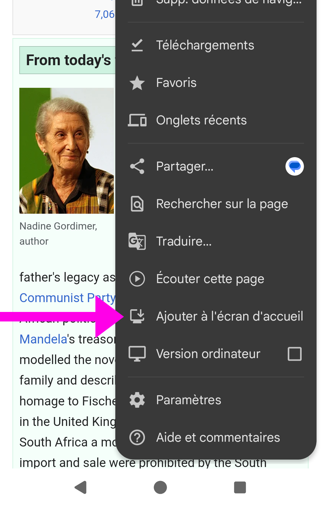{data-zoom-image}

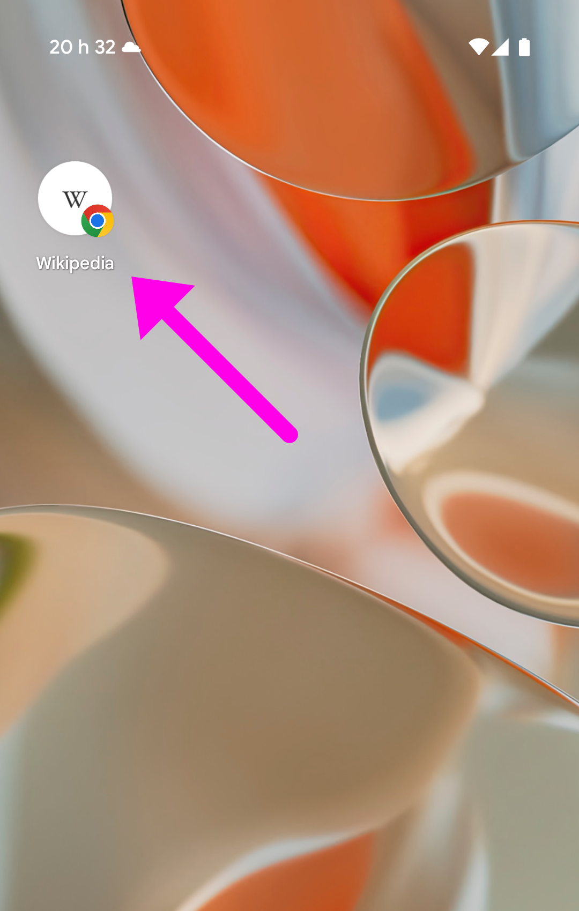{data-zoom-image}
</div>

Les favoris **(bookmarks)** d’un navigateur les affichent afin d’aider à trouver rapidement le site recherché.


!!! note

    À l’origine le nom **"favicon"** provient de la contraction des mots **"Favourite"** et **"Icon"** puisqu’ils étaient initialement utilisés uniquement pour les favoris.

### Création

Il fut un temps où les favicons avaient une dimension fixe de **16px × 16px**.  

Avec l’évolution des usages et la variété des appareils (mobiles, tablettes, écrans haute résolution, Progressive Web Apps), plusieurs formats sont maintenant nécessaires pour assurer un affichage optimal.  

Nous allons explorer 2 méthodes. L'une est rapide, l'autre est rapide-rapide 🤪.

#### Favicon.io (rapide-rapide)

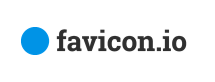

Sur [https://favicon.io/favicon-converter/](https://favicon.io/favicon-converter/), on peut ajouter une image en format `png` pour générer toutes les favicônes nécessaires.

<figure markdown>
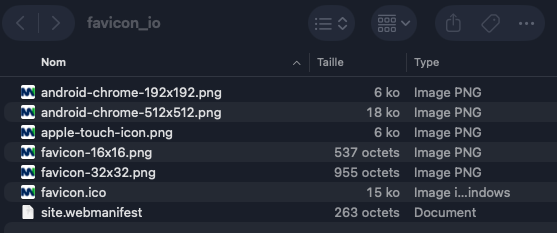{data-zoom-image}
<figcaption>Fichiers générés par favicon.io</figcaption>
</figure>

Pour utiliser les fichiers générés par favicon.io, traditionnellement, on les place à la racine du projet. Puis dans le html, on doit ajouter les balises link :

```html title="HTML"
<head>
  <!-- ... -->
  <link rel="apple-touch-icon" sizes="180x180" href="/apple-touch-icon.png">
  <link rel="icon" type="image/png" sizes="32x32" href="/favicon-32x32.png">
  <link rel="icon" type="image/png" sizes="16x16" href="/favicon-16x16.png">
  <link rel="manifest" href="/site.webmanifest">
</head>
```

Les plus perspicaces auront remarqué qu'il y a plus de fichiers générés que de balises `<link>` dans le HTML. C'est normal : c'est le fichier webmanifest qui gère le reste des images (sur Android, par exemple).

#### RealFaviconGenerator.net (juste rapide)

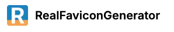

Sur [RealFaviconGenerator.net](https://realfavicongenerator.net), on peut ajouter une image en format `svg` pour générer toutes les favicônes nécessaires. L'avantage de ce site par rapport à l'autre, c'est surtout sa prise en charge d'un format vectoriel.

<figure markdown>
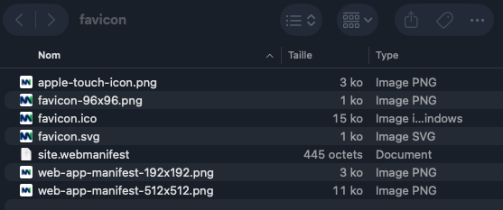{data-zoom-image}
<figcaption>Fichiers générés par RealFaviconGenerator</figcaption>
</figure>

Pour utiliser les fichiers générés par RealFaviconGenerator.net, traditionnellement, on les place à la racine du projet. Puis dans le html, on doit ajouter les balises link :

```html title="HTML"
<head>
  <!-- ... -->
  <link rel="icon" type="image/png" href="/favicon-96x96.png" sizes="96x96" />
  <link rel="icon" type="image/svg+xml" href="/favicon.svg" />
  <link rel="shortcut icon" href="/favicon.ico" />
  <link rel="apple-touch-icon" sizes="180x180" href="/apple-touch-icon.png" />
  <meta name="apple-mobile-web-app-title" content="Momo" />
  <link rel="manifest" href="/site.webmanifest" />
</head>
```

Comme on peut voir, il y a davantage d'informations ajoutées dans le HTML. En effet, RealFaviconGenerator.net est préférable 🥰, car il est plus complet.

### Au sujet des formats


Historiquement, le seul format des favicons était `.ico`. Aujourd’hui, le format `.png` est largement utilisé et même le format `.svg` (malgré sa [compatibilité limitée](https://caniuse.com/link-icon-svg))!

Idéalement, on doit avoir une image de **1024px x 1024px** (svg, sinon png) pour concevoir une favicône contemporaine. À partir de cette grande image, on génère toutes les tailles nécessaires (16, 32, 180, 192, 512).

## Balises details et summary

Les balises `<details>` et `<summary>` permettent de créer des zones de contenu repliables et dépliables directement en HTML.

Par défaut, le contenu est caché. Lorsque l’utilisateur clique sur la balise `<summary>`, le contenu s’affiche.

```html title="Exemple"
<details>
  <summary>Qui était Gengis Khan ?</summary>
  <p>Gengis Khan (1162-1227) fut le fondateur et le premier Grand Khan de l’Empire mongol. Sous son commandement, l’empire devint le plus vaste territoire contigu de l’histoire, reliant l’Asie et l’Europe grâce à ses conquêtes.</p>
</details>
```

<iframe height="300" style="width: 100%;" scrolling="no" title="HTML - textarea" src="https://codepen.io/tim-momo/embed/ZYQGNyz?default-tab=result&theme-id=50173" frameborder="no" loading="lazy" allowtransparency="true" allowfullscreen="true">
  See the Pen <a href="https://codepen.io/tim-momo/pen/ZYQGNyz">
  HTML - textarea</a> by TIM Montmorency (<a href="https://codepen.io/tim-momo">@tim-momo</a>)
  on <a href="https://codepen.io">CodePen</a>.
</iframe>

## Révision HTML

L’examen portera sur toute la matière vue depuis le premier cours. L’objectif est de consolider vos acquis et de vérifier que vous maîtrisez les fondamentaux de HTML5.

* Notation kebab
* Structure de base (`<!DOCTYPE html>`, `<html>`, `<head>`, `<body>`)
* Balises de structure : `<header>`, `<nav>`, `<main>`, `<section>`, `<article>`, `<aside>`, `<footer>`
* Titres `<h1>` à `<h6>`
* Paragraphes, emphase (`<p>`, `<em>`, `<strong>`)
* Listes (`<ul>`, `<ol>`, `<li>`)
* Images et attributs (``)
* Liens (`<a href="" target="">`)
* Audio / vidéo (`<audio>`, `<video>`, `<source>`)
* Tableaux (`<table>`, `<tr>`, `<td>`, `<th>`, `<thead>`, `<tbody>`, `<tfoot>`)
* Formulaires (`<form>`, `<input>`, `<textarea>`, `<label>`)
* Attributs globaux (class, id, title, alt)

!!! example "Révision"

    **🧑‍🏫 Démo du prof**

<!-- [Résumé du HTML 5](html/resume.md){.back} -->

## Révision - chemins relatifs

### C'est quoi un chemin ?

Un chemin, c’est comme une adresse pour un fichier. Il indique où se trouve une image, une page ou un document dans ton projet.

```html title="Exemple"

```

Ici, `assets/images/arbres.png` est le chemin qui mène à l’image `arbres.png`.

### C’est quoi « relatif » ?

Relatif veut dire « par rapport à l'endroit où tu es ». Si j'édite le fichier allo.html, relatif veut dire à partir de l'endroit où est situé ce fichier sur l'ordinateur.

Si la page et l’image sont dans le même dossier, le chemin est juste le nom du fichier :

<div class="grid align-items-start" markdown>
```html title="about.html"

```

```text title="Structure du projet"
📁 mon-site
 ├── about.html
 └── chat.png
```
</div>

Si l’image est dans un sous-dossier, on dit qu'on « descend » dedans :

<div class="grid align-items-start" markdown>
```html title="about.html"

```

```text title="Structure du projet"
📁 mon-site
 ├── about.html
 └── 📁 images
      └── chat.png
```
</div>

Si le fichier n'est pas accessible via le dossier dans lequel on se trouve, on doit « remonter » avec des `../` :

<div class="grid align-items-start" markdown>
```html title="about.html"

```

```text title="Structure du projet"
📁 mon-site
 ├── 📁 pages
 |   └── about.html
 └── 📁 images
     └── chat.png
```
</div>

Si le fichier est très creux, on peut utiliser remonter de plusieurs dossiers :

<div class="grid align-items-start" markdown>
```html title="about.html"

```

```text title="Structure du projet"
📁 mon-site
 ├── 📁 pages
 |   └── 📁 trop
 |       └── 📁 cool
 |           └── about.html
 └── 📁 images
     └── chat.png
```
</div>

## Exercices

<div class="grid grid-1-2" markdown>
  

  <small>Exercice - HTML</small><br>
  **[Iconique](./exercices/mon-icone-favorite/index.md){.stretched-link .back}**
</div>

<div class="grid grid-1-2" markdown>
  

  <small>Exercice - HTML</small><br>
  **[Quiz Funk](./exercices/funk/index.md){.stretched-link .back}**
</div>

<div class="grid grid-1-2" markdown>
  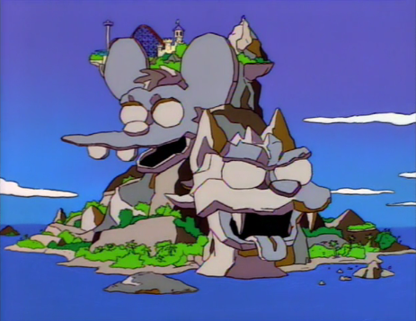

  <small>Exercice - Chemins relatifs</small><br>
  **[Itcky et Scratchy](./exercices/chat-souris/index.md){.stretched-link .back}**
</div>

<div class="grid grid-1-2" markdown>
  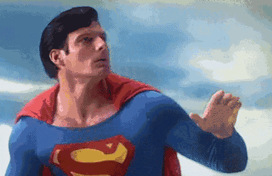

  <small>Exercice - HTML</small><br>
  **[Trouvez les erreurs](./exercices/la-faute/index.md){.stretched-link .back}**
</div>

## TP

Le reste de la période est consacré au développement du TP

[STOP]

https://vitrinelinguistique.oqlf.gouv.qc.ca/fiche-gdt/fiche/26529220/ebauche-structurelle
https://vitrinelinguistique.oqlf.gouv.qc.ca/fiche-gdt/fiche/26529188/maquette-conceptuelle
https://dribbble.com/shots/978949-Responsive-Wireframe-Templates-GIF
https://dribbble.com/shots/1017934-Free-responsive-wireframes-GIF
https://www.flux-academy.com/blog/beginners-guide-to-wireframing-for-website-design
https://app.uxcel.com/courses/designing-wireframes/wireframing-best-practices-816
