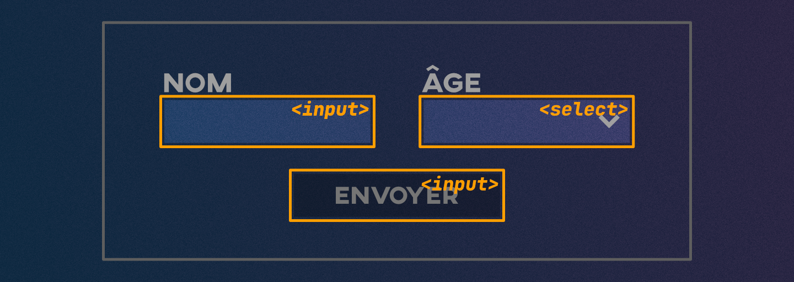

# Cours 6

## Formulaires

### Structure de base


Balise : [`<form>`](https://developer.mozilla.org/fr/docs/Web/HTML/Reference/Elements/form)

Attributs :

* **action=""** : URL où envoyer les données du formulaire. Dans le cadre du cours, les données ne pourront pas être traitées, car cela nécessite un langage de programmation côté serveur (comme PHP), ce qu’on ne couvre pas ici. On peut donc utiliser action="#" ou laisser vide pour rester sur la même page.
* **method=""** : Deux valeurs possibles :
  * **get** : envoie le contenu du formulaire dans l’URL (visible dans la barre d’adresse).
  * **post** : envoie les données de façon invisible, mais ne fonctionne que si un serveur est capable de les traiter, ce qui ne sera pas le cas dans le cours.

```html title="Exemple"
<form action="merci.html" method="get">

  <!-- Ici on insère les champs du formulaire -->
  
</form>
```

### Champs



Balises : [`<input>`](https://developer.mozilla.org/fr/docs/Web/HTML/Reference/Elements/input), [`<textarea>`](https://developer.mozilla.org/fr/docs/Web/HTML/Reference/Elements/textarea), [`<select>`](https://developer.mozilla.org/fr/docs/Web/HTML/Reference/Elements/select)

| Balise                    | Usage            | Exemple                              |
| ------------------------- | ---------------- | ------------------------------------ |
| `<input type="text">`     | Champ texte      | <form><input type="text"></form>     |
| `<input type="email">`    | Courriel         | <form><input type="email"></form>    |
| `<input type="password">` | Mot de passe     | <form><input type="password"></form> |
| `<input type="radio">`    | Choix unique     | <form><input type="radio" name="rad">1<input type="radio" name="rad">2<input type="radio" name="rad">3</form> |
| `<input type="checkbox">` | Choix multiples  | <form><input type="checkbox">1<input type="checkbox">2<input type="checkbox">3</form> |
| `<select>` `<option>`     | Liste déroulante | <form><select><option>1</option><option>2</option><option>3</option></select></form> |
| `<input type="submit">`   | Bouton d’envoi   | <form><input type="submit"></form>   |
| `<textarea>`              | Zone de texte    | <form><textarea></form>              |

Les [attributs de champ de formulaire](https://developer.mozilla.org/fr/docs/Web/HTML/Reference/Elements/input#attributs) sont nombreux. Voici une courte liste des plus utilisés :

* **required** : Le champ avec cet attribut soit être rempli pour soumettre le formulaire
* **disabled** : Désactive l'interactivité du champ.
* **placeholder** : Affiche un exemple de ce qui pourrait se trouver dans le champ. **Ne remplace pas la balise `<label>`**.
* **value** : Inscrit une valeur par défaut au chargement de la page
* **checked** : Un peu comme value, on peut définir si un radio ou un checkbox est coché par défaut.
* **name** : l'attribut name est essentiel pour que le langage de programmation côté serveur puisse associer un champ à sa valeur.
* **id** : Surtout utile pour la balise `<label>`.

<iframe class="aspect-1-1" height="300" style="width: 100%;" scrolling="no" title="Web 1 - Audio" src="https://codepen.io/tim-momo/embed/MYaeKgZ?%2Cresult&editable=true&theme-id=50210" frameborder="no" loading="lazy" allowtransparency="true" allowfullscreen="true">
  See the Pen <a href="https://codepen.io/tim-momo/pen/MYaeKgZ">
  Web 1 - Audio</a> by TIM Montmorency (<a href="https://codepen.io/tim-momo">@tim-momo</a>)
  on <a href="https://codepen.io">CodePen</a>.
</iframe>

### Label


Chaque champ doit être accompagné d'un libellé. Pour l'associer à un champ, on doit appliquer un id au champ et spécifier le id dans l'attribut for de la balise label.

| Balise                    | Usage            | Exemple          |
| ------------------------- | ---------------- | ---------------- |
| `<label for="">`          | Libellé de champ | <form><label for="ttt">Prénom</lable><br><input id="ttt" type="text"></form> |

Exemple : Avec association for et sans.

!!! example "Post vs. Get"

	Démonstration post-vs-get: [formulaire.zip](./exercices/formulaire.zip){ download }

## Ébauche structurelle


L’ébauche structurelle (ou wireframe en anglais) est une maquette simplifiée qui permet de planifier l’organisation du contenu d’une page Web avant d’en aborder le design ou le codage. C’est une méthode rapide et peu coûteuse pour valider la disposition des éléments. Elle se fait souvent sur papier, mais des outils comme Balsamiq, Figma ou Adobe XD sont couramment utilisés en industrie.

Relume https://www.relume.io/

Important : aucune couleur, aucune image, aucun style — uniquement la structure.

!!! warning "Un outil conceptuel, pas visuel"

	Il arrive qu’un client ne voie pas l’intérêt d’un wireframe et préfère passer directement à une maquette graphique. 
	
	Cette étape permet de se concentrer sur le contenu et l’architecture, sans être distrait par des questions de design. 
	
	Cela évite les commentaires hors propos du type « je n’aime pas la couleur » et recentre la discussion sur l’essentiel : *quelles informations doivent apparaître et où*.


[STOP]

## Formulaire avancé


[number, password, email, tel, date, etc.](https://tim-montmorency.com/compendium/582-111–web1/html/formulaire-avance.md)
<br>
<br>
## Exercice Among Us


[Exercice Among Us](https://tim-montmorency.com/compendium/582-111–web1/exercices/amongus.md)
<br>
<br>
## Favicon


[icônes de navigateur](https://tim-montmorency.com/compendium/582-111–web1/html/favicon.md)
<br>
<br>
## Favicon - Mega Man


[Pour cet exercice, vous devrez créer un fichier HTML affichant dans l’onglet de votre navigateur un favicon de Mega Man.](https://tim-montmorency.com/compendium/582-111–web1/exercices/megaman.md)
<br>
<br>
## Details & Summary


[Les balises `<details>` et `<summary>`](https://tim-montmorency.com/compendium/582-111–web1/html/details-summary.md)
<br>
<br>

## Details & Summary - Quiz Marc Labrèche


[Pour cet exercice, vous devrez recréer un mini quiz portant Marc Labrèche à l’aide des balises details et summary.](https://tim-montmorency.com/compendium/582-111–web1/exercices/quiz-marc-labreche.md)
<br>
<br>

## Résumé


[Résumé du HTML 5](https://tim-montmorency.com/compendium/582-111–web1/html/resume.md)

## Exercice Résumé


[Pour cet exercice, vous devrez compléter le site web](https://tim-montmorency.com/compendium/582-111–web1/exercices/le-cirque.md)


