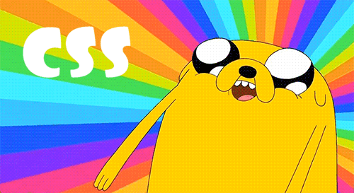
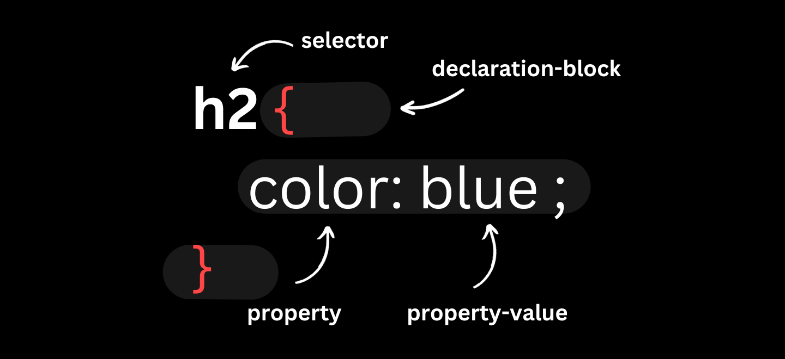
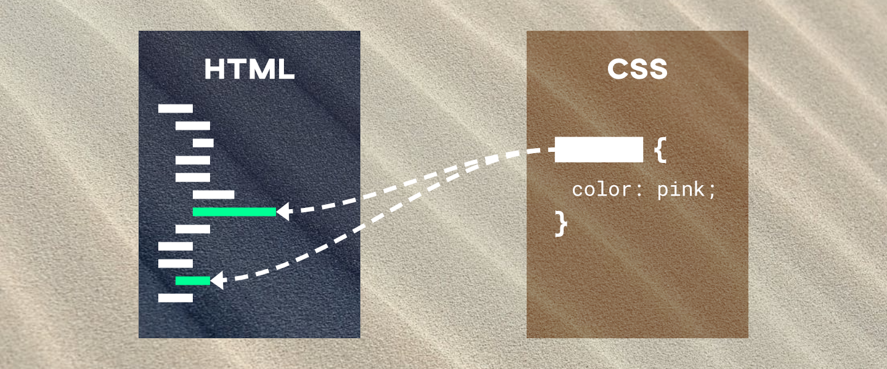
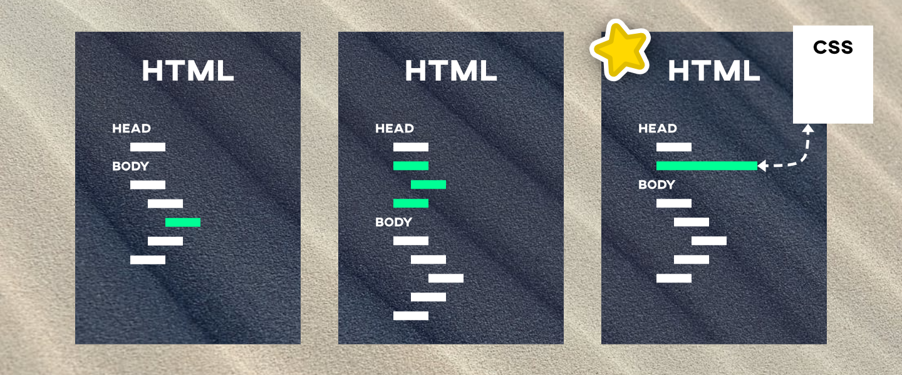
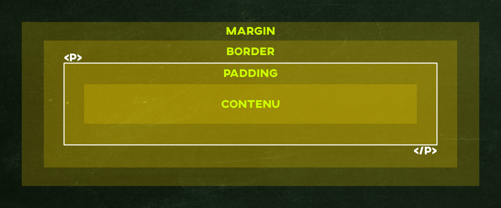
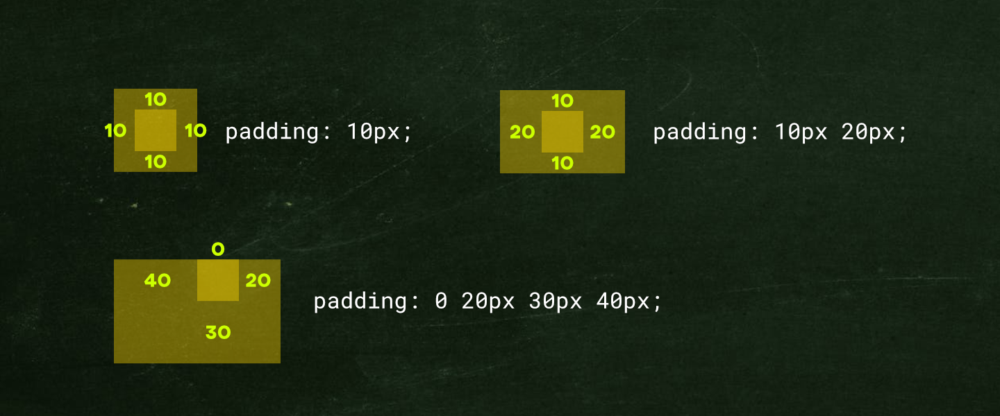
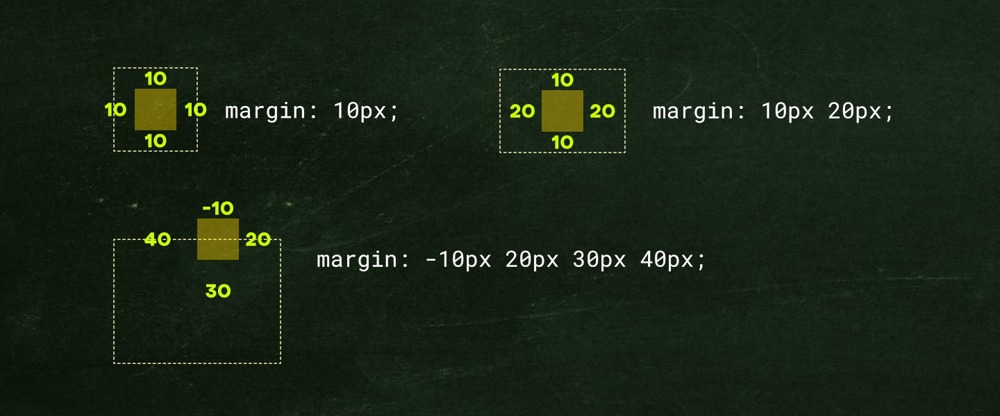
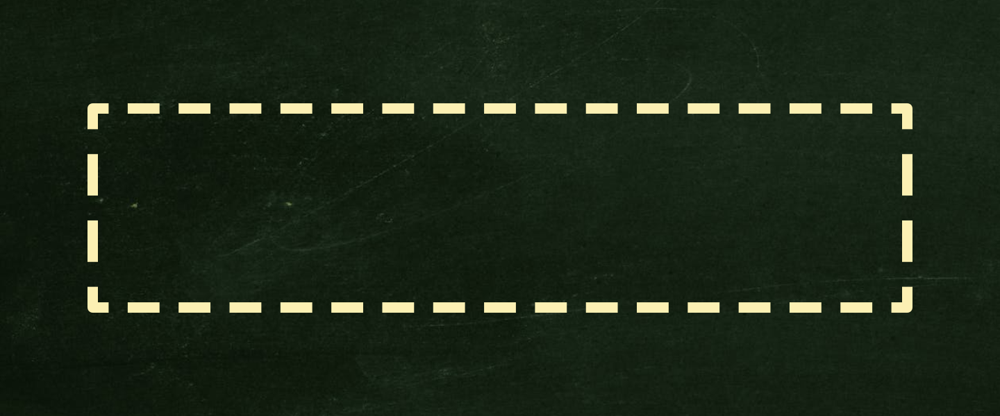
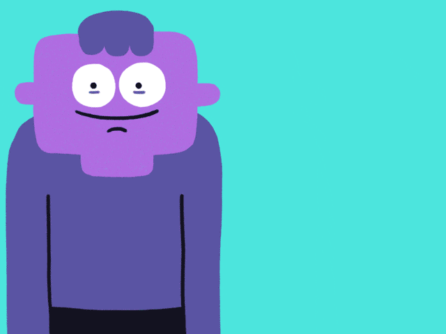

# Cours 8 | CSS

*[CSS]: Cascading Style Sheets

{ .w-100}

Le CSS (aussi appelé **feuille de style**) est un langage qui permet de **mettre en forme** les éléments d’une page Web : **couleurs**, **tailles**, **polices**, **espacements**, **alignements** et bien plus encore.

## Syntaxe et règle

Une **règle CSS** est constituée d'un **sélecteur** et d'une ou plusieurs **déclarations**.
 
Les déclarations d’une règle sont toujours entourées d’**accolades** `{ }`. 

Elles sont constituées d’une **propriété** et d’une **valeur**, séparées par un deux-points `:` et se terminent par un point-virgule `;`.

{data-zoom-image .w-50}

Voici un aperçu : 

<div class="grid align-items-start" markdown>
```text title="Structure d'une règle CSS"
sélecteur {
  propriété: valeur;
}
```

```css title="Exemple"
p {
  color: green;
  font-family: Arial;
}
```
</div>

### Commentaire

En CSS, un commentaire doit être compris entre les caractères `/*` et `*/`.

```css title="Exemple" hl_lines="1"
/* Mes styles d'entête */
header {
  color: pink;
  font-family: Tahoma;
}
```

## Sélecteur

{ data-zoom-image }

En général, un **sélecteur** est l’élément ou attribut HTML sur lequel on souhaite appliquer un style.

| Type de sélecteur | Exemple | Effet |
| ----------------- | ------- | ----- |
| Balise | `p` | Cible tous les paragraphes |
| Classe | `.ma-classe` | Cible tous les éléments avec `class="ma-classe"` |
| Identifiant | `#mon-id` | Cible l'élément avec `id="mon-id"` |

### Balise

<div class="grid align-items-start" markdown>
```html title="HTML"
<p>Bonjour</p>
<p>Ça va ?</p>
```

```css title="CSS"
p {
  color: red
}
```
</div>

<iframe class="aspect-4-1" height="300" style="width: 100%;" scrolling="no" title="Web 1 - CSS Flow A" src="https://codepen.io/tim-momo/embed/dPGVvQL?default-tab=result&theme-id=50173" frameborder="no" loading="lazy" allowtransparency="true" allowfullscreen="true">
  See the Pen <a href="https://codepen.io/tim-momo/pen/dPGVvQL">
  Web 1 - CSS Flow A</a> by TIM Montmorency (<a href="https://codepen.io/tim-momo">@tim-momo</a>)
  on <a href="https://codepen.io">CodePen</a>.
</iframe>

### Classe

<div class="grid align-items-start" markdown>
```html title="HTML"
<p class="ma-classe">Bonjour</p>
<p>Ça va ?</p>
```

```css title="CSS"
.ma-classe {
  color: red
}
```
</div>

<iframe class="aspect-4-1" height="300" style="width: 100%;" scrolling="no" title="Web 1 - CSS balise" src="https://codepen.io/tim-momo/embed/wBMPBqv?default-tab=result&theme-id=50173" frameborder="no" loading="lazy" allowtransparency="true" allowfullscreen="true">
  See the Pen <a href="https://codepen.io/tim-momo/pen/wBMPBqv">
  Web 1 - CSS balise</a> by TIM Montmorency (<a href="https://codepen.io/tim-momo">@tim-momo</a>)
  on <a href="https://codepen.io">CodePen</a>.
</iframe>

### Identifiant

<div class="grid align-items-start" markdown>
```html title="HTML"
<p>Bonjour</p>
<p id="mon-id">Ça va ?</p>
```

```css title="CSS"
#mon-id {
  color: red
}
```
</div>

<iframe class="aspect-4-1" height="300" style="width: 100%;" scrolling="no" title="Web 1 - CSS classe" src="https://codepen.io/tim-momo/embed/raxYazw?default-tab=result&theme-id=50173" frameborder="no" loading="lazy" allowtransparency="true" allowfullscreen="true">
  See the Pen <a href="https://codepen.io/tim-momo/pen/raxYazw">
  Web 1 - CSS classe</a> by TIM Montmorency (<a href="https://codepen.io/tim-momo">@tim-momo</a>)
  on <a href="https://codepen.io">CodePen</a>.
</iframe>

### Combinaison

Dans un sélecteur, il est possible de combiner une balise avec une classe ou un identifiant. 

<div class="grid align-items-start" markdown>
```html title="HTML"
<header class="gros">Un</header>
<p class="gros">Deux</p>
<p>Trois</p>
```

```css title="CSS"
/* Cible les paragraphes 
avec la classe « gros » */
p.gros {
  font-size: 30px;
}
```
</div>

<iframe class="aspect-4-1" height="300" style="width: 100%;" scrolling="no" title="Web 1 - CSS id" src="https://codepen.io/tim-momo/embed/QwyOwqy?default-tab=result&theme-id=50173" frameborder="no" loading="lazy" allowtransparency="true" allowfullscreen="true">
  See the Pen <a href="https://codepen.io/tim-momo/pen/QwyOwqy">
  Web 1 - CSS id</a> by TIM Montmorency (<a href="https://codepen.io/tim-momo">@tim-momo</a>)
  on <a href="https://codepen.io">CodePen</a>.
</iframe>

### Descendant

Un sélecteur descendant précise une hiérarchie dans le HTML.

<div class="grid align-items-start" markdown>
```html title="HTML"
<p>Quelqu'un, un jour, a dit :</p>
<blockquote>
  <p>Hey, salut !</p>
</blockquote>
```

```css title="CSS"
/* Cible les paragraphes 
dans les blockquote */
blockquote p {
  font-size: 12px;
  color: orange;
}
```
</div>

<iframe class="aspect-4-1" height="300" style="width: 100%;" scrolling="no" title="Web 1 - CSS selector combinaision" src="https://codepen.io/tim-momo/embed/VYerYxq?default-tab=result&theme-id=50173" frameborder="no" loading="lazy" allowtransparency="true" allowfullscreen="true">
  See the Pen <a href="https://codepen.io/tim-momo/pen/VYerYxq">
  Web 1 - CSS selector combinaision</a> by TIM Montmorency (<a href="https://codepen.io/tim-momo">@tim-momo</a>)
  on <a href="https://codepen.io">CodePen</a>.
</iframe>

### Sélecteur universel

Le sélecteur universel `*` cible tous les éléments.

<div class="grid align-items-start" markdown>
```html title="HTML"
<main>
  <h1>Salutations</h1>
  <p>Hola, ¿qué tal?</p>
  <small>- untel</small>
</main>
```

```css title="CSS"
/* Cible toutes les balises
dans main */
main * {
  color: green;
}
```
</div>

<iframe class="aspect-4-1" height="300" style="width: 100%;" scrolling="no" title="Web 1 - CSS selector descendant" src="https://codepen.io/tim-momo/embed/VYerYRN?default-tab=result&theme-id=50173" frameborder="no" loading="lazy" allowtransparency="true" allowfullscreen="true">
  See the Pen <a href="https://codepen.io/tim-momo/pen/VYerYRN">
  Web 1 - CSS selector descendant</a> by TIM Montmorency (<a href="https://codepen.io/tim-momo">@tim-momo</a>)
  on <a href="https://codepen.io">CodePen</a>.
</iframe>

#### Sélecteur multiple

Afin d'éviter la répétition, on peut sélectionner plusieurs éléments pour la même règle. Il suffit de séparer les sélecteurs par une virgule.

<div class="grid align-items-start" markdown>
```html title="HTML"
<p class="intro">Eins</p>
<p>Zwei</p>
<p class="outro">Drei</p>
```

```css title="CSS"
.intro, .outro {
  color: yellowgreen;
}
```
</div>

<iframe class="aspect-4-1" height="300" style="width: 100%;" scrolling="no" title="Web 1 - CSS selector multiple" src="https://codepen.io/tim-momo/embed/dPGZPEr?default-tab=result&theme-id=50173" frameborder="no" loading="lazy" allowtransparency="true" allowfullscreen="true">
  See the Pen <a href="https://codepen.io/tim-momo/pen/dPGZPEr">
  Web 1 - CSS selector multiple</a> by TIM Montmorency (<a href="https://codepen.io/tim-momo">@tim-momo</a>)
  on <a href="https://codepen.io">CodePen</a>.
</iframe>

### Ordre

Si deux règles de même spécificité ciblent le même élément et la même propriété, c'est la dernière règle lue par le navigateur qui est appliquée.

<iframe height="300" style="width: 100%;" scrolling="no" title="Web 1 - CSS selector ordre" src="https://codepen.io/tim-momo/embed/emJemwV?default-tab=css%2Cresult&editable=true&theme-id=50210" frameborder="no" loading="lazy" allowtransparency="true" allowfullscreen="true">
  See the Pen <a href="https://codepen.io/tim-momo/pen/emJemwV">
  Web 1 - CSS selector ordre</a> by TIM Montmorency (<a href="https://codepen.io/tim-momo">@tim-momo</a>)
  on <a href="https://codepen.io">CodePen</a>.
</iframe>

### Spécificité (Priorité)

> Type < Classe < ID

La spécificité est un score attribué à chaque sélecteur pour déterminer sa priorité.

| Type de sélecteur        | Priorité  | Score |
| ------------------------ | --------- | ----- |
| Balise                   | 🟢 Faible | 1     |
| Classe                   | 🟡 Moyen  | 10    |
| Identifiant              | 🔴 Fort   | 100   |
| Dans le HTML directement | 🔴 Max    | 1000  |

```html title="Exemple"
<p id="sanchez" class="rick">Wubba Lubba Dub Dub</p>
```

<iframe class="aspect-16-9" height="300" style="width: 100%;" scrolling="no" title="Web 1 - CSS selector ordre" src="https://codepen.io/tim-momo/embed/pvgdJor?default-tab=css%2Cresult&editable=true&theme-id=50210" frameborder="no" loading="lazy" allowtransparency="true" allowfullscreen="true">
  See the Pen <a href="https://codepen.io/tim-momo/pen/pvgdJor">
  Web 1 - CSS selector ordre</a> by TIM Montmorency (<a href="https://codepen.io/tim-momo">@tim-momo</a>)
  on <a href="https://codepen.io">CodePen</a>.
</iframe>

!!! info "Au sujet du Score"

    Le score n'indique pas une marche à suivre. C'est juste pour indiquer qui a priorité sur qui.

    Si possible, essayez d'avoir le score le plus bas possible. Éviter les id en css si possible.

### Outil 🤌

<!-- <iframe class="aspect-5-3" height="300" style="width: 100%;" scrolling="no" title="Web 1 - CSS" src="https://codepen.io/tim-momo/embed/KwdgxXB?default-tab=html%2Cresult&editable=true&theme-id=50210" frameborder="no" loading="lazy" allowtransparency="true" allowfullscreen="true">
  See the Pen <a href="https://codepen.io/tim-momo/pen/KwdgxXB">
  Web 1 - CSS</a> by TIM Montmorency (<a href="https://codepen.io/tim-momo">@tim-momo</a>)
  on <a href="https://codepen.io">CodePen</a>.
</iframe> -->

<div class="grid grid-1-2" markdown>
  

  **[Explicateur de sélecteur](https://kittygiraudel.github.io/selectors-explained){.stretched-link}** (en anglais)
</div>

### Bon à savoir

Un élément HTML peut avoir plusieurs classes séparés par des espaces.

<div class="grid align-items-start" markdown>
```html title="HTML"
<h1 class="txt cool">
  Lorem
</h1>
<p class="intro txt super">
  Ipsum
</p>
```

```css title="CSS"
.txt {
  color: orangered;
}
.txt.super {
  font-weight: bold;
}
```
</div>

<iframe class="aspect-4-1" height="300" style="width: 100%;" scrolling="no" title="Web 1 - CSS selector spécificité" src="https://codepen.io/tim-momo/embed/yyePNJp?default-tab=result&theme-id=50173" frameborder="no" loading="lazy" allowtransparency="true" allowfullscreen="true">
  See the Pen <a href="https://codepen.io/tim-momo/pen/yyePNJp">
  Web 1 - CSS selector spécificité</a> by TIM Montmorency (<a href="https://codepen.io/tim-momo">@tim-momo</a>)
  on <a href="https://codepen.io">CodePen</a>.
</iframe>

Un élément HTML et peut avoir plein de paramètres. Plus il y a de paramètres, plus il y a de manière d'écrire le sélecteur : 

```html title="HTML"
<p class="intro big cool" id="coucou" title="Un joli texte">
  Lorem ipsum
</p>
```

```css title="CSS"
.intro { color: red; }
/* ou */
p.intro { color: red; }
/* ou */
#coucou { color: red; }
/* ou */
p#coucou { color: red; }
/* ou */
p.intro.cool { color: red; }
/* etc. */
```

## Usage

{ data-zoom-image }

Il existe trois façons d’intégrer du CSS dans une page HTML :

### CSS inline 

Le style est appliqué directement sur un élément HTML via l’attribut `style=""`, sans sélecteur.

Cette méthode est déconseillée dans la plupart des cas : elle est difficile à maintenir, répète du code et ne profite pas du système de sélecteur CSS.

```html
<p style="color: black;">BLΛƆKPIИK</p>
```

### CSS interne 

Le CSS est écrit **dans le même fichier HTML**, à l’intérieur d’une balise `<style>` située dans la portion `<head>` du document.

```html title="index.html"
<!DOCTYPE html>
<html lang="fr">
<head>
    <meta charset="UTF-8">
    <meta name="viewport" content="width=device-width, initial-scale=1.0">
    <title>CSS interne</title>
    <style>
      p {
        color: pink; 
      }
    </style>
</head>
<body>
    <p>BLΛƆKPIИK</p>
</body>
</html>
```

### CSS externe 👌😍

Le CSS est écrit dans un fichier séparé (avec l’extension .css), puis lié au fichier HTML avec une balise `<link>` dans le `<head>`.

C'est la méthode recommandée et celle que nous utiliserons majoritairement dans le cours.

```html title="index.html"
<!DOCTYPE html>
<html lang="fr">
<head>
    <meta charset="UTF-8">
    <meta name="viewport" content="width=device-width, initial-scale=1.0">
    <title>CSS externe</title>
    <link rel="stylesheet" href="styles.css">
</head>
<body>
    <p>BLΛƆKPIИK</p>
</body>
</html>
```

```css title="styles.css"
p {
  color: pink;
}
```

!!! info "À propos de la balise `<link>`"

    La balise `<link>` permet de **lier des ressources externes** à la page HTML (feuilles de style, icônes, etc.).  
    Elle se place dans le `<head>` et est autofermante.

    Exemple :

    ```html
    <link rel="stylesheet" href="chemin/vers/le/fichier/style.css">
    ```

	L’attribut `rel` est obligatoire et indique **la nature du lien**. On l'utile la plupart du temps pour les feuilles de styles et le favicon.

!!! example "Lier un fichier css à une page html"

    **🧑‍🏫 Démo du prof**

## Dimensions

La propriété [width](https://developer.mozilla.org/fr/docs/Web/CSS/width) permet de définir la largeur de la boîte du contenu d'un élément.

La propriété [height](https://developer.mozilla.org/fr/docs/Web/CSS/height) définit la hauteur de la boîte de contenu d'un élément. 

```css title="Exemple"
div {
  width: 100px;
  height: 100px;
}
```

## Modèle des boîtes CSS

{ data-zoom-image }

Chaque élément HTML est une boîte constituée de :

* `margin` : espacement extérieur
* `border` : bordure
* `padding` : espacement intérieur

<!-- ```css title="exemple"
div {
  padding: 10px;
  margin: 20px;
  border: 2px solid black;
}
``` -->

### Padding

{data-zoom-image .w-100}

La propriété [`padding`](https://developer.mozilla.org/fr/docs/Web/CSS/padding) définit l'espace entre le contenu et ses extrémités. 

On peut configurer l'espacement de manière granulaire (pour chaque côté) :

```css
div{
  padding-top: 10px;
  padding-right: 10px;
  padding-bottom: 10px;
  padding-left: 10px;
}
```

On peut aussi configurer l'espacement avec une syntaxe abrégée.

Cette syntaxe courte s'écrit de trois façons : une valeur unique (pour appliquer la même valeur aux quatre côtés), deux valeurs (pour définir l'espacement vertical puis l'espacement horizontal) ou quatre valeurs (pour définir l'espacement pour chaque côté dans l'ordre : haut, droit, bas, gauche).

```css
header{
  /* haut 11px, droit 11px, bas 11px, gauche 11px */
  padding: 11px;
}

main{
  /* haut 11px, droit 55px, bas 11px, gauche 55px */
  padding: 11px 55px; 
}

footer{
  /* haut 11px, droit 22px, bas 33px, gauche 44px */
  padding: 11px 22px 33px 44px;
}
```

### Margin

{data-zoom-image .w-100}

La propriété [`margin`](https://developer.mozilla.org/fr/docs/Web/CSS/margin) définit un espace vide devant être respecté autour d'un élément. 

On peut configurer l'espacement de manière granulaire (pour chaque côté) :

```css
div{
  margin-top: 10px;
  margin-right: 10px;
  margin-bottom: 10px;
  margin-left: 10px;
}
```

On peut aussi configurer l'espacement avec une syntaxe abrégée.

Cette syntaxe courte s'écrit de trois façons : une valeur unique (pour appliquer la même valeur aux quatre côtés), deux valeurs (pour définir l'espacement vertical puis l'espacement horizontal) ou quatre valeurs (pour définir l'espacement pour chaque côté dans l'ordre : haut, droit, bas, gauche).

```css
header{
  /* haut 11px, droit 11px, bas 11px, gauche 11px */
  margin: 11px;
}

main{
  /* haut 11px, droit 55px, bas 11px, gauche 55px */
  margin: 11px 55px; 
}

footer{
  /* haut 11px, droit 22px, bas 33px, gauche 44px */
  margin: 11px 22px 33px 44px;
}
```

!!! info "Fusion de marge"

    Lorsque deux marges verticales sont côte-à-côte, elle se fusionnent au lieu de s'additionner ! C'est ce qu'on appelle un _margin collapse_.

#### Alignement horizontal

La façon traditionnelle de centrer un élément est de lui appliquer une largeur fixe et de lui assigner les marges latérales à la valeur 'auto'.

```css
div {
  width: 500px;
  margin-left: auto;
  margin-right: auto;
}
```

<iframe height="300" style="width: 100%;" scrolling="no" title="Web 1 - CSS margin neg" src="https://codepen.io/tim-momo/embed/xbZPZYW?default-tab=result&editable=true&theme-id=50173" frameborder="no" loading="lazy" allowtransparency="true" allowfullscreen="true">
  See the Pen <a href="https://codepen.io/tim-momo/pen/xbZPZYW">
  Web 1 - CSS margin neg</a> by TIM Montmorency (<a href="https://codepen.io/tim-momo">@tim-momo</a>)
  on <a href="https://codepen.io">CodePen</a>.
</iframe>

#### Marges négatives

Contrairement à `padding`, la propriété `margin` accepte les valeurs négatives ! 

```css
div {
  margin-top: -30px;
}
```

Ça permet de « tirer » l'élément vers l'élément adjacent.

C'est la méthode la plus simple pour faire chevaucher deux éléments. Par exemple, faire remonter une image de bannière au-dessus du contenu principal.

<iframe class="aspect-16-9" height="300" style="width: 100%;" scrolling="no" title="Web 1 - CSS Flow B" src="https://codepen.io/tim-momo/embed/WbrXrdQ?default-tab=result&editable=true&theme-id=50173" frameborder="no" loading="lazy" allowtransparency="true" allowfullscreen="true">
  See the Pen <a href="https://codepen.io/tim-momo/pen/WbrXrdQ">
  Web 1 - CSS Flow B</a> by TIM Montmorency (<a href="https://codepen.io/tim-momo">@tim-momo</a>)
  on <a href="https://codepen.io">CodePen</a>.
</iframe>

### Bordures

{.w-100}

La propriété [`border`](https://developer.mozilla.org/fr/docs/Web/CSS/border) permet d’ajouter une bordure autour d’un élément.

Elle est composée de trois sous-propriétés principales :

* `border-width` : épaisseur de la bordure
* `border-style` : type de trait
* `border-color` : couleur de la bordure

Elles peuvent être combinées dans une seule déclaration :

```css
div {
  border: 3px solid black;
}
```

#### Styles

La propriété CSS [`border-style`](https://developer.mozilla.org/fr/docs/Web/CSS/border-style) permet de définir le style des lignes.

```css
div {
  border-style: solid;   /* ligne pleine */
  border-style: dotted;  /* points */
  border-style: dashed;  /* tirets */
  border-style: none;    /* aucune bordure */
}
```

<iframe height="300" style="width: 100%;" scrolling="no" title="Web 1 - CSS border styles" src="https://codepen.io/tim-momo/embed/ogbobaQ?default-tab=result&theme-id=50173" frameborder="no" loading="lazy" allowtransparency="true" allowfullscreen="true">
  See the Pen <a href="https://codepen.io/tim-momo/pen/ogbobaQ">
  Web 1 - CSS border styles</a> by TIM Montmorency (<a href="https://codepen.io/tim-momo">@tim-momo</a>)
  on <a href="https://codepen.io">CodePen</a>.
</iframe>

#### Bordure arrondie

La propriété [`border-radius`](https://developer.mozilla.org/fr/docs/Web/CSS/border-radius) permet d’arrondir les coins.

On peut arrondir tous les coins à la fois ou un coin spécifique.

```css
/* tous les coins */
div {
  border-radius: 10px;
}

/* valeurs distinctes (haut-gauche, haut-droit, bas-droit, bas-gauche) */
div {
  border-radius: 10px 20px 30px 40px;
}
```

Il existe quatre sous-propriétés pour arrondir un coin particulier : `border-top-left-radius`, `border-top-right-radius`, `border-bottom-right-radius` et `border-bottom-left-radius`.

<iframe height="300" style="width: 100%;" scrolling="no" title="Web 1 - CSS border styles" src="https://codepen.io/tim-momo/embed/YPwEqWK?default-tab=result&theme-id=50173" frameborder="no" loading="lazy" allowtransparency="true" allowfullscreen="true">
  See the Pen <a href="https://codepen.io/tim-momo/pen/YPwEqWK">
  Web 1 - CSS border styles</a> by TIM Montmorency (<a href="https://codepen.io/tim-momo">@tim-momo</a>)
  on <a href="https://codepen.io">CodePen</a>.
</iframe>

## Propriété display

La propriété [display](https://developer.mozilla.org/fr/docs/Web/CSS/display) définit la façon dont un élément est affiché dans le [flux](https://developer.mozilla.org/fr/docs/Web/CSS/display) du document.

### `display: block;`

Un élément de type bloc prend toute la largeur disponible. Il commence toujours sur une nouvelle ligne, même si d’autres éléments le suivent dans le code HTML.

```css title="Exemple"
div {
  display: block;
}
```

Exemples d’éléments block par défaut : `<div>`, `<p>`, `<section>`, `<header>`, `<footer>`, `<main>`.

On peut leur appliquer des propriétés comme `width`, `height`, `margin`, `padding`.

### `display: inline;`

Un élément en ligne (inline) s’affiche dans le flux du texte, à la suite des autres éléments, sans retour à la ligne.

```css title="Exemple"
span {
  display: inline;
}
```

Exemples d’éléments inline par défaut : `<span>`, `<a>`, `<strong>`, `<em>`, ``.

!!! warning "Pas de largeur, ni d'hauteur"

    Les éléments inline ne peuvent pas avoir de `width` ou de `height` personnalisée.

### `display: inline-block;`

C’est un mélange entre les deux :

* Comme `inline`, il s’affiche dans la même ligne que les autres éléments.
* Comme `block`, il accepte les propriétés de taille (`width`, `margin`, etc.)

```css title="Exemple"
button {
  display: inline-block;
  width: 150px;
  height: 50px;
}
```

!!! info "Alignement vertical"

    Avec `inline-block`, il est possible d'utiliser la propriété [`vertical-align`](https://developer.mozilla.org/fr/docs/Web/CSS/vertical-align) afin d'aligner verticalement les éléments.

    ```css title="Exemple"
    img {
      display: inline-block;
      vertical-align: center;
    }
    ```

### `display: none;` 

Cette valeur cache complètement l’élément : il n’apparaît plus à l’écran et ne prend plus de place dans la page.                              

```css
div {
  display: none;
}
```

<!-- 
On peut aussi aligner les éléments inline vertivalement avec la propriété `vertical-align`.

```css title="exemple"
span {
  display: inline-block;
  vertical-align: middle;
}
``` 
-->

## Couleurs et arrière-plan

{.w-100}


Le CSS permet de modifier la couleur du texte et l’arrière-plan d’un élément.
Ces deux propriétés sont parmi les plus simples et les plus utilisées.

### Couleur du texte

La propriété [color](https://developer.mozilla.org/fr/docs/Web/CSS/color) définit la couleur du texte à l’intérieur d’un élément.

| Format | Exemple |
| --- | --- |
| [Nom de couleur](https://developer.mozilla.org/fr/docs/Web/CSS/named-color) | `orange`, `red`, `magenta` |
| [Hexadécimal](https://developer.mozilla.org/fr/docs/Web/CSS/hex-color) | `#ff0000`, `#00ff00` | 
| [Hexadécimal abrégé](https://developer.mozilla.org/fr/docs/Web/CSS/hex-color) | `#f00`, `#0f0` | 
| [rgb](https://developer.mozilla.org/fr/docs/Web/CSS/color_value/rgb) | `rgb(255, 0, 0)` | 
| [rgba](https://developer.mozilla.org/fr/docs/Web/CSS/color_value/rgb) | `rgba(255, 0, 0, 0.5)` | 

```css title="Exemple"
p {
  color: tomato;
  color: #FF6347;
  color: rgb(255, 99, 71);
}
```

### Arrière-plan

La propriété [background-color](https://developer.mozilla.org/fr/docs/Web/CSS/background-color) permet de définir une couleur derrière le contenu d’un élément.

```css
section {
  background-color: #000;
}
```

!!! info "Limites"

    La couleur d'arrière-plan s’étend sous le contenu, le padding et la bordure, mais pas dans les marges.

### Image en arrière-plan

Il est aussi possible d’afficher une image en arrière-plan :

```css
body {
  background-image: url("./chemin/vers/votre/image.png");
}
```

Et on peut la configurer :

```css
body {
  background-image: url("./chemin/vers/votre/image.png");
  background-repeat: no-repeat;
  background-position: center;
  background-size: cover;
}
```

* `background-repeat` : Répète ou non l’image (`repeat`, `repeat-x`, `no-repeat`, etc.)
* `background-position` : Position de l’image (`left`, `center`, `top`, `bottom`, etc.)
* `background-size` : Ajuste la taille (`auto`, `cover`, `contain`, etc.)

### Propriété abrégée

Toutes les propriétés de fond peuvent être regroupées en une seule ([background](https://developer.mozilla.org/fr/docs/Web/CSS/background)) :

```css
body {
  background: #222 url("./chemin/vers/votre/image.png") no-repeat center / cover;
}
```

## Héritage

{.w-100}

L'Héritage est le mécanisme par lequel certaines propriétés CSS sont transmises automatiquement d'un élément parent à ses éléments enfants.

La plupart du temps, ce sont les propriétés liées au texte qui sont passées aux enfant.

```html
<div id="parent">
  <p>Ceci est un enfant.</p> 
</div>
```

```css
#parent {
  color: green;
  padding: 10px;
}
```

Résultat. Le texte du paragraphe sera en vert, mais n'héritera pas du padding de son parent.

## Exercices

[Spécificités](https://css-specificity.smnarnold.com/?level=class-and-class-vs-class)

<div class="grid grid-1-2" markdown>
  

  <small>Exercice CSS</small><br>
  **[Sélecteur pulpeux](./exercices/diner/index.md){.stretched-link .back}**
</div>

<div class="grid grid-1-2" markdown>
  

  <small>Exercice CSS</small><br>
  **[Yé](./exercices/ye/index.md){.stretched-link .back}**
</div>

<div class="grid grid-1-2" markdown>
  

  <small>Exercice CSS</small><br>
  **[Chihiro](./exercices/chihiro/index.md){.stretched-link .back}**
</div>

<div class="grid grid-1-2" markdown>
  

  <small>Exercice CSS</small><br>
  **[Blade Runner](./exercices/blade-runner/index.md){.stretched-link .back}**
</div>
