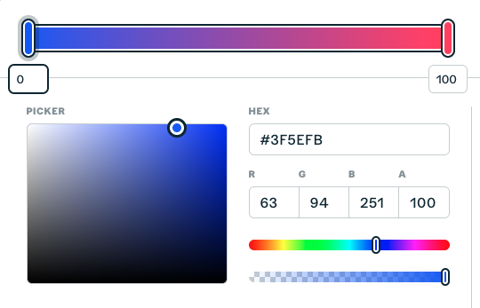
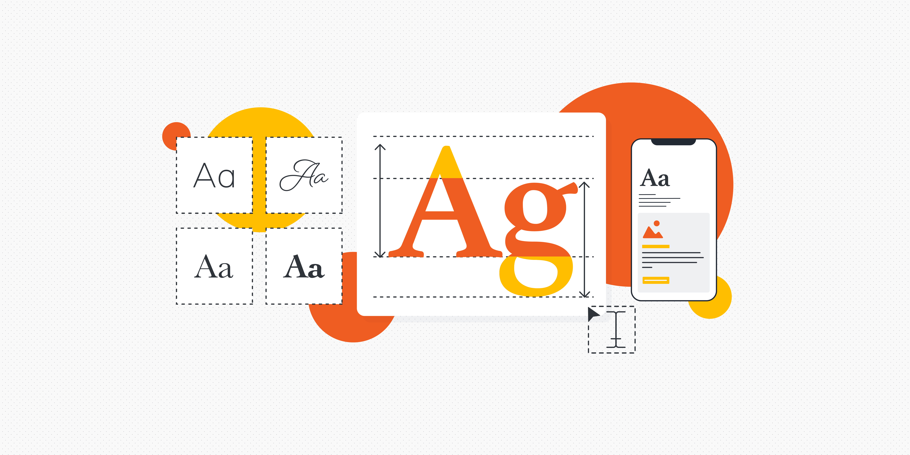
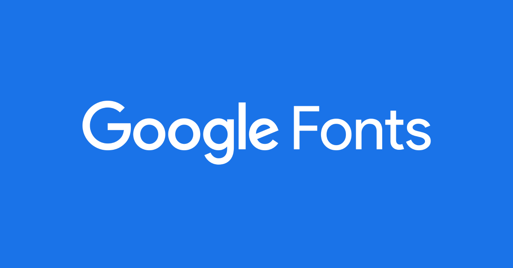
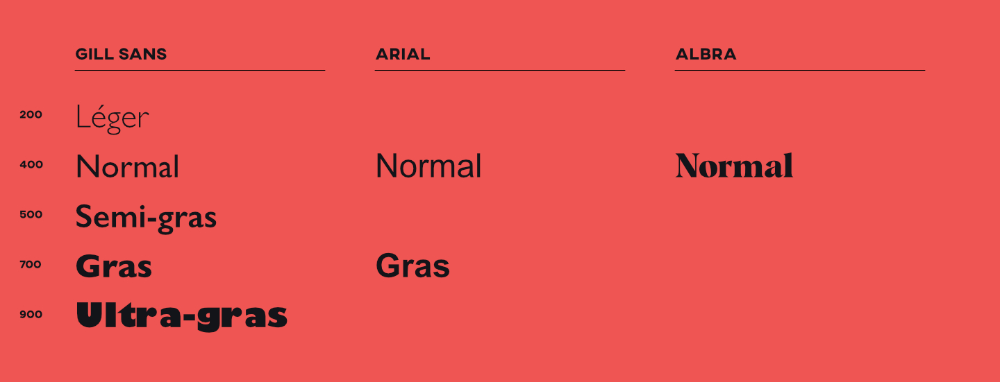
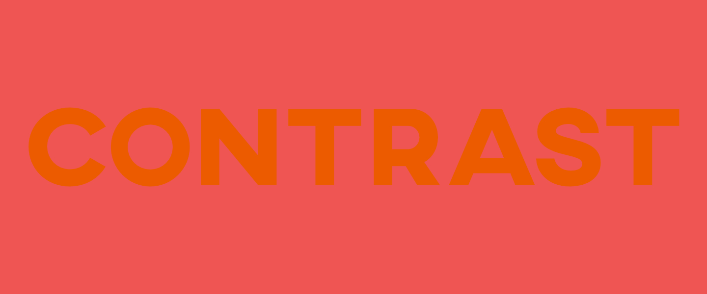
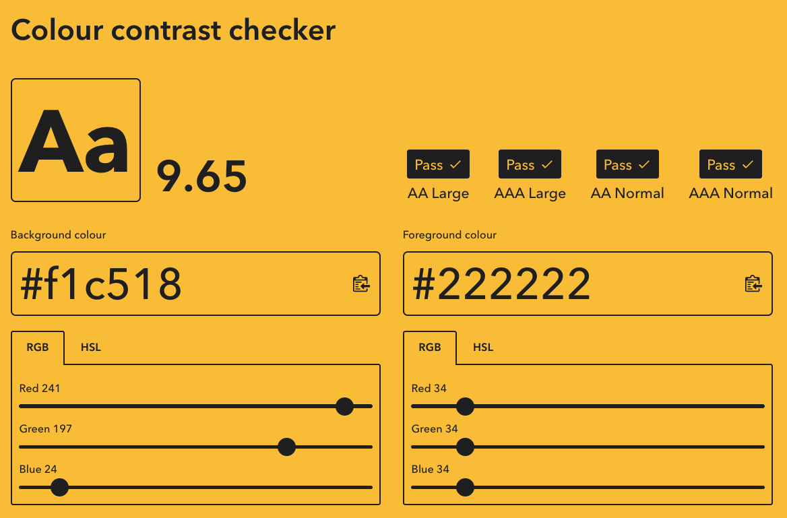
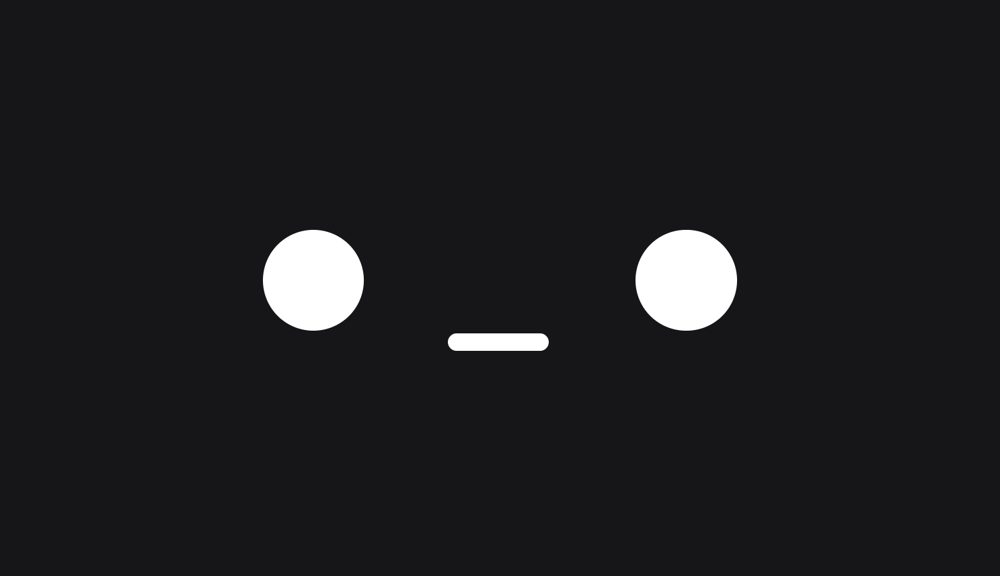

# Cours 9 | CSS

## Dégradé de couleur

Il est possible de générer un dégradé de couleur à titre d’image d’arrière-plan en utilisant les fonctions CSS `linear-gradient()` et `radial-gradient()`.

Les valeurs possibles sont les [couleurs Web](https://developer.mozilla.org/fr/docs/Web/CSS/color).

### Dégradé linéaire

```css
div{
  background: linear-gradient(#FF0000, #000000);
  /* ou */
  background: linear-gradient(to bottom, red, black);
}
```

<iframe height="300" style="width: 100%;" scrolling="no" title="Web1 - gradient multicolore" src="https://codepen.io/tim-momo/embed/QwymWaa?default-tab=result&theme-id=50173&editable=true" frameborder="no" loading="lazy" allowtransparency="true" allowfullscreen="true">
  See the Pen <a href="https://codepen.io/tim-momo/pen/QwymWaa">
  Web1 - gradient multicolore</a> by TIM Montmorency (<a href="https://codepen.io/tim-momo">@tim-momo</a>)
  on <a href="https://codepen.io">CodePen</a>.
</iframe>

Orientations possibles : `to bottom` (par défaut), `to top`, `to right`, `to left`, degré (ex. : `45deg`).

!!! info "Multicolore"

	On peut ajouter autant de couleurs que désiré.

	```css
	div{
	  background: linear-gradient(to right, red, orange, yellow, green, cyan, blue, violet);
	}
	```

	<iframe class="aspect-8-1" height="300" style="width: 100%;" scrolling="no" title="Web1 - gradient" src="https://codepen.io/tim-momo/embed/KwVoKyo?default-tab=result&theme-id=50173&editable=true" frameborder="no" loading="lazy" allowtransparency="true" allowfullscreen="true">
		See the Pen <a href="https://codepen.io/tim-momo/pen/KwVoKyo">
		Web1 - gradient</a> by TIM Montmorency (<a href="https://codepen.io/tim-momo">@tim-momo</a>)
		on <a href="https://codepen.io">CodePen</a>.
	</iframe>

### Dégradé circulaire

```css
div{
  background: radial-gradient(red, black);
  /* ou */
  background: radial-gradient(ellipse, red, black);
}
```

<iframe height="300" style="width: 100%;" scrolling="no" title="Web1 - gradient linéaire" src="https://codepen.io/tim-momo/embed/emJMYyP?default-tab=result&theme-id=50173&editable=true" frameborder="no" loading="lazy" allowtransparency="true" allowfullscreen="true">
  See the Pen <a href="https://codepen.io/tim-momo/pen/emJMYyP">
  Web1 - gradient linéaire</a> by TIM Montmorency (<a href="https://codepen.io/tim-momo">@tim-momo</a>)
  on <a href="https://codepen.io">CodePen</a>.
</iframe>

Formes : `ellipse` (par défaut), `circle`

<div class="grid grid-1-2" markdown>
  

  <small>Outil</small><br>
  **[Gestionnaire de dégradé CSS](https://cssgradient.io/){.stretched-link .back}**
</div>

## Typographie

{.w-100}

### `letter-spacing`

```css
p {
  letter-spacing: 10px;
}
```

<iframe class="aspect-8-1" height="300" style="width: 100%;" scrolling="no" title="Web 1 - CSS letter spacing" src="https://codepen.io/tim-momo/embed/emJMYoX?default-tab=result&theme-id=50173&editable=true" frameborder="no" loading="lazy" allowtransparency="true" allowfullscreen="true">
  See the Pen <a href="https://codepen.io/tim-momo/pen/emJMYoX">
  Web 1 - CSS letter spacing</a> by TIM Montmorency (<a href="https://codepen.io/tim-momo">@tim-momo</a>)
  on <a href="https://codepen.io">CodePen</a>.
</iframe>

### `word-spacing`

```css
p {
  word-spacing: 10px;
}
```

<iframe class="aspect-8-1" height="300" style="width: 100%;" scrolling="no" title="Web 1 - CSS border radius" src="https://codepen.io/tim-momo/embed/RNrMwEo?default-tab=result&theme-id=50173&editable=true" frameborder="no" loading="lazy" allowtransparency="true" allowfullscreen="true">
  See the Pen <a href="https://codepen.io/tim-momo/pen/RNrMwEo">
  Web 1 - CSS border radius</a> by TIM Montmorency (<a href="https://codepen.io/tim-momo">@tim-momo</a>)
  on <a href="https://codepen.io">CodePen</a>.
</iframe>

### font-family

```css
body {
  font-family: Arial;
}
```

<iframe class="aspect-8-1" height="300" style="width: 100%;" scrolling="no" title="Web 1 - CSS word spacing" src="https://codepen.io/tim-momo/embed/LEGdEEN?default-tab=result&theme-id=50173&editable=true" frameborder="no" loading="lazy" allowtransparency="true" allowfullscreen="true">
  See the Pen <a href="https://codepen.io/tim-momo/pen/LEGdEEN">
  Web 1 - CSS word spacing</a> by TIM Montmorency (<a href="https://codepen.io/tim-momo">@tim-momo</a>)
  on <a href="https://codepen.io">CodePen</a>.
</iframe>

Polices Web‑safe: polices par défaut du Web. Tous les navigateurs peuvent afficher ces fontes: Arial, Times, Tahoma, Verdana, Trebuchet MS, monospace, serif, sans‑serif.

Il est également possible d'ajouter d'autres fontes. Pour cela, soit la police est déjà installée sur l'ordinateur de l'utilisateur, soit on lui fait télécharger une police au chargement de la page.

#### Google Fonts

{.w-50}

La méthode simple d'installer une fonte externe est d'y aller avec [Google Fonts](https://fonts.google.com/).

!!! example "Installer une police Google"

    **🧑‍🏫 Démo du prof**, prenez des notes ;)

#### Substitution

On peut aussi ajouter des fontes de substitution (aussi appelées "_fallbacks_") si la fonte choisie n'est pas disponible chez l'utilisateur.

```css
body {
  font-family: Helvetica, Arial, sans-serif;
}
```

### font-size

<iframe class="aspect-8-1" height="300" style="width: 100%;" scrolling="no" title="Web 1 - CSS word spacing" src="https://codepen.io/tim-momo/embed/jEWzEbQ?default-tab=result&theme-id=50173&editable=true" frameborder="no" loading="lazy" allowtransparency="true" allowfullscreen="true">
  See the Pen <a href="https://codepen.io/tim-momo/pen/jEWzEbQ">
  Web 1 - CSS word spacing</a> by TIM Montmorency (<a href="https://codepen.io/tim-momo">@tim-momo</a>)
  on <a href="https://codepen.io">CodePen</a>.
</iframe>

```css
h1 {
  font-size: 32px;
}
```

Par défaut, si aucune taille n'est spécifiée, les navigateurs attribuent la taille de **16px** aux textes. 

### font-weight

<iframe class="aspect-8-1" height="300" style="width: 100%;" scrolling="no" title="Web 1 - CSS font-size" src="https://codepen.io/tim-momo/embed/myVxyVM?default-tab=result&theme-id=50173&editable=true" frameborder="no" loading="lazy" allowtransparency="true" allowfullscreen="true">
  See the Pen <a href="https://codepen.io/tim-momo/pen/myVxyVM">
  Web 1 - CSS font-size</a> by TIM Montmorency (<a href="https://codepen.io/tim-momo">@tim-momo</a>)
  on <a href="https://codepen.io">CodePen</a>.
</iframe>

```css
a {
  font-weight: bold;
}
```

Quelques valeurs possibles : 

* `100`, `200`, `300`, `400`, `500`, `600`, `700`, `800` et `900`
* `bold`, `normal`

!!! warning "Toutes les polices ne sont pas égales"

	{data-zoom-image}

	Les différentes épaisseurs de police (`font-weight`) sont configurables si la police elle même a des variantes d'épaisseurs.

### Interlignage

<iframe class="aspect-8-1" height="300" style="width: 100%;" scrolling="no" title="Web 1 - CSS font-size" src="https://codepen.io/tim-momo/embed/GgoxgZM?default-tab=result&theme-id=50173&editable=true" frameborder="no" loading="lazy" allowtransparency="true" allowfullscreen="true">
  See the Pen <a href="https://codepen.io/tim-momo/pen/GgoxgZM">
  Web 1 - CSS font-size</a> by TIM Montmorency (<a href="https://codepen.io/tim-momo">@tim-momo</a>)
  on <a href="https://codepen.io">CodePen</a>.
</iframe>

Espacement entre les lignes.

```css
p {
  line-height: 1.5;
}
```

Peut être une valeur fixe (11px) ou ratio (ex.: 2)

### color

<iframe class="aspect-8-1" height="300" style="width: 100%;" scrolling="no" title="Web 1 - CSS font-size" src="https://codepen.io/tim-momo/embed/MYKVYed?default-tab=result&theme-id=50173&editable=true" frameborder="no" loading="lazy" allowtransparency="true" allowfullscreen="true">
  See the Pen <a href="https://codepen.io/tim-momo/pen/MYKVYed">
  Web 1 - CSS font-size</a> by TIM Montmorency (<a href="https://codepen.io/tim-momo">@tim-momo</a>)
  on <a href="https://codepen.io">CodePen</a>.
</iframe>

```css
p {
  color: #ff0000;
}
```

Les valeurs possibles sont les [couleurs Web](https://developer.mozilla.org/fr/docs/Web/CSS/color).

### font-style

<iframe class="aspect-8-1" height="300" style="width: 100%;" scrolling="no" title="Web 1 - CSS color" src="https://codepen.io/tim-momo/embed/gbPebwo?default-tab=result&theme-id=50173&editable=true" frameborder="no" loading="lazy" allowtransparency="true" allowfullscreen="true">
  See the Pen <a href="https://codepen.io/tim-momo/pen/gbPebwo">
  Web 1 - CSS color</a> by TIM Montmorency (<a href="https://codepen.io/tim-momo">@tim-momo</a>)
  on <a href="https://codepen.io">CodePen</a>.
</iframe>

```css
p {
  font-style: italic;
}
```

Valeur possible : 

* normal (par défaut)
* italic

### Alignement

<iframe class="aspect-8-1" height="300" style="width: 100%;" scrolling="no" title="Web 1 - CSS font-style" src="https://codepen.io/tim-momo/embed/raxdYJq?default-tab=result&theme-id=50173&editable=true" frameborder="no" loading="lazy" allowtransparency="true" allowfullscreen="true">
  See the Pen <a href="https://codepen.io/tim-momo/pen/raxdYJq">
  Web 1 - CSS font-style</a> by TIM Montmorency (<a href="https://codepen.io/tim-momo">@tim-momo</a>)
  on <a href="https://codepen.io">CodePen</a>.
</iframe>

```css
p {
  text-align: center;
}
```

Les valeurs possibles sont : `left`, `right` et `center`.

Il y a aussi `justify`, mais cette mise en forme est généralement déconseillée en Web.

### transformation

<iframe class="aspect-8-1" height="300" style="width: 100%;" scrolling="no" title="Web 1 - CSS font-style" src="https://codepen.io/tim-momo/embed/myVxqxP?default-tab=result&theme-id=50173&editable=true" frameborder="no" loading="lazy" allowtransparency="true" allowfullscreen="true">
  See the Pen <a href="https://codepen.io/tim-momo/pen/myVxqxP">
  Web 1 - CSS font-style</a> by TIM Montmorency (<a href="https://codepen.io/tim-momo">@tim-momo</a>)
  on <a href="https://codepen.io">CodePen</a>.
</iframe>

```css
h1 {
  text-transform: uppercase;
}
```

Quelques valeurs possibles sont : `none`, `uppercase`, `lowercase` et `capitalize`.

### décoration

<iframe class="aspect-8-1" height="300" style="width: 100%;" scrolling="no" title="Web 1 - CSS text-transform" src="https://codepen.io/tim-momo/embed/PwZROeb?default-tab=result&theme-id=50173&editable=true" frameborder="no" loading="lazy" allowtransparency="true" allowfullscreen="true">
  See the Pen <a href="https://codepen.io/tim-momo/pen/PwZROeb">
  Web 1 - CSS text-transform</a> by TIM Montmorency (<a href="https://codepen.io/tim-momo">@tim-momo</a>)
  on <a href="https://codepen.io">CodePen</a>.
</iframe>

```css
a {
  text-decoration: underline;
}
```

Quelques valeurs possibles : `none`, `underline` et `line-through`

Ce style est appliqué par défaut sur les liens pour spécifier qu'il en est un.

### text-stroke

La propriété `-webkit-text-stroke`, bien que non standard (d'où son préfixe `-webkit-`), est prise en charge par les principaux navigateurs.

<iframe class="aspect-8-1" height="300" style="width: 100%;" scrolling="no" title="Web 1 - CSS font-style" src="https://codepen.io/tim-momo/embed/emJMeRK?default-tab=result&theme-id=50173&editable=true" frameborder="no" loading="lazy" allowtransparency="true" allowfullscreen="true">
  See the Pen <a href="https://codepen.io/tim-momo/pen/emJMeRK">
  Web 1 - CSS font-style</a> by TIM Montmorency (<a href="https://codepen.io/tim-momo">@tim-momo</a>)
  on <a href="https://codepen.io">CodePen</a>.
</iframe>

```css
h1 {
  -webkit-text-stroke: 2px red;
  text-stroke: 2px red; /* pour le futur */
}
```

### text-shadow

<iframe class="aspect-8-1" height="300" style="width: 100%;" scrolling="no" title="Web 1 - CSS text-shadow multi" src="https://codepen.io/tim-momo/embed/gbPeXQg?default-tab=result&theme-id=50173&editable=true" frameborder="no" loading="lazy" allowtransparency="true" allowfullscreen="true">
  See the Pen <a href="https://codepen.io/tim-momo/pen/gbPeXQg">
  Web 1 - CSS text-shadow multi</a> by TIM Montmorency (<a href="https://codepen.io/tim-momo">@tim-momo</a>)
  on <a href="https://codepen.io">CodePen</a>.
</iframe>

```css
p {
  text-shadow: 2px 2px red;
  /* ou */
  text-shadow: 3px 3px 10px red;
}
```

!!! info "Multicouches"

	Il est possible d'ajouter plusieurs ombres à un même texte si désiré en séparant chaque ombre par une virgule.

	<iframe class="aspect-8-1" height="300" style="width: 100%;" scrolling="no" title="Web 1 - CSS text-decoration" src="https://codepen.io/tim-momo/embed/vELRWrL?default-tab=result&theme-id=50173&editable=true" frameborder="no" loading="lazy" allowtransparency="true" allowfullscreen="true">
		See the Pen <a href="https://codepen.io/tim-momo/pen/vELRWrL">
		Web 1 - CSS text-decoration</a> by TIM Montmorency (<a href="https://codepen.io/tim-momo">@tim-momo</a>)
		on <a href="https://codepen.io">CodePen</a>.
	</iframe>

	```css
	p {
	  text-shadow: 2px 2px red, 4px 4px blue;
	}
	```

## Couleurs et contrastes

{.w-100}

Le contraste des couleurs est important pour l'accessibilité et l'efficacité de votre design.

<div class="grid grid-1-2" markdown>
  

  <small>Outil</small><br>
  **[Valideur de contraste](https://colourcontrast.cc/){.stretched-link .back}**
</div>

### Accessibilité Web

{.w-50}

L’accessibilité Web consiste à concevoir des sites utilisables par toutes les personnes, y compris celles ayant des limitations physiques ou cognitives, afin de garantir une expérience **équitable** et **inclusive** pour tous les utilisateurs.

## Unités CSS

<iframe height="300" style="width: 100%;" scrolling="no" title="Web1 - relative vs absolute" src="https://codepen.io/tim-momo/embed/OPMvzyO?default-tab=result&theme-id=50173&editable=true" frameborder="no" loading="lazy" allowtransparency="true" allowfullscreen="true">
  See the Pen <a href="https://codepen.io/tim-momo/pen/OPMvzyO">
  Web1 - relative vs absolute</a> by TIM Montmorency (<a href="https://codepen.io/tim-momo">@tim-momo</a>)
  on <a href="https://codepen.io">CodePen</a>.
</iframe>

En CSS, il existe deux grandes familles d’[unités](https://developer.mozilla.org/fr/docs/Web/CSS/length) de mesure pour définir les dimensions (largeur, hauteur, marges, etc.) ou la taille du texte :

* les unités absolues (fixes)
* les unités relatives (variables selon leur contexte)

### Unités absolues

Une unité absolue représente une taille fixe et indépendante du contexte d’affichage.
Elle ne s’adapte ni à la taille de l’écran, ni à la taille du texte par défaut du navigateur.

Ces unités sont surtout utilisées pour l’impression ou des éléments qui doivent garder une taille précise (ex. : un logo dans un document PDF).

| Unité | Nom complet | Équivalence approximative |
| ----- | ----------- | ------------------------- | 
| px    | pixel       | 1 px = 1 point de l’écran |
| cm    | centimètre  | 1 cm = 37.8 px |
| in    | pouce       | 1 in = 96 px |
| pt    | point       | 1 pt = 1.33 px | 

### Unités relatives

Les unités relatives varient selon un contexte : la taille de la police, la largeur du parent, ou la taille de la fenêtre du navigateur. 

Elles permettent de créer des mises en page souples et adaptatives, essentielles pour le design [responsive](https://developer.mozilla.org/fr/docs/Learn_web_development/Core/CSS_layout/Responsive_Design).

| Unité | Signification | Référence |
| ----- | ------------- | --------- | 
| em    | Taille relative à la police de l’élément courant | Exemple : 2em = 2 × la taille de police actuelle |
| rem   | Taille relative à la police du root (html) | Si on change le font-size de html, tout se modifie. Super pratique.|
| %     | Pourcentage de la taille du parent | Exemple : width: 50% prend la moitié du conteneur | 
| vw    | 1% de la largeur de la fenêtre (viewport width) | Exemple : 50vw = moitié de la largeur de l’écran | 
| vh    | 1% de la hauteur de la fenêtre (viewport height) | Exemple : 100vh = hauteur complète de la fenêtre |

<iframe class="aspect-6-1" height="300" style="width: 100%;" scrolling="no" title="Web 1 - CSS letter spacing" src="https://codepen.io/tim-momo/embed/ByjxayN?default-tab=result&editable=true&theme-id=50173" frameborder="no" loading="lazy" allowtransparency="true">
  See the Pen <a href="https://codepen.io/tim-momo/pen/ByjxayN">
  Web 1 - CSS letter spacing</a> by TIM Montmorency (<a href="https://codepen.io/tim-momo">@tim-momo</a>)
  on <a href="https://codepen.io">CodePen</a>.
</iframe>

<iframe class="aspect-6-1" height="300" style="width: 100%;" scrolling="no" title="Web 1 - CSS em" src="https://codepen.io/tim-momo/embed/emJrpZy?default-tab=result&editable=true&theme-id=50173" frameborder="no" loading="lazy" allowtransparency="true">
  See the Pen <a href="https://codepen.io/tim-momo/pen/emJrpZy">
  Web 1 - CSS em</a> by TIM Montmorency (<a href="https://codepen.io/tim-momo">@tim-momo</a>)
  on <a href="https://codepen.io">CodePen</a>.
</iframe>

<iframe class="aspect-4-1" height="300" style="width: 100%;" scrolling="no" title="Web 1 - CSS width" src="https://codepen.io/tim-momo/embed/qEbYOPv?default-tab=result&editable=true&theme-id=50173" frameborder="no" loading="lazy" allowtransparency="true">
  See the Pen <a href="https://codepen.io/tim-momo/pen/qEbYOPv">
  Web 1 - CSS width</a> by TIM Montmorency (<a href="https://codepen.io/tim-momo">@tim-momo</a>)
  on <a href="https://codepen.io">CodePen</a>.
</iframe>


<div class="grid grid-1-2" markdown>
  

  <small>Outil</small><br>
  **[Visualisation des unités](https://katydecorah.com/css-ruler/){.stretched-link .back}**
</div>

## États interactifs CSS

Les pseudo-classes permettent de styliser un élément selon un état temporaire ou une interaction de l’utilisateur (survol, clic, sélection, etc.).

Elles commencent toujours par le caractère : et s’ajoutent au sélecteur de l’élément.

### :hover

Quand la souris survole un élément.

```css
a:hover {
  color: orange;
  text-decoration: underline;
}
```

<iframe class="aspect-8-1" height="300" style="width: 100%;" scrolling="no" title="Web 1 - CSS active" src="https://codepen.io/tim-momo/embed/MYKVzpQ?default-tab=result&theme-id=50173&editable=true" frameborder="no" loading="lazy" allowtransparency="true" allowfullscreen="true">
  See the Pen <a href="https://codepen.io/tim-momo/pen/MYKVzpQ">
  Web 1 - CSS active</a> by TIM Montmorency (<a href="https://codepen.io/tim-momo">@tim-momo</a>)
  on <a href="https://codepen.io">CodePen</a>.
</iframe>

### :active

Quand l’utilisateur clique ou maintient le bouton de la souris sur l’élément.

```css
a:active {
  color: violet;
}
```

<iframe class="aspect-8-1" height="300" style="width: 100%;" scrolling="no" title="Web 1 - CSS hover" src="https://codepen.io/tim-momo/embed/NPxYEbd?default-tab=result&theme-id=50173&editable=true" frameborder="no" loading="lazy" allowtransparency="true" allowfullscreen="true">
  See the Pen <a href="https://codepen.io/tim-momo/pen/NPxYEbd">
  Web 1 - CSS hover</a> by TIM Montmorency (<a href="https://codepen.io/tim-momo">@tim-momo</a>)
  on <a href="https://codepen.io">CodePen</a>.
</iframe>

### :focus

Quand un élément reçoit le focus du clavier (ex. : champ de formulaire actif, lien sélectionné via Tab).

```css
input:focus {
  outline: 5px solid deeppink;
}
```

<iframe class="aspect-8-1" height="300" style="width: 100%;" scrolling="no" title="Web 1 - CSS hover" src="https://codepen.io/tim-momo/embed/JoGLeRw?default-tab=result&theme-id=50173&editable=true" frameborder="no" loading="lazy" allowtransparency="true" allowfullscreen="true">
  See the Pen <a href="https://codepen.io/tim-momo/pen/JoGLeRw">
  Web 1 - CSS hover</a> by TIM Montmorency (<a href="https://codepen.io/tim-momo">@tim-momo</a>)
  on <a href="https://codepen.io">CodePen</a>.
</iframe>

### Autres pseudo-classes utiles

| Pseudo-classe | Déclencheur | Exemple d’usage |
|---------------|--------------|-----------------|
| `:visited` | Lien déjà visité | Changer la couleur d’un lien déjà cliqué |
| `:disabled` | Élément inactif (ex. : bouton désactivé) | Griser un bouton de formulaire |
| `:checked` | Élément coché (case à cocher ou bouton radio) | Afficher une option active |

## Width et height

Les propriétés `width` et `height` permettent de définir la largeur et la hauteur d’un élément.

```css
div {
  width: 75%;
  height: 40px;
}
```

<iframe class="aspect-8-1" height="300" style="width: 100%;" scrolling="no" title="Web 1 - CSS hover" src="https://codepen.io/tim-momo/embed/NPxYEjp?default-tab=result&theme-id=50173&editable=true" frameborder="no" loading="lazy" allowtransparency="true" allowfullscreen="true">
  See the Pen <a href="https://codepen.io/tim-momo/pen/NPxYEjp">
  Web 1 - CSS hover</a> by TIM Montmorency (<a href="https://codepen.io/tim-momo">@tim-momo</a>)
  on <a href="https://codepen.io">CodePen</a>.
</iframe>

### minimum et maximum

Les propriétés `min-width` et `max-width` permettent de fixer une largeur minimale et maximale à un élément.

```css
div {
  width: 75%;
  min-width: 250px;
}
```

<iframe class="aspect-6-1" height="300" style="width: 100%;" scrolling="no" title="Web 1 - CSS max-width" src="https://codepen.io/tim-momo/embed/bNEvQRg?default-tab=result&theme-id=50173&editable=true" frameborder="no" loading="lazy" allowtransparency="true" allowfullscreen="true">
  See the Pen <a href="https://codepen.io/tim-momo/pen/bNEvQRg">
  Web 1 - CSS max-width</a> by TIM Montmorency (<a href="https://codepen.io/tim-momo">@tim-momo</a>)
  on <a href="https://codepen.io">CodePen</a>.
</iframe>

L’équivalent existe aussi pour la hauteur : `min-height` et `max-height`.

## Listes

### list-style

La propriété `list-style` permet de définir le type de puce ou de numérotation utilisé dans une liste.

```css
ul {
  list-style: square;
}

ol {
  list-style: upper-roman;
}
```

<iframe class="aspect-6-1" height="300" style="width: 100%;" scrolling="no" title="Web 1 - CSS list inside" src="https://codepen.io/tim-momo/embed/jEWxPQq?default-tab=result&editable=true&theme-id=50173" frameborder="no" loading="lazy" allowtransparency="true">
  See the Pen <a href="https://codepen.io/tim-momo/pen/jEWxPQq">
  Web 1 - CSS list inside</a> by TIM Montmorency (<a href="https://codepen.io/tim-momo">@tim-momo</a>)
  on <a href="https://codepen.io">CodePen</a>.
</iframe>

| Type | Description | Exemple |
|------|-------------|---------|
| `disc` | Puce pleine (valeur par défaut) | • |
| `circle` | Cercle vide | ○ |
| `square` | Carré plein | ■ |
| `decimal` | Chiffres | 1, 2, 3 |
| `none` | Supprime les puces | |

### list-style-position

La propriété list-style-position contrôle la position des puces par rapport au texte.

```css
ul {
  list-style-position: inside;
}
```

<iframe class="aspect-6-1" height="300" style="width: 100%;" scrolling="no" title="Web 1 - CSS list style none" src="https://codepen.io/tim-momo/embed/emJrNyB?default-tab=result&editable=true&theme-id=50173" frameborder="no" loading="lazy" allowtransparency="true">
  See the Pen <a href="https://codepen.io/tim-momo/pen/emJrNyB">
  Web 1 - CSS list style none</a> by TIM Montmorency (<a href="https://codepen.io/tim-momo">@tim-momo</a>)
  on <a href="https://codepen.io">CodePen</a>.
</iframe>

Les valeurs possibles sont `inside` et `outside`.

!!! example "Astuce"

	Pour supprimer complètement les puces d’une liste et la styliser manuellement (souvent pour les menus) :

	```css
	ul {
	  list-style: none;
	  margin: 0;
	  padding: 0;
	}
	```

    <iframe class="aspect-6-1" height="300" style="width: 100%;" scrolling="no" title="Web 1 - CSS text-shadow" src="https://codepen.io/tim-momo/embed/YPwaREz?default-tab=result&theme-id=50173&editable=true" frameborder="no" loading="lazy" allowtransparency="true" allowfullscreen="true">
      See the Pen <a href="https://codepen.io/tim-momo/pen/YPwaREz">
      Web 1 - CSS text-shadow</a> by TIM Montmorency (<a href="https://codepen.io/tim-momo">@tim-momo</a>)
      on <a href="https://codepen.io">CodePen</a>.
    </iframe>

## Métadonnées

Les balises `<meta>` se placent dans la section `<head>` d’un document HTML.

Elles servent à fournir des informations sur la page : encodage, auteur, description, langue, comportement mobile, etc.

Elles ne s’affichent pas à l’écran, mais sont utilisées par les navigateurs, les moteurs de recherche et les réseaux sociaux.

### Encodage (charset)

Définit l’encodage des caractères utilisés dans la page.
UTF-8 est la norme universelle (elle gère les accents, caractères spéciaux, emojis, etc.).

```html
<meta charset="utf-8">
```

### Affichage mobile (viewport)

Balise essentielle pour un site [responsive](https://developer.mozilla.org/fr/docs/Learn_web_development/Core/CSS_layout/Responsive_Design), elle permet d’adapter la mise en page aux écrans des appareils mobiles.

```html
<meta name="viewport" content="width=device-width, initial-scale=1">
```

### Description

Ajoute un court texte (environ 155 caractères) utilisé par Google dans les résultats de recherche.

```html
<meta name="description" content="Programme de Techniques d’intégration multimédia du Collège Montmorency.">
```

### Autres balises meta utiles

| Nom | Rôle |
|------|------|
| `author` | Auteur ou entreprise du site |
| `copyright` | Droits d’auteur du contenu |
| `keywords` | Liste de mots-clés (désuet) |
| `language` | Langue du contenu (souvent remplacé par l’attribut `lang` dans `<html>`) |

```html
<head>
  <meta charset="utf-8">
  <meta name="viewport" content="width=device-width, initial-scale=1">
  <meta name="description" content="Cours d’introduction au développement Web au Collège Montmorency.">

  <meta name="author" content="Collège Montmorency">
  <meta name="copyright" content="Collège Montmorency">
  <meta name="keywords" content="Animation, Web, Vidéo">
  <meta name="language" content="fr">
  <!-- ... -->
</head>
```

## Exercices 

<div class="grid grid-1-2" markdown>
  

  <small>Exercice - CSS</small><br>
  **[Hey, focus !](./exercices/focus/index.md){.stretched-link .back}**
</div>

<div class="grid grid-1-2" markdown>
  

  <small>Exercice - CSS</small><br>
  **[Kawaii](./exercices/kawaii/index.md){.stretched-link .back}**
</div>

## Devoir

<div class="grid grid-1-2" markdown>
  

  <small>Devoir - Formatif</small><br>
  **[La connexion](./exercices/formulaire-css/index.md){.stretched-link .back}**
</div>
