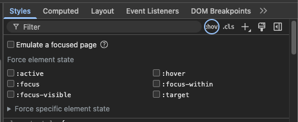
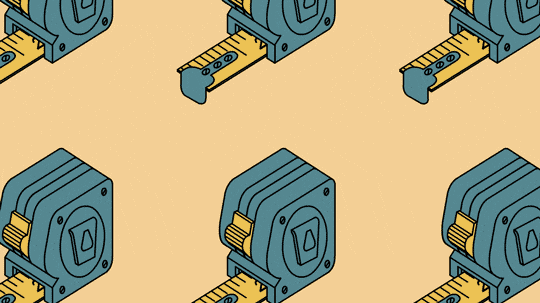
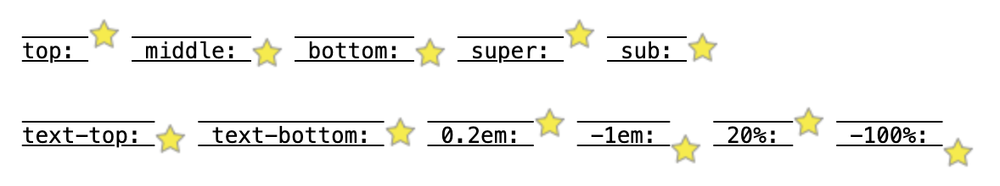
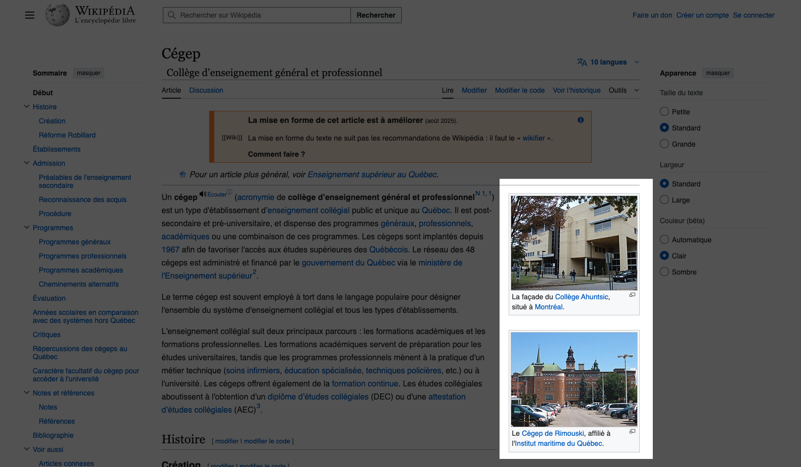
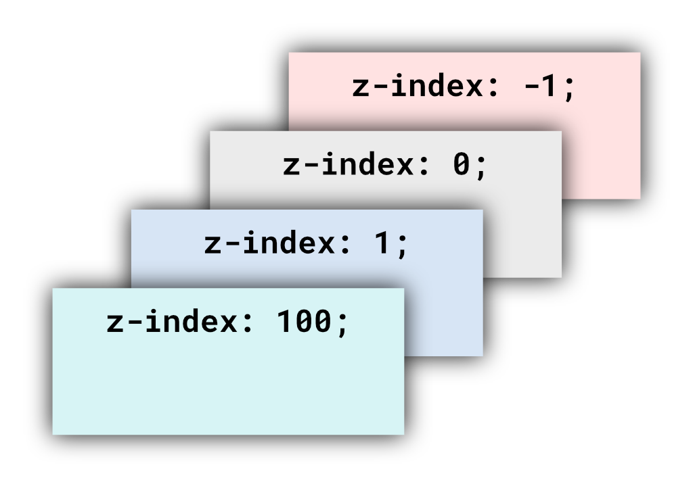

# Cours 10

## Rappel de l'inspecteur


* Faire un clic droit sur la souris 🖱️ et choisir l'option **Inspecter**.
* Utiliser le raccourci clavier ⌨️
  * Windows ++ctrl+shift+i++ ou ++f12++
  * Mac ++command+option+i++ ou ++f12++

Dans l'onglet **Elements**, non seulement on voit le DOM, mais on peut : 

* voir les styles de la page
* voir le modèle de boîte
* voir les styles des états interactifs (:hover, :focus, :active) 

{data-zoom-image}

Aussi, rappelez-vous, on peut chercher dans le DOM. Il suffit de faire le raccourci ++ctrl+f++.

!!! tip "Astuce importante"

	Dans la partie des styles, cliquer sur une valeur numérique permet de la modifier, mais ce n'est pas tout ! Appuyer sur les flèches (haut et bas) permet de modifier certaines des valeurs.

	

## Sélecteurs avancés

{.w-100}

### Plus (`A + B`)

Sélectionne **l’élément B qui suit immédiatement A** (dans le même parent).

```html title="HTML"
<p class="note">Note 1</p>
<p class="intro">Intro</p>
<p class="note">Note 2</p>
<p class="note">Note 3</p>
```

```css title="CSS"
/* vise Note 2 */
.intro + .note {
	color: black;
} 
```

### Tilde (`A ~ B`)

Sélectionne **tous les B qui suivent A** (dans le même parent), pas nécessairement adjacents.

```html title="HTML"
<p class="note">Note 1</p>
<p class="intro">Intro</p>
<p class="note">Note 2</p>
<p class="note">Note 3</p>
```

```css title="CSS"
/* vise Note 2 et Note 3*/
.intro ~ .note {
	color: black;
}
```

### Plus grand que (`A > B`)

Sélectionne **les enfants directs B de A** (pas les petits-enfants).

```html title="HTML"
<ul class="menu">
  <li>
	<a href="#">Lien 1</a>
  </li>
  <li>
	<span>
		<a href="#">Lien 2</a>
	</span>
  </li>
  <li>
	<a href="#">Lien 3</a>
  </li>
</ul>
```

```css title="CSS"
/* Sélectionne Lien 1 et Lien 3 */
li > a { 
	color: black;
}
```

## Propriété `overflow`

{.w-100}

La propriété [`overflow`](https://developer.mozilla.org/fr/docs/Web/CSS/overflow) définit comment gérer le dépassement du contenu d'un élément dans son bloc.

| Propriété                 | Effet                                         |
| ------------------------- | --------------------------------------------- |
| `overflow: visible;`      | (défaut) Le contenu déborde et reste visible. |
| `overflow: hidden;`       | Le contenu excédentaire est **coupé**.        |
| `overflow: scroll;`       | Toujours afficher des barres de défilement.   |
| `overflow: auto;`         | Affiche des barres **si nécessaire**.         |
| `overflow-x / overflow-y` | Axe spécifique (horizontal/vertical).         |

```css
.carte {
  width: 240px;
  height: 140px;
  padding: 12px;
  overflow: auto; /* Affiche les scrollbars si ça déborde */
}
```

<iframe class="aspect-4-3" height="300" style="width: 100%;" scrolling="no" title="Web 1 - CSS overflow" src="https://codepen.io/tim-momo/embed/vELzBod?default-tab=&editable=true&theme-id=50173" frameborder="no" loading="lazy" allowtransparency="true">
      See the Pen <a href="https://codepen.io/tim-momo/pen/vELzBod">
  Web 1 - CSS overflow</a> by TIM Montmorency (<a href="https://codepen.io/tim-momo">@tim-momo</a>)
  on <a href="https://codepen.io">CodePen</a>.
</iframe>

### text-overflow

La propriété [`text-overflow`](https://developer.mozilla.org/fr/docs/Web/CSS/text-overflow) définit le comportement du contenu textuel qui dépasse son contenant.

La valeur la plus utilisée est `ellipsis`. Elle permet de tronquer le texte et d'ajouter un `…` à la fin de la chaîne de caractères.

```css
.tronque {
  width: 16rem;
  white-space: nowrap;
  overflow: hidden;
  text-overflow: ellipsis; /* Affiche … si ça déborde */
}
```

## Propriété `box-sizing`

{.w-100}

La propriété CSS [`box-sizing`](https://developer.mozilla.org/fr/docs/Web/CSS/box-sizing) définit la façon dont la hauteur et la largeur totale d'un élément sont calculées.

| Valeur        | Description |
| ------------- | ----------- |
| `content-box` | valeur par défaut, largeur **exclut** padding et border |
| `border-box`  | largeur **inclut** padding et border (**recommandée** 👌) |

<iframe height="300" style="width: 100%;" scrolling="no" title="Web 1 - CSS border-box" src="https://codepen.io/tim-momo/embed/pvgZLxN?default-tab=&editable=true&theme-id=50173" frameborder="no" loading="lazy" allowtransparency="true">
      See the Pen <a href="https://codepen.io/tim-momo/pen/pvgZLxN">
  Web 1 - CSS border-box</a> by TIM Montmorency (<a href="https://codepen.io/tim-momo">@tim-momo</a>)
  on <a href="https://codepen.io">CodePen</a>.
</iframe>

!!! tip "Pourquoi se casser la tête"

	Ajoutez systématiquement ce style dans vos projets. Ça évite beaucoup de problèmes quant aux hauteurs et largeurs des éléments de la page.

	```css
	* {
	  box-sizing: border-box;
	}
	```

## Propriété `vertical-align`

La propriété [vertical-align](https://developer.mozilla.org/fr/docs/Web/CSS/vertical-align) définit l'alignement vertical d'un élément en display inline, inline-block ou table-cell.

Valeurs : `baseline`, `top`, `middle`, `bottom`, `text-top`, `text-bottom`, `super`, `sub`.

<iframe height="300" style="width: 100%;" scrolling="no" title="Vertical-align" src="https://codepen.io/tim-momo/embed/abjYQNP?default-tab=&editable=true&theme-id=50173" frameborder="no" loading="lazy" allowtransparency="true">
      See the Pen <a href="https://codepen.io/tim-momo/pen/abjYQNP">
  Vertical-align</a> by TIM Montmorency (<a href="https://codepen.io/tim-momo">@tim-momo</a>)
  on <a href="https://codepen.io">CodePen</a>.
      </iframe>

C'est souvent utile pour aligner des images dans un texte. Voici un [exemple](https://developer.mozilla.org/fr/docs/Web/CSS/vertical-align#alignement_vertical_sur_une_bo%C3%AEte_de_ligne) : 



!!! warning "4px"

    N'oubliez pas que les éléments en `display: inline-block;` ont un espace à droite de `4px`.
    
    Il n'est donc pas possible d'aligner deux inline-block de 50% de large un à côté de l'autre. Il faut souvent réduire la taille des colonnes.

## Propriété `float` ☁️

La propriété `float` permet à un élément de flotter à gauche ou à droite à l'intérieur de son conteneur. Elle permet aussi au texte et aux autres éléments en ligne de s’**enrouler** autour.

```css title="Syntaxe"
img.flotte-juste-pas {
  float: none; /* par défaut */
}

img.flotte-a-droite {
  float: right;
}

img.flotte-a-gauche {
  float: left;
}
```

<iframe class="aspect-2-1" height="300" style="width: 100%;" scrolling="no" title="Float" src="https://codepen.io/tim-momo/embed/XWBYPjO?default-tab=&editable=true&theme-id=50173" frameborder="no" loading="lazy" allowtransparency="true">
      See the Pen <a href="https://codepen.io/tim-momo/pen/XWBYPjO">
  Float</a> by TIM Montmorency (<a href="https://codepen.io/tim-momo">@tim-momo</a>)
  on <a href="https://codepen.io">CodePen</a>.
</iframe>

!!! info "Wikipedia"

	La notion de `float` est omniprésente sur le site Wikipedia.org

	{data-zoom-image .w-25}

### Propriété `clear`

Empêche un élément de monter à côté d’un float.

```css
.clear-left  {
  clear: left;
}

.clear-right {
  clear: right;
}

.clear-both {
  clear: both;
}
```

<iframe height="300" style="width: 100%;" scrolling="no" title="Float" src="https://codepen.io/tim-momo/embed/ogbPgNQ?default-tab=&editable=true&theme-id=50173" frameborder="no" loading="lazy" allowtransparency="true">
      See the Pen <a href="https://codepen.io/tim-momo/pen/ogbPgNQ">
  Float</a> by TIM Montmorency (<a href="https://codepen.io/tim-momo">@tim-momo</a>)
  on <a href="https://codepen.io">CodePen</a>.
</iframe>

## Propriété `position`

La propriété [`position`](https://developer.mozilla.org/fr/docs/Web/CSS/position) définit la façon dont un élément est positionné. Les propriétés `top`, `right`, `bottom`, `left` déterminent son emplacement final.

Par défaut, les éléments ont `position: static`. Ils suivent le [**flow**](https://developer.mozilla.org/fr/docs/Web/CSS/CSS_display/Flow_layout) de la page et ne répondent pas aux propriétés `top`, `right`, `bottom` et `left`.

```css
p {
  position: static; /* Par défaut */
}
```

<iframe height="300" style="width: 100%;" scrolling="no" title="Web 1 - CSS static" src="https://codepen.io/tim-momo/embed/LEGJPgx?default-tab=&editable=true&theme-id=50173" frameborder="no" loading="lazy" allowtransparency="true">
      See the Pen <a href="https://codepen.io/tim-momo/pen/LEGJPgx">
  Web 1 - CSS static</a> by TIM Montmorency (<a href="https://codepen.io/tim-momo">@tim-momo</a>)
  on <a href="https://codepen.io">CodePen</a>.
      </iframe>

### `relative`

L’élément occupe l’espace normal, mais il peut être **décalé** visuellement avec les propriétés `top`, `right`, `bottom` et `left`.

```css
.exemple-de-position-relative {
	position: relative;
	top: 10px;
	left: 10px;
}
```

<iframe height="300" style="width: 100%;" scrolling="no" title="Web 1 - CSS sticky" src="https://codepen.io/tim-momo/embed/MYKqgox?default-tab=&editable=true&theme-id=50173" frameborder="no" loading="lazy" allowtransparency="true">
      See the Pen <a href="https://codepen.io/tim-momo/pen/MYKqgox">
  Web 1 - CSS sticky</a> by TIM Montmorency (<a href="https://codepen.io/tim-momo">@tim-momo</a>)
  on <a href="https://codepen.io">CodePen</a>.
      </iframe>

#### Propriété `z-index`

{data-zoom-image .w-33}

Maintenant qu'on parle de positionnement et de chevauchement, il est temps de parler du concept de profondeur.

La propriété [`z-index`](https://developer.mozilla.org/fr/docs/Web/CSS/z-index) définit la profondeur d'un élément **positionné** en `relative`, `absolute`, `fixed` ou `sticky`. 

Plus le chiffre du `z-index` est bas (les négatifs sont permis), plus son ordre d'affichage sera vers l'arrière.

```css
.salut { 
	position: relative; 
	z-index: 10; 
}
.bonjour { 
	position: relative; 
	z-index: 20; 
}
```

### `absolute`

Les éléments en `position: absolute` quittent le flow de la page et se positionnent par rapport à l’ancêtre **positionné** le plus proche. 

```html
<div class="une-position-relative">
	
</div>
```

```css
.une-position-relative {
	position: relative;
}

img {
	position: absolute;

	top: 0;
	left: 0;
	z-index: 1;
}
```

<iframe class="aspect-4-3" height="300" style="width: 100%;" scrolling="no" title="Web 1 - CSS width" src="https://codepen.io/tim-momo/embed/MYKBMLp?default-tab=&editable=true&theme-id=50173" frameborder="no" loading="lazy" allowtransparency="true">
      See the Pen <a href="https://codepen.io/tim-momo/pen/MYKBMLp">
  Web 1 - CSS width</a> by TIM Montmorency (<a href="https://codepen.io/tim-momo">@tim-momo</a>)
  on <a href="https://codepen.io">CodePen</a>.
</iframe>

### `fixed`

Semblable à `absolute`, mais **référencé au viewport** (la fenêtre). Reste fixe au défilement.

<iframe height="300" style="width: 100%;" scrolling="no" title="Web 1 - CSS fixed" src="https://codepen.io/tim-momo/embed/ZYQjgdm?default-tab=&editable=true&theme-id=50173" frameborder="no" loading="lazy" allowtransparency="true">
      See the Pen <a href="https://codepen.io/tim-momo/pen/ZYQjgdm">
  Web 1 - CSS fixed</a> by TIM Montmorency (<a href="https://codepen.io/tim-momo">@tim-momo</a>)
  on <a href="https://codepen.io">CodePen</a>.
</iframe>

### `sticky`

Se comporte comme `static` **puis** devient fixe **lorsque** le défilement atteint la valeur de `top`/`left`/`right`/`bottom`.  

<iframe height="300" style="width: 100%;" scrolling="no" title="Web 1 - CSS sticky" src="https://codepen.io/tim-momo/embed/WbrgerJ?default-tab=&editable=true&theme-id=50173" frameborder="no" loading="lazy" allowtransparency="true">
      See the Pen <a href="https://codepen.io/tim-momo/pen/WbrgerJ">
  Web 1 - CSS sticky</a> by TIM Montmorency (<a href="https://codepen.io/tim-momo">@tim-momo</a>)
  on <a href="https://codepen.io">CodePen</a>.
</iframe>

!!! warning "Quelques considérations"

	Pour que ça fonctionne, il faut que le parent ait une hauteur plus grande que l'enfant en sticky.

    Il faut aussi spécifier la valeur `top`
	
	Finalement, aucun ancêtre doit avoir la propriété `overflow` configurée à autre chose que `visible` ou `clip`.

## Exercices

<div class="grid grid-1-2" markdown>
  

  <small>Exercice interactif - CSS</small><br>
  **[Sélecteurs avancés, mais tout aussi pulpeux](./exercices/diner-fin/index.md){.stretched-link .back}**
</div>

<div class="grid grid-1-2" markdown>
  

  <small>Exercice interactif - CSS</small><br>
  **[Schrödinger](./exercices/schrodinger/index.md){.stretched-link .back}**
</div>

<div class="grid grid-1-2" markdown>
  

  <small>Exercice interactif - Inspecteur</small><br>
  **[Unlock](./exercices/unlock/index.md){.stretched-link .back}**
</div>

<div class="grid grid-1-2" markdown>
  

  <small>Exercice - CSS</small><br>
  **[Mr. Sandwich](./exercices/mr-sandwich/index.md){.stretched-link .back}**
</div>

<div class="grid grid-1-2" markdown>
  

  <small>Exercice - CSS</small><br>
  **[Firewatch](./exercices/firewatch/index.md){.stretched-link .back}**
</div>
