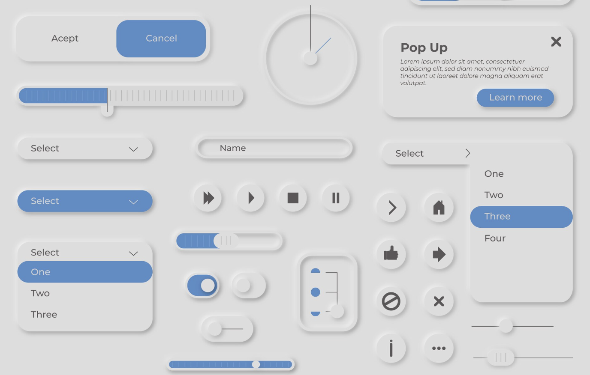

# Cours 11

*[BEM]: Block Element Modifier

## Hygiène CSS

{.w-100}

Lorsqu'on écrit des classes CSS, on peut écrire n'importe quoi et la fonctionnalité ne sera pas affectée. Par contre, à la lecture, il est intéressant de comprendre ce que fait le style, sinon c'est plus laborieux.

<div class="grid" markdown>
<div>
```html title="HTML"
<div class="asdfasdf">
🤷
</div>
```
```css title="CSS"
.asdfasdf {
	width: 100%;
	height: 30vh;
	position: relative;
	background: #ccc;
	padding: 15px;
	margin: 1rem auto;
}
```
</div>

<div markdown>
```html title="HTML"
<div class="slideshow">
👌
</div>
```
```css title="CSS"
.slideshow {
	width: 100%;
	height: 30vh;
	position: relative;
	background: #ccc;
	padding: 15px;
	margin: 1rem auto;
}
```
</div>
</div>

## BEM

{.w-50}

BEM (Block Element Modifier), c’est une façon de nommer les classes CSS pour que le code reste clair et organisé.

```css title="Syntaxe"
.block {

}

.block__element {

}

.block__element--modifier {

}
```

### Bloc

{.w-100 data-zoom-image}

Un _block_, c’est une composante. 

> Les composantes... vous vous souvenez ? Dans le [cours 1](./cours01.md)

Exemple : une carte, un menu, un bouton, un formulaire.

```html title="Exemple" 
<div class="card">
	...
</div>
```

### Élément

{.w-100 data-zoom-image}

Un _element_, c’est une partie du bloc qui n’a pas de sens tout seul.

Exemple : le titre, l’image ou le bouton d’une carte.

```html
<div class="card">
  <h2 class="card__title">Titre</h2>
  <p class="card__text">Texte descriptif</p>
</div>
```

### Modificateur

{.w-100 data-zoom-image}

Un _modifier_, c’est une variante du block ou de l’élément.

Exemple : une carte “active”, un bouton “rouge”, un titre “grand”.

```html
<div class="card card--shadow">
  <h2 class="card__title card__title--large">Titre</h2>
</div>
```

`--shadow` et `--large` indiquent des versions différentes, sans créer un nouveau composant.

## _utility-first_

{.w-100}

> Pas facile de le franciser celui-là.

En « utility-first », au lieu de créer des classes pour des composantes, on utilise plein de petites classes "utilitaires" qui font une seule chose chacune. 

Présentement, c'est ce qui est le plus utilisé en entreprise, mais ça prends son sens seulement quand on travaille avec des technologies un peu plus haut niveau que ce qu'on fait en Web 1. Voici tout de même le concept.

<div class="grid align-items-start" markdown>
<div markdown>
BEM
```html title="HTML"
<button class="btn">
  Envoyer
</button>
```
```css title="CSS"
.btn {
  background-color: #007bff;
  color: white;
  padding: 0.5rem 1rem;
  border-radius: 0.5rem;
}
```
</div>

<div markdown>
_utility-first_
```html title="HTML"
<button class="bg-blue color-white p-2 rounded">
  Envoyer
</button>
```
```css title="CSS"
.bg-blue { 
  background-color: #007bff; 
}
.color-white {
  color: white;
}
.p-2 {
  padding: 0.5rem;
}
.rounded { 
  border-radius: 0.5rem;
}
```
</div>
</div>

En _utility-first_, on composer le design directement dans le HTML, un peu comme avec des LEGO.

!!! success "Bref"

	L'important c'est surtout d'écrire les classes (_class_) et les identifiants (_id_) pour qu'on comprenne ce qu'ils font.

## Imbrication CSS

{.w-100}

L'imbrication CSS (ou [_CSS nesting_](https://developer.mozilla.org/en-US/docs/Web/CSS/CSS_nesting/Using_CSS_nesting)) est une technique d'organisation du CSS. Elle permet d'imbriquer des classes entre elles afin de visualiser l'aspect hiérarchique. 

Par exemple, un style de card conventionnel pourrait ressembler à ceci : 

```css
.card {
	padding: 2rem;
	border-radius: 1rem;
	background-color: #444;
}
.card .card--title {
	font-size: 26px;
	font-weight: bold;
	font-family: sans-serif;
	margin: 0;
}
.card .card--title.card--title__light {
	color: greenyellow;
}
```

La version imbriquée ressemblerait à ceci : 

<iframe class="aspect-16-9" height="300" style="width: 100%;" scrolling="no" title="Web 1 - CSS absolute" src="https://codepen.io/tim-momo/embed/YPwMRLm?default-tab=css%2Cresult&editable=true&theme-id=50210" frameborder="no" loading="lazy" allowtransparency="true">
      See the Pen <a href="https://codepen.io/tim-momo/pen/YPwMRLm">
  Web 1 - CSS absolute</a> by TIM Montmorency (<a href="https://codepen.io/tim-momo">@tim-momo</a>)
  on <a href="https://codepen.io">CodePen</a>.
</iframe>

!!! example "&"

    L'esperluette (&) représente le sélecteur parent (le sélecteur courant).

    ```css title="Exemple"
    .card {
      &.active  { /* identique à : .card.active  */ }
      & img     { /* identique à : .card img     */ }
      &:hover   { /* identique à : .card:hover   */ }
      & + &     { /* identique à : .card + .card */ }
    }
    ```

## aspect-ratio

<iframe class="aspect-16-9" height="300" style="width: 100%;" scrolling="no" title="Ratios" src="https://codepen.io/tim-momo/embed/myVgaWR/7e03846f6e45644eb57a76b953f7d11c?default-tab=result&theme-id=50173" frameborder="no" loading="lazy" allowtransparency="true">
      See the Pen <a href="https://codepen.io/tim-momo/pen/myVgaWR/7e03846f6e45644eb57a76b953f7d11c">
  Ratios</a> by TIM Montmorency (<a href="https://codepen.io/tim-momo">@tim-momo</a>)
  on <a href="https://codepen.io">CodePen</a>.
</iframe>

Le ratio d’image décrit la forme d’une image, c’est-à-dire la relation entre sa largeur et sa hauteur. Ils sont normalement écris de la manière suivante : 

* 1:1
* 4:3
* 16:9

En CSS, la propriété CSS [aspect-ratio](https://developer.mozilla.org/fr/docs/Web/CSS/Reference/Properties/aspect-ratio) définit un ratio d'affichage. Au lieu d'avoir un ":" pour réparer les chiffres, en css on écrit un slash "/".

```css
.mon-style {
	aspect-ratio: 16 / 9;
}
```

<iframe height="300" style="width: 100%;" scrolling="no" title="Web 1 - Nested" src="https://codepen.io/tim-momo/embed/dPGLQgx?default-tab=result&editable=true&theme-id=50173" frameborder="no" loading="lazy" allowtransparency="true">
      See the Pen <a href="https://codepen.io/tim-momo/pen/dPGLQgx">
  Web 1 - Nested</a> by TIM Montmorency (<a href="https://codepen.io/tim-momo">@tim-momo</a>)
  on <a href="https://codepen.io">CodePen</a>.
</iframe>

### ratio et images

Si on veut que les images conservent leur ratio original peu importe la configuration css, il suffit d'inscrire les dimensions de l'image en html. Ex :

```html

```

<iframe height="300" style="width: 100%;" scrolling="no" title="Web 1 - Aspect images" src="https://codepen.io/tim-momo/embed/pvgBQYa?default-tab=result&editable=true&theme-id=50173" frameborder="no" loading="lazy" allowtransparency="true">
      See the Pen <a href="https://codepen.io/tim-momo/pen/pvgBQYa">
  Web 1 - Aspect images</a> by TIM Montmorency (<a href="https://codepen.io/tim-momo">@tim-momo</a>)
  on <a href="https://codepen.io">CodePen</a>.
</iframe>

## opacity

{ .w-100 }

La propriété `opacity` ressemble à ce que fait [rgba](https://www.w3schools.com/colors/colors_rgb.asp) pour la couleur. Elle permet de gérer l'opacité d'un élément. Une valeur de `0` correspond à une transparence complète, tandis qu'une valeur de `1` correspond à une opacité complète.

Important à savoir, ça affecte aussi les enfants (héritée visuellement).

```css
.mon-style {
  opacity: 0.5;
}
```

<iframe height="300" style="width: 100%;" scrolling="no" title="Web 1 - Aspect" src="https://codepen.io/tim-momo/embed/pvgBqKq?default-tab=result&theme-id=50173" frameborder="no" loading="lazy" allowtransparency="true">
      See the Pen <a href="https://codepen.io/tim-momo/pen/pvgBqKq">
  Web 1 - Aspect</a> by TIM Montmorency (<a href="https://codepen.io/tim-momo">@tim-momo</a>)
  on <a href="https://codepen.io">CodePen</a>.
      </iframe>

## box-shadow

La propriété CSS [box-shadow](https://developer.mozilla.org/fr/docs/Web/CSS/Reference/Properties/box-shadow) fonctionne un peu comme le text-shadow. 

Ça ajoute des ombres à un élément. Ils peuvent être en flou ou pas et peuvent être à l'intérieur ou à l'extérieur

```css
.mon-style {
  box-shadow: 10px 10px red;
  /* ou */
  box-shadow: 0 0 10px red;
  /* ou */
  box-shadow: inset 5px 5px 5px red;
  /* ou */
  box-shadow: 10px 10px red, 20px 20px blue;
}
```

<iframe height="300" style="width: 100%;" scrolling="no" title="Web 1 - Box-shadow" src="https://codepen.io/tim-momo/embed/EaPJGrj?default-tab=result&theme-id=50173" frameborder="no" loading="lazy" allowtransparency="true">
      See the Pen <a href="https://codepen.io/tim-momo/pen/EaPJGrj">
  Web 1 - Box-shadow</a> by TIM Montmorency (<a href="https://codepen.io/tim-momo">@tim-momo</a>)
  on <a href="https://codepen.io">CodePen</a>.
      </iframe>

<div class="grid grid-1-2" markdown>
  

  <small>Outil</small><br>
  **[Générateur d'ombre portée](https://neumorphism.io/#e0e0e0){.stretched-link}**
</div>

## Raccourcis clavier

{.w-100}

* Sélectionner tout le texte : ++ctrl+a++
* Sauvegarder : ++ctrl+s++
* Annuler (Undo) : ++ctrl+z++
* Refaire (Redo) : ++ctrl+shift+z++ ou ++ctrl+y++
* Copier : ++ctrl+c++
* Couper : ++ctrl+x++
* Coller : ++ctrl+v++
* Coller sans mise en forme : ++ctrl+shift+v++
* Ouvrir un onglet fermé : ++ctrl+shift+t++
* Changer d’application ouverte (_task switcher_) : ++alt+tab++
* Chercher : ++ctrl+f++

!!! info "Mac"

	La plupart du temps, les variations :simple-apple: pour mac remplacent ++ctrl++ par ++command++.

## Prochain cours : examen 02

!!! example "Révision avec le prof 🧑‍🏫"

## Exercices

<div class="grid grid-1-2" markdown>
  

  <small>Exercice - CSS</small><br>
  **[Néomorphisme](./exercices/neomorphisme/index.md){.stretched-link .back}**
</div>

<div class="grid grid-1-2" markdown>
  

  <small>Exercice de révision CSS</small><br>
  **[Priorités](./exercices/priorites/index.md){.stretched-link .back}**
</div>

<div class="grid grid-1-2" markdown>
  

  <small>Exercice - CSS</small><br>
  **[Discord](./exercices/discord/index.md){.stretched-link .back}**
</div>

<div class="grid grid-1-2" markdown>
  

  <small>Exercice - CSS</small><br>
  **[Discord, la suite](./exercices/discord-suite/index.md){.stretched-link .back}**
</div>


[STOP]

Note : Ajouter la notion de visibility. Elle n'a pas été traitée dans le cours 🤷