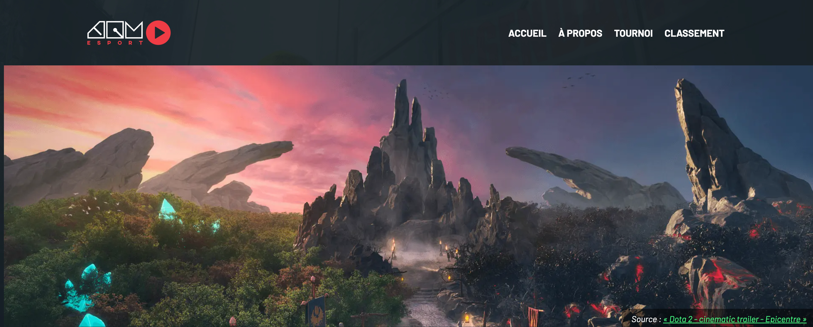
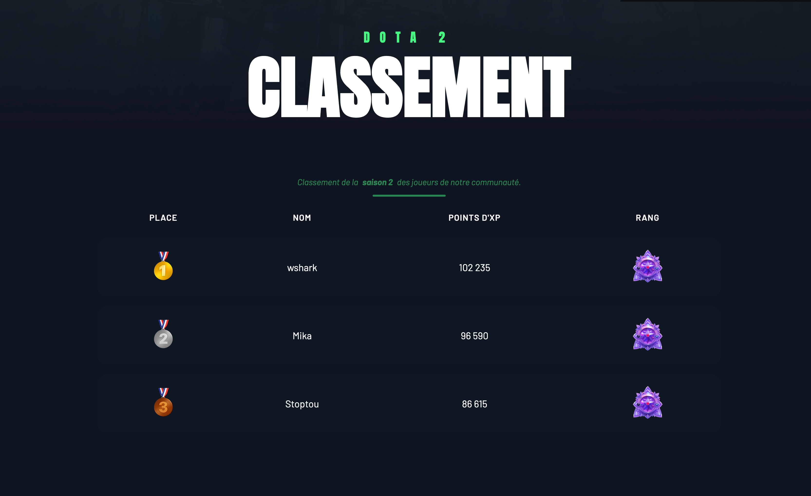

# Dota2

L'objectif est de reproduire un site Web en y ajoutant les bonnes balises HTML.

## Résultat attendu

{data-zoom-image}
{data-zoom-image}
{data-zoom-image}
{data-zoom-image}

## Contenu

> Accueil - À propos - Tournoi - Classement
> 
> Source : « Dota 2 - cinematic trailer - Epicentre » : https://www.youtube.com/watch?v=dTYMQTtA1_4
> 
> Dota 2 Classement
> 
> Classement de la saison 2 des joueurs de notre communauté. 
> Place - Nom - Points d'XP - Rang 
> 🥇 - wshark - 102 235 
> 🥈 - Mika - 96 590 
> 🥉 - Stoptou - 86 615
> 
> Inscriptions ! 
> Participez à nos tournois et grimpez dans le classement. 
> Courriel 
> Contactez-nous
> 
> C'était pas si pire finalement ;) 
> - Anonyme
> 
> Web 1 - Examen 1

## Consignes

Mise en place

- [ ] Télécharger le [dossier de départ](./exam_depart.zip)
- [ ] Dans le fichier index.html, ajouter une structure HTML de base
- [ ] Dans la portion `<head>`, ajouter le `title` : « TIM eSport »
- [ ] Toujours dans la portion `<head>`, ajoutez la balise `<link rel="stylesheet" href="style.css">`

Entête

- [ ] Dans la portion `<body>`, ajouter une balise sémantique d'entête
- [ ] Dans l'entête, ajouter l'image `logo.png`
- [ ] Dans l'entête, ajouter une navigation. Dans celle-ci, ajouter une liste non ordonnée de liens. La destination des liens doit être simplement le caractère « / »

Contenu principal

- [ ] Dans la portion `<body>`, ajouter une balise sémantique de contenu principal
- [ ] Dans le contenu principal, ajouter une **figure** avec l'image `banner.webp` et la légende de figure comme dans le résultat attendu
- [ ] Dans le contenu principal, ajouter un paragraphe avec un attribut `class` « surtitre » et le contenu « Dota 2 »
- [ ] Dans le contenu principal, ajouter un titre 1 avec le contenu « Classement »
- [ ] Dans le contenu principal, ajouter un tableau html. Il doit comprendre une légende de tableau, une section d'entête et une section de corps
  - [ ] Dans la légende du tableau, mettre la partie « saison 2 » en gras
  - [ ] L'image dans la colonne de droite est `diamond.png`
- [ ] Dans le contenu principal, ajouter une **section** avec un attribut `class` « join-us »
  - [ ] Ajouter un titre 2 pour la mention « Inscriptions ! »
  - [ ] Ajouter un paragraphe pour la partie « Participez à nos tournois ... »
  - [ ] Ajouter un formulaire avec champ courriel obligatoire et son étiquette correctement associée. Ajouter le placeholder « exemple@domaine.com »
  - [ ] Ajotuer un bouton « Contactez-nous » avec un attribut `class` « btn »

Pied de page

- [ ] Dans la portion `<body>`, ajouter une balise sémantique de pied de page
- [ ] Dans le pied de page, ajouter un bloc de citation
  - [ ] Ajouter un paragraphe
  - [ ] Ajouter la bonne balise pour spécifier l'auteur de la citation « - Anonyme »
- [ ] Dans le pied de page, ajouter un paragraphe pour la mention « Web 1 - Examen 1 »

## Remise

Remettre dans Teams le dossier en format `zip` avec la nomenclature suivante : `nomfamille-prenom_examen01.zip`

## Critères d'évaluation

| Section                 | Critère (observable et mesurable)                                | Points |
|-------------------------|------------------------------------------------------------------|--------|
| Général                 | Respect des consignes                                            |   2    |
| Général                 | Qualité du code                                                  |   2    |
| Mise en place           | Titre du document                                                |   2    |
| Mise en place           | Styles chargés                                                   |   2    |
| Navigation              | Logo                                                             |   2    |
| Navigation              | Navigation                                                       |   2    |
| Navigation              | Liste                                                            |   2    |
| Navigation              | Liens de navigation                                              |   2    |
| Introduction            | Bannière                                                         |   2    |
| Introduction            | Figure et légende                                                |   2    |
| Introduction            | Surtitre                                                         |   2    |
| Introduction            | Titre 1                                                          |   2    |
| Tableau de classement   | Tableau                                                          |   2    |
| Tableau de classement   | Légende du tableau                                               |   2    |
| Tableau de classement   | Texte en gras                                                    |   2    |
| Tableau de classement   | En-tête du tableau                                               |   2    |
| Tableau de classement   | Corps du tableau                                                 |   2    |
| Tableau de classement   | Image                                                            |   2    |
| Section inscription     | Section avec attribut                                            |   2    |
| Section inscription     | Titre 2                                                          |   2    |
| Section inscription     | Paragraphe                                                       |   2    |
| Section inscription     | Formulaire                                                       |   2    |
| Section inscription     | Champ courriel obligatoire                                       |   2    |
| Section inscription     | Étiquette liée au champ courriel                                 |   2    |
| Section inscription     | Placeholder                                                      |   2    |
| Section inscription     | Bouton avec attribut                                             |   2    |
| Pied de page            | Zone de pied de page                                             |   2    |
| Pied de page            | Bloc de citation                                                 |   2    |
| Pied de page            | L’auteur cité                                                    |   2    |
| Pied de page            | Paragraphe final                                                 |   2    |
| **TOTAL**               |                                                                  | **60** |
