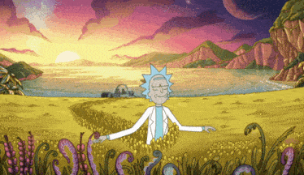

# Examen 1

  

  <small>Première partie - 40 %</small> 
  **[Questionnaire à choix multiples](https://forms.office.com/r/Lu7X6iMrLn?origin=lprLink){.stretched-link}**

  

  <small>Deuxième partie - 60 %</small> 
  **[Dota](./dota/index.md){.stretched-link .back}**

