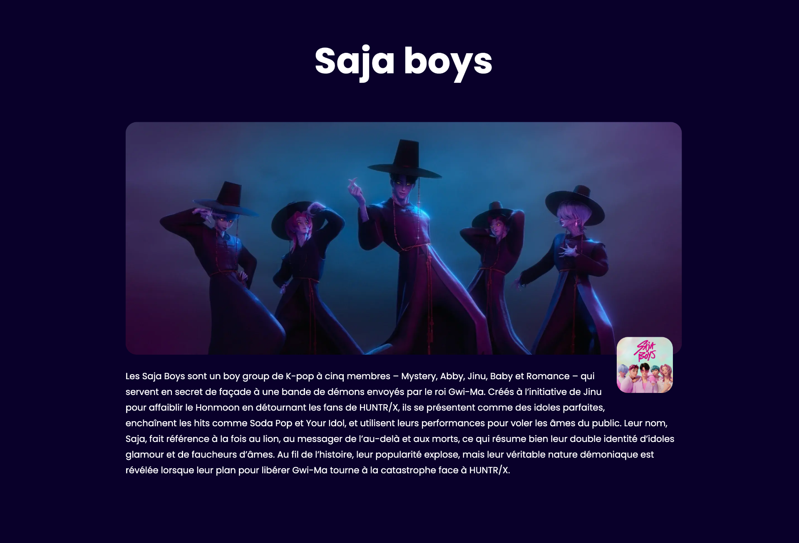

# Soda pop

L'objectif est de reproduire un site Web en y ajoutant les bons styles CSS.

## Résultat attendu

{data-zoom-image}

## Consignes

Mise en place :

- [ ] Télécharger le [dossier de départ](./soda-pop-depart.zip)
- [ ] Extraire le contenu du dossier zip
- [ ] Ouvrir le dossier extrait dans VSCode

Le reste des consignes sera à faire dans le fichier `style.css`

### Général

- [ ] Ajouter la police de caractères [Poppins](https://fonts.google.com/specimen/Poppins) sur Google Fonts
- [ ] Sur tous les éléments du site, appliquer la propriété `box-sizing` à la valeur `border-box`

Sur la balise **`body`**, appliquer les styles suivants :

- [ ] Couleur de fond `#09002A`
- [ ] Couleur de texte en blanc
- [ ] Police de caractères `Poppins`
- [ ] Un interlignage de `1.75`
- [ ] Aucune marge

Sur le **titre 1**, appliquer les styles suivants : 

- [ ] Taille du texte à `9vw`
- [ ] Tout en majuscule
- [ ] Un interlignage de `0.8`
- [ ] Police de caractères `Huntrix`
- [ ] Une ombre portée du texte de 10px à droite, 10px en bas, 10px de flou et de la couleur `#19002A`
- [ ] Retirer toutes les marges sauf celle du bas qui doit être de `1.5rem`
    
Sur les **titres 2**, appliquer les styles suivants :

- [ ] Taille du texte à `4rem`
- [ ] Texte aligné au centre

Sur les **titres 3**, appliquer le style suivant :

- [ ] Taille du texte à `2.5rem`

Sur les **liens** de la page, appliquer les styles suivants :

- [ ] Couleur de texte en blanc
- [ ] Retirer la ligne sous le lien

- [ ] Lorsqu'on glisse la souris sur les liens, afficher la ligne en dessous

Sur la classe **`btn`**, appliquer les styles suivants :

- [ ] Texte en gras
- [ ] Couleur de texte `#f0d354`
- [ ] Couleur de fond `#524511`
- [ ] Un padding vertical de `15px` et horizontal de `30px`
- [ ] Une bordure de `2px` de couleur `#f0d354`
- [ ] Coins arrondis de `5px`

### Balise `header`

{data-zoom-image}

Sur la balise **`header`**, appliquer les styles suivants :

- [ ] Une position à `fixed`
- [ ] Un `z-index` à `10`
- [ ] Un `top` à `0`
- [ ] Une couleur de fond `#19002A`
- [ ] Largeur de `100%`
- [ ] Alignement du texte au centre
- [ ] Une ombre portée de `0` vers la droite, de `10px` vers le bas, `10px` de flou et une couleur noire à 50% de transparence

Sur l'**image** dans **`header`**, appliquer les styles suivants :

- [ ] Hauteur de `7rem`
- [ ] Display à `block`

Sur **`ul`** dans **`header`**, appliquer les styles suivants :

- [ ] Aucune marge
- [ ] Aucun `padding`
- [ ] Style de liste à `none`

Sur **`li`** dans **`header`**, appliquer les styles suivants :

- [ ] Display à `inline-block`
- [ ] Aucune marge verticale et une marge horizontale de `10px`
- [ ] Alignement vertical au milieu
    
Sur les **liens** dans **`header`**, appliquer les styles suivants :
    
- [ ] Couleur du texte à `#B154F0`
- [ ] Tout en majuscule
    
### Classe `.banner`

{data-zoom-image}

Sur la classe **`banner`**, appliquer les styles suivants :

- [ ] Image de fond `kpop.jpg`
- [ ] Afficher l'image en `cover`
- [ ] Padding vertical à `25vh` et horizontal à `10vw`
- [ ] Une marge en haut de `100px`
    
Sur la classe **`netflix`**, appliquer les styles suivants :

- [ ] Largeur de `70px`
- [ ] Hauteur de `70px`
- [ ] Display à `inline-block`
- [ ] Alignement vertical au milieu
- [ ] Une marge à droite de `10px`

### Classe `.huntrx`

{data-zoom-image}

Sur la classe **`huntrx`**, appliquer les styles suivants :

- [ ] Un padding vertical de `5rem` et horizontal de `10vw`
- [ ] Un dégradé linéaire orienté vers le haut à droite allant de `#80051B` à `#28247D` puis `#245B7A`
- [ ] Une bordure en haut et en bas de `1px` de couleur `#371152`
- [ ] Position `relative`

Sur la classe **`derpy`**, appliquer les styles suivants :
 
- [ ] Position `absolute`
- [ ] Un `top` à `0`
- [ ] Un `right` à `0`
- [ ] Une hauteur de `250px`
    
Sur **`p`** dans la classe **`huntrx`**, appliquer les styles suivants :

- [ ] Une opacité à `0.4`
- [ ] Taille du texte à `1.25rem`

Sur la classe **`three-columns`**, appliquer les styles suivants :

- [ ] Largeur de `1200px`
- [ ] Aligner au centre avec la propriété `margin`
- [ ] Aligner le texte au centre

Sur les **images** dans la classe **`three-columns`**, appliquer les styles suivants :

- [ ] Largeur maximale à `100%`
- [ ] Display à `block`
- [ ] Coins arrondis de `20px`
- [ ] Marges verticales de `20px` et aucune marge horizontale

Sur la classe **`column`**, appliquer les styles suivants :

- [ ] Display à `inline-block`
- [ ] Alignement vertical en haut
- [ ] Largeur de `30%`

### Classe `.saja`

{data-zoom-image}

Sur la classe **`saja`**, appliquer les styles suivants :

- [ ] Largeur de `992px`
- [ ] Aligner au centre avec la propriété `margin`
- [ ] Un padding en bas de `100px`

Sur la classe **`saja-group`**, appliquer les styles suivants :
    
- [ ] Largeur maximale de `100%`
- [ ] Coins arrondis de `20px`
    
Sur la classe **`saja-float`**, appliquer les styles suivants :
    
- [ ] Largeur maximale de `100px`
- [ ] Incruster l'image dans le texte par la droite
- [ ] Coins arrondis de `20px`
- [ ] Marge en haut de `-40px`, à droite de `1rem`, en bas de `1rem` et de `0` à gauche.
- [ ] Position `relative`
- [ ] Un `z-index` à `1`
    
## Remise

Remettre dans Teams le dossier en format `zip` avec la nomenclature suivante : `nomfamille-prenom_examen02.zip`
