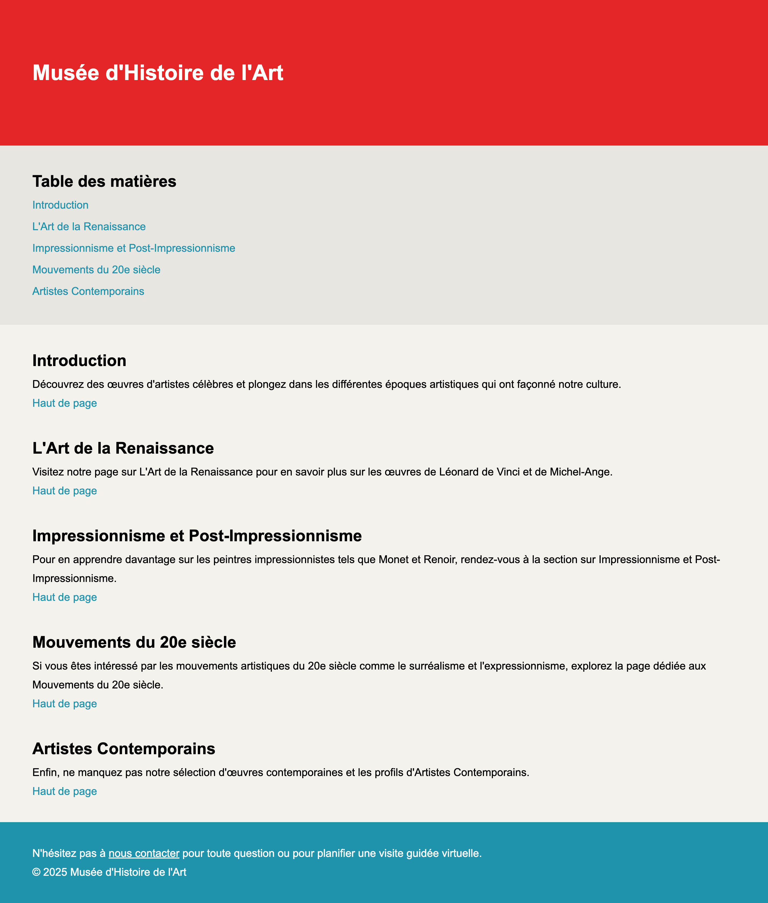

# Ancres

Cet exercice a pour objectif de vous familiariser avec les balises sémantiques en HTML et de vous montrer comment créer des ancres permettant une navigation interne fluide dans une page Web.

{ data-zoom-image }

## Contenu textuel à structurer

> Musée d'Histoire de l'Art
> 
> Table des matières
> 
> Introduction
> 
> L'Art de la Renaissance
> 
> Impressionnisme et Post-Impressionnisme
> 
> Mouvements du 20e siècle
> 
> Artistes Contemporains
> 
> Introduction
> 
> Découvrez des œuvres d'artistes célèbres et plongez dans les différentes époques artistiques qui ont façonné notre culture. Haut de page
> 
> L'Art de la Renaissance
> 
> Visitez notre page sur L'Art de la Renaissance pour en savoir plus sur les œuvres de léonard de Vinci et de Michel-Ange. Haut de page
> 
> Impressionnisme et Post-Impressionnisme
> 
> Pour en apprendre davantage sur les peintres impressionnistes tels que Monet et Renoir, rendez-vous à la section sur Impressionnisme et Post-Impressionnisme. Haut de page
> 
> Mouvements du 20e siècle
> 
> Si vous êtes intéressé par les mouvements artistiques du 20e siècle comme le surréalisme et l'expressionnisme, explorez la page dédiée aux Mouvements du 20e siècle. Haut de page
> 
> Artistes Contemporains
> 
> Enfin, ne manquez pas notre sélection d'œuvres contemporaines et les profils d'Artistes Contemporains. Haut de page
> 
> N'hésitez pas à nous contacter pour toute question ou pour planifier une visite guidée virtuelle.
> © 2025 Musée d'Histoire de l'Art

## Consignes

Structure

- [ ] Créer un nouveau fichier `index.html` dans VSCode avec une structure de base HTML
- [ ] 🪄 Ajouter cette ligne de code dans la portion `<head>` du HTML : `<link rel="stylesheet" href="https://web1.tim-momo.com/exercices/anchors/styles.css">`

Entête

- [ ] Dans la section `<body>`, ajouter une en-tête (`<header>`)
- [ ] Dans l'entête, ajouter le **titre 1** de la page

Navigation 1/2

- [ ] Ensuite, ajoutez une navigation (avec `<nav>`) pour la table des matières
- [ ] Ajouter un **titre 2** à la table des matières
- [ ] Appliquer un identifiant unique au **titre 2**
- [ ] Créer les liens de type ancre pour la table des matières

Sections

- [ ] À l'aide de balises sémantiques, séparez chaque sections
- [ ] Dans chaque section, utilisez des balises **titre 2** et **paragraphe**
- [ ] Appliquer un identifiant unique aux **titre 2** avec l'attribut **id**
- [ ] Configurer les liens « Haut » pour qu'ils pointent vers la table des matières.
- [ ] Vérifier que tous les liens fonctionnent bien

Navigation 2/2

- [ ] Configurer les liens pour qu'ils pointent vers les identifiants uniques dans les sections.

Footer

- [ ] Ajouter le pied de page avec la balise `<footer>`.

[STOP]
