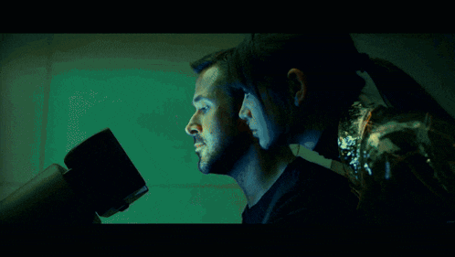
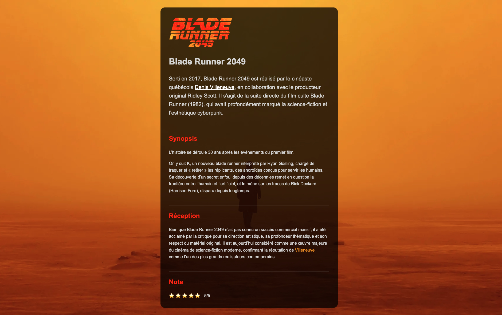

# Blade Runner

{.w-100}

L'objectif de cet exercice est de mettre en pratique l'ensemble des notions CSS apprises dans le cours.

## Résultat attendu

{data-zoom-image}

<!-- [En ligne](https://web1.tim-momo.com/blade-runner/) -->

## Consignes

- [ ] Télécharger le [dossier de départ](./blade-runner-depart.zip){download}
- [ ] Ouvrir le dossier avec vscode

L'objectif ici sera de reproduire à l'identique le résultat attendu sans toucher au HTML. On ne peut écrire que du CSS.

Voici quelques indices pour accomplir l'exercice :

- [ ] L'image de fond `bg.webp` doit être appliquée au `body` avec un `background-size` à `cover`
- [ ] Le main doit faire 600px de large et être centré avec des marges automatiques
- [ ] Le main doit avoir une couleur de fond noire, mais translucide.
- [ ] Le main doit avoir un bon padding et des coins arrondis

- [ ] Le paragraphe d'introduction doit avoir un `font-size` de `20px`

- [ ] Les liens de la page doivent être de la couleur `#EFA000`, sauf ceux dans l'introduction. Ceux-là doivent être blancs.

- [ ] Les titres 2 doivent afficher de l'espacement en haut.
- [ ] Les titres 2 doivent afficher une bordure blanche translucide en haut.
- [ ] Les titres 2 doivent être de la couleur `#FF2700`.

- [ ] Les étoiles doivent s'afficher sur une seule ligne. 
- [ ] La note aussi doit être sur la même ligne. Il faut aussi la "décoller" des étoiles.
