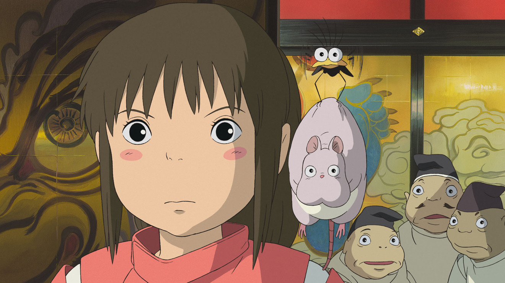
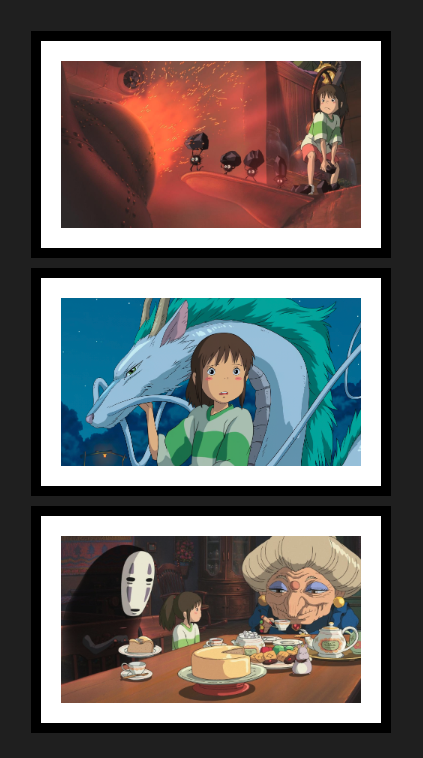

# Le voyage de Chihiro

{.w-100}

L'objectif de cet exercice est d'appliquer les concepts du modèle de boîte et de la propriété `display`.

## Résultat attendu

{data-zoom-image}

## Contenu

[Image 1 :material-download:](./spirited-away-1.png)

[Image 2 :material-download:](./spirited-away-2.png)

[Image 3 :material-download:](./spirited-away-3.png)

## Consignes

- [ ] Écouter le film « [Spirited Away](https://en.wikipedia.org/wiki/Spirited_Away) » 😜

- [ ] Créer un dossier nommé « chihiro »
- [ ] À la racine, créer un fichier `index.html` et un fichier `styles.css`
- [ ] Télécharger les trois images dans un sous dossier `assets/images`

Dans `index.html`

- [ ] Créer une structure HTML de base
- [ ] Lier le fichier `styles.css`
- [ ] Ajouter les trois images avec la balise `img`

Dans `styles.css`

- [ ] Ajouter la couleur de fond `#222` au `body`.

Ajouter les styles suivants sur les images

- [ ] Affichage en **block**
- [ ] Largeur de **300px**
- [ ] Espacement interne (padding) de **20px**
- [ ] Espacement externe (margin) de **10px**
- [ ] Couleur de fond en blanc
- [ ] Une bordure pleine de **10px** en noir
