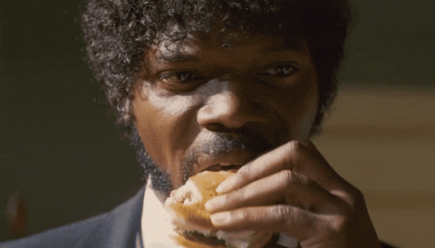

# Sélecteur pulpeux

{.w-100}

L’objectif de cet exercice est de mettre en pratique vos connaissances sur les sélecteurs CSS et leur contexte d’utilisation.

## Consignes

- [ ] Aller à l'adresse : <https://tim-montmorency.com/css-diner/>
- [ ] Compléter les **11** premières étapes