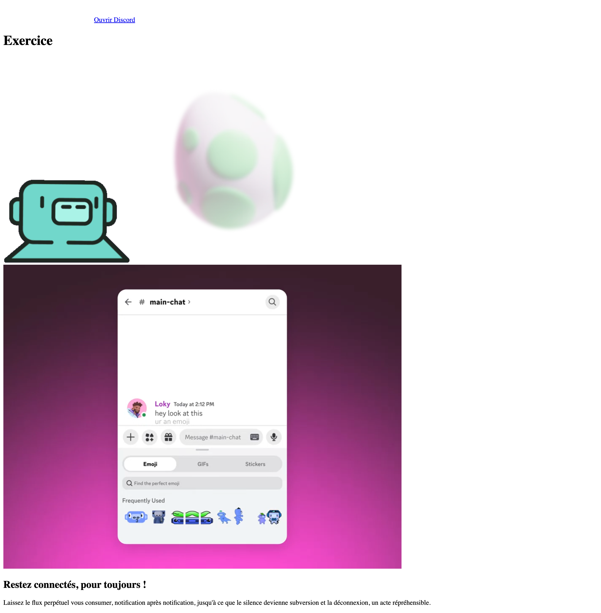

# Discord 

L'objectif de cet exercice est de démontrer la connaissance des balises et des propriétés CSS à utiliser.

## Résultat attendu

[Site Web](https://web1.tim-momo.com/discord/)

## Consignes

### Préparation

- [ ] Télécharger le [dossier de départ](./discord-depart.zip){ download }
- [ ] Extraire le dossier zip
- [ ] Ouvrir le dossier dézippé « discord-depart » dans vscode

### HTML

- [ ] Dans `index.html`, remplacer les commentaires par les balises et attributs HTML demandés. À effectuer dans l'ordre mentionné.

Résultat : 

{.w-25 data-zoom-image}

### CSS

!!! success "Important"

    À chaque fois qu'une règle CSS est complétée, vérifiez le résultat dans le navigateur pour comprendre son effet sur la mise en page.

- [ ] Dans `styles.css`, remplacer les commentaires css par les bonnes propriétés CSS. À effectuer dans l'ordre des lignes de code.

