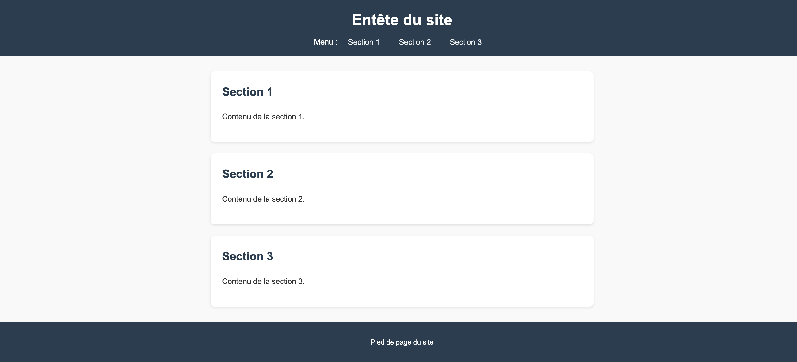

# Fait du sens

{.w-100}

> L'expression « faire du sens » est [déconseillée](https://vitrinelinguistique.oqlf.gouv.qc.ca/23499/les-emprunts-a-langlais/emprunts-syntaxiques/lemprunt-deconseille-faire-du-sens) par l'Office québécois de la langue française. C'est un emprunt à l'anglais. On emploiera alors les expressions « avoir du sens » ou « être sensé », qui permettent d’exprimer la même idée.

L'objectif de cet exercice est d'ajouter du sens à la programmation HTML en modifiant les balises existantes par des balises sémantiques.

[Dossier de départ](./fait-du-sens.zip){ .md-button .md-button--primary }

## Résultat attendu

Si vous modifiez correctement les balises, des styles s'appliqueront automatiquement pour donner un résultat semblable à cette image :

{data-zoom-image}

## Consignes

* [ ] Télécharger le dossier de départ
* [ ] Dézipper le dossier téléchargé
* [ ] Dans le fichier HTML, identifier les balises à modifier et appliquer la correction
* [ ] Comparer votre résultat avec le résultat attendu
* [ ] En levant la main, valider votre code avec l'enseignant
