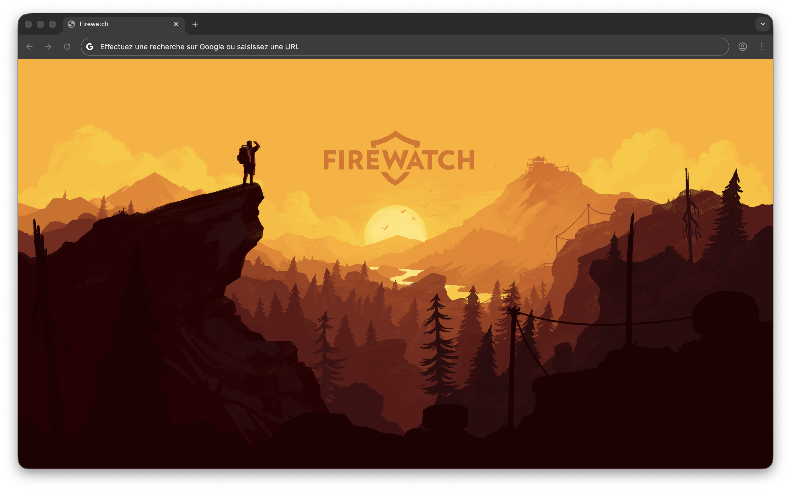

# Firewatch 

L’objectif de cet exercice est de superposer plusieurs images en position `absolute`.

## Résultat attendu

{data-zoom-image}

## Consignes

- [ ] Télécharger le [dossier de départ](./firewatch-depart.zip){download}
- [ ] Ne pas modifier le HTML
- [ ] Ajouter le css nécessaire pour reproduire le résultat attendu.
