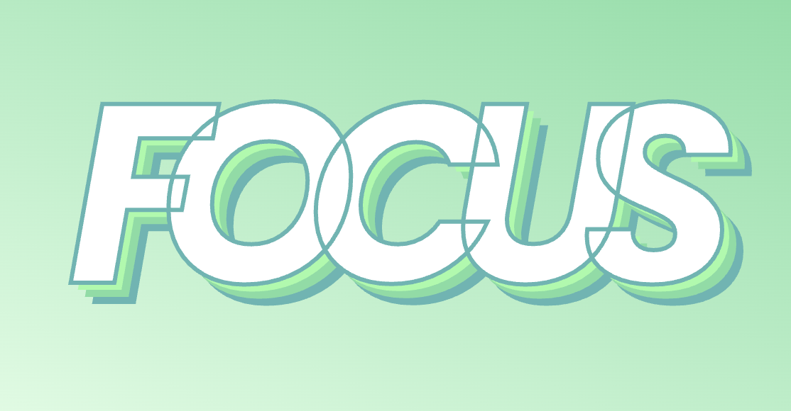

# Hey, focus !

L'objectif de cet exercice est de manipuler les propriétés de texte en CSS afin de recréer un effet typographique.

## Résultat attendu

### Couleurs

- Vert pâle : `#E3FEE7`
- Vert menthe : `#9AFBA6`
- Vert algue : `#7ADDA1`
- Turquoise : `#59B6B3`
 
## Consignes

- [ ] Effectuer un fork du [Codepen de départ](https://codepen.io/tim-momo/pen/MWLgPLm)
- [ ] Appliquer un dégradé linéaire à la balise html. 
      L'angle doit être de 45 degrés, commencer par la couleur « vert pâle » et se terminer avec la couleur « vert algue ».
- [ ] Appliquer une hauteur minimale de `100vh` à la balise html
- [ ] Installez la police de caractères [Google Fonts | Poppins](https://fonts.google.com/specimen/Poppins) dans la portion CSS de CodePen
  
Appliquer les styles suivants à la classe `focus`

- [ ] Police de caractères « Poppins »
- [ ] Taille de caractères de `25vw`
- [ ] Couleur de texte en blanc
- [ ] Bordure de caractères de 5px en « turquoise »
- [ ] Gras
- [ ] Italic
- [ ] Espacement de lettre de `-5vw`
- [ ] Tout en majuscule
- [ ] Aligné au centre
- [ ] Ombre portée de `5px` avec les couleurs « vert menthe », « vert algue » et « turquoise »
