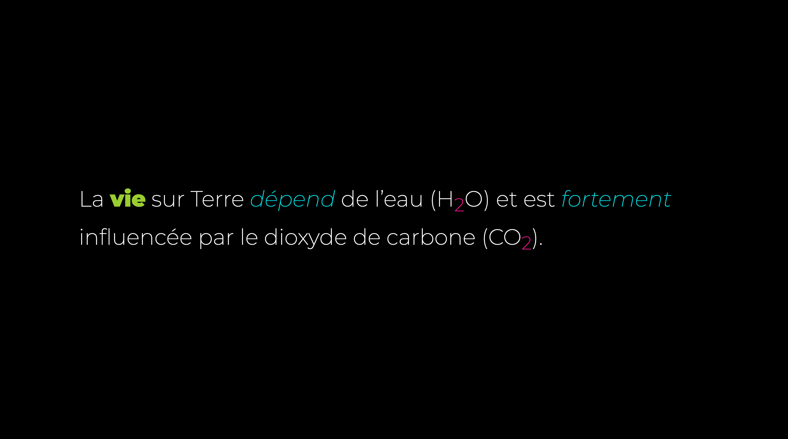

# Élémentaire

L'objectif de cet exercice est d'appliquer les bonnes balises de **formattage** aux bons endroit.

[Dossier de départ](./format.zip){ .md-button .md-button--primary }

## Résultat attendu

Ajoutez les bonnes balises pour faire apparaitre les styles dans l'image ci-dessous :

{data-zoom-image}

> Le dioxyde de carbone (CO2) joue un rôle essentiel dans le cycle du carbone et dans la photosynthèse. Les plantes l’utilisent pour produire de l’oxygène et de l’énergie, mais en trop grande quantité dans l’atmosphère, il contribue aussi au réchauffement climatique.

## Consignes

* [ ] Télécharger le dossier de départ
* [ ] Dézipper le dossier téléchargé
* [ ] Dans le fichier HTML, identifier les éléments à affecter
  * [ ] Ajouter du gras sur le mot vie
  * [ ] Ajouter de l'italic sur les mots « dépend » et « fortement »
  * [ ] Ajouter le texte en indice pour les formules chimiques
