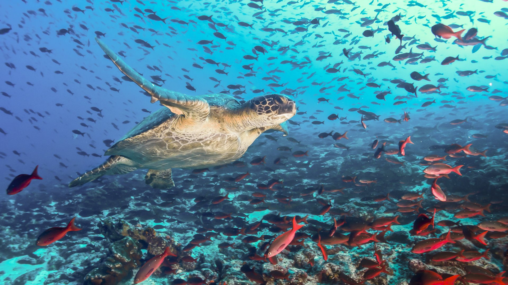

# Galapagos 🌋

{.w-100}

> Les îles Galápagos, nées de volcans surgis du Pacifique il y a des millions d’années, abritent une faune et une flore uniques au monde. En 1835, Charles Darwin y observa des espèces qui inspirèrent sa théorie de l’évolution !

Le but de cet exercice est de produire une page Web en HTML présentant les îles Galápagos.

## Résultat attendu

<https://web1.tim-momo.com/galapagos/>

## Consignes

- [ ] Télécharger le [dossier de départ](./galapagos_depart.zip)
- [ ] Dans `<body>`, ajouter un `<main>`. Tout le contenu du site y sera contenu.
- [ ] Dans `<main>`, ajouter un titre 1 avec le contenu : « Îles Galápagos »
- [ ] Dans `<main>`, ajouter une `<section>`.
- [ ] Dans `<section>` :
  - [ ] Ajouter un paragraphe de présentation décrivant l’archipel. (trouvez du texte par vous même)
  - [ ] Ajouter le `<iframe>` de la ([source Vimeo](https://vimeo.com/groups/14470/videos/785580956))
  - [ ] Ajouter un titre 2 avec le contenu : « Carte des îles Galápagos »
  - [ ] Ajouter le `<iframe>` d'une carte [OpenStreetMap](https://www.openstreetmap.org/). Chercher pour « Galapagos islands ».

[STOP]

```html
<main>
    <h1>Îles Galápagos</h1>
    <section>
        <p>Les îles Galápagos sont un archipel volcanique situé dans l'océan Pacifique, à environ 1 000 kilomètres à l'ouest des côtes de l'Équateur. Elles sont célèbres pour leur biodiversité unique et ont joué un rôle crucial dans le développement de la théorie de l'évolution de Charles Darwin.</p>
        <iframe src="https://player.vimeo.com/video/785580956?h=fd4c12e0af&byline=0" width="640" height="360" frameborder="0" allow="autoplay; fullscreen; picture-in-picture" allowfullscreen></iframe>
        <h2>Carte des îles Galápagos</h2>
        <iframe width="425" height="350" src="https://www.openstreetmap.org/export/embed.html?bbox=-93.61999511718751%2C-1.8783255723852057%2C-89.0057373046875%2C2.147324286308352&amp;layer=mapnik" allowfullscreen></iframe>
    </section>
</main>
```