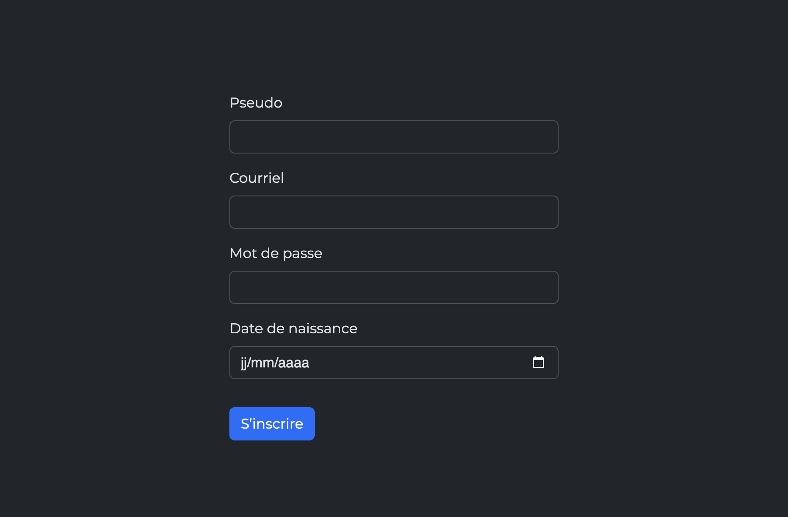

# L'inscription

<figure markdown>

<figcaption markdown>[Inscription de Rabatak](https://fr.wikipedia.org/wiki/Inscription_de_Rabatak)</figcaption>
</figure>

L'objectif de cet exercice est de mettre en pratique le concept de formulaire en HTML.

## Résultat attendu

## Consignes

- [ ] Effectuer un fork du [Codepen de départ](https://codepen.io/tim-momo/pen/WbrNOLd?editors=1000)
- [ ] Dans un formulaire, ajouter un champ texte pour le pseudo
- [ ] Ajouter un champ email pour le courriel
- [ ] Ajouter un champ mot de passe pour le mot de passe
- [ ] Ajouter un champ date pour la date de naissance
- [ ] Tous les champs doivent être requis et accompagnés d'un label correctement lié
- [ ] Ajouter un champ submit pour le bouton de soumission.
- [ ] Renommer le bouton pour qu’il affiche « S'inscrire »
- [ ] Si vous avez bien fait ça, vous devriez voir apparaître la mention «Bravo 👌» lorsque le formulaire est envoyé.

Note : Le message « Bravo 👌 » est déjà prévu dans le CodePen de départ. Si vous ne le voyez pas, c’est que certains champs ou attributs requis manquent.