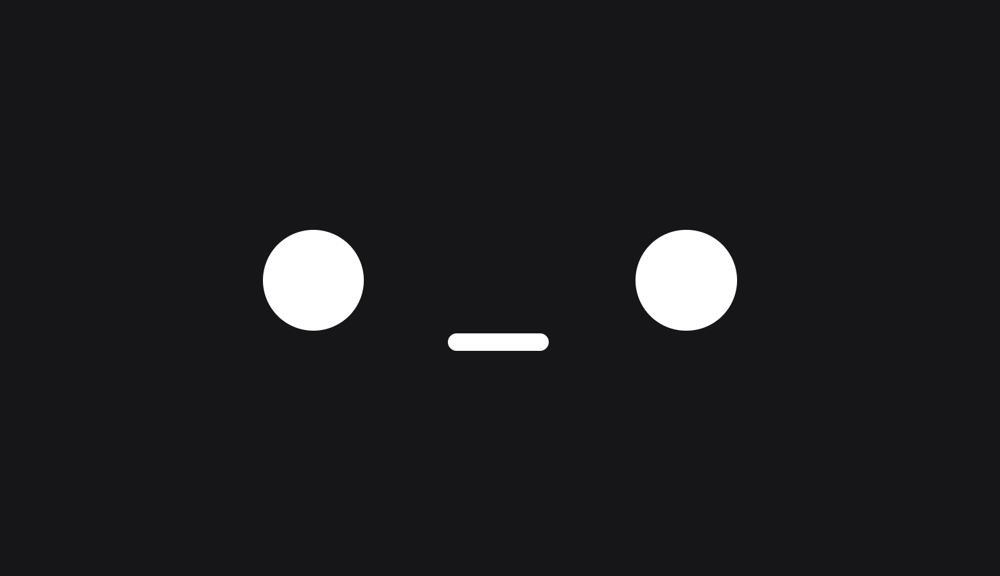

# Kawaii

L'objectif de cet exercice est de créer et centrer un personnage avec les unités relatives `vh` et `vw`.

## Résultat attendu

 
## Consignes

- [ ] Effectuer un fork du [Codepen de départ](https://codepen.io/tim-momo/pen/MYKVzqX)
- [ ] Ajouter le CSS nécessaire dans les classes `.oeil-gauche`, `.oeil-droit` et `.bouche` afin de recréer le résultat attendu.

### Contraintes

- Unités **autorisées** : `vh`, `vw`
- Unités **interdites** : `%`, `px`, `em`, `rem`, etc.

### Vérification

{data-zoom-image .w-50}

- [ ] Redimensionner la fenêtre. Le personnage doit rester centré et conserver ses proportions.

