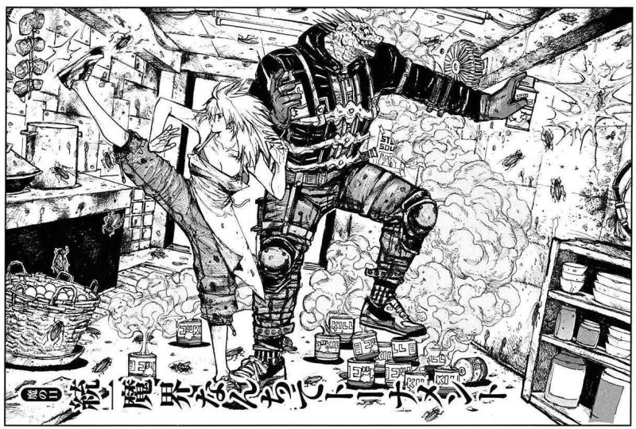

# Manga

{.w-100}

L'objectif de cet exercice est de mettre en pratique le concept des listes et des tableaux HTML.

## Résultat attendu

{data-zoom-image}

## Contenus

> Top 3
>
> Image, Manga, Étiquettes, Score
>
> Image : berserk.webp
> Titre : Berserk
> URL : https://myanimelist.net/manga/2/
> Score : 9.47
> Étiquettes : Action, Aventure, Drame, Fantastique, Horreur, Militaire, Psychologique
>
> Image : jojo.webp
> Titre : Jojo bizarre adventure
> URL : https://myanimelist.net/manga/1706/
> Score : 9.33
> Étiquettes : Action, Aventure, Mystère, Surnaturel, Historique
>
> Image vagabond.webp
> Titre : Vagabond
> URL : https://myanimelist.net/manga/656/
> Score : 9.27
> Étiquettes : Action, Aventure, Historique, Samouraï
>
>
> Publics cibles des mangas
>
> Shōnen
> Mangas ciblant principalement les garçons adolescents, caractérisés par l'action, l'aventure et des thèmes de dépassement de soi.
>
> Shōjo
> Mangas destinés aux filles adolescentes, mettant l'accent sur les relations interpersonnelles, la romance et le développement émotionnel.
>
> Seinen
> Mangas pour hommes adultes, proposant des histoires plus matures et complexes avec des thèmes psychologiques ou sociétaux approfondis.
>
> Josei
> Mangas ciblant les femmes adultes, explorant des relations amoureuses réalistes et des situations de la vie quotidienne avec une approche mature.

## Consignes

- [ ] Télécharger le [dossier de départ](./manga_depart.zip){download}
- [ ] Dans `<body>`, ajoutez une balise main. Elle contiendra tout le HTML de l'exercice.
- [ ] Ajouter un Titre 1
- [ ] Ajouter une première section
- [ ] Dans la section, ajouter un tableau avec son contenu. Le tableau doit avoir une structure avec `<thead>` et `<tbody>`.
  - [ ] Le lien des titres de manga doit ouvrir la page dans un nouvel onglet.
  - [ ] Les étiquettes doivent être affichées sous forme de liste
- [ ] Ajouter une seconde section
- [ ] Dans la section, ajouter un Titre 2
- [ ] Ajouter une liste de définitions pour les termes de publics cibles

[STOP]

https://web1.tim-momo.com/manga/