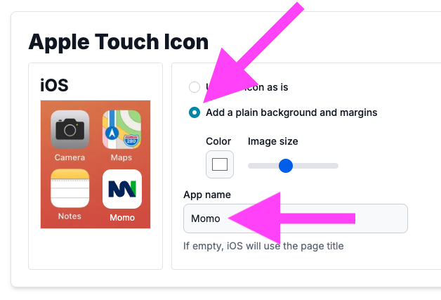
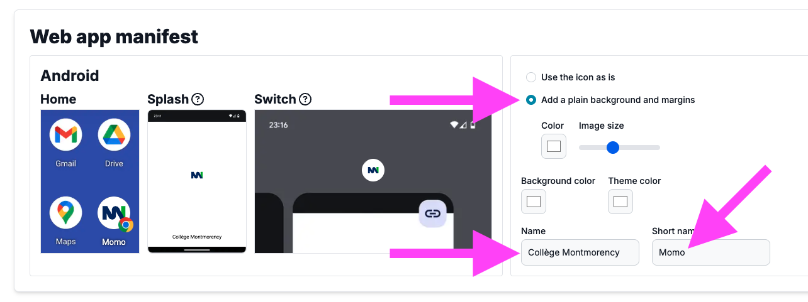
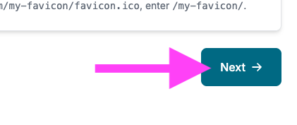
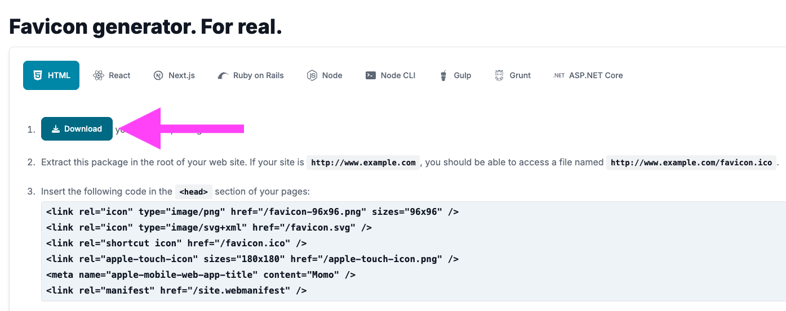

# Iconique

Il y a des icônes de mode, des icônes politiques, religieuses, culturelles, technologiques, ... et il y a des icônes de site Web 🤪

Le but de cet exercice est de générer des favicônes avec le site <https://realfavicongenerator.net/> et de les intégrer correctement à un site Web.

## Résultat attendu

{data-zoom-image}

## Consignes

- [ ] Créer une page html avec une structure de base.
- [ ] Télécharger l'[image vectorielle](./logo.svg){download} à convertir en favicon
- [ ] Convertir l'image avec <https://realfavicongenerator.net/>
- [ ] Configurez adéquatement la favicon avec les informations : Collège Montmorency (Momo). Voici les étapes :
  {data-zoom-image}
  {data-zoom-image}
  {data-zoom-image}
  {data-zoom-image}
- [ ] Intégrer le html fourni dans la partie head de votre fichier html
- [ ] Tester dans un navigateur si vous voyez bien la favicône 🔥
