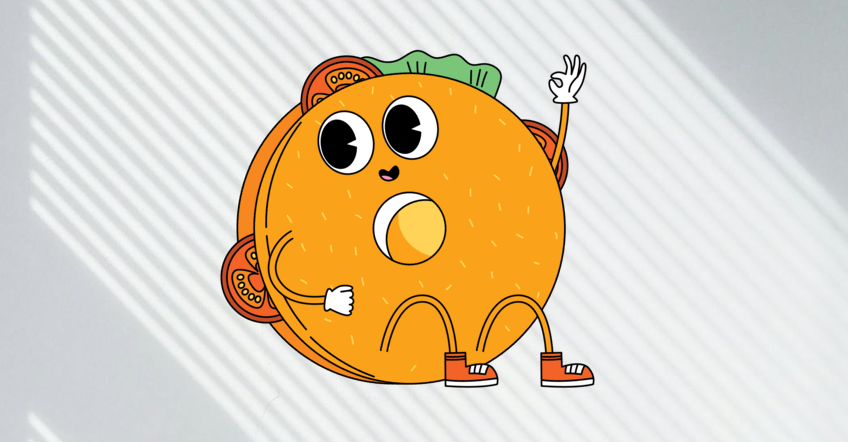

# Monsieur Sandwich

L'objectif de cet exercice est de mettre en pratique la notion de positionnement absolu avec un ordre d'affichage contrôlé par `z-index`.

## Résultat attendu

{ data-zoom-image }

## Consignes

- [ ] Effectuer un fork du [Codepen de départ](https://codepen.io/tim-momo/pen/gbPdMbj/e94598154e109da1f948ac1becd20a0b)
- [ ] En CSS seulement, positionner correctement chacunes des images et leur ordre d'affichage.
