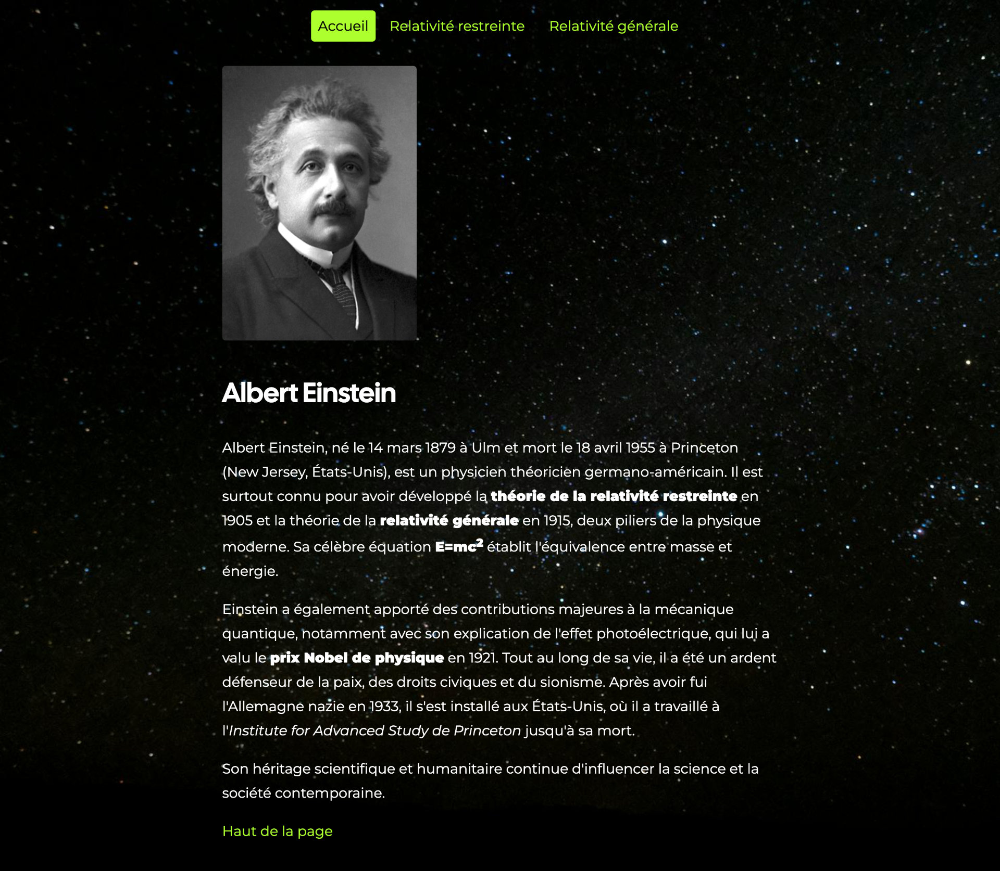
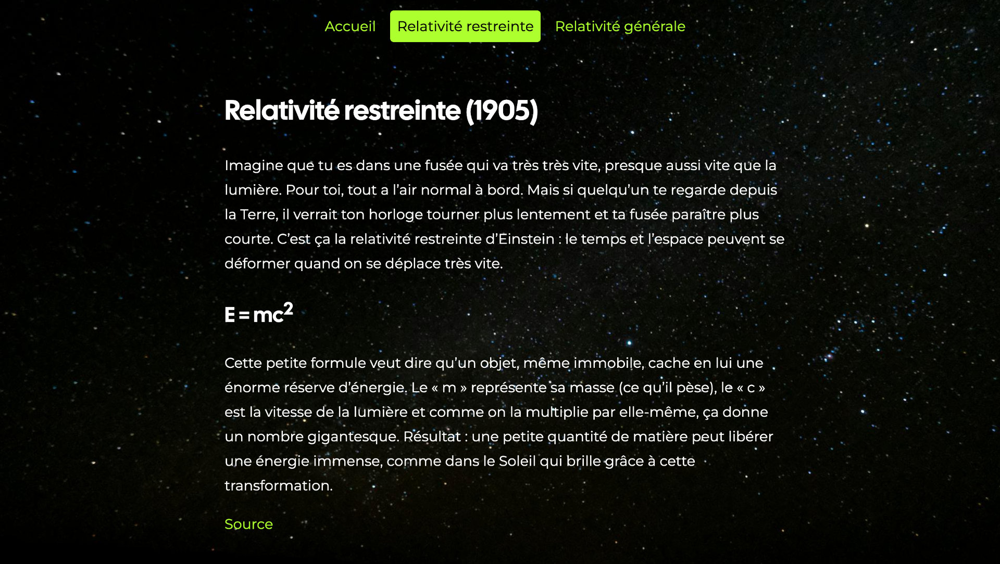
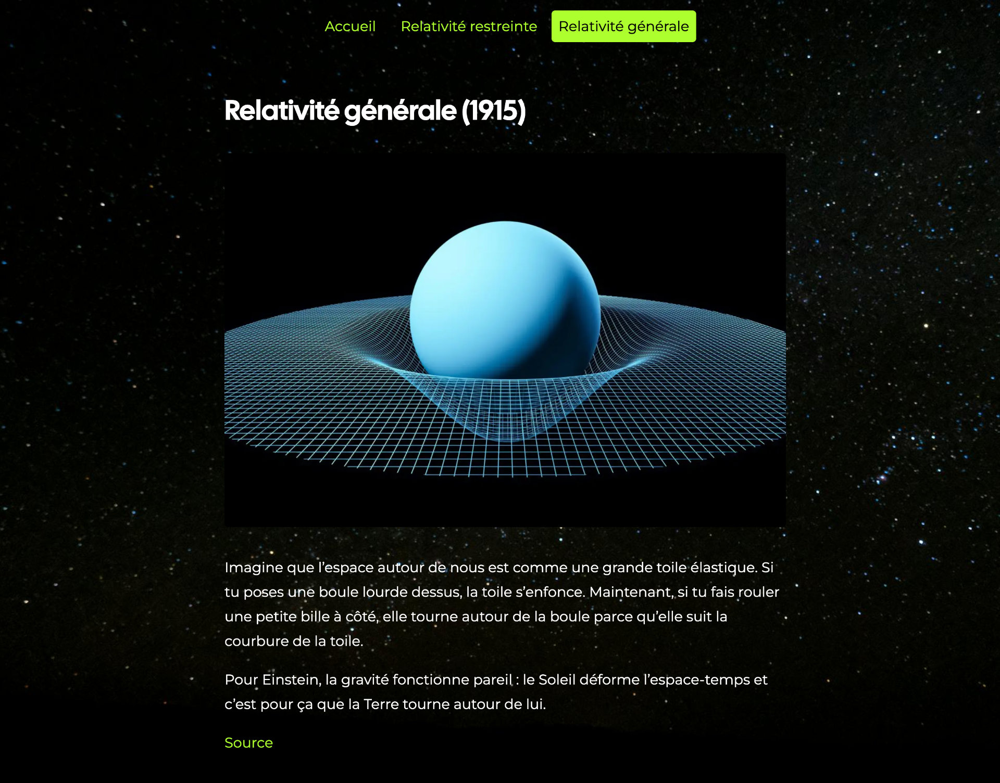

# Relativité einsteinienne

L'objectif de cet exercice est de construire un mini-site Web sur Albert Einstein et ses théories sur la relativité.

Tu disposes d’une version de départ (relativite-einsteinienne-start.zip) contenant les fichiers bruts.
Ton objectif est de corriger, structurer et enrichir le code pour arriver au rendu final (dont tu verras uniquement des captures d’écran, sans le code).

[Dossier de départ :material-download:](./relativite-einsteinienne-depart.zip){ .md-button .md-button--primary }

## Résultat attendu

Accueil ([:material-download:](./preview-index.jpg))

{data-zoom-image}

Relativité restreinte ([:material-download:](./preview-relativite-restreinte.jpg))

{data-zoom-image}

Relativité générale ([:material-download:](./preview-relativite-generale.jpg))

{data-zoom-image}

## Contenus

### Albert Einstein

[Image :material-download:](./einstein-nobel.png)

Albert Einstein, né le 14 mars 1879 à Ulm et mort le 18 avril 1955 à Princeton (New Jersey, États-Unis), est un physicien théoricien germano-américain. Il est surtout connu pour avoir développé la théorie de la relativité restreinte en 1905 et la théorie de la relativité générale en 1915, deux piliers de la physique moderne. Sa célèbre équation E=mc2 établit l'équivalence entre masse et énergie.

Einstein a également apporté des contributions majeures à la mécanique quantique, notamment avec son explication de l'effet photoélectrique, qui lui a valu le prix Nobel de physique en 1921. Tout au long de sa vie, il a été un ardent défenseur de la paix, des droits civiques et du sionisme. Après avoir fui l'Allemagne nazie en 1933, il s'est installé aux États-Unis, où il a travaillé à l'Institute for Advanced Study de Princeton jusqu'à sa mort.

Son héritage scientifique et humanitaire continue d'influencer la science et la société contemporaine.

Haut de la page

### Relativité restreinte (1905)

Imagine que tu es dans une fusée qui va très très vite, presque aussi vite que la lumière. Pour toi, tout a l’air normal à bord. Mais si quelqu’un te regarde depuis la Terre, il verrait ton horloge tourner plus lentement et ta fusée paraître plus courte. C’est ça la relativité restreinte d’Einstein : le temps et l’espace peuvent se déformer quand on se déplace très vite.

E = mc2

Cette petite formule veut dire qu’un objet, même immobile, cache en lui une énorme réserve d’énergie. Le « m » représente sa masse (ce qu’il pèse), le « c » est la vitesse de la lumière et comme on la multiplie par elle-même, ça donne un nombre gigantesque. Résultat : une petite quantité de matière peut libérer une énergie immense, comme dans le Soleil qui brille grâce à cette transformation.

Source (<https://w.wiki/FEih>)

### Relativité générale (1915)

[Image :material-download:](./gravity.webp)

Imagine que l’espace autour de nous est comme une grande toile élastique. Si tu poses une boule lourde dessus, la toile s’enfonce. Maintenant, si tu fais rouler une petite bille à côté, elle tourne autour de la boule parce qu’elle suit la courbure de la toile.

Pour Einstein, la gravité fonctionne pareil : le Soleil déforme l’espace-temps et c’est pour ça que la Terre tourne autour de lui.

Source (<https://w.wiki/FEio>)

## Consignes

**Structure HTML**

- [ ] Utiliser les balises sémantiques suivantes : `<header>`, `<nav>`, `<main>`

**Navigation**

- [ ] Ajoute une barre de navigation en haut de toutes les pages.
- [ ] Mets en évidence la page active en ajoutant class="active" à l’élément de menu correspondant.
- [ ] Dans la page d’accueil (index.html), ajoute une ancre “haut de la page” et fais pointer le lien « Haut de la page » vers cette ancre.

**Formules et formatage**

- [ ] Corrige l’équation d’Einstein pour afficher le 2 en exposant avec ``.
- [ ] Mets en gras (`<strong>`) les passages indiqués dans le rendu final.
- [ ] Pour les mots en anglais (par ex. Source), ajoute l’attribut lang="en".

**Images**

- [ ] Ajoute les images correspondantes avec leur balise `` et un texte alternatif pertinent.

**Liens**

- [ ] Les liens externes doivent s’ouvrir dans un nouvel onglet : utilise target="_blank" et rel="noopener noreferrer".
- [ ] Ajoute le lien vers les sources fournies.

**Pages à corriger**

- [ ] index.html (accueil)
- [ ] /relativite-generale/index.html (relativité générale)
- [ ] /relativite-restreinte/index.html (relativité restreinte)

## Corrigé (/20)

Structure (3 pts)

* Utilisation des balises sémantiques (2 pts)
* Bon usage des titres (1 pt)

Navigation (3 pts)

* Présente sur toutes les pages (1 pts)
* Classe "active" appliquée correctement (1 pt)
* Lien « Haut de la page » fonctionnel sur l'accueil (1 pts)

Formules et mise en forme (3 pts)

* E=mc2 écrit correctement partout (1 pts)
* Mots en gras selon l’aperçu (1 pts)
* Attribut lang="en" sur mots anglais (1 pt)

Images (3 pts)

* Images affichées correctement (1 pt)
* Texte alternatif pertinent (alt) (2 pts)

Liens (2 pts)

* Liens externes ouvrent dans un nouvel onglet (1 pts)
* Lien source bien placé et fonctionnel (1 pts)

Général (6 pts)

* Indentation (1 pts)
* HTML valide (1 pts)
* Site fonctionnel (1 pts)
* Ressemblance au résultat attendu (1 pts)
* Rigeur et minutie (2 pts)

## Remise

À remettre en format .zip

Nomenclature du .zip : [nom de famille]-[prénom]_[identifiant du travail]
Exemple : gilbert-charlene_devoir01.zip

Date de remise : début du prochain cours

[STOP]

https://web1.tim-momo.com/relativite-einsteinienne/
