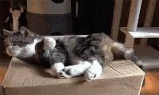

# Schrodinger

{.w-100}

> Le chat de Schrödinger est une expérience imaginaire qui montre qu’en physique quantique, une chose minuscule peut exister dans plusieurs états en même temps, tant qu’on ne la regarde pas 🤯
> Schrödinger a inventé cette idée pour montrer que ces lois étranges ne fonctionnent pas avec le monde réel.
> Par exemple, il serait impensable qu'un chat puisse être à la fois vivant et mort dans une boîte fermée 🤪

L'objectif de cet exercice est de mettre en pratique les connaissances relatives à la notion de [position](https://developer.mozilla.org/fr/docs/Web/CSS/position) en CSS.

## Consignes

Dans l'exercice, chaque carré a une dimension de 100px × 100px.

- [ ] Faire chaque étapes de l'exercice en ligne : <https://codepen.io/tim-momo/live/ByjdeKR>
