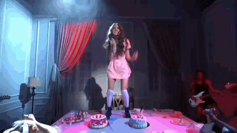

# Ta toune

{ .w-100 }

L'objectif de cet exercice est de programmer en HTML les paroles d'une chanson d'un artiste ou d'un groupe de votre choix.

Si vous n'avez pas d'inspiration, pourquoi pas prendre les paroles de [good 4 u](https://genius.com/Olivia-rodrigo-good-4-u-lyrics) d'Olivia Rodrigo _like a damn sociopath_.

## Résultat attendu

<https://web1.tim-momo.com/ma-toune/>

## Consignes

- [ ] Trouver les paroles d'une chanson sur internet (ex.: <https://genius.com>)
- [ ] Ouvrir VSCode
- [ ] Créer un nouveau fichier et l'enregistrer avec le nom `index.html`
- [ ] Programmer la structure HTML de base avec le raccourci « ! » dans vscode
- [ ] Modifier le contenu de la balise `title` par "Paroles de A par B". Remplacer «A» par le titre de la chason et «B» par le nom de l'artiste.
- [ ] Ajouter un titre de niveau 1 pour le titre de la chason choisie
- [ ] Sous le titre, inscrire le nom de l'artiste
- [ ] Ajoutez un trait de séparation comme dans le résultat attendu
- [ ] Ajouter ensuite les couplets dans des paragraphes et ajoutez le nécessaire pour les sauts de ligne
- [ ] 🪄 Ajouter un peu de magie dans la portion `head` du code HTML en y ajoutant cette ligne de code `<link rel="stylesheet" href="https://web1.tim-momo.com/ma-toune/styles.css">`
- [ ] En levant la main, valider votre programmation avec le prof
