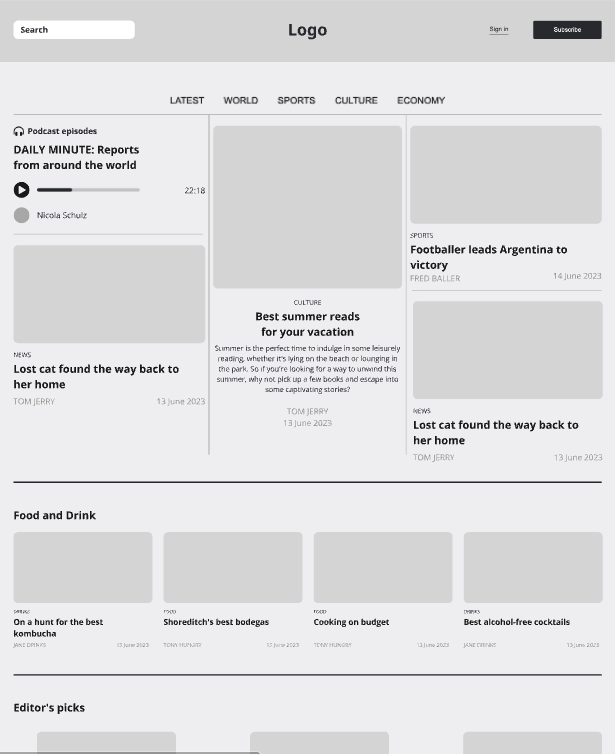

# Tenet

{.w-100}

L'exercice s'appelle Tenet parce qu'il consiste à faire un exercice à l'enver, c'est à dire, créer une maquette conceptuelle à partir d'un produit fini 🤯

L'objectif est donc de construire le wireframe de la page d'accueil d'un site Web de votre choix !

Vous pouvez utiliser soit draw.io ou une feuille de papier et un crayon.

## Exemple de résultat

{data-zoom-image}

## Consignes

- [ ] Effectuez votre maquette conceptuelle avec le plus d'attention aux détails possible
- [ ] Évitez de dessiner les aspects graphiques et concentrez-vous sur le contenu
- [ ] Valider avec l'enseignant votre wireframe
