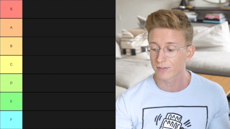

# Tierlist

{.w-100}

L'objectif de cet exercice est de créer un tableau html dans lequel vous devrez ajouter des images à la façon [tiermaker.com](https://tiermaker.com/).

L'exercice se déroule exclusivement en HTML.

## Résultat attendu

<https://web1.tim-momo.com/tierlist/>

## Consignes

- [ ] Télécharger le [dossier de départ :material-download:](./tierlist-depart.zip){download}
- [ ] Dans `<body>`, ajouter un tableau HTML
- [ ] Le tableau doit avoir **7 rangées** (pas d’en-tête) et **2 colonnes**  
- [ ] La première colonne doit contenir les lettres : S, A, B, C, D, E et F
  - Chaque cellule de première colonne doit avoir un attribut `class` correspondant à son rang (`s-tier`, `a-tier`, `b-tier`, etc.)
- [ ] Dans la colonne de droite, vous devrez ajouter, dans les cellules de votre choix, les images suivantes :
  - [Automne :material-download:](./automne.png){download}
  - [Printemps :material-download:](./printemps.png){download}
  - [Été :material-download:](./ete.png){download}
  - [Hiver :material-download:](./hiver.png){download}

[STOP]

Solution

```html
<table>
  <tr>
    <td class="s-tier">S</td>
    <td></td>
  </tr>
  <tr>
    <td class="a-tier">A</td>
    <td></td>
  </tr>
  <tr>
    <td class="b-tier">B</td>
    <td></td>
  </tr>
  <tr>
    <td class="c-tier">C</td>
    <td></td>
  </tr>
  <tr>
    <td class="d-tier">D</td>
    <td></td>
  </tr>
  <tr>
    <td class="e-tier">E</td>
    <td></td>
  </tr>
  <tr>
    <td class="f-tier">F</td>
    <td></td>
  </tr>
</table>
```
