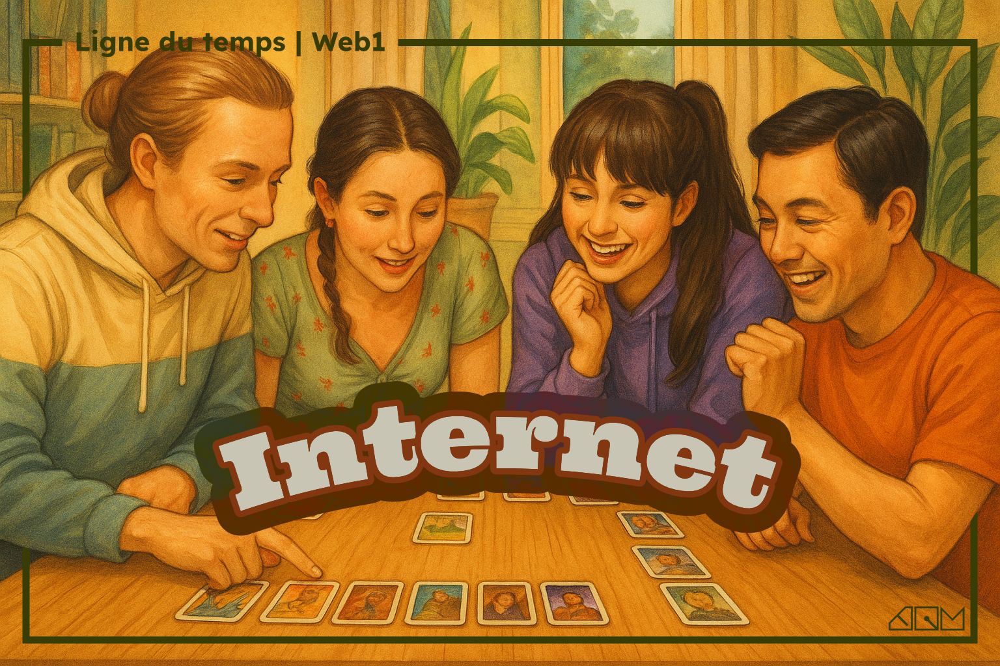

---
tags:
  - Exercice
  - En équipe
---

# L'histoire d'Internet

À la manière du jeu de société [Timeline](https://boardgamegeek.com/boardgame/128664/timeline), votre mission est de replacer dans l’ordre chronologique les événements majeurs de la relativement courte histoire d’Internet.

Chaque carte présente un jalon important, que vous devrez positionner correctement sur la ligne du temps.

## Instructions

- [ ] Former une équipe de **2** ou **3** personnes
- [ ] Ouvrir le lien [Wooclap (WEB1TL1)](https://app.wooclap.com/WEB1TL1)
- [ ] Répondre aux question dans Wooclap

[STOP]

1969 – Lancement d’ARPANET
Le premier réseau reliant des ordinateurs, marquant la naissance concrète d’Internet.

1971 – Premier courriel (e-mail)
Ray Tomlinson envoie le tout premier message électronique entre deux ordinateurs reliés par ARPANET.

1989 – Création du World Wide Web (www)
Tim Berners-Lee invente le protocol HTTP, le langage HTML et le concept de navigateur Web.

2007 – Sortie de l’iPhone
Lancement du smartphone d’Apple démocratisant l’accès mobile à Internet. Avant, Internet c'était juste à la maison.

2011 – Émergence de l’Internet des objets (IoT)
Expansion des objets connectés à Internet (montres, thermostats, etc.), élargissant le réseau au-delà des ordinateurs.

2022 – Arrivée de ChatGPT
Démocratisation massive de l’intelligence artificielle conversationnelle générative auprès du grand public.

[STOP]

1974 – Protocole TCP/IP
Invention du protocole fondamental permettant aux ordinateurs de communiquer sur Internet.

1983 – Introduction du DNS
Création du système des noms de domaine (ex : google.com), facilitant l’accès au web.

1993 – Premier navigateur graphique (Mosaic)
Premier navigateur rendant accessible au grand public le web via une interface graphique.

1998 – Naissance de Google
Création du moteur de recherche devenu emblématique pour sa rapidité et sa pertinence.

2004 – Lancement de Facebook
Début de la révolution sociale en ligne avec la création de la plateforme la plus populaire au monde.