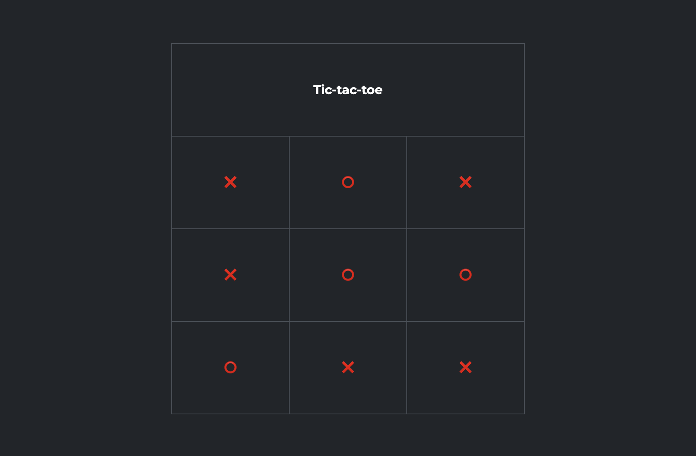
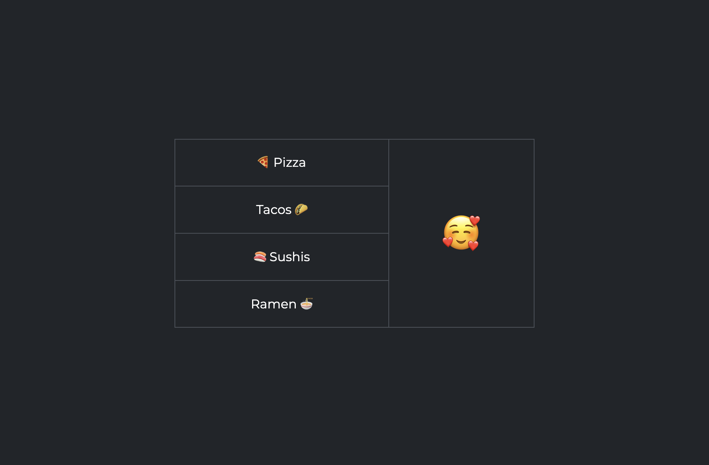
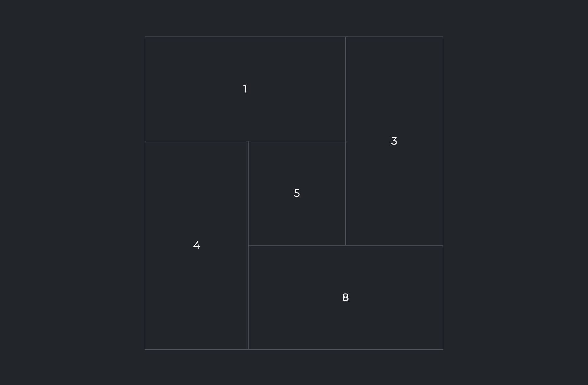

# Uzumaki

{.w-100}

L'objectif de cet exercice est de mettre en pratique la notion de `colspan` et de `rowspan` dans les tableaux html.

Dans cet exercice, vous ne devez modifier que le HTML.

## Consignes

### colspan

- [ ] Effectuer un fork du [Codepen de départ 1](https://codepen.io/tim-momo/pen/GgoRErp?editors=1000)
- [ ] Avec l'aide de l'attribut `colspan`, reproduire le résultat suivant :  
  {data-zoom-image}

### rowspan

- [ ] Effectuer un fork du [Codepen de départ 2](https://codepen.io/tim-momo/pen/yyeLXOz?editors=1000)
- [ ] Avec l'aide de l'attribut `rowspan`, reproduire le résultat suivant :  
  {data-zoom-image}

### colspan + rowspan

- [ ] Effectuer un fork du [Codepen de départ 3](https://codepen.io/tim-momo/pen/ByjBPqw?editors=1000)
- [ ] Avec l'aide des attributs `colspan` et  `rowspan`, reproduire le résultat suivant :  
  {data-zoom-image}
