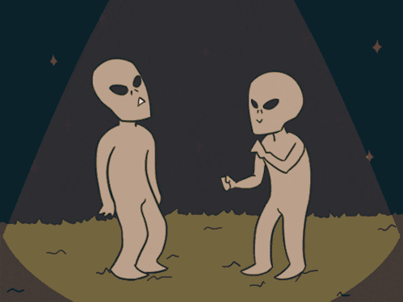

# Yé

{.w-100}

L’objectif de cet exercice est de reproduire à l’identique le résultat attendu en utilisant les notions de sélecteurs CSS, de classes, ainsi que les propriétés `border-radius`, `display` et `background-color`.

## Résultat attendu

{data-zoom-image}

## Consignes

- [ ] Effectuer un fork du [codepen de départ](https://codepen.io/tim-momo/pen/bNEYVLQ)
- [ ] Changer la couleur de fond de la classe `shape` pour `greenyellow`
- [ ] Ajouter un `border-radius` de **10px** à la classe `tile`

- [ ] Ajouter une nouvelle classe CSS `cercle` avec l'attribut `border-radius` configuré de sorte à faire un cercle. 
- [ ] Appliquer la classe au bon élément HTML
- [ ] Créez et appliquez une nouvelle classe CSS pour les autres formes.

- [ ] Ajouter une classe CSS `hidden` avec l'attribut `display` configué pour cacher le contenu
- [ ] Appliquer la classe aux bons éléments HTML
