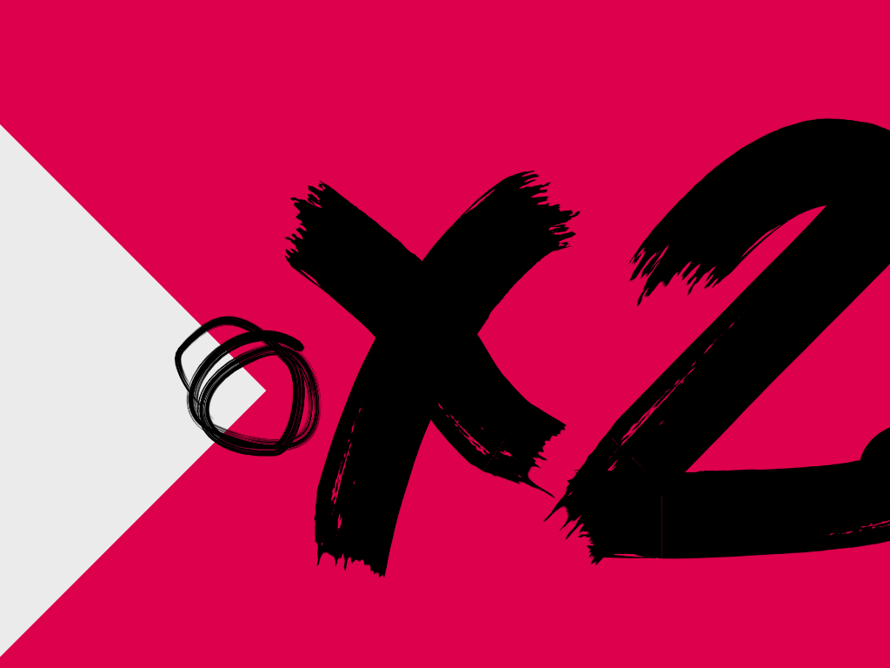
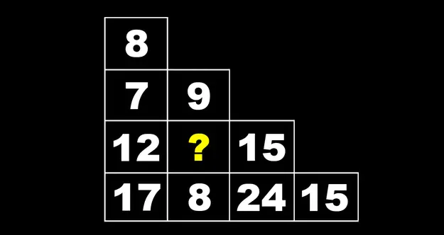

# Comprendre le concept

Ce type de jeu est apparu au début des années 2000.

Il consiste à créer un mini-site Web où chaque page contient une énigme et, en la résolvant, on trouve l'URL de la page suivante.

{data-zoom-image}

Exemples en ligne : 

* <https://jfcmontmorency.github.io/enigmorency/reveil/> (par votre humble enseignant) 
* <http://www.timtang.com/ttt/> ([réponses](https://timtangsolutions.blogspot.com/2015/11/here-are-detailed-answers-for-first-98.html))
* <https://www.mcgov.co.uk/zahada.html> ([réponses](https://zahadawalkthrough.blogspot.com/))
* <https://notpron.com/notpron/>([réponses](https://www.thehelper.net/threads/notpron-full-walkthrough-hints-cheats.20560/))

!!! warning "Pas de choix de réponse"

    Dans ce type de jeu, il est important de ne pas laisser à l'utilisateur un choix de réponse. Celui-ci ne doit pas résoudre une énigme par élimination. Il doit l'avoir résolue.

## Types d’énigmes

### Devinette

{data-zoom-image}

<section markdown>
**Texte d'accompagnement** : Je suis pris avant de dormir et parfois après un bon repas

**Indice** : Camellia sinensis

**✅ Réponse** : `the.html`
</section>

 
### Charade
  

{data-zoom-image}

**Texte d'accompagnement** :

> Mon premier miaule. 
> Mon deuxième est essentiel à la vie. 
> Mon tout est un abri.

**Indice** : On se croirait à _Disney Land_

**✅ Réponse** : `chateau.html` (chat + eau)

### Anagramme

[Anagramme](https://www.alloprof.qc.ca/fr/eleves/bv/francais/l-anagramme-f1646) | Jeu de lettres consistant à réorganiser les lettres d'un mot ou d'une phrase pour en former un autre.

{data-zoom-image}

**Texte d'accompagnement** : _aucun_

**Indice** : En France, Anna pèse les grammes du Che Guevara

**✅ Réponse** : `revolution-francaise.html` (« un veto corse la finira » est un anagramme de « révolution française »)

### Rébus

[Rébus](https://fr.wikipedia.org/wiki/R%C3%A9bus) | Énigme où des images, symboles ou sons représentent des syllabes ou des mots à combiner pour former une expression.

{data-zoom-image}

**Texte d'accompagnement** : _aucun_

**Indice** : Ornithorynque n'est pas une onomatopée

**✅ Réponse** : `canard.html` (le canard fait coin coin)

 

### Formule mathématique

{data-zoom-image}

**Texte d'accompagnement** : Les mathématiques sont partout, même en nature

**Indice** : 💧

**✅ Réponse** : `1.html` (Cachée dans l'image, on peut voir la formule `(4 x 6 - 4) / 5 - 3`)

### Codes 

{data-zoom-image}

**Texte d'accompagnement** : _aucun_

**Indice** : Ah ! Ce que l'amour peut faire

**✅ Réponse** : `aveugle.html` (Le trait du losange est écrit en code morse. Il est inscrit : « Je ne vois rien »)

Un code peut être l'[alphabet phonétique](https://fr.wikipedia.org/wiki/Alphabet_phon%C3%A9tique_international), le [code morse](https://fr.wikipedia.org/wiki/Code_Morse_international), les [chiffres romains](https://fr.wikipedia.org/wiki/Num%C3%A9ration_romaine), le langage [leet](https://fr.wikipedia.org/wiki/Leet_speak), etc.

### Dégradations lisibles

{data-zoom-image}

**Texte d'accompagnement** : Les gnes me rocnensnaseit suroutt gcrâe à ma clèérbe mamxie « Je pnese, dnoc je sius »

**Indice** : La philo c'est la vie

**✅ Réponse** : `descartes.html`

[Générateur de dégradation](https://unsceptiqueaubureau.com/coffee-break/selon-une-etude-de-cambridge/)

### Logique

{data-zoom-image}

**Texte d'accompagnement** : Je suis la plus jeune à faire partie du **club**.

**Indice** : Chanteuse, auteur-compositeur, interprète britannique

**✅ Réponse** : `winehouse.html` (L'image donne 27. [Club des 27](https://fr.wikipedia.org/wiki/Club_des_27))

### Déduction

{data-zoom-image}

**Texte d'accompagnement** : _aucun_

**Indice** : C'est juste une question de somme

**✅ Réponse** : `5.html` (La somme de chaque ligne est le double de la précédente)

[Tests de QI](https://www.buzzfeed.com/spenceralthouse/best-iq-test-online)

### Truquage technique

{data-zoom-image}

**Texte d'accompagnement** : Il faut que je trouve le moyen d'entrer !

**Indice** : Les serrures de porte sont faciles à trafiquer. Il suffit d'utiliser le bon outil.

**✅ Réponse** : `xxxx.html` (L'outil est la souris. Il faut simplement cliquer sur la poignée de porte)

#### Variantes

* Énigme vague, mais la réponse est carrément écrite dans le code du site, dans le texte alternatif d'une image ou dans le titre de l'onglet !

* **Indices cachés**
  * Exemple 1 : texte de la même couleur que la couleur de fond. 
  * Exemple 2 : hover sur une image pour la faire disparaître en CSS et en arrière se trouve le mot recherché.
* **Énigme audio**
* **Énigme dans une image**
  * Exemple : un montage de photos affiche plusieurs images avec un même objet. Le nom de l'objet est la réponse.

