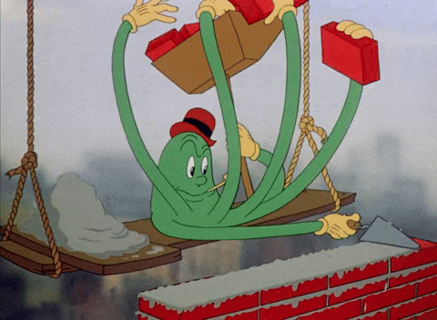

# Énigmorency

{.w-100}

Le TP2 consiste à créer un petit jeu d'énigme comprenant une page d'accueil, 5 pages d'énigme et une page de victoire.

## Développement du TP2 (35% de la session)

  

  **[Comprendre le concept](./concept.md){.stretched-link .back}**

  

  **[Préparer le projet](./preparation.md){.stretched-link .back}**

  

  **[Développer le site](./dev.md){.stretched-link .back}**

## Présentation en classe (5% de la session)

  

  **[Présentation](./presentation.md){.stretched-link .back}**

## Remise

**Stéphane** : 9 décembre 
**Jean-François** : 11 décembre

Sur Teams, remettre le projet en format zip avec la nomenclature suivante : `nomdefamille-prenom-tp2.zip`
