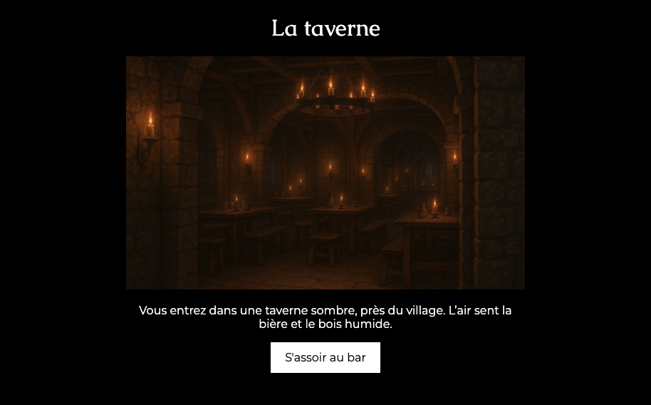

# LDVELH | Développement

Créer une petite histoire interactive à partir les de la phase de planification. Chaque page HTML correspond à une case de votre schéma draw.io.

## Exemple

Une scène ressemblera à ceci :

{data-zoom-image}

[Exemple de projet](https://web1.tim-momo.com/ldvelh/histoires/exemple/)

[Exemple de structure HTML (incomplet)](./ldvelh_depart.zip)

## Identifiants

| Groupe JF am                      | 📁 Dossier | Suite |
|-----------------------------------|-------------|-------------|
| Beauregard, Alexis                | tp1-90666   | tp1-87613   |
| Kengne, Joseph-Marie Sitamze      | tp1-87613   | tp1-97418   |
| Beaulieu, Nanthapricha            | tp1-97418   | tp1-67423   |
| El-Mekari, Ahmed                  | tp1-67423   | tp1-97633   |
| Kammour, Mohamed                  | tp1-97633   | tp1-09645   |
| Mathieu, Evan                     | tp1-09645   | tp1-09803   |
| Canal, Gabriel                    | tp1-09803   | tp1-34308   |
| Drouin, Isabelle                  | tp1-34308   | tp1-43137   |
| Barrette, Liam                    | tp1-43137   | tp1-49248   |
| Manoukian, Aline Teresa           | tp1-49248   | tp1-50161   |
| Koffi, Tanya Mariella             | tp1-50161   | tp1-56231   |
| Quesnel, Vincent                  | tp1-56231   | tp1-68460   |
| Saulnier, Justin                  | tp1-68460   | tp1-72447   |
| Lajeunesse, Élodie                | tp1-72447   | tp1-78893   |
| Prien, Terrence                   | tp1-78893   | tp1-83046   |
| Granger, Christophe               | tp1-83046   | tp1-86911   |
| Bélisle, Jonathan                 | tp1-86911   | tp1-90666   |

| Groupe JF pm                      | 📁 Dossier | Suite |
|-----------------------------------|-------------|-------------|
| Berbiche, Wilhene                 | tp1-72933   | tp1-88158   |
| Roy, Félix                        | tp1-88158   | tp1-96110   |
| Dubé, Colin                       | tp1-96110   | tp1-97654   |
| Ouellet, Pierre-Olivier           | tp1-97654   | tp1-98369   |
| Bachir, Fawzi                     | tp1-98369   | tp1-65934   |
| Leurot, Théana                    | tp1-65934   | tp1-95055   |
| Bah, Ibrahima                     | tp1-95055   | tp1-09694   |
| Rayner-Barcelli, Alexander        | tp1-09694   | tp1-10963   |
| Siffrard, Emanuel                 | tp1-10963   | tp1-34739   |
| Pépin, Clovis                     | tp1-34739   | tp1-35716   |
| Bastien, Marcus Andrew            | tp1-35716   | tp1-37768   |
| Mirza, David                      | tp1-37768   | tp1-47076   |
| Brisebois, Alycia                 | tp1-47076   | tp1-49868   |
| Nadeau, Marc-Olivier              | tp1-49868   | tp1-54239   |
| Toussaint, Steven                 | tp1-54239   | tp1-62913   |
| Lanthier, Zara                    | tp1-62913   | tp1-72656   |
| Yoou, Noah-Charles                | tp1-72656   | tp1-73662   |
| Pelletier, Amélie                 | tp1-73662   | tp1-80523   |
| Dumont, Xavier                    | tp1-80523   | tp1-84688   |
| Savoie, Rosa-Lee                  | tp1-84688   | tp1-72933   |

| Groupe Stéphane                   | 📁 Dossier | Suite |
|-----------------------------------|-------------|-------------|
| Gravel, Kellie                    | tp1-70299   | tp1-89993   |
| Castilloux, Alicia                | tp1-89993   | tp1-96882   |
| Visinand Yoan                     | tp1-96882   | tp1-73615   |
| Gutierrez, Gaël                   | tp1-73615   | tp1-43902   |
| Emond, Florence                   | tp1-43902   | tp1-94371   |
| Nguyen, Phu Thanh                 | tp1-94371   | tp1-96744   |
| Laurence, Mathilde                | tp1-96744   | tp1-98383   |
| Cholette, Zakk                    | tp1-98383   | tp1-09704   |
| Labrie, Anne-Julie                | tp1-09704   | tp1-49958   |
| Bozelko, Thomas                   | tp1-49958   | tp1-49053   |
| Louis, Jayden                     | tp1-49053   | tp1-35319   |
| Figueroa, Sophia                  | tp1-35319   | tp1-33819   |
| Valois Loïc                       | tp1-33819   | tp1-22213   |
| Rivard-Septimus, Alexandre        | tp1-22213   | tp1-55790   |
| Tomolaga Eliza                    | tp1-55790   | tp1-56770   |
| Van Elsuwé Maélie                 | tp1-56770   | tp1-61102   |
| Laplante, Noémie                  | tp1-61102   | tp1-63192   |
| Parent, Francis                   | tp1-63192   | tp1-74150   |
| Baldassarre, Rosalia              | tp1-74150   | tp1-78109   |
| Elayyan, Mariam Shehadeh Aziz     | tp1-78109   | tp1-70815   |
| Lebire, Hugo                      | tp1-70815   | tp1-83995   |
| Arcand, Félix                     | tp1-83995   | tp1-70299   |

### Lier sa scène à l'autre

{.w-50}

1. La colonne Suite indique l'histoire qui va venir après la vôtre.
1. Contactez cette personne sur Teams.
1. Ensemble, inventez une courte scène de transition (elle peut être complètement farfelue 🤯).
1. Intégrez la scène. C’est vous qui devez écrire et ajouter cette scène à la fin de votre propre histoire. (La personne contactée n’a pas à l’ajouter dans la sienne.)

## Consignes

- [ ] Créez un dossier nommé tp1-XXXXX (remplacez XXXXX par le code associé à votre nom).
- [ ] Placez dans ce dossier :
  - [ ] un fichier `index.html` pour votre première page
  - [ ] les autres fichiers `.html` de chaque scène de votre histoire
  - [ ] un dossier assets contenant vos images et fichiers audios compartimenté dans des sous-dossiers.
- [ ] Dans la portion `<head>` de **tous** vos fichiers HTML, vous devez ajouter la balise suivante en remplaçant "John Doe" par votre nom complet :
    ```html
    <meta name="author" content="John Doe">
    ```
- [ ] Dans la portion `<head>`, assurez vous d'ajouter cette ligne :
    ```html
    <link rel="stylesheet" href="https://web1.tim-momo.com/ldvelh/assets/css/ldvelh-iframe.css">
    ```    
- [ ] Structure minimale d’une page :
  - [ ] Un entête avec un titre 1
  - [ ] Une balise main dans laquelle on retrouve une image (1200px x 700px) et le texte de la scène
  - [ ] Un pied de page contenant une balise de navigation dans laquelle se trouve une liste non ordonnée de liens vers les scènes suivantes.

- [ ] Une fois la structure minimale faite pour une page, vous pouvez utiliser la même pour les autres pages HTML.

- [ ] Ajoutez au moins deux balises `<audio>` en autoplay dans des scènes différentes, en cohérence avec l’histoire (ex. bruit d’épée). Aucune de ces balises ne doit être sur la première scène.
- [ ] Ajoutez obligatoirement des balises `<em>` pour mettre les mots importants de l'histoire en emphase
- [ ] Tous les chemins doivent être relatifs
- [ ] Tous les fichiers du projet doivent respecter la notation kebab-case
- [ ] Toutes les images du projet doivent avoir un texte alternatif
- [ ] La dernière scène doit contenir un lien vers l’index.html de l’étudiant suivant (Suite). Pour ce faire, il faudra remonter d'un niveau relatif. Voici un exemple :
    ```html title="Exemple de lien final"
    <a href="../tp1-12345/index.html">Suite ...</a>
    ```
- [ ] Connectez votre scène à l'autre (Voir comment : « [Lier sa scène à l'autre](./developpement.md#lier-sa-scene-a-lautre) »)

## Remise

Remettez un fichier `.zip` de votre dossier. Exemple : `tp1-XXXXX.zip`

Groupe avec Stéphane - Remise 6 octobre à 23:59

Groupe avec JF - Remise 8 octobre à 23:59

## Grille d’évaluation

| Critère                                                           | Points |
|-------------------------------------------------------------------|--------|
| Usage des balises sémantiques (`header`, `main`, `footer`, `nav`) | 1      |
| Code bien indenté et lisible                                      | 1      |
| Code HTML valide                                                  | 1      |
| Navigation fonctionnelle avec liens relatifs                      | 1      |
| Lien final fonctionnel vers l’étudiant suivant                    | 1      |
| Chaque page contient une image                                    | 1      |
| Images au format 1200px x 700px                                   | 1      |
| Texte alternatif sur toutes les images                            | 1      |
| Présence d’au moins 2 pistes audio pertinentes                    | 1      |
| Audio en autoplay (sauf sur la première scène)                    | 1      |
| Emploi de la balise d’emphase                                     | 1      |
| Présence d’un titre 1 sur chaque page                             | 1      |
| Liste à puces non ordonnée pour les choix                         | 1      |
| Texte de l’histoire rédigé dans des paragraphes                   | 1      |
| Balise `<meta name="author">` dans chaque fichier                 | 1      |
| Fichiers nommés en kebab-case                                     | 1      |
| Structure de fichiers avec le dossier `assets/`                   | 1      |
| Créativité de l’histoire                                          | 1      |
| Cohérence narrative de l’histoire                                 | 1      |
| Respect général des consignes                                     | 1      |
| Total                                                             | /20    |

**Les points de l'évaluation équivalent à 15 points sur 20 points du tp1**
