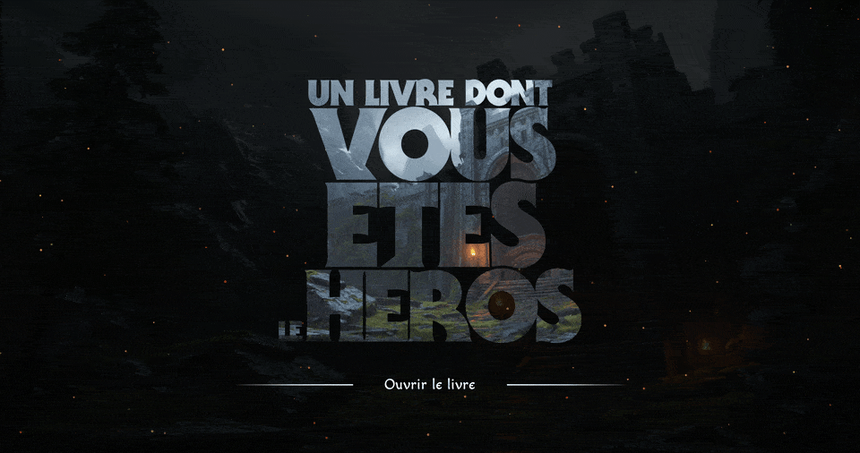

# LDVELH

{.w-100}

<!--

À ajuster :

  L'idée d'avoir une histoire en continu ne fonctionne pas : les étudiants ne remettent pas la bonne structure de dossier, certains quittent le programme, certains ne sont pas assidus, bref, à changer.

-->

Le travail pratique LDVELH est séparé en 2 phases, soit la phase de **planification** et la phase de **développement**.

L'évaluation sommative complète (TP1a + TP1b) compte pour 20% de la note finale.

  

TP1a 
**[Planification (5%)](./planification.md){.stretched-link .back}** 
<small>Stéphane - Remise 22 septembre 23:59</small> 
<small>JF - Remise 24 septembre 23:59</small>

  

TP1b 
**[Développement (15%)](./developpement.md){.stretched-link .back}** 
<small>Stéphane - Remise 6 octobre à 23:59</small> 
<small>JF - Remise 8 octobre à 23:59</small>

