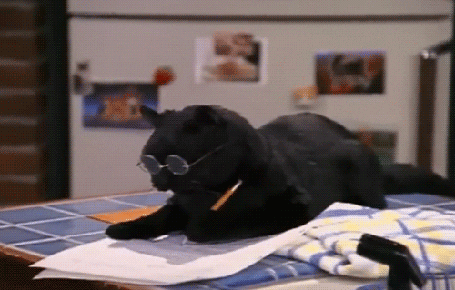
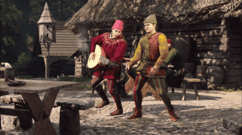

# LDVELH | Planification

{.w-100}

*[LDVELH]: Livre dont vout êtes le héros

[^lierre]: Arbrisseau rampant et grimpant par des racines adventives, à feuilles luisantes toujours vertes, à fleurs jaune verdâtre et à baies noires.

Dans cette première phase du TP1, vous devez planifier une courte histoire médiévale sous forme de schéma dans draw.io.

L’idée est de concevoir un petit récit interactif où chaque scène mène à des choix qui orientent l’histoire.

Chaque **scène** représente un **fichier html** et chaque **choix** représente un **lien hypertexte**.

## Thématique

{.w-50}

L’univers de votre histoire doit s’ancrer dans l'époque médiévale.

Vous pouvez puiser votre inspiration soit dans un cadre médiéval réaliste (villages, châteaux, chevaliers, vie quotidienne), soit dans un registre médiéval fantastique (magie, créatures, royaumes imaginaires).

## Représentation graphique avec draw.io

* Chaque scène est représentée par un rectangle arrondi.
* Chaque bouton (choix du lecteur) est représenté par un cercle.
* Les boutons doivent être des verbes (actions courtes et claires).

Chaque scène doit comporter :

* Un titre
* Un mini-paragraphe (2 phrases max) décrivant la situation.

## Exemples

[Exemple de deux histoires | draw.io](./ldvelh.drawio)

### Exemples de commencements

1. Vous arrivez devant les portes massives d’un château en ruine, couvert de lierre[^lierre].
1. Vous traversez une forêt sombre où les arbres semblent se pencher sur votre passage.
1. Vous poussez la porte d’une taverne enfumée, pleine de regards méfiants.
1. Vous franchissez un vieux pont de pierre, au-dessus d’un ravin grondant.
1. Vous pénétrez dans un cimetière oublié, où les statues fissurées semblent bouger.
1. Vous marchez jusqu’à une clairière, au centre de laquelle se dresse un autel couvert de runes.
1. Vous arrivez sur la place d’un village désert, les chariots encore remplis de marchandises.
1. Vous trouvez une crypte entrouverte et un souffle froid en sort comme un avertissement.
1. Vous vous réveillez dans une cellule humide, une torche vacillante fixée au mur.
1. Vous atteignez la tour d’un mage, dont la porte s’ouvre d’elle-même à votre approche.

### Exemples de fins ouvertes

1. Un portail de pierres anciennes s’illumine et s’ouvre devant vous.
1. La forêt se tait, puis une silhouette encapuchonnée vous fait signe de la suivre.
1. Les flammes de votre torche révèlent un escalier descendant plus bas que la terre elle-même.
1. Un cor de guerre retentit au loin, et tout se met à vibrer autour de vous.
1. Une rune gravée sur votre bras s’enflamme et projette une lumière aveuglante.
1. Un chevalier spectral apparaît et vous désigne une route encore inexplorée.
1. Le brouillard s’écarte et dévoile une cité oubliée à l’horizon.
1. Une gemme éclate dans vos mains, ouvrant une faille lumineuse dans le sol.
1. Un corbeau noir vous fixe, puis s’envole en traçant une lueur dans le ciel.
1. Les cloches d’une cathédrale invisible résonnent, vous guidant vers l’inconnu.

## Exigences

- [ ] 1 scène de commencement
- [ ] Entre 6 et 12 scènes au total
- [ ] Au moins 1 fin tragique (le joueur perd).
- [ ] Colorer les cercles de fin tragique en rouge 🔴.
- [ ] 1 fin ouverte (permettant de continuer vers une autre histoire).
- [ ] Colorer le cercle de fin ouverte en vert 🟢.
- [ ] Au moins 1 scène qui ramène en arrière (le joueur revient à une scène précédente).
- [ ] Colorer le cercle qui ramène en arrière en mauve 🟣.

## Production finale

- [ ] Exportez votre schéma en PNG avec fond blanc et 50px de bordure.
- [ ] Sauvegardez-le avec la nomenclature suivante : [nom de famille]-[prénom]_[identifiant du travail] (Exemple : gilbert-charlene_tp1a.png)
- [ ] Remettez votre fichier dans le devoir Teams « TP1a ».

## Remise

* Groupe de Stéphane - Remise 22 septembre 23:59
* Groupe de Jean-François - Remise 24 septembre 23:59

## Grille d’évaluation

| Critère                    | Détail                                                                       | Points |
|----------------------------|------------------------------------------------------------------------------|--------|
| **Thématique médiévale**   | L’histoire respecte l’univers spécifié.                                      | /1     |
| **Nombre de scènes**       | Entre 6 et 12 scènes présentes dans le schéma.                               | /1     |
| **Commencement**           | Une scène d’introduction claire (mise en contexte).                          | /1     |
| **Fin tragique 🔴**        | Au moins une fin où l’aventure se termine mal.                               | /1     |
| **Fin ouverte 🟢**         | Une fin qui permet de continuer vers une autre histoire.                     | /1     |
| **Retour en arrière 🟣**   | Au moins une scène ramène vers une scène précédente.                         | /1     |
| **Titres de scène**        | Chaque scène possède un titre significatif.                                  | /1     |
| **Descriptions de scène**  | Mini-paragraphe (max 2 phrases) cohérent et clair par scène.                 | /1     |
| **Boutons (liens)**        | Les choix sont courts et formulés avec des verbes d’action.                  | /1     |
| **Présentation technique** | Export en PNG, fond blanc, bordure de 50px, schéma lisible et bien organisé. | /1     |

**Les 10 points de l'évaluation équivalent à 5 points sur 20 points du tp1**