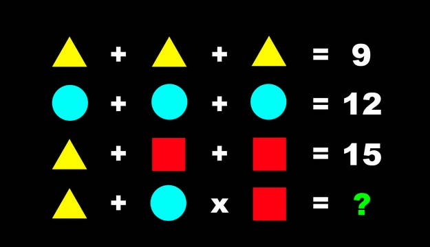

# Comprendre le concept

Le type de jeu _riddle_ est un jeu où chaque page contient une énigme et, en la résolvant, on trouve l’URL de la page suivante.

{data-zoom-image}

* <https://jfcmontmorency.github.io/enigmorency/reveil/> (par votre humble enseignant) 
* <http://www.timtang.com/ttt/> ([réponses](https://timtangsolutions.blogspot.com/2015/11/here-are-detailed-answers-for-first-98.html))
* <https://www.mcgov.co.uk/zahada.html> ([réponses](https://zahadawalkthrough.blogspot.com/))

!!! warning "Pas de choix de réponse"

    Dans ce type de jeu, il est important de ne pas laisser à l'utilisateur un choix de réponse. Celui-ci ne doit pas résoudre une enigme par élimination. Il doit l'avoir résolu.

    Idéalement, chaque énigme doit faire naitre une déduction chez l'utilisateur. 

## Types d’énigmes

### Devinette

{data-zoom-image}

<section markdown>
**Texte d'accompagnement** : Je suis pris avant de dormir et parfois après un bon repas

**Astuce** : Camellia sinensis

**✅ Réponse** : `the.html`
</section>

 
### Charade
  

{data-zoom-image}

**Texte d'accompagnement** :

> Mon premier miaule. 
> Mon deuxième est essentiel à la vie. 
> Mon tout est un abri.

**Astuce** : On se croirait à _Disney Land_ 

**✅ Réponse** : `chateau.html` (chat + eau)

### Anagramme

{data-zoom-image}

**Texte d'accompagnement** : _aucun_

**Astuce** : En France, Anna pèse les grammes du Che Guevara

**✅ Réponse** : `revolution-francaise.html`

### Rébus

{data-zoom-image}

**Texte d'accompagnement** : _aucun_

**Astuce** : Ornithorynque n'est pas une onomatopée 

**✅ Réponse** : `coincoin.html` ou `coin-coin.html`

### Formule mathématique

{data-zoom-image}

**Texte d'accompagnement** : Les mathématiques sont partout, même en nature

**Astuce** : 💧

**✅ Réponse** : `1.html` (Cachée dans l'image, on peut voir la formule `(4 x 6 - 4) / 5 - 3`)

### Codes 

alphabétique, phonétique, morse

{data-zoom-image}

**Texte d'accompagnement** : _aucun_

**Astuce** : Ah ! Ce que l'amour peut faire

**✅ Réponse** : `aveugle.html`

### Dégradations lisibles

https://unsceptiqueaubureau.com/coffee-break/selon-une-etude-de-cambridge/

{data-zoom-image}

**Texte d'accompagnement** : Les gnes me rocnensnaseit suroutt gcrâe à ma clèérbe mamxie « Je pnese, dnoc je sius »

**Astuce** : La philo c'est la vie

**✅ Réponse** : `descartes.html`

### Logique

{data-zoom-image}

**Texte d'accompagnement** : Je suis la plus jeune à faire parti du club.

**Astuce** : Chanteuse, auteur-compositeur, interprète britannique

**✅ Réponse** : `winehouse.html` ([Club des 27](https://fr.wikipedia.org/wiki/Club_des_27))

### Déduction de pattern

https://www.buzzfeed.com/spenceralthouse/best-iq-test-online

{data-zoom-image}

**Texte d'accompagnement** : _aucun_

**Astuce** : C'est juste une question de somme

**✅ Réponse** : `5.html` (La somme de chaque ligne est le double de la précédente)

### Truquage technique (clic)

{data-zoom-image}

**Texte d'accompagnement** : Il faut que je trouve le moyen d'entrer !

**Astuce** : Les lockets de porte sont facile à trafiquer. Il suffit d'utiliser les bons outils.

**✅ Réponse** : `xxxx.html` (L'outil est la souris. Il fallait simplement cliquer sur la poignée de porte)

13. **Ciphers avancés (Vigenère, Playfair, RSA simplifié)**
    Exemple : message chiffré par « CLE » en Vigenère → texte clair.

    > Réponse : secret.html
    > Astuce : reconnaître répétitions (indice Vigenère) ou longueur de clé.

14. **Rébus visuel / puzzle d’images (image map)**
    Définition : utiliser une image cliquable ou zones-indices.
    Exemple : image d’une clé cachée dans un dessin → cliquer sur la bonne zone ouvre la suite.
    Réponse : cleTrouvee.html
    Astuce : penser aux détails graphiques et aux calques.

15. **Puzzle spatial / tangram / labyrinthe**
    Exemple : reconstituer une forme à partir de pièces (ou résoudre labyrinthe)
    Réponse : sortie_labyrinthe.html
    Astuce : essais-erreurs, rotation des pièces.

16. **Suite logique visuelle (pattern recognition)**
    Exemple : suite d’images où une coche passe de la gauche à la droite suivant un motif → quel est la suivante ?
    Réponse : motif.html
    Astuce : observer rotation, symétrie, inversion.

## Expert / spécialisé

17. **Énigmes de cryptographie stéganographique**
    Définition : message caché dans une image, son, fichier (ex : LSB).
    Exemple : image contenant un message dans les bits de couleur → décoder.
    Réponse : message_cache.html
    Astuce : vérifier métadonnées, LSB, ou texte encodé en base64.

18. **Chaîne d’énigmes / puzzle hunt (multi-étapes)**
    Définition : résoudre plusieurs énigmes pour obtenir indices successifs.
    Exemple : résoudre 4 petites énigmes dont réponses forment un mot-clé final.
    Réponse : final.html
    Astuce : conserver toutes les réponses — elles s’assemblent.

19. **Méta-énigme (énigme sur les réponses d’autres énigmes)**
    Définition : la solution se trouve en combinant les réponses précédentes.
    Exemple : initiales des réponses forment un nouveau mot.
    Réponse : meta.html
    Astuce : regarder patterns dans les réponses (initiales, positions).

20. **Puzzle de logique mathématique (équations non standard)**
    Exemple : 12 = 3, 6 = 2, 8 = ? (où le calcul ne suit pas l’arithmétique habituelle mais le nombre de lettres « douze » = 5, etc.)
    Réponse : 8 = 5 (si compte lettres) → mathlogik.html
    Astuce : essayer lecture littérale (lettres), facteurs, etc.

21. **Puzzles physiques / mécanique (pour jeux hybrides)**
    Définition : casse-tête mécanique (cadenas, boîtes) à combiner avec indices numériques.
    Exemple : combinaison du cadenas correspond à l’année trouvée dans un poème.
    Réponse : cadenas.html
    Astuce : mappe indices textes → chiffres.

22. **Nonogram / Picross / Paint by numbers**
    Définition : grille logique qui révèle une image.
    Exemple : indices en marge mènent à un dessin d’une clé.
    Réponse : image_clef.html
    Astuce : commencer par lignes/colonnes complètes.

23. **Sudoku / Kakuro / KenKen (puzzles numériques classiques)**
    Exemple : mini-sudoku 4x4 dont solution révèle un code.
    Réponse : sudoku_ok.html
    Astuce : techniques classiques (paires, lignes candidates).

24. **Puzzles linguistiques (palindromes, pangrammes, lipogrammes)**
    Exemple : mot qui se lit de la même façon à l’envers.

    > Énigme : Quel mot français est palindrome et signifie « radar » ?
    > Réponse : radar.html (réponse : *radar*)
    > Astuce : vérifier orthographe exacte.

25. **Puzzles basés sur le temps / calendrier (âge, dates, fuseaux)**
    Exemple : « Si aujourd’hui est le 1er mars et ton anniversaire était 10000 jours avant, quelle est la date ? »
    Réponse : date.html
    Astuce : convertir jours ↔ années en tenant compte des années bissextiles.

## Variantes et combinaisons fréquentes

* Enigme avec la réponse dans le code du site, ou dans le nom de l'image, ou dans le titre de l'onglet
* **Énigme à choix multiples** (utile pour web) — autorise test rapide.
* **Puzzle à indices cachés (hover/clic)** — interaction web typique.
* **Énigme audio** (morceau joué à l’envers ou morse).
* **Énigme vidéo / animation** (indices dans les images successives).
* **Énigme collaboratives (puzzle social)** — plusieurs joueurs doivent combiner réponses.

---

## Conseils pour ton jeu / organisation

* Classe les énigmes par **type** et **difficulté** (comme tu as commencé).
* Pour chaque énigme, fournis : *énoncé, réponse, indice optionnel, méthode de vérification* (ex. regex pour valider un champ html).
* Propose un bouton « Indice » qui donne d’abord un aide légère, puis un indice « ultime » (pour éviter spoil direct).
* Garde une **trace métadonnée** : type, difficulté, durée estimée, tags (cryptogramme, image, maths).

---

Si tu veux, je peux :

* transformer cette liste en fichier markdown prêt à coller dans ton projet (ou en canvas/code via un fichier `.html` ou `.md`) — dis-moi lequel et je le prépare immédiatement ;
* ou générer 10 exemples prêts à l’emploi (énoncé + réponse + index HTML suggéré) pour chaque niveau de difficulté.

Tu veux que je **génère le fichier markdown** ou que je **crée directement des exemples prêts à coller en `.html`** ?

## Types d'énigme dans un jeu riddles online des années 2000

Facile

1. Enigme simple
   > J'ai perdu ma dent d'acier 
   > Réponse : cle.html
2. Charade
   > Dans mon premier, on peut parfois trouver des vaches. 
   > Mon deuxième est un refus 
   > Tout le monde possède mon tout. 
   > Réponse : prenom.html
3. Formule mathématique
   > (4 x 6 - 4) / 5 - 3
   > Réponse : 1.html

Intermédiaire

1. Culture générale (Ex: Whiskey, Echo, Bravo en alphabet phonétique donne WEB)

Avancé

1. Déduction. Par exemple, dans une énigme, on pourrait devoir déduire que des chiffres font référence à la position des lettres et une équation montre un pattern et ce pattern serait la réponse. 

