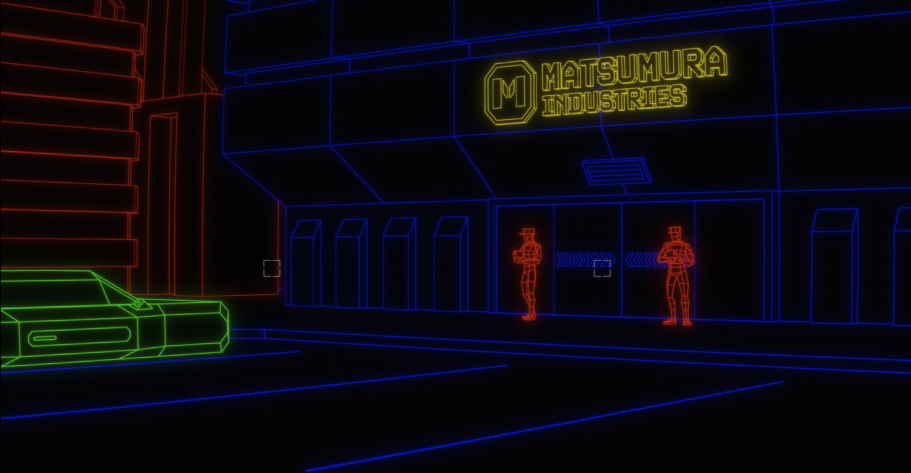
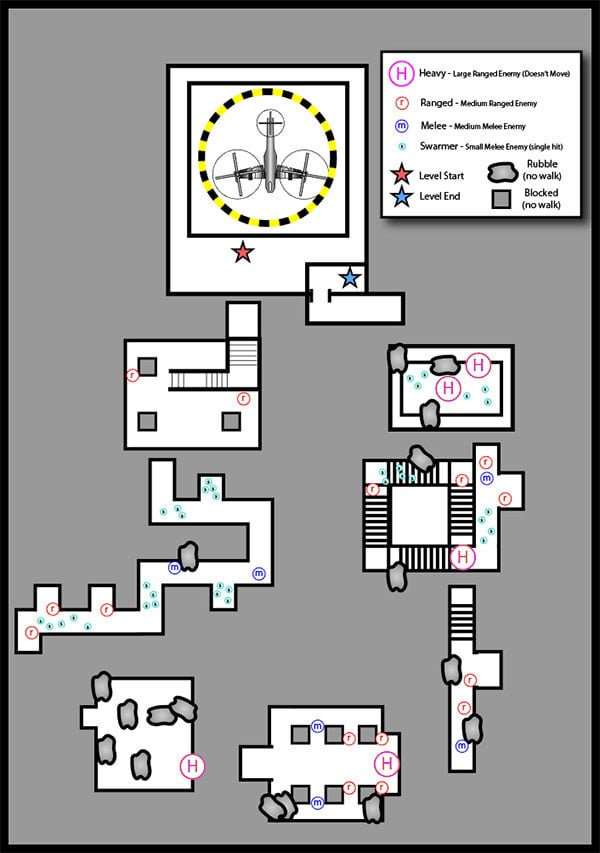
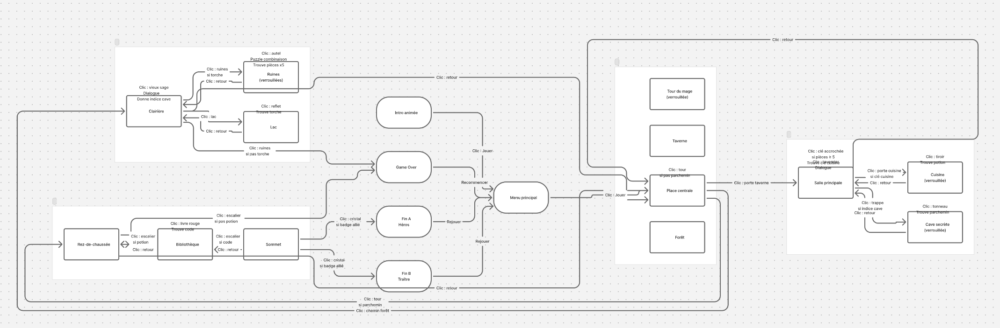

# Figmorency

L'objectif de ce projet est de concevoir un **jeu vidéo point-and-click jouable** en utilisant les outils de prototypage de Figma : variables, logiques conditionnelles, composantes, animations et transitions. Aucun code externe ni autre logiciel de prototypage n'est permis.

Il s'agit d'un **projet individuel** qui compte pour **30%** de votre note finale. Il est remis **et** présenté oralement au cours 15.

## Exemple

  

  **[Hackerman 1977](https://www.figma.com/proto/wozH7xzVNQw2aIR8jymeTL/Hackerman-1977?scaling=scale-down&content-scaling=fixed){.stretched-link}**

[Source du jeu Hackerman 1977](https://www.figma.com/design/c9xB0a85MuB4Imni8vLJZ3/Hackerman-1977--copie-?node-id=0-1&t=ZRNdRALZJm0Rm8vy-1)

## Échéances

| Étape | Échéance |
| :--- | :--- |
| **FigJam validé par l'enseignant** | Cours 13 |
| **Remise + présentation orale** | Cours 15 |

## Le concept

Définir le jeu sur un **FigJam**.

- [ ] **Titre** du jeu
- [ ] **Synopsis** : contexte, personnage(s) et objectif
- [ ] **Ambiance** : humoristique, mystérieux, horreur, rétro, etc.
- [ ] **Moodboard** : au moins 6 références visuelles (jeux, films, illustrations) qui inspirent votre direction artistique.
- [ ] **Carte des scènes** : un schéma montrant les scènes du jeu (au moins 5 en tout) et les liens entre elles. Les mécaniques utilisées dans chaque scène doivent y être indiquées. Voici un exemple :

{data-zoom-image .w-10}
{data-zoom-image .w-25}

- [ ] Valider le contenu du FigJam avec l'enseignant **au cours 12**.

## Les mécaniques de jeu

### Mécaniques obligatoires

- [ ] Le jeu doit avoir une scène de **menu principal**.
- [ ] Le jeu doit avoir une scène **échec** (_game over_) avec la possibilité de recommencer.
- [ ] Le jeu doit avoir une scène **victoire** avec la possibilité de recommencer.
- [ ] **Navigation entre scènes** : Le joueur se déplace d'un lieu à un autre en cliquant sur des zones (portes, flèches, sorties). Les transitions doivent être animées.
- [ ] **Action conditionnelle inter-scènes** : Une action dans une scène doit influencer l'état d'une autre scène. Par exemple : un levier actionné dans la forêt ouvre une trappe dans la bibliothèque.

### Mécaniques au choix

En plus des mécaniques obligatoires, vous devez implanter **au moins 4** mécaniques différentes parmi les suivantes.

| Mécanique | Description | 
| :--- | :--- |
| :green_circle: **Objet caché** | Des zones cliquables sont dissimulées dans une scène. Cliquer au bon endroit déclenche une réaction. |
| :green_circle: **Interrupteur d'état** | Un élément (lumière, machine, panneau) peut être activé ou désactivé. Son état change l'apparence de la scène. |
| :blue_circle: **Dialogues** | Un personnage affiche du texte ou propose des choix de réponses. Les réponses influencent la suite du jeu. | 
| :blue_circle: **Inventaire** | Le joueur ramasse des objets en cliquant dessus. Ils s'affichent dans un panneau persistant. |
| :blue_circle: **Compteur ou score** | Un nombre (vies, pièces, tentatives) varie selon les actions du joueur et s'affiche à l'écran en tout temps. | 
| :orange_circle: **Puzzle de combinaison** | Le joueur doit entrer un code ou effectuer des actions dans le bon ordre pour déverrouiller un objet ou une zone. | 
| :orange_circle: **Fins alternatives** | Le jeu propose au moins deux fins différentes selon les choix ou actions effectués par le joueur. |
| :orange_circle: **Badges** | À la façon Steam, PlayStation ou Xbox, des succès sont attribués pour des actions spécifiques. La liste doit être visible dans un menu à part. |
| :orange_circle: **Mini-jeu intégré** | Un court défi interactif est intégré dans une scène : mémoire, quiz, remise en ordre, etc. |

!!! info "Légende de difficulté"
    :green_circle: Accessible · :blue_circle: Intermédiaire · :orange_circle: Ambitieux

## La narration

Le jeu doit guider le joueur avec du texte à au moins deux moments :

- [ ] **Messages contextuels** : si le joueur clique sur quelque chose qu'il ne peut pas encore utiliser, un message doit apparaître (ex. : *« Cette porte est verrouillée. »*).
- [ ] **Indices ou dialogues** qui donnent des pistes pour progresser dans le jeu.

Le contenu textuel doit être entièrement en français. Aucun anglais permis.

La narration peut être humoristique, dramatique ou absurde, mais elle doit être cohérente avec l'ambiance du jeu.

## La direction artistique

La cohérence visuelle, la créativité et les techniques de design graphique apprises en classe seront rigoureusement évaluées.

Vous pouvez utiliser des ressources visuelles externes (photos, illustrations, images générées par IA, etc.). Les principes de design graphique vus en classe doivent cependant être respectés : poids visuel, hiérarchie, palette de couleurs, typographie. 

!!! warning "La cohérence graphique est primordiale."

- [ ] Une **palette de couleurs** et une **typographie** cohérentes sont appliquées dans toutes les scènes.
- [ ] Le jeu comporte **au moins 5 scènes distinctes**.
- [ ] L'interface (boutons, inventaire, messages) est intégrée à l'univers visuel.

## L'introduction animée

Le jeu s'ouvre sur une **séquence d'introduction animée** (comme dans *Hackerman 1977*).

- [ ] L'introduction doit présenter le titre du jeu, le nom de l'auteur ou l'autrice, le sigle du cours et l'année.
- [ ] Elle se termine sur une action permettant de commencer à jouer.

!!! note "Il peut y avoir plusieurs séquences enchaînées. C'est une bonne occasion d'introduire l'histoire du jeu."

## Présentation orale (cours 15) 

Au cours 15, vous présenterez **individuellement** votre jeu à la classe en **10 minutes**.

Vous devrez couvrir :

- [ ] **Démonstration** : présenter le jeu en direct dans Figma.
- [ ] **Concept** : synopsis, ambiance et choix de direction artistique justifiés.
- [ ] **Mécaniques** : lesquelles avez-vous implantées et comment fonctionnent-elles ?
- [ ] **Défis rencontrés** : ce qui n'a pas fonctionné et comment vous l'avez résolu.
- [ ] **Recul** : ce que vous feriez différemment si vous recommenciez.

## Remise (cours 15)

La remise se fait sur **Teams** sous forme d'un fichier `.zip` nommé `nomfamille-prenom-projetfinal.zip`. 

Il doit contenir :

- [ ] Le fichier source : `nomfamille-prenom-projetfinal.fig`
- [ ] Le FigJam en PDF : : `nomfamille-prenom-projetfinal.pdf`
- [ ] Le lien partagé publiquement vers le prototype

## Grille d'évaluation

| Critère | 2 points | 1 point | 0 point |
| ------- | -------- | ------- | ------- |
| **FigJam** | Complet et validé | Incomplet ou peu détaillé | Absent ou non validé |
| **Introduction animée** | Informations complètes, séquences animées, intégrée à l'univers, mène à une action pour commencer | Présente, mais incomplète ou peu soignée | Absente |
| **Scènes obligatoires** | Menu principal, scène d'échec et de victoire sont fonctionnelles et permettent de recommencer | Incomplet ou partiellement fonctionnel | Absent ou non fonctionnel |
| **Navigation et logique** | - La navigation entre scènes est agréable et animé subtilement.  - Au moins une action dans une scène influence l'état d'une autre | Partiellement fonctionnel | Absent ou non fonctionnel |
| **Mécaniques au choix** | 4 mécaniques ou plus, toutes fonctionnelles et bien intégrées à l'univers | Incomplet ou partiellement fonctionnel | Absent ou non fonctionnel |
| **Narration** | Messages contextuels et indices présents, entièrement en français, cohérents avec l'ambiance | Partiellement intégrée | Absente ou non conforme |
| **Scènes de jeu** | Au moins 5 scènes distinctes, excluant le menu, l'introduction, la victoire et l'échec | 3 ou 4 scènes distinctes | Moins de 3 scènes ou scènes trop similaires |
| **Direction artistique** | Palette, typographie et interface cohérentes; principes de design appliqués avec intention | Principes partiellement respectés | Principes non maîtrisés |
| **Présentation orale** | Couvre tous les points demandés, propos clair et maîtrisé, durée respectée | Un ou deux points manquants ou dépassement de temps notable | Insuffisante ou absente |
| **Respect des consignes** | Remise complète et conforme | Un ou deux éléments manquants ou mal nommés | Remise incomplète ou non conforme |

**Total : / 20 points**

_(le résultat sera converti en 30 % de la note finale)_