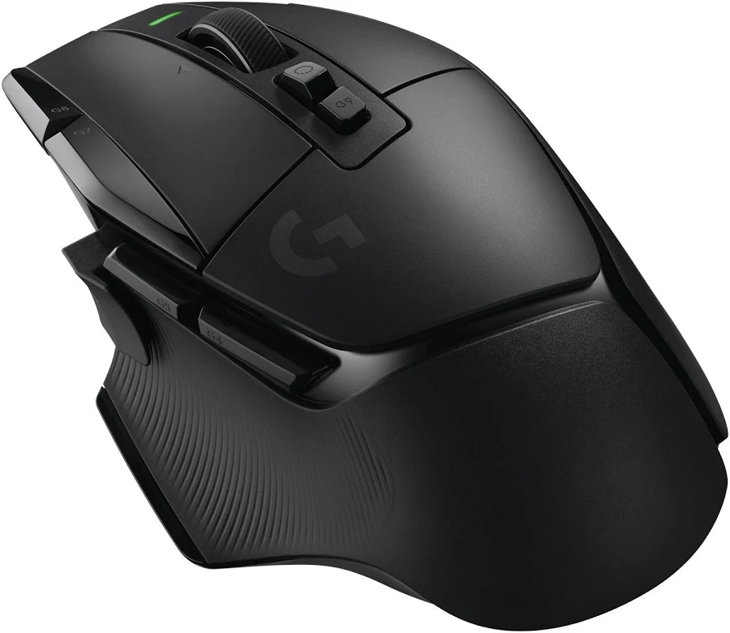
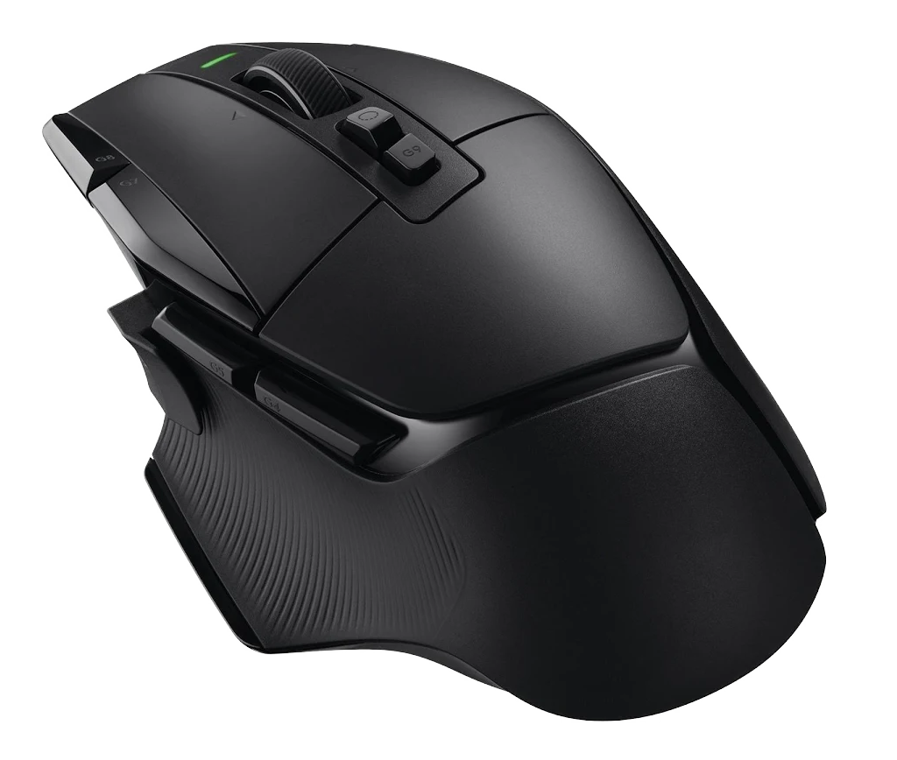

---
tags:
  - Devoir
  - Évaluation sommative
---

# Publicité Web

L'objectif de ce devoir est de concevoir une **campagne publicitaire Web** pour une marque fictive de votre choix.

Vous devez créer **4 formats publicitaires** à partir d'un même concept visuel, adaptés à des contextes différents.

Ce devoir compte pour **15%** de votre note finale.

## La marque

Choisissez une **catégorie de produit**. Voici quelques idées :

- Audio (écouteurs, casque, enceinte, etc.)
- Vêtements (chaussures, casquette, manteau, etc.)
- Jeux (jeux de table, manette de console, souris, clavier, etc.)
- Soin / beauté (parfum, crème, shampooing)

Ensuite, **inventez une marque fictive**. Donnez-lui un nom. Pas besoin d'un logo élaboré (un nom bien typographié suffit). 

Le logo ne sera pas évalué.

## Le produit

Trouvez l'image d'un produit existant et avec un logiciel comme Photoshop, retirer le fond et le logo du produit s'il se trouve sur celui-ci.

!!! warning "La résolution de l'image doit être élevé pour éviter d'avoir à l'étirer sur les publicités."

<figure markdown>
{data-zoom-image}
<figcaption>Avant</figcaption>
</figure>

<figure markdown>
{data-zoom-image}
<figcaption>Apres</figcaption>
</figure>

Au besoin, appliquez votre logo sur le produit.

## 2 publics cibles

Vous devrez créer une campagne pour **2 publics cibles différents** à partir du même produit.

- **Public A** : 16–24 ans
- **Public B** : 35 ans et plus

Le ton, l'accroche et les choix visuels doivent clairement refléter à qui s'adresse chaque campagne.

## 4 formats par public cible

Votre campagne doit être déclinée en 4 formats.

| Format | Dimensions | Contexte |
|---|---|---|
| **Hero Web** | 1440 × 500 px | En-tête d'un site Web |
| **Portrait** | 1080 × 1920 px | Instagram / Meta Story & Reels |
| **Carré** | 1080 × 1080 px | Instagram / Facebook Feed |
| **Horizontal** | 970 × 250 px | Bannière Google Display |

Le style des images d'une même campagne doit être **cohérent**.

### Contenu pour chaque format

- [ ] Une **accroche** textuelle
- [ ] L'image du produit
- [ ] Un appel à l'action (_CTA_)
- [ ] Le **nom de la marque** / logo
- [ ] Visuel soigné et créatif 

## Consignes techniques

- [ ] Images libres de droit (sauf pour le produit).
- [ ] Contraste de couleurs [accessible](https://webaim.org/resources/contrastchecker/)
- [ ] Principes de hiérarchie, d'espacement et d'alignement bien exécutés.

!!! tip "Malgré l'espace restreint, il faut que votre mise en page « respire »"

## Remise

Date : La veille du cours de la **semaine 9** à **23 h 59**

Sur Teams, remettre **un seul fichier zip** nommé `nomfamille-prenom-pub.zip` comprenant :

- [ ] `nomfamille-prenom-pub.fig`

- [ ] `nomfamille-prenom-pubA-hero.png`
- [ ] `nomfamille-prenom-pubA-portrait.png`
- [ ] `nomfamille-prenom-pubA-carre.png`
- [ ] `nomfamille-prenom-pubA-horizontal.png`

- [ ] `nomfamille-prenom-pubB-hero.png`
- [ ] `nomfamille-prenom-pubB-portrait.png`
- [ ] `nomfamille-prenom-pubB-carre.png`
- [ ] `nomfamille-prenom-pubB-horizontal.png`

## Grille d'évaluation

| Critère | Points | Détails attendus |
|:---|:---:|:---|
| **Accroche et message** | **1 pt** | L'accroche est forte. La proposition de valeur est claire et orientée bénéfice. Le CTA est précis. |
| **Différenciation des publics cibles** | **2 pts** | Les campagnes A et B se distinguent clairement. Le ton, l'accroche, les choix visuels et la hiérarchie reflètent chaque public de façon cohérente et intentionnelle. |
| **Cohérence visuelle** | **2 pts** | Au sein de chaque campagne, les 4 formats partagent un univers commun (couleurs, typographie, ton). On reconnaît la même campagne d'un format à l'autre. |
| **Adaptation aux formats** | **2 pts** | Chaque format est conçu pour son contexte. La mise en page tient compte des contraintes de lisibilité et d'espace propres à chaque format. |
| **Principes de design graphique** | **1 pt** | Hiérarchie, contraste, équilibre, typographie et couleur appliqués avec intention. |
| **Qualité technique** | **1 pt** | Frames aux bonnes dimensions, images propres, textes lisibles, exports corrects. |
| **Respect des consignes** | **1 pt** | Tous les éléments demandés sont présents. Nomenclature respectée. |

**Total : / 10 points** (le résultat sera converti en 15% de la note finale)