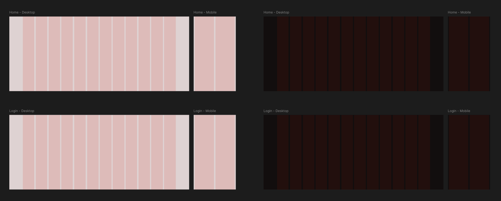
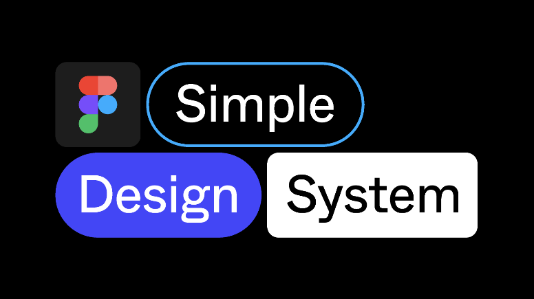

---
tags:
  - Devoir 04
  - Évaluation sommative
---

# Refonte Web

L'objectif de ce devoir est de concevoir les **maquettes graphiques** pour la refonte d'un site Web existant.

Vous devez proposer un redesign complet et réfléchi, en appliquant les principes de design graphique vus en classe, un _design system_ de la communauté, des composantes personnalisées et les fonctionnalités Figma pour le responsive (auto-layout, contraintes).

Ce devoir compte pour **20%** de votre note finale.

## Contexte

Certains sites Web ont un contenu pertinent, mais souffrent d'une expérience visuelle datée ou peu efficace. Votre mandat est de moderniser l'interface d'un de ces sites en améliorant la **clarté**, la **hiérarchie visuelle**, l'**esthétisme** et l'**adaptabilité** (_responsive_).

## Choix du site

{.w-100}

- [ ] Choisissez **un** site parmi les trois suivants :

| Site | Accueil | Page formulaire |
| ---- | ------ | ------ |
| Yala Sri Lanka :lion_face: | [Accueil](https://www.yalasrilanka.lk/) | [Contact](https://www.yalasrilanka.lk/contact) |
| Craigslist Montréal :peace: | [Accueil](https://montreal.craigslist.org/) | [Connexion](https://accounts.craigslist.org/login) |
| MyAnimeList :simple-myanimelist: | [Accueil](https://myanimelist.net/) | [Connexion](https://myanimelist.net/login.php) |

!!! info "Prenez le temps de naviguer sur le site choisi avant de commencer. Comprenez sa structure, son contenu et son public cible."

## 8 frames à concevoir

Vous devez refaire le design des **2 pages** du site choisi, déclinées en Desktop (1440 px) et Mobile (390 px), en mode clair et sombre.

- [ ] Accueil / Desktop / Clair
- [ ] Accueil / Desktop / Sombre
- [ ] Accueil / Mobile / Clair
- [ ] Accueil / Mobile / Sombre
- [ ] Formulaire / Desktop / Clair
- [ ] Formulaire / Desktop / Sombre
- [ ] Formulaire / Mobile / Clair
- [ ] Formulaire / Mobile / Sombre

!!! success "Utilisez exactement cette nomenclature pour nommer vos frames."

## Consignes techniques

### Structure du fichier Figma

- [ ] Composition de type « Design » nommée « Refonte »
- [ ] Une page principale contenant tous les frames
- [ ] Une page nommée « Components » contenant votre composante personnalisée

### Structure des pages

La page **Accueil** doit contenir au minimum :

- [ ] Une entête avec navigation
- [ ] Une section héro
- [ ] Des cartes
- [ ] Un pied de page

La page **Formulaire** doit contenir au minimum :

- [ ] Une entête
- [ ] Un ou plusieurs formulaires
- [ ] Un pied de page

### Design system

{.w-25}

- [ ] Importer le **Simple Design System** depuis la communauté Figma
- [ ] Utiliser **au minimum 3 composantes** du design system (boutons, champs, cartes, navigation, etc.)
- [ ] Dans les frames en mode **sombre**, utiliser la **version sombre** des composantes

### Composante personnalisée

- [ ] Créer **au minimum une composante de type variante** dans la page « Components » et l'utiliser dans vos maquettes

### Variables de couleurs

- [ ] Créer une palette de couleurs avec des variables Figma en **deux modes : Clair et Sombre**
- [ ] Appliquer ces variables dans vos maquettes (arrière-plans, textes, bordures, etc.)
- [ ] Le basculement entre les deux modes doit fonctionner en changeant simplement le mode de la collection

### Responsive

- [ ] Utiliser l'**auto-layout** et les **contraintes** correctement
- [ ] Le contenu doit s'adapter au redimensionnement

### Design graphique

- [ ] Hiérarchie visuelle nettement améliorée par rapport au site original
- [ ] Typographie lisible et cohérente
- [ ] Palette de couleurs harmonieuse et contrastes accessibles
- [ ] Espacement et alignements soignés

## Document d'accompagnement

En plus du fichier Figma, vous devez remettre un **document Word** avec les sections suivantes :

- [ ] **Composantes du design system** : Nommez les composantes utilisées et indiquez l'endroit de leur usage.
- [ ] **Composante personnalisée** : Indiquez l'endroit de son usage.
- [ ] **Variables** : Expliquez votre logique de nomenclature et si vous avez utilisé la notion de sémantique.
- [ ] **Responsive** : Indiquez où l'auto-layout et les contraintes sont utilisés.
- [ ] **Hiérarchie visuelle** : Expliquez en quoi votre refonte améliore la hiérarchie visuelle par rapport au site original (taille, poids, couleur, espacement, ordre de lecture, etc.).
- [ ] **Qualité visuelle** : Décrivez brièvement vos choix typographiques, votre palette de couleurs et votre approche communicationnelle en design graphique Web.

## Remise

Date : La veille du cours de la **semaine 12 à 23 h 59**

Sur Teams, remettre **un seul fichier zip** nommé `nomfamille-prenom-devoir04.zip` comprenant :

- [ ] `nomfamille-prenom-devoir04.fig`
- [ ] `nomfamille-prenom-devoir04.docx`

## Grille d'évaluation

| Critère | Pts | Ce qui est évalué |
|:---|:---:|:---|
| **Frames** | **2** | :material-arrow-right: Tous les _frames_ sont présents. :material-arrow-right: Les _frames_ sont correctement nommés selon la nomenclature demandée. |
| **Structure des pages** | **2** | :material-arrow-right: La page Accueil contient : entête avec navigation, section héro, cartes et pied de page. :material-arrow-right: La page Formulaire contient : entête, formulaire(s) et pied de page. |
| **Composantes** | **3** | :material-arrow-right: Au moins 3 composantes du Simple Design System sont utilisées. :material-arrow-right: La version sombre des composantes est utilisée dans les frames en mode sombre. :material-arrow-right: Une composante de type variante est créée dans la page « Components » et utilisée dans au moins un frame. |
| **Variables clair / sombre** | **2** | :material-arrow-right: Une collection de variables de couleurs avec les modes Clair et Sombre est configurée. :material-arrow-right: Les variables sont appliquées aux maquettes et le basculement entre les modes fonctionne sans intervention manuelle. |
| **Responsive** | **2** | :material-arrow-right: L'auto-layout est utilisé correctement (contenus qui s'étirent, se compriment ou se réorganisent selon le frame). :material-arrow-right: Les contraintes sont configurées correctement et le contenu s'adapte au redimensionnement. |
| **Hiérarchie visuelle** | **2** | :material-arrow-right: L'ordre de lecture est intentionnel : titre principal, contenu secondaire et appels à l'action sont clairement différenciés (taille, poids, couleur, espacement). :material-arrow-right: La refonte représente une amélioration visible et justifiable par rapport au site original. |
| **Qualité visuelle** | **1** | Typographie lisible, palette harmonieuse, contrastes suffisants et espacement soigné. L'ensemble est cohérent d'un frame à l'autre. |
| **Document d'accompagnement** | **2** | :material-arrow-right: Le document est complet : toutes les sections sont présentes et chaque élément est localisé dans les maquettes. :material-arrow-right: Les justifications sont précises et démontrent une compréhension des choix effectués. |
| **Rigueur** | **1** | Respect des consignes |
| **Total** | **17** | *(converti en 20 % de la note finale)* |