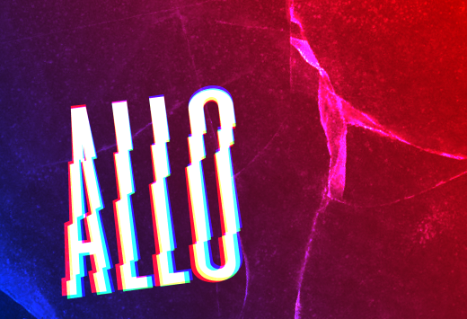

# Allo

L'objectif de cet exercice est de créer une composition avec un texte modifié en vectoriel. La notion de mode de fusion devra être appliquée sur le texte et sur une texture.

Cet exercice sert à comprendre les étapes d'une composition graphique.

## Résultat suggéré

{data-zoom-image}

## Consigne

- [ ] Dans Figma, créer un frame **paysage** (résolution de votre choix)
- [ ] Ajouter **un mot** avec la police de votre choix
    
    {data-zoom-image .w-25}

- [ ] **Convertir le texte en vecteurs (tracés)** pour le rendre modifiable
- [ ] **Diviser** le mot en **2 ou 3 formes distinctes**, puis déplacer les zones pour donner un effet déphasé

    {data-zoom-image .w-25}

- [ ] Grouper tous les morceaux
- [ ] Dupliquer pour avoir en tout **3 groupes**
- [ ] Mettre chaque groupe en mode de fusion **Écran**
- [ ] Remplissez un groupe en **rouge 🔴**, un en **bleu 🔵** et un en **vert 🟢**
- [ ] Décaler légèrement chaque groupe pour créer un effet **glitch** et positionner le résultat où vous voulez

    {data-zoom-image .w-25}

- [ ] Ajouter un fond en dégradé

    {data-zoom-image .w-25}

- [ ] Trouver une [texture sur pexels.com](https://www.pexels.com/fr-fr/chercher/texture/) et la superposer par-dessus la composition, puis appliquer un **mode de fusion** de votre choix (ex. : Superposition)

    {data-zoom-image .w-25}
