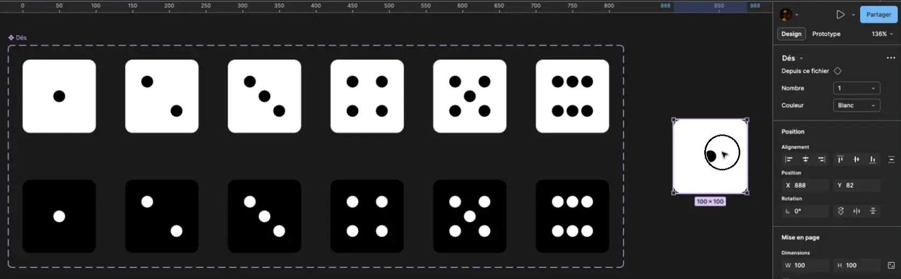

# Angine de poitrine

<figure markdown>
{.w-100}
<figcaption markdown>
</figcaption>
[:material-music-note:](https://anginedepoitrine.bandcamp.com/album/angine-de-poitrine-vol-1)
</figure>

Le but de cet exercice est de créer des variantes de composantes afin d'obtenir la possibilité de créer une instance de dé à 6 faces qu'on peut configurer en noir ou en blanc.

## Résultat attendu

{data-zoom-image .w-100}

## Consignes

- [ ] Créer une page nommée « Composants »
- [ ] Créer un Frame de `100x100`
- [ ] Sur le Frame, activer un `Guide de mise en page` de type `Grille` d'une taille de `20`
- [ ] Placer un cercle de `16x16` au centre.
- [ ] Dupliquer 5 fois le Frame
- [ ] Ajuster les cercles pour chaque faces de dé
- [ ] Dupliquer les 6 Frames sur une deuxième ligne
- [ ] Inverser les couleurs
- [ ] Créer un ensemble de composants avec les 12 dés
- [ ] Configurer les paramètres pour les variantes