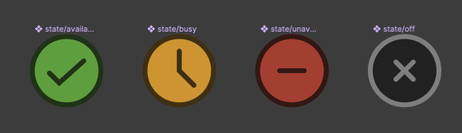
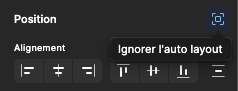
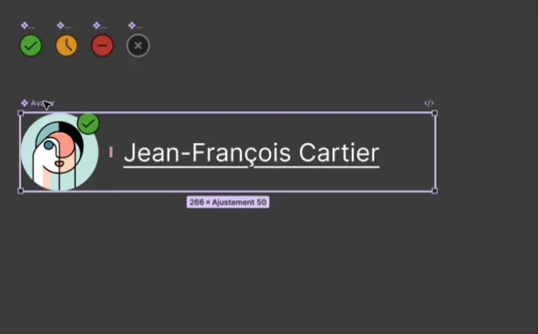
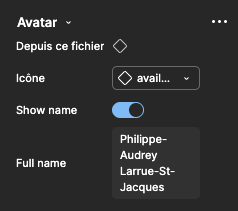
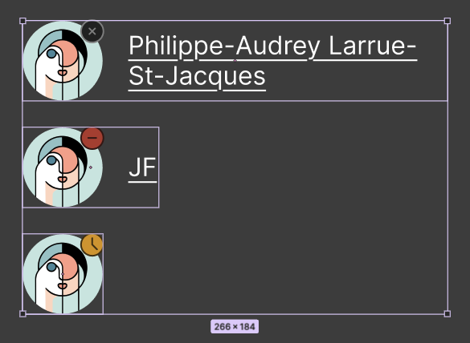

# Avatar

{.w-100}

L'objectif de cet exercice est de mettre en pratique la gestion avancée de composantes dans Figma.

Vous allez créer une composante « avatar » composée d'une image de profil, d'un indicateur d'état et d'un nom complet.

C'est le genre de composante qu'on observe entre autres dans le logiciel Teams.

## Résultat attendu

{data-zoom-image}

## Consignes

### Création des états

{data-zoom-image}

Nous allons créer les icônes pour les 4 états suivants : disponible, indisponible, occupé et absent.

- [ ] Créer 4 frames de `13x13`
- [ ] Renommer chacun des frames selon la nomenclature suivante : « etat/nom_de_l'etat » (ex. : « etat/Disponible »)
- [ ] Créer les 4 icônes manuellement 
- [ ] Transformer chacun des frames en composante

### Création de la composante principale

- [ ] Créer un frame de `250x50` nommé « Avatar »
- [ ] Appliquer un _auto layout_ horizontal
- [ ] Ajouter une image de `50x50` en utilisant un portrait tiré du plugin « UI Faces »
- [ ] Ajouter une instance d'icône d'état en spécifiant d'ignorer l'_auto layout_ :  {data-zoom-image .w-25}
- [ ] Ajouter une zone de texte à droite du portrait
- [ ] Transformer le frame en composante

### Responsive

- [ ] La largeur du frame doit s'ajuster au contenu
- [ ] Le texte doit avoir une largeur maximale de `200px`, tout en s'ajustant à son contenu
- [ ] Lorsqu'on redimensionne le frame, il doit se comporter de cette façon : 

{.w-50 data-zoom-image}

### Configurer les options

- [ ] Configurer les propriétés de la composante afin de pouvoir choisir l'icône d'état, modifier le texte et afficher/masquer le texte : 

{data-zoom-image}

{data-zoom-image}

- [ ] S'assurer que le texte soit en noir 